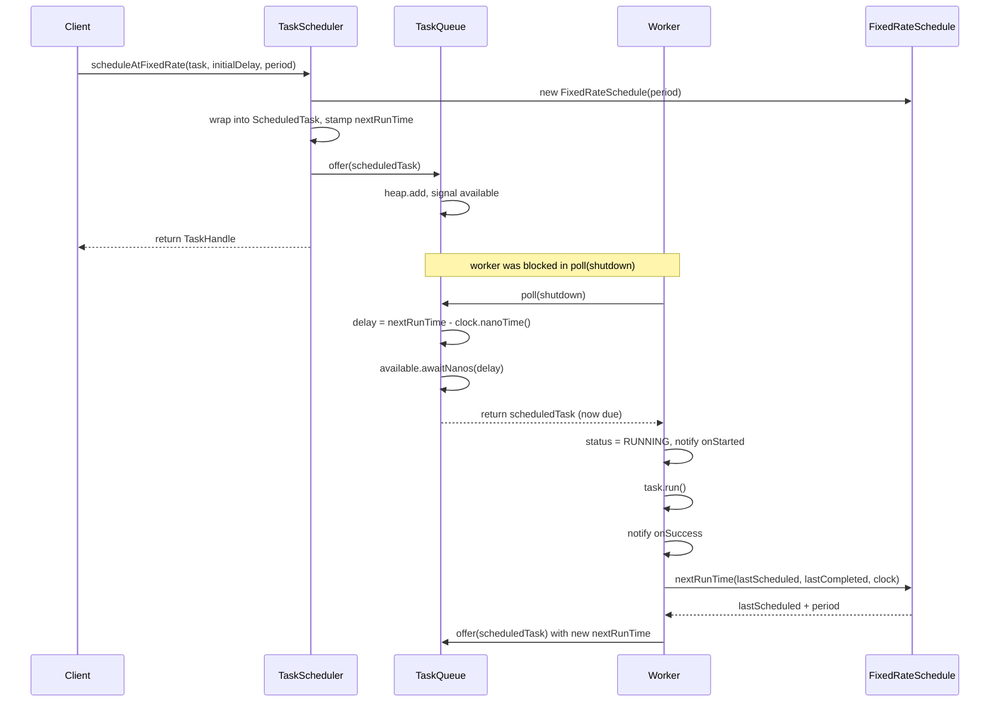
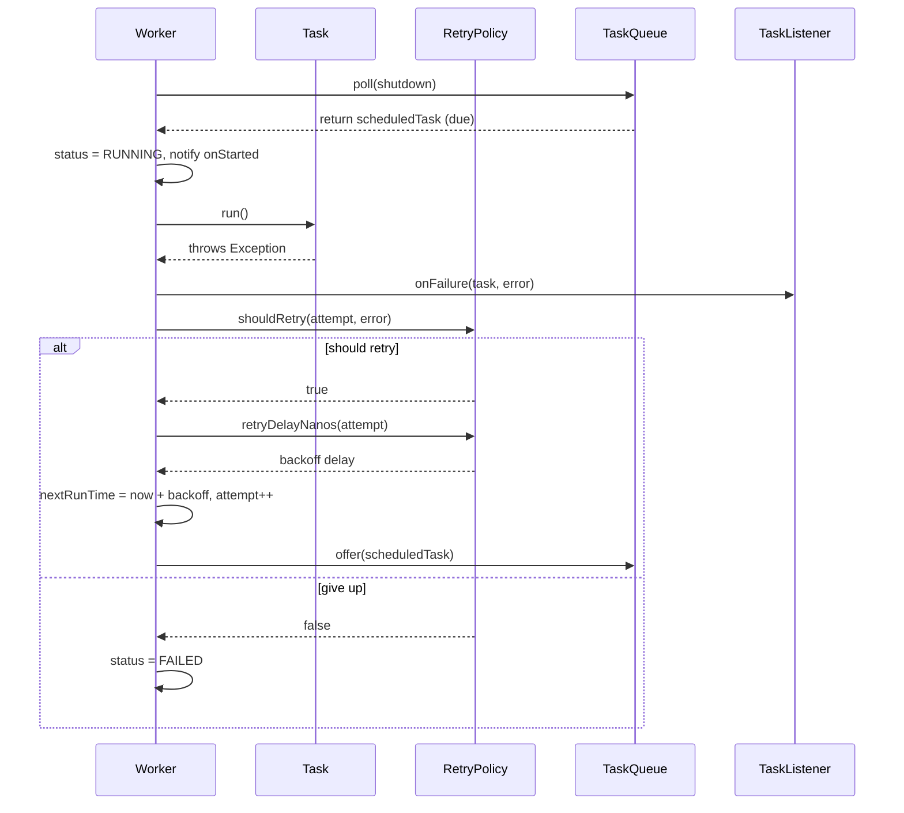
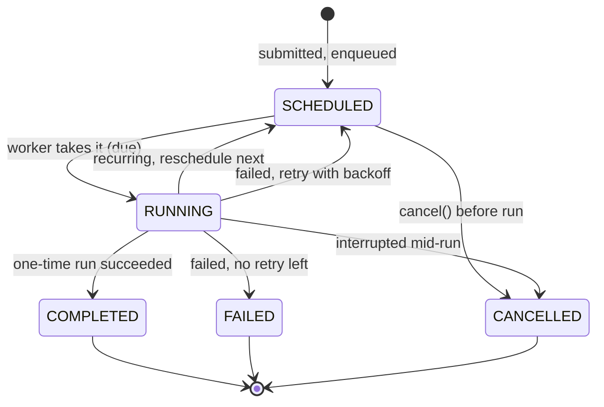

# ⏱️ Low-Level Design: Task Scheduler

> A complete, interview-ready walkthrough of the classic **Task / Job Scheduler** design problem — the engine that sits behind Java's `ScheduledThreadPoolExecutor`, Unix `cron`, Quartz, and Kubernetes `CronJob`. We start from a blank whiteboard and build up to a staff-level design that lets a caller say "run this now," "run this once in 30 seconds," or "run this every 5 minutes," and have a pool of worker threads execute each task at exactly the right moment — never early, never busy-spinning the CPU, always picking the task that is due soonest first, and staying correct when hundreds of tasks are submitted and cancelled concurrently.

At first glance a task scheduler looks trivial: keep a list of jobs, loop forever, and run whichever ones are due. That surface simplicity is exactly why interviewers reach for it, because the naive loop hides two problems that separate a junior answer from a senior one. The first is *how you wait*. A candidate who writes `while (true) { for each task, if (now >= task.time) run(task); }` has built a **busy-wait** that pins a CPU core at 100% doing nothing, and a candidate who writes `Thread.sleep(task.delay)` on the earliest task has built something that sleeps right through a more urgent task submitted a moment later. The correct answer — block on a condition variable for exactly the delay until the next task is due, and get woken early if a sooner task arrives — is the intellectual heart of this problem, and it is precisely how the JDK's `DelayedWorkQueue` and `DelayQueue` are built. The second problem is *ordering under concurrency*: the ready structure must always surrender the earliest-due task first, in O(log n), while producers add and cancel tasks from other threads without corrupting it. A candidate who reaches for a **min-heap keyed by next-execution-time**, guarded by a lock and a condition, and who can explain fixed-rate versus fixed-delay recurrence, cancellation, and retries on top of it, is demonstrating exactly the systems fluency the question is designed to surface. This guide walks the entire journey: it opens with the beginner's mental model of jobs, a clock, and a worker, then escalates naturally into the delay-queue mechanism, the min-heap, worker-pool concurrency, recurrence semantics, missed-execution policy, and the distributed cron systems a principal engineer raises in the closing minutes.

---

## 📋 Table of Contents

**Part I — Framing the Problem**

1. [Problem Statement](#1-problem-statement)
2. [Requirement Clarification & Assumptions](#2-requirement-clarification--assumptions)
3. [Functional & Non-Functional Requirements](#3-functional--non-functional-requirements)
4. [Core Concepts Being Tested](#4-core-concepts-being-tested)

**Part II — Modeling the Domain**

5. [Domain Model & Entities](#5-domain-model--entities)
6. [CRC Cards](#6-crc-cards)
7. [UML Class Diagram](#7-uml-class-diagram)
8. [Package Structure](#8-package-structure)

**Part III — Design Rationale**

9. [Design Decisions & Trade-offs](#9-design-decisions--trade-offs)
10. [Class-by-Class Deep Dive](#10-class-by-class-deep-dive)
11. [Design Patterns Applied](#11-design-patterns-applied)
12. [SOLID Principles Mapping](#12-solid-principles-mapping)

**Part IV — Behavior & Diagrams**

13. [Sequence Diagram](#13-sequence-diagram)
14. [State Diagram](#14-state-diagram)

**Part V — The Implementation**

15. [Complete Java Implementation](#15-complete-java-implementation)
16. [Execution Flow & Code Walkthrough](#16-execution-flow--code-walkthrough)

**Part VI — Engineering Depth**

17. [Complexity Analysis](#17-complexity-analysis)
18. [Thread Safety & Concurrency](#18-thread-safety--concurrency)
19. [Error Handling & Validation](#19-error-handling--validation)
20. [Scalability Discussion](#20-scalability-discussion)
21. [Alternative Designs & Trade-offs](#21-alternative-designs--trade-offs)

**Part VII — Interview Mastery**

22. [Common FAANG Follow-up Questions (L4 → L6)](#22-common-faang-follow-up-questions-l4--l6)
23. [Common Design Mistakes](#23-common-design-mistakes)
24. [Testing Strategy](#24-testing-strategy)
25. [FAANG Q&A Section](#25-faang-qa-section)
26. [STAR Behavioral Questions](#26-star-behavioral-questions)
27. [⚡ Quick Revision Cheat Sheet](#27--quick-revision-cheat-sheet)

---

## 1. Problem Statement

Design the engine behind the "schedule this to run later" capability — the machinery inside Java's `ScheduledThreadPoolExecutor`, a cron daemon, or a job framework like Quartz. A caller hands the scheduler a **task** (a unit of work, a `Runnable`) together with **when** it should run: immediately, once after a fixed delay ("in 30 seconds"), at a fixed rate ("every 5 minutes starting now"), or with a fixed delay between the end of one run and the start of the next ("wait 5 minutes after each run finishes"). The scheduler must execute each task at the right moment on a pool of worker threads, always running the task that is due soonest before any that are due later, and returning to the caller a **handle** they can use to check the task's status or cancel it before it runs.

The system coordinates several concerns at once — a **time-ordered ready queue** that always yields the earliest-due task, a **waiting mechanism** that blocks efficiently until that task's moment arrives (without burning CPU and without oversleeping when a sooner task is added), a **pool of workers** that execute tasks concurrently, a **recurrence** layer that re-schedules periodic tasks after each run, and a **retry** policy for tasks that throw. But the beating heart, the reason this problem is asked, is the **due-time dispatch mechanism**: how do you make one or more threads sleep for precisely the interval until the next task is due, wake the instant that interval elapses *or* the instant an earlier task is submitted, and hand exactly that task to a free worker — correctly, and without a spinning loop.

<details>
<summary>📖 <b>In plain terms — what are we actually building?</b></summary>

Picture the alarm-and-reminders feature on your phone, but as a service other code can call. Some code says "run this cleanup job in 10 minutes," another says "collect metrics every 30 seconds," another says "send this email right now." Our job is the machine that holds all those pending jobs, keeps them sorted by which one is due next, and has a few worker threads that wake up at exactly the right time to run each one — then, for the repeating ones, puts them back in line for their next turn. It hands back a little ticket for each job so the caller can cancel it or ask "did it run yet?" We are *not* building the jobs themselves (the actual cleanup or email logic), nor a UI, nor a database — we are building the timing-and-dispatch brain: the part that decides *what runs when* and makes sure a thread is ready to run it at the right instant without wasting the CPU spinning in a loop.

</details>

The deliverable in an interview is not a production job platform; it is a **clean object-oriented model** — the entities (`Task`, `ScheduledTask`, `Schedule`, the ready `TaskQueue`, `Worker`, and the orchestrating `TaskScheduler`), their responsibilities, and above all the **efficient due-time dispatch mechanism** that makes timed execution correct and cheap — plus a clear story for **how a task moves from submitted, to scheduled in the queue, to running on a worker, to completed (or failed-and-retried, or cancelled), and back into the queue if it recurs**. Grading centers on whether you avoid busy-waiting, whether your ready structure yields the earliest task in logarithmic time, whether you distinguish fixed-rate from fixed-delay recurrence, and how gracefully the design absorbs new schedule types, retries, priorities, cancellation, and the leap to a distributed, persistent scheduler that survives process restarts.

---

## 2. Requirement Clarification & Assumptions

The single biggest mistake candidates make is coding before scoping. A strong candidate spends the first few minutes turning "design a task scheduler" into a bounded problem — and, crucially, surfaces the *how do we wait efficiently* question early, because the entire concurrency design is built around the answer. Below is the clarification dialogue you should drive, framed as the questions to ask and the assumptions to lock in.

### 2.1 Actors

The people and systems that interact with the scheduler define its surface area.

| Actor | Role in the system |
|-------|--------------------|
| **Client / Producer** | Submits tasks with a schedule (once, delayed, periodic); holds a handle to check status or cancel. |
| **Worker Thread** | A thread from the pool that picks up a due task, runs it, and reports the outcome. |
| **Dispatcher / Queue** | The time-ordered structure and the logic that decides which task is next and when to release it. |
| **Retry Policy** | Decides whether and when a failed task is re-enqueued. |
| **Task Listener** | An optional observer notified on lifecycle events (started, succeeded, failed, cancelled) — metrics, logging, alerting. |
| **Operator** | Starts and shuts the scheduler down (graceful drain vs immediate stop), tunes pool size. |

### 2.2 Key Clarifying Questions

Before modeling anything, resolve these with the interviewer. Each answer materially changes the design.

- **What kinds of schedules must we support?** — *(Assumption: run-once-immediately, run-once-after-a-delay, fixed-**rate** periodic, and fixed-**delay** periodic. Cron-expression scheduling is a natural extension behind the same `Schedule` interface.)*
- **How does a worker wait for a task's due time — what's the mechanism?** — This is *the* question; drive it early. *(Assumption: workers block on a `Condition` for the exact nanoseconds until the head task is due, and are signalled awake early if a sooner task is inserted. We do **not** busy-wait, and we do **not** `Thread.sleep` on a fixed delay that ignores newer tasks.)*
- **Fixed-rate vs fixed-delay — do we need both, and what's the difference?** — *(Assumption: yes. Fixed-rate schedules the next run at `startTime + n*period` regardless of how long a run takes; fixed-delay schedules it `period` after the current run **finishes**. They behave very differently when a task runs long.)*
- **Single worker or a pool?** — *(Assumption: a configurable **pool** of workers so multiple due tasks run concurrently. Single-threaded is a special case, pool size = 1, which also gives strict serial ordering.)*
- **What are the ordering guarantees?** — *(Assumption: tasks are dispatched in **earliest-due-time order**; ties broken by a monotonic sequence number so equal-time tasks run FIFO. Within concurrent workers, no ordering is promised across simultaneously-running tasks.)*
- **Can tasks be cancelled, and what does cancel mean mid-run?** — *(Assumption: a pending task can be cancelled so it never runs; a task already running is interrupted best-effort via `Thread.interrupt`, and a cancelled periodic task is not re-scheduled.)*
- **What happens when a task throws?** — *(Assumption: a thrown exception is caught, isolated to that task, reported to listeners, and handled by a pluggable `RetryPolicy`; one task's failure must never kill a worker or the scheduler.)*
- **Do we need priorities?** — *(Assumption: optional. Among tasks due at the same instant we can order by priority; the primary key is always time. We note it as a tie-breaker extension, not the main axis.)*
- **Must it survive restarts (persistence)?** — *(Assumption: **no** for the core in-process design — tasks live in memory. Durability, missed-run catch-up, and distribution are the staff-level extension we escalate to at the end.)*
- **What's the scale?** — *(Assumption: from a handful of tasks in one JVM up to hundreds of thousands of scheduled tasks; the design must keep enqueue/dequeue logarithmic and must not scan all tasks on every tick.)*

### 2.3 Explicit Non-Goals

Naming what you will *not* build is a senior signal — it shows you can bound scope deliberately rather than by omission.

- No persistence, durability, or crash recovery in v1 — the ready set is in memory; we design the seam and escalate to it later.
- No distributed coordination, leader election, or cross-node deduplication in the core model — that is the closing scale discussion.
- No cron-expression parser implementation (we design `CronSchedule` behind the `Schedule` interface but don't hand-roll the parser).
- No task result/return-value plumbing beyond a `Future`-style handle; the focus is scheduling, not data flow.
- No UI, REST API, or configuration DSL — we build the in-process library that such layers would sit on.
- No wall-clock/time-zone or daylight-saving reasoning in the core; we schedule on a monotonic clock in nanoseconds and note tz handling as an edge concern.
- No exactly-once execution guarantee across failures — that's a distributed-systems property we discuss but don't build into the single-JVM core.

<details>
<summary>📖 <b>Why spend so long on clarification?</b></summary>

The prompt "design a task scheduler" is intentionally broad, and one question reshapes the entire design: "how does a worker wait until a task is due?" The moment you answer *block on a condition for the exact delay, and get woken early if a sooner task arrives* rather than *loop and check* or *sleep for the delay*, the interview pivots away from CRUD and toward the delay-queue mechanism and producer-consumer concurrency — the concepts everything else hangs on. The second high-value clarification is "fixed-rate or fixed-delay?", because they diverge sharply when a task runs longer than its period, and knowing the difference signals real familiarity with `ScheduledThreadPoolExecutor`. Asking these upfront shows you know where the difficulty actually lives, and it sets up the staff-level follow-ups on missed executions, distributed cron, and persistence.

</details>

---

## 3. Functional & Non-Functional Requirements

### 3.1 Functional Requirements (what the system *does*)

These are the concrete behaviors the system must support. In an interview, list them crisply — they become your checklist for the class design.

1. **Submit an immediate task** — run a `Runnable` as soon as a worker is free.
2. **Schedule a one-time delayed task** — run once, after a specified delay from now.
3. **Schedule a fixed-rate task** — run repeatedly, each execution starting one period after the *scheduled start* of the previous, independent of run duration.
4. **Schedule a fixed-delay task** — run repeatedly, each execution starting one period after the previous run *finishes*.
5. **Dispatch in due-time order** — always run the task whose next-execution-time is earliest; break ties deterministically (FIFO by submission order).
6. **Execute concurrently on a worker pool** — multiple due tasks may run at once, up to the pool size.
7. **Return a cancellable handle** — the caller gets a handle to query status and cancel a task before (or interrupt it during) execution.
8. **Re-schedule recurring tasks** — after a periodic task runs, compute its next time and re-enqueue it.
9. **Retry failed tasks** — apply a pluggable retry policy (none, fixed, exponential backoff) when a task throws.
10. **Notify listeners** — emit lifecycle events (scheduled, started, succeeded, failed, cancelled) to observers.
11. **Graceful shutdown** — stop accepting new tasks and either drain in-flight/pending tasks or interrupt them, on request.

### 3.2 Non-Functional Requirements (how *well* it does it)

These qualities separate a passing design from a staff-level one. Call them out explicitly.

- **CPU efficiency (no busy-wait).** An idle scheduler with tasks scheduled far in the future must consume ~zero CPU. Waiting must be event-driven (block until due), never a spin loop.
- **Timeliness / low dispatch latency.** A task should fire as close to its due instant as possible; the wake-up mechanism must not oversleep past a newly-submitted sooner task.
- **Correctness under concurrency.** Concurrent submit, cancel, and dequeue must never corrupt the ready structure, lose a task, or run one twice.
- **Efficient enqueue/dequeue.** Adding a task and extracting the earliest must be O(log n), not O(n), so the design scales to hundreds of thousands of pending tasks.
- **Fault isolation.** A task that throws or hangs must not crash its worker, stall the queue, or take down other tasks.
- **Extensibility.** New schedule types (cron), new retry policies, and new listeners must slot in without editing the dispatch core (Open/Closed).
- **Graceful lifecycle.** Clean startup and shutdown with a well-defined drain-vs-interrupt policy.

<details>
<summary>📖 <b>Functional vs non-functional — what's the difference here?</b></summary>

Functional requirements are the *verbs* — submit a task, run it after a delay, repeat it every N seconds, cancel it. If you handed the design to a tester, these are the calls they'd make and the outcomes they'd check. Non-functional requirements are the *adverbs* — run it *at the right time*, wait *without burning CPU*, add and cancel tasks *safely from many threads at once*, extract the next task *in log time even with 100k pending*. In this problem the non-functional side is where the interview actually lives: any beginner can loop over a list and run what's due, but doing it without a spin loop, without oversleeping a newer task, and without a data race under concurrent submission is the staff-level challenge, and it drives nearly every design decision that follows.

</details>

---

## 4. Core Concepts Being Tested

This problem is a favorite because it quietly probes a dense cluster of systems-design skills. Knowing what's being graded lets you steer the conversation toward the high-value ground.

**Efficient timed waiting (the delay-queue mechanism).** The central intellectual test: making a thread block for exactly the interval until the next task is due, waking early if a sooner task is added, and never busy-spinning. The tool is a lock plus a `Condition` and `awaitNanos`, signalled on insertion of a new head. This is the exact machinery inside the JDK's `DelayQueue` and `ScheduledThreadPoolExecutor.DelayedWorkQueue`.

**The right data structure for a ready queue.** Storing pending tasks so "which is due next?" is O(1) to peek and O(log n) to remove is a **min-heap** (a binary heap / priority queue) keyed by next-execution-time. Choosing and justifying this over a sorted list (O(n) insert) or an unsorted list (O(n) scan) is a strong signal.

**Producer-consumer concurrency.** Submitters (producers) and workers (consumers) share the queue across threads. The interview pushes on how they coordinate — the blocking queue, the condition signalling, and how a pool of workers pulls due tasks without stampeding or missing wake-ups.

**Fixed-rate vs fixed-delay recurrence.** Recognizing that periodic scheduling has two distinct semantics — next-run measured from the previous *scheduled time* versus from the previous *completion* — and modeling both cleanly behind one `Schedule` abstraction.

**Separation of concerns / patterns.** Keeping *when to run* (Schedule strategy), *what to run* (Task), *the ready structure* (queue), *execution* (workers), and *orchestration* (scheduler facade) in distinct, swappable pieces, so the design flexes as requirements grow.

**Escalation to scale.** How the single-JVM model becomes a distributed, persistent scheduler: durable storage, leader election, missed-execution catch-up, sharding by task, and exactly-once-ish delivery — the concepts a principal engineer probes at the end.

<details>
<summary>📖 <b>What's the one idea to anchor on?</b></summary>

If you internalize a single thing, make it this: **the scheduler keeps pending tasks in a min-heap ordered by next-run-time, and a worker blocks on a condition for exactly the delay until the head task is due — waking early only if a sooner task is inserted.** Everything else — the fixed-rate vs fixed-delay math, the retry policy, the cancellation handle, the listeners — is machinery around that core loop. When an interviewer pushes with "what if you add a task that should run sooner than the one you're waiting on?" or "how do you avoid spinning the CPU?" you can always return to this anchor: the head of the heap defines the wait, and signalling the condition on insert makes the wait re-evaluate. Keeping that north star in view is what turns a scattered answer into a coherent, senior one.

</details>

---

## 5. Domain Model & Entities

With the problem scoped, we translate the nouns of the domain into objects. The art here is drawing boundaries so each entity owns exactly one clear responsibility — and, above all, so the *when-to-run* logic, the *ready-queue* logic, and the *execution* logic never bleed into one another.

### 5.1 The entities and why each exists

**`Task`** — the unit of work the caller wants performed: an id, a human-readable name, a `Runnable command` (the actual code), and a `priority`. It knows *what* to do, nothing about *when*. Keeping the payload separate from the timing means the same task could, in principle, be scheduled several different ways.

**`Schedule`** — the pluggable policy that answers one question: *given the last scheduled/completion time, when should this task next run?* This is the Strategy that isolates timing logic. Its implementations are the different scheduling semantics: `OneTimeSchedule` (fires once at a target time, never recurs), `FixedRateSchedule` (next = previous *scheduled* time + period), `FixedDelaySchedule` (next = previous *completion* time + period), and `CronSchedule` (next computed from a cron expression). Because they share one interface, the scheduler core never contains an `if (type == …)` ladder.

**`ScheduledTask`** — the internal wrapper that actually lives in the ready queue. It binds a `Task` to a `Schedule`, remembers its `nextRunTimeNanos`, carries a monotonically increasing `sequenceNumber` for FIFO tie-breaking, tracks its `TaskStatus` and `attemptCount`, and implements `Comparable<ScheduledTask>` so the min-heap orders it by (time, then sequence). It also implements `TaskHandle`, so the object in the queue *is* the object the caller holds — a single identity for cancellation and status. This mirrors how the JDK's `ScheduledFutureTask` is simultaneously the heap node and the returned `Future`.

**`TaskHandle`** — the caller-facing interface returned by every schedule call. It exposes `cancel()`, `getStatus()`, and `getTaskId()` and hides the rest of `ScheduledTask`. This is the seam that lets a client cancel or inspect a task without touching queue internals.

**`TaskQueue`** — the time-ordered ready structure and the **heart of the concurrency design**. Internally a `PriorityQueue<ScheduledTask>` (a binary min-heap) guarded by a `ReentrantLock` and an `available` `Condition`. Its `poll(shutdown)` method blocks a worker for exactly the delay until the head is due (via `awaitNanos`), returning the task the instant it is due; `offer()` inserts a task and signals waiters so they re-evaluate their wait when a sooner task arrives; `remove()` supports cancellation. This is the `DelayQueue` / `DelayedWorkQueue` of our design.

**`Worker`** — a `Runnable` bound to a pool thread. Its loop is small and total: `poll()` the next due task from the queue, mark it `RUNNING`, execute its command, then on success re-schedule it if it recurs, or on failure consult the `RetryPolicy` — and notify listeners at each step. All the "what happens after a run" logic lives here, isolated from the queue's timing logic.

**`WorkerPool`** — owns the `N` worker threads: constructs them, starts them, and coordinates shutdown (drain vs interrupt). Pool size is the concurrency knob; size 1 gives strictly serial execution.

**`RetryPolicy`** — the pluggable Strategy for failures: `shouldRetry(attempt, error)` and `retryDelayNanos(attempt)`. Implementations are `NoRetryPolicy`, `FixedDelayRetryPolicy`, and `ExponentialBackoffRetryPolicy`. Isolating this means changing retry behavior never touches the worker or queue.

**`TaskListener`** — the Observer seam: `onScheduled`, `onStarted`, `onSuccess`, `onFailure`, `onCancelled`. Metrics, structured logging, and alerting hook in here without the scheduler knowing they exist.

**`Clock`** — a thin abstraction over the time source (`nanoTime()`), injected so tests can advance a fake clock deterministically instead of sleeping in real time. This one seam is what makes the whole scheduler unit-testable.

**`TaskScheduler`** — the orchestrating **facade** and sole public entry point. It exposes `submit`, `schedule`, `scheduleAtFixedRate`, `scheduleWithFixedDelay`, `shutdown`, and `shutdownNow`; it wraps each submission into a `ScheduledTask`, stamps its first run time, offers it to the queue, and returns a `TaskHandle`. Clients talk only to this.

### 5.2 Relationships at a glance

A `TaskScheduler` *has-a* `TaskQueue`, *has-a* `WorkerPool`, *has-a* `RetryPolicy`, *has-a* `Clock`, and *has-many* `TaskListener`s. The `WorkerPool` *owns-many* `Worker`s; each `Worker` *pulls-from* the shared `TaskQueue` and *calls-back* into the scheduler to reschedule, retry, and notify. Each `ScheduledTask` *wraps-a* `Task` and *has-a* `Schedule`, and *implements* `TaskHandle`. The `TaskQueue` *holds-many* `ScheduledTask`s in a min-heap. A `Schedule` *computes* the next run time from a `Clock` reading.

<details>
<summary>📖 <b>How do these objects relate, in plain terms?</b></summary>

Think of it as three layers. At the bottom is the `Task` (the work) paired with a `Schedule` (the rule for when it runs) — bundled together as a `ScheduledTask` that also knows its next run time. In the middle is the `TaskQueue`: a pile of scheduled tasks kept sorted so the soonest one is always on top, plus the trick that lets a worker sleep exactly until that top task is due and wake up early if something sooner gets added. At the top is the `TaskScheduler` you actually call: you hand it a job and a timing rule, it stamps the first run time and drops it in the queue, and hands you back a ticket (`TaskHandle`) to cancel or check on it. A small crew of `Worker` threads sits waiting on the queue; when a task comes due, one worker grabs it, runs it, and — if it repeats — computes the next time and drops it back in. Keeping "when to run" in the `Schedule` and "how to wait" in the `TaskQueue` means the workers and the scheduler never do clock math themselves.

</details>

### 5.3 Enumerations

One enum captures the fixed vocabulary of a task's lifecycle:

- **`TaskStatus`** — `SCHEDULED` (in the queue, waiting for its time), `RUNNING` (a worker is executing it), `COMPLETED` (a one-time task finished, or the last run of a recurring task ended), `FAILED` (threw and will not be retried), `CANCELLED` (cancelled before running or between recurrences). A recurring task cycles `SCHEDULED → RUNNING → SCHEDULED …` until cancelled or errored-out.

---

## 6. CRC Cards

CRC (Class–Responsibility–Collaborator) cards are the whiteboard tool for pinning down *who does what* before any code exists. Each card names a class, its handful of responsibilities, and the collaborators it leans on. If a card's responsibility list grows long or vague, that's your cue the class is doing too much.

| **Task** | |
|---|---|
| **Responsibilities** | Hold the work to run (id, name, `Runnable command`, priority); expose `run()` to execute the command. |
| **Collaborators** | — (value/holder object) |

| **Schedule** *(interface)* | |
|---|---|
| **Responsibilities** | Compute the next execution time from the previous scheduled/completion time; report whether the task recurs. |
| **Collaborators** | Clock |

| **ScheduledTask** | |
|---|---|
| **Responsibilities** | Bind a Task to a Schedule; hold `nextRunTimeNanos`, `sequenceNumber`, status, attempt count; order itself in the heap (`compareTo`); implement `TaskHandle` (cancel, status). |
| **Collaborators** | Task, Schedule, TaskStatus |

| **TaskQueue** | |
|---|---|
| **Responsibilities** | Keep scheduled tasks in a min-heap by (time, sequence); `offer` a task and signal waiters; `take` the earliest task, blocking until it is due without busy-waiting; `remove` on cancel. |
| **Collaborators** | ScheduledTask, Clock |

| **Worker** | |
|---|---|
| **Responsibilities** | Loop: take a due task, mark it RUNNING, run it, then reschedule (if recurring) or retry (if failed); notify listeners; isolate task exceptions. |
| **Collaborators** | TaskQueue, TaskScheduler, RetryPolicy, TaskListener |

| **WorkerPool** | |
|---|---|
| **Responsibilities** | Create and start N worker threads; coordinate graceful (drain) and immediate (interrupt) shutdown. |
| **Collaborators** | Worker |

| **RetryPolicy** *(interface)* | |
|---|---|
| **Responsibilities** | Decide whether a failed task should retry and, if so, after what delay. |
| **Collaborators** | — |

| **TaskListener** *(interface)* | |
|---|---|
| **Responsibilities** | React to lifecycle events (scheduled, started, success, failure, cancelled) for metrics/logging/alerting. |
| **Collaborators** | ScheduledTask |

| **Clock** *(interface)* | |
|---|---|
| **Responsibilities** | Provide the current monotonic time in nanoseconds; injectable for deterministic tests. |
| **Collaborators** | — |

| **TaskScheduler** | |
|---|---|
| **Responsibilities** | Public API: submit/schedule (once, fixed-rate, fixed-delay); wrap tasks, stamp first run time, enqueue, return a handle; own shutdown; hold retry policy, listeners, clock. |
| **Collaborators** | TaskQueue, WorkerPool, Schedule, RetryPolicy, TaskListener, Clock, ScheduledTask |

<details>
<summary>📖 <b>What problem do CRC cards actually solve?</b></summary>

Before you draw a single arrow or write a class, CRC cards force a cheap sanity check: can you state each class's job in one or two lines? If you can't — if the card for `TaskScheduler` sprawls into heap math and thread management and retry logic and clock reading — the design is telling you those jobs belong in separate classes (`TaskQueue`, `WorkerPool`, `RetryPolicy`, `Clock`). Here the cards make the split obvious: the `Schedule` owns *when*, the `TaskQueue` owns *ordering and waiting*, the `Worker` owns *running and reacting*, and the scheduler only *coordinates*. That single-responsibility discipline, caught on an index card in thirty seconds, is far cheaper than discovering it after you've tangled timing, threading, and retries into one god-class.

</details>

---

## 7. UML Class Diagram

The ASCII diagram below shows the static structure — classes, key fields, key methods, and how they connect. Every name here matches the Java implementation in Section 15 exactly; keep this as your map while reading the code.

```
┌────────────────────────────────────────────────────────────────────────────┐
│                          TaskScheduler (Facade)                              │
├────────────────────────────────────────────────────────────────────────────┤
│ - queue: TaskQueue                                                           │
│ - pool: WorkerPool                                                           │
│ - retryPolicy: RetryPolicy                                                   │
│ - listeners: List<TaskListener>                                              │
│ - clock: Clock                                                               │
│ - sequencer: AtomicLong                                                      │
├────────────────────────────────────────────────────────────────────────────┤
│ + submit(Task): TaskHandle                                                   │
│ + schedule(Task, delayNanos): TaskHandle                                     │
│ + scheduleAtFixedRate(Task, initialDelay, period): TaskHandle                │
│ + scheduleWithFixedDelay(Task, initialDelay, period): TaskHandle             │
│ + shutdown()                                                                 │
│ + shutdownNow(): List<ScheduledTask>                                         │
└───────┬───────────────┬───────────────────┬──────────────────┬──────────────┘
        │ has-a          │ has-a             │ has-a            │ has-many
        ▼                ▼                   ▼                  ▼
┌───────────────┐  ┌──────────────┐  ┌───────────────┐  ┌──────────────────┐
│  TaskQueue    │  │  WorkerPool  │  │  RetryPolicy  │  │  TaskListener    │
├───────────────┤  ├──────────────┤  │  «interface»  │  │  «interface»     │
│ - heap:       │  │ - workers:   │  ├───────────────┤  ├──────────────────┤
│   PriorityQ<  │  │   List<      │  │ + shouldRetry(│  │ + onScheduled()  │
│   ScheduledTask> │   Worker>    │  │   attempt,    │  │ + onStarted()    │
│ - lock:       │  │ - threads    │  │   error):bool │  │ + onSuccess()    │
│   ReentrantLock│ ├──────────────┤  │ + retryDelay  │  │ + onFailure()    │
│ - available:  │  │ + start()    │  │   Nanos(      │  │ + onCancelled()  │
│   Condition   │  │ + shutdown() │  │   attempt):long│ └──────────────────┘
├───────────────┤  │ + shutdownNow│  └──────┬────────┘
│ + offer(t)    │  └──────┬───────┘         │ implemented by
│ + poll(sd):   │         │ owns-many        ▼
│   ScheduledTask│        ▼          NoRetryPolicy
│ + remove(t)   │  ┌──────────────┐  FixedDelayRetryPolicy
│ + size()      │  │   Worker     │  ExponentialBackoffRetryPolicy
└──────┬────────┘  │ (Runnable)   │
       │ holds-many├──────────────┤
       ▼           │ - queue      │
┌────────────────────────────┐    │ - scheduler  │
│      ScheduledTask         │◄───┤ + run()      │
│  implements TaskHandle,    │take│ (loop)       │
│  Comparable<ScheduledTask> │    └──────────────┘
├────────────────────────────┤
│ - task: Task               │        ┌──────────────────┐
│ - schedule: Schedule       │───────►│    Schedule      │
│ - nextRunTimeNanos: long   │ has-a  │   «interface»    │
│ - sequenceNumber: long     │        ├──────────────────┤
│ - attemptCount: int        │        │ + nextRunTime(   │
│ - status: TaskStatus       │        │   lastScheduled, │
├────────────────────────────┤        │   lastCompleted, │
│ + compareTo(o)             │        │   clock): long   │
│ + cancel(): boolean        │        │ + isRecurring(): │
│ + getStatus(): TaskStatus  │        │   boolean        │
│ + getTaskId(): String      │        └────────┬─────────┘
└──────────┬─────────────────┘                 │ implemented by
           │ wraps-a                            ▼
           ▼                          OneTimeSchedule
   ┌────────────────┐                 FixedRateSchedule
   │      Task      │                 FixedDelaySchedule
   ├────────────────┤                 CronSchedule
   │ - id: String   │
   │ - name: String │        ┌───────────────┐
   │ - command:     │        │  TaskStatus   │
   │   Runnable     │        │   «enum»      │
   │ - priority:int │        ├───────────────┤
   ├────────────────┤        │ SCHEDULED     │
   │ + run()        │        │ RUNNING       │
   │ + getPriority()│        │ COMPLETED     │
   └────────────────┘        │ FAILED        │
                             │ CANCELLED     │
   ┌────────────────┐        └───────────────┘
   │  Clock         │
   │  «interface»   │   SystemClock implements Clock
   ├────────────────┤   (nanoTime -> System.nanoTime())
   │ + nanoTime():  │
   │   long         │
   └────────────────┘
```

The diagram's spine reads top to bottom: the `TaskScheduler` facade holds the `TaskQueue`, the `WorkerPool`, a `RetryPolicy`, and `TaskListener`s. Workers pull `ScheduledTask`s from the queue; each `ScheduledTask` wraps a `Task`, delegates *when* to a `Schedule`, and doubles as the `TaskHandle` the caller holds. The `Clock` is the single injectable time source everything reads.

---

## 8. Package Structure

A clean package layout mirrors the responsibilities and makes the dependency direction obvious — the core depends on the abstractions (`Schedule`, `RetryPolicy`, `Clock`, `TaskListener`), never the other way around.

```
com.scheduler
│
├── model                 // the "what" and its lifecycle
│   ├── Task.java
│   ├── ScheduledTask.java        // heap node + TaskHandle impl
│   ├── TaskHandle.java           // «interface» caller-facing handle
│   └── TaskStatus.java           // «enum»
│
├── schedule              // the "when" — Strategy family
│   ├── Schedule.java             // «interface»
│   ├── OneTimeSchedule.java
│   ├── FixedRateSchedule.java
│   ├── FixedDelaySchedule.java
│   └── CronSchedule.java         // (design seam; parser out of scope)
│
├── queue                 // the ready structure + waiting mechanism
│   └── TaskQueue.java            // min-heap + lock + condition
│
├── execution             // the "run it" side
│   ├── Worker.java               // Runnable loop
│   └── WorkerPool.java
│
├── retry                 // failure policy — Strategy family
│   ├── RetryPolicy.java          // «interface»
│   ├── NoRetryPolicy.java
│   ├── FixedDelayRetryPolicy.java
│   └── ExponentialBackoffRetryPolicy.java
│
├── listener              // Observer seam
│   └── TaskListener.java         // «interface»
│
├── time                  // injectable time source
│   ├── Clock.java                // «interface»
│   └── SystemClock.java
│
├── exception
│   ├── SchedulerShutdownException.java
│   └── TaskRejectedException.java
│
└── TaskScheduler.java    // the Facade — public entry point
```

The rule of thumb this layout encodes: **`queue` and `execution` are the concurrency-critical core; `schedule`, `retry`, `listener`, and `time` are the pluggable seams around it.** You can add a `CronSchedule`, an `ExponentialBackoffRetryPolicy`, or a metrics `TaskListener` without ever opening the queue or the worker — that separation is the Open/Closed principle expressed as folders.

---

## 9. Design Decisions & Trade-offs

Every serious design is a chain of deliberate choices, each with an alternative you rejected for a reason. Being able to name the alternative and defend the choice is exactly what separates an L5 answer from an L4 one. Here are the decisions that define this scheduler.

### 9.1 Min-heap for the ready queue, not a sorted list or unsorted scan

The ready structure must answer "which task is due next?" cheaply and accept new tasks cheaply. A **binary min-heap** (Java's `PriorityQueue`) peeks the minimum in O(1) and inserts/extracts in O(log n). The alternatives are worse on one axis each: an **unsorted list** makes insert O(1) but forces an O(n) scan for the minimum on every dispatch; a **sorted array/list** makes peek O(1) but insert O(n) because of the shift. A `TreeMap`/skip-list keyed by time is also O(log n) and would additionally support efficient range queries, but a heap is simpler and matches the access pattern (always take the min) exactly — which is why the JDK's scheduled executor uses a heap internally. We choose the heap and note the tree as the alternative when range queries over scheduled tasks become a requirement.

### 9.2 Condition-based waiting, not busy-wait or fixed sleep

This is the decision the whole problem is really about. Three candidate mechanisms:

- **Busy-wait** — `while (true) { if (headDue) run(); }`. Correct but pins a CPU at 100%. Unacceptable.
- **Sleep-the-delay** — compute the delay to the head task and `Thread.sleep(delay)`. Efficient while sleeping, but it *oversleeps* a sooner task submitted mid-sleep, and you can't cancel the sleep. Wrong.
- **Block on a Condition for the delay, signalled on insert** — `available.awaitNanos(delayToHead)`, and every `offer()` calls `signal()` so a waiting worker re-computes its wait against the (possibly new, sooner) head. Zero CPU while idle *and* responsive to newer tasks. **Correct.**

We choose the third. It is the exact mechanism inside `java.util.concurrent.DelayQueue` and `ScheduledThreadPoolExecutor.DelayedWorkQueue`, and being able to explain *why* the first two fail is a strong signal.

### 9.3 Fixed-rate vs fixed-delay as two Schedule strategies

Rather than a boolean flag and branching inside the scheduler, the two periodic semantics are two classes behind one `Schedule` interface. `FixedRateSchedule` computes the next time from the previous *scheduled* time (`lastScheduled + period`), so runs happen on a steady cadence regardless of how long each takes; `FixedDelaySchedule` computes it from the previous *completion* time (`lastCompleted + period`), so there is always a fixed gap between runs. Modeling them as strategies keeps the worker's reschedule step a single polymorphic call and makes adding `CronSchedule` a new class, not a new branch.

### 9.4 The queue entry *is* the handle (ScheduledTask implements TaskHandle)

We could return a separate `Future` object distinct from the heap node, but binding them into one `ScheduledTask` gives a single source of truth for status and cancellation: cancelling the handle flips the node's status and removes it from the heap, with no synchronization gap between "the thing the caller holds" and "the thing in the queue." This is precisely the JDK's `ScheduledFutureTask` design, and it avoids a whole class of "cancelled the handle but the task still ran" bugs.

### 9.5 Injected Clock, not direct System.nanoTime() calls

Reading time through a `Clock` interface rather than calling `System.nanoTime()` inline costs nothing at runtime (the `SystemClock` just delegates) but buys full testability: a `FakeClock` lets tests assert "after advancing 5 seconds, exactly these two tasks fired" deterministically, with no `Thread.sleep` in the test and no flakiness. Scheduler code that calls `nanoTime()` directly is nearly impossible to unit-test without real waiting.

### 9.6 Sequence number for FIFO tie-breaking

Two tasks scheduled for the same instant need a deterministic order, or the heap's behavior on ties is arbitrary and non-reproducible. A monotonic `AtomicLong sequenceNumber` stamped at submission and used as the secondary compare key guarantees equal-time tasks run in submission order — a small touch that makes behavior predictable and testable.

<details>
<summary>📖 <b>Why is "how you wait" such a big deal?</b></summary>

Imagine a scheduler with one task due in an hour. The naive version loops millions of times a second checking "is it time yet?" — a whole CPU core roasting for an hour to run one job. The slightly-less-naive version sleeps for an hour, which saves the CPU but breaks the moment someone adds a task due in one minute: the worker is fast asleep and won't wake until the hour is up, so the urgent task fires 59 minutes late. The right answer sleeps *smartly*: it blocks for exactly the time until the next task, but on a wake-up signal it can be nudged awake early. When the one-minute task arrives, the scheduler taps the sleeping worker on the shoulder — "recompute, something sooner came in" — and it re-sleeps for one minute instead. That combination, idle-cheap but instantly responsive, is the entire engineering point of the problem.

</details>

---

## 10. Class-by-Class Deep Dive

With the decisions settled, we walk each class in the order you'd build it — bottom-up, so each depends only on what came before.

### 10.1 `Clock` and `SystemClock`

`Clock` is a one-method interface, `long nanoTime()`. `SystemClock` returns `System.nanoTime()`. We use `nanoTime` rather than `currentTimeMillis` because it is **monotonic** — it never jumps backward when the system clock is adjusted (NTP correction, daylight saving), which would otherwise let a task's due time move and either fire twice or never. All scheduling math is done on these monotonic nanoseconds; wall-clock concerns (cron at "9 a.m. local") are layered on top only where needed.

### 10.2 `Task`

A holder for the work: `id`, `name`, `Runnable command`, `priority`, and `run()` which invokes the command. It deliberately knows nothing about timing or retries. Priority is carried here so a `Schedule`/queue can use it as a tie-breaker among equal-time tasks, but the primary ordering axis is always time.

### 10.3 `Schedule` and its implementations

`Schedule` declares `long nextRunTime(long lastScheduledNanos, long lastCompletedNanos, Clock clock)` and `boolean isRecurring()`. The two time parameters are what make fixed-rate and fixed-delay expressible through one signature:

- **`OneTimeSchedule`** — constructed with a target time; `isRecurring()` is `false`; after its single run there is no next time.
- **`FixedRateSchedule`** — `nextRunTime = lastScheduledNanos + periodNanos`. The next run is anchored to the *scheduled* time, so if the task itself runs long, subsequent runs bunch up (or fire immediately back-to-back) to keep the cadence.
- **`FixedDelaySchedule`** — `nextRunTime = lastCompletedNanos + periodNanos`. The next run is anchored to *completion*, guaranteeing a fixed idle gap between runs regardless of duration.
- **`CronSchedule`** — computes the next matching instant from a cron expression. We design it behind the interface and delegate the actual expression parsing to a library (Quartz's `CronExpression`), keeping the parser out of scope.

### 10.4 `ScheduledTask`

The workhorse. It stores the `Task`, the `Schedule`, the current `nextRunTimeNanos`, the `sequenceNumber`, the `attemptCount`, and a `volatile TaskStatus status`. Its `compareTo` orders first by `nextRunTimeNanos`, then by `sequenceNumber`, so the heap always yields the earliest task and ties resolve FIFO. As the `TaskHandle` implementation, `cancel()` atomically transitions the status to `CANCELLED` (if not already running/done) and asks the queue to remove it; `getStatus()` reads the volatile status. Making status `volatile` gives cheap, correct visibility across the worker thread and the cancelling thread without a lock on every read.

### 10.5 `TaskQueue`

The concurrency core. A `PriorityQueue<ScheduledTask>` (the min-heap), a `ReentrantLock lock`, and a `Condition available`. Three operations matter:

- **`offer(ScheduledTask t)`** — under the lock, add to the heap; if `t` became the new head (soonest), `signalAll()` so any worker waiting on a later head recomputes; otherwise `signal()` one waiter in case the queue was empty. Then unlock.
- **`poll(shutdown)`** — under the lock, loop: if the heap is empty, `available.await()`; else compute `delay = head.nextRunTimeNanos - clock.nanoTime()`; if `delay <= 0`, extract the head (`heap.poll()`) and return it (signalling another waiter if more remain); else `available.awaitNanos(delay)` and loop again. This is the busy-wait-free blocking dispatch.
- **`remove(ScheduledTask t)`** — under the lock, remove from the heap (supports cancellation); O(n) in the worst case, which is acceptable because cancellation is far rarer than dispatch.

### 10.6 `Worker` and `WorkerPool`

`Worker` implements `Runnable`; its `run()` is the consumer loop: `poll()` a due task from the queue, guard against it having been cancelled, mark it `RUNNING` and notify `onStarted`, execute the command inside a try/catch, and then branch — on success, notify `onSuccess`, and if the schedule recurs, compute the next time and re-`offer()` it; on exception, notify `onFailure` and consult the `RetryPolicy` to decide whether to re-enqueue with a backoff delay or mark it `FAILED`. Crucially the whole body is exception-guarded so a throwing task never kills the worker thread. `WorkerPool` constructs `N` workers on named threads, starts them, and implements `shutdown()` (stop taking new work, let running/pending drain) and `shutdownNow()` (interrupt workers, return undrained tasks).

### 10.7 `RetryPolicy` implementations

`NoRetryPolicy.shouldRetry` always returns `false`. `FixedDelayRetryPolicy` retries up to `maxAttempts` with a constant delay. `ExponentialBackoffRetryPolicy` retries up to `maxAttempts` with `baseDelay * 2^attempt` (optionally jittered), the standard approach for transient failures against a downstream that may be overloaded — the same pattern AWS SDKs and gRPC clients use.

### 10.8 `TaskScheduler`

The facade. Each public method (`submit`, `schedule`, `scheduleAtFixedRate`, `scheduleWithFixedDelay`) builds the appropriate `Schedule`, wraps the `Task` in a `ScheduledTask` with a fresh sequence number and its first `nextRunTimeNanos`, offers it to the queue, notifies `onScheduled`, and returns it as a `TaskHandle`. It rejects submissions after shutdown with `TaskRejectedException`. It owns the `WorkerPool` lifecycle and exposes `shutdown`/`shutdownNow`.

---

## 11. Design Patterns Applied

This design is a compact showcase of the patterns interviewers most want to see used *appropriately* — each earns its place by solving a concrete problem, not by being name-dropped.

**Strategy** — twice. `Schedule` makes *when to run* pluggable (one-time, fixed-rate, fixed-delay, cron) so the worker's reschedule step is one polymorphic call; `RetryPolicy` makes *how to handle failure* pluggable (none, fixed, exponential backoff). Both let new behavior arrive as a new class rather than an edit to the dispatch core — the textbook payoff of Strategy.

**Facade** — `TaskScheduler` presents a small, intention-revealing API (`schedule`, `scheduleAtFixedRate`, …) over a multi-part subsystem (queue, worker pool, clock, retry, listeners). Clients never assemble a `ScheduledTask` or touch the heap; they express intent and get a handle back.

**Observer** — `TaskListener` decouples lifecycle *notification* from the scheduler. Metrics, logging, and alerting subscribe without the scheduler knowing they exist, and notifications fire outside the queue lock so a slow listener can't stall dispatch.

**Command** — `Task` (wrapping a `Runnable`) is a Command object: it encapsulates a request as an object so it can be queued, passed to a worker, and executed later, fully decoupling the *what* from the *when* and *who*. This is the pattern that makes deferred execution possible at all.

**Producer–Consumer** — the structural pattern of the whole engine: submitters produce `ScheduledTask`s into the `TaskQueue`; workers consume them. The `TaskQueue` is the bounded/blocking buffer that decouples the two sides and handles the hand-off safely.

**Future / Promise** — `TaskHandle` is a Future-style token given to the caller for status and cancellation, decoupling the caller's timeline from the task's execution timeline.

<details>
<summary>📖 <b>Which pattern is doing the heavy lifting?</b></summary>

If you had to point to the one pattern that makes a task scheduler *a task scheduler*, it's **Producer–Consumer** built on a blocking, time-ordered queue. Producers (the code calling `schedule`) drop jobs into the queue and walk away; consumers (worker threads) pull jobs out when they're due and run them. The queue in the middle is what lets the two sides run at completely different speeds without knowing about each other — you can submit a thousand tasks in a burst and a pool of four workers will drain them at their own pace. Strategy (`Schedule`) rides on top to answer "when," and Command (`Task`) is what makes a unit of work something you can *store and run later* in the first place. Everything else — Facade, Observer, Future — is polish that makes the core pleasant and safe to use.

</details>

---

## 12. SOLID Principles Mapping

SOLID is not decoration here; each principle shows up as a concrete structural choice that you can point to on the whiteboard.

**Single Responsibility.** Every class has one reason to change: `Schedule` changes when timing rules change, `TaskQueue` when the ready-structure or waiting mechanism changes, `Worker` when execution/retry flow changes, `RetryPolicy` when failure handling changes, `TaskScheduler` only when the public API changes. The clock math lives in `Schedule`/`TaskQueue`, never smeared into the scheduler.

**Open/Closed.** The design is open to extension, closed to modification: adding a `CronSchedule`, an `ExponentialBackoffRetryPolicy`, or a Prometheus `TaskListener` requires *new* classes and zero edits to the queue or worker. The absence of any `if (scheduleType == …)` branch in the core is the proof.

**Liskov Substitution.** Any `Schedule`, `RetryPolicy`, or `Clock` implementation is a drop-in for its interface — the worker calls `schedule.nextRunTime(...)` without caring whether it's fixed-rate or cron, and the contract (a valid future nanos value, `isRecurring` honesty) holds for all of them.

**Interface Segregation.** Interfaces are minimal and role-specific: `Clock` has one method, `Schedule` two, `TaskHandle` exposes only cancel/status/id (not the heap internals), and `TaskListener` can be an interface with default no-op methods so a listener implements only the events it cares about. No client is forced to depend on methods it doesn't use.

**Dependency Inversion.** The high-level `TaskScheduler` depends on abstractions — `Schedule`, `RetryPolicy`, `Clock`, `TaskListener` — all injected at construction, not on concrete implementations. This is exactly what makes the whole thing testable with a `FakeClock` and a stub listener, and swappable without touching the core.

---

## 13. Sequence Diagram

The two flows worth tracing are (a) scheduling and first dispatch of a fixed-rate task, and (b) a task that throws and is retried. The first shows the producer–consumer hand-off and the condition-based wait; the second shows fault isolation and the retry policy.

**Flow A — schedule a fixed-rate task and dispatch its first run.**



**Flow B — a task throws and the retry policy re-enqueues it.**



Both diagrams reinforce the two invariants: dispatch always goes through `poll(shutdown)` (which blocks efficiently until due), and every path after a run — success, recurrence, failure, retry — is decided by the worker consulting a *pluggable* collaborator, never by hard-coded branching.

---

## 14. State Diagram

A `ScheduledTask` moves through a small, well-defined lifecycle. Modeling it explicitly is what lets `cancel()` and retry behave correctly at every point.



The key transitions to defend in an interview: `SCHEDULED → CANCELLED` is the common case (cancel a task before its time, and it is simply removed from the heap and never runs). `RUNNING → SCHEDULED` is the loop that makes a task *periodic* — after a successful run of a recurring task, or after a failure the retry policy chooses to retry, the same object goes back into the queue with a new `nextRunTimeNanos`. `RUNNING → CANCELLED` is the hardest: cancelling a task that is already executing can only *request* interruption (`Thread.interrupt`); whether it stops promptly depends on the task honoring the interrupt flag, so this transition is best-effort and worth calling out explicitly.

<details>
<summary>📖 <b>Why does a recurring task loop back to SCHEDULED?</b></summary>

A one-time task has a simple life: it waits, it runs, it's done. A repeating task — "every 5 minutes" — is really the same object living many lives. After each run finishes, instead of ending, it computes when it should next fire, updates its own due time, and drops back into the queue as if freshly scheduled. So its status cycles `SCHEDULED → RUNNING → SCHEDULED → RUNNING …` indefinitely, and the only things that break the cycle are someone cancelling it or a failure that the retry policy decides not to recover from. That loop-back is exactly why we don't create a brand-new task object for each occurrence — one `ScheduledTask` carries the whole series, which keeps memory bounded and makes "cancel the whole series" a single flag flip.

</details>

---

## 15. Complete Java Implementation

Below is a complete, compilable, single-JVM implementation. It's organized bottom-up: the `Clock` and `Task` primitives first, then the `Schedule` strategy family, the `TaskStatus`/`TaskHandle` types, the `ScheduledTask` heap node, the `TaskQueue` (the concurrency core), the `RetryPolicy` family, the `TaskListener` seam, the `Worker`/`WorkerPool`, the orchestrating `TaskScheduler` facade, and finally a runnable `Demo`. Every class name, field, and method signature matches the diagrams above. Each block is collapsible so you can read the narrative first and dive into code on demand.

<details>
<summary>💻 <b>1. Clock &amp; SystemClock — the injectable, monotonic time source</b></summary>

```java
package com.scheduler.time;

/**
 * The single time source everything reads. Abstracted so tests can inject a
 * FakeClock and advance time deterministically instead of sleeping in real time.
 */
public interface Clock {
    /** Monotonic nanoseconds; never runs backward on wall-clock adjustments. */
    long nanoTime();
}
```

```java
package com.scheduler.time;

/** Production clock: delegates to System.nanoTime() (monotonic, not wall-clock). */
public final class SystemClock implements Clock {
    @Override public long nanoTime() { return System.nanoTime(); }
}
```

We use `nanoTime()` rather than `currentTimeMillis()` because it is monotonic — it never jumps backward when NTP or daylight saving adjusts the wall clock, which would otherwise corrupt every due-time comparison.

</details>

<details>
<summary>💻 <b>2. Task &amp; TaskStatus — the unit of work and its lifecycle</b></summary>

```java
package com.scheduler.model;

/** The lifecycle states a ScheduledTask moves through. */
public enum TaskStatus {
    SCHEDULED,   // in the queue, waiting for its due time
    RUNNING,     // a worker is executing it
    COMPLETED,   // one-time task finished (or last run of a series ended)
    FAILED,      // threw and will not be retried
    CANCELLED    // cancelled before running or between recurrences
}
```

```java
package com.scheduler.model;

/**
 * A unit of work: the "what". Knows nothing about "when" (that is Schedule)
 * or "how to handle failure" (that is RetryPolicy). This is the Command object.
 */
public final class Task {
    private final String id;
    private final String name;
    private final Runnable command;
    private final int priority;   // tie-breaker hint among equal-time tasks

    public Task(String id, String name, Runnable command, int priority) {
        if (command == null) throw new IllegalArgumentException("command required");
        this.id = id;
        this.name = name;
        this.command = command;
        this.priority = priority;
    }

    public Task(String id, Runnable command) { this(id, id, command, 0); }

    /** Execute the wrapped work. */
    public void run() { command.run(); }

    public String getId()      { return id; }
    public String getName()    { return name; }
    public int getPriority()   { return priority; }
}
```

</details>

<details>
<summary>💻 <b>3. Schedule — the Strategy family that answers "when does it next run?"</b></summary>

```java
package com.scheduler.schedule;

import com.scheduler.time.Clock;

/**
 * Strategy: given when this run was scheduled for and when it completed,
 * compute the next run time (monotonic nanos). isRecurring() tells the worker
 * whether to re-enqueue after a successful run.
 */
public interface Schedule {
    long nextRunTime(long lastScheduledNanos, long lastCompletedNanos, Clock clock);
    boolean isRecurring();
}
```

```java
package com.scheduler.schedule;

import com.scheduler.time.Clock;

/** Runs exactly once. Its first run time is stamped by the scheduler; never recurs. */
public final class OneTimeSchedule implements Schedule {
    @Override
    public long nextRunTime(long lastScheduledNanos, long lastCompletedNanos, Clock clock) {
        return lastScheduledNanos; // never used: isRecurring() is false
    }
    @Override public boolean isRecurring() { return false; }
}
```

```java
package com.scheduler.schedule;

import com.scheduler.time.Clock;

/**
 * Fixed-RATE: next run is anchored to the previous SCHEDULED time, so the cadence
 * stays steady regardless of how long each run takes. If a run overruns its period,
 * the next fires immediately (catch-up), keeping the long-run frequency at 1/period.
 */
public final class FixedRateSchedule implements Schedule {
    private final long periodNanos;
    public FixedRateSchedule(long periodNanos) {
        if (periodNanos <= 0) throw new IllegalArgumentException("period must be > 0");
        this.periodNanos = periodNanos;
    }
    @Override
    public long nextRunTime(long lastScheduledNanos, long lastCompletedNanos, Clock clock) {
        return lastScheduledNanos + periodNanos;
    }
    @Override public boolean isRecurring() { return true; }
}
```

```java
package com.scheduler.schedule;

import com.scheduler.time.Clock;

/**
 * Fixed-DELAY: next run is anchored to the previous COMPLETION time, guaranteeing
 * a fixed idle gap between runs no matter how long each run takes.
 */
public final class FixedDelaySchedule implements Schedule {
    private final long periodNanos;
    public FixedDelaySchedule(long periodNanos) {
        if (periodNanos <= 0) throw new IllegalArgumentException("period must be > 0");
        this.periodNanos = periodNanos;
    }
    @Override
    public long nextRunTime(long lastScheduledNanos, long lastCompletedNanos, Clock clock) {
        return lastCompletedNanos + periodNanos;
    }
    @Override public boolean isRecurring() { return true; }
}
```

```java
package com.scheduler.schedule;

import com.scheduler.time.Clock;

/**
 * Cron-based recurrence (design seam). The expression parsing / next-fire
 * computation is delegated to a library (e.g. Quartz CronExpression); here we
 * only sketch the interface fit. Out of scope: the parser itself.
 */
public final class CronSchedule implements Schedule {
    private final String cronExpression;
    public CronSchedule(String cronExpression) { this.cronExpression = cronExpression; }

    @Override
    public long nextRunTime(long lastScheduledNanos, long lastCompletedNanos, Clock clock) {
        // Pseudocode: convert clock.nanoTime() to a wall-clock instant, ask the
        // parsed cron expression for the next matching instant, convert back to nanos.
        throw new UnsupportedOperationException("Delegate to a cron library");
    }
    @Override public boolean isRecurring() { return true; }
}
```

</details>

<details>
<summary>💻 <b>4. TaskHandle &amp; ScheduledTask — the heap node that is also the caller's handle</b></summary>

```java
package com.scheduler.model;

/** Caller-facing token: cancel a task and inspect its status without touching queue internals. */
public interface TaskHandle {
    boolean cancel();          // true if this call transitioned it out of a live state
    TaskStatus getStatus();
    String getTaskId();
}
```

```java
package com.scheduler.model;

import com.scheduler.queue.TaskQueue;
import com.scheduler.schedule.Schedule;

/**
 * The workhorse. Binds a Task to a Schedule, lives in the min-heap ordered by
 * (nextRunTime, sequenceNumber), and IS the TaskHandle the caller holds — one
 * identity for both the queue node and cancellation/status.
 */
public final class ScheduledTask implements TaskHandle, Comparable<ScheduledTask> {
    private final Task task;
    private final Schedule schedule;
    private final long sequenceNumber;      // FIFO tie-breaker for equal times
    private final TaskQueue queue;          // owning queue (for removal on cancel)

    private volatile long nextRunTimeNanos;  // when this task is due
    private volatile long scheduledTimeNanos;// the due time of the CURRENT run
    private volatile int attemptCount;       // retries performed so far
    private volatile TaskStatus status;
    private volatile Thread runner;          // the thread executing it, if RUNNING

    public ScheduledTask(Task task, Schedule schedule, long firstRunNanos,
                         long sequenceNumber, TaskQueue queue) {
        this.task = task;
        this.schedule = schedule;
        this.nextRunTimeNanos = firstRunNanos;
        this.scheduledTimeNanos = firstRunNanos;
        this.sequenceNumber = sequenceNumber;
        this.queue = queue;
        this.status = TaskStatus.SCHEDULED;
    }

    /** Ordered by due time, then submission order — earliest, then FIFO. */
    @Override
    public int compareTo(ScheduledTask o) {
        int c = Long.compare(nextRunTimeNanos, o.nextRunTimeNanos);
        return c != 0 ? c : Long.compare(sequenceNumber, o.sequenceNumber);
    }

    /** Transition SCHEDULED -> RUNNING atomically; false if it was cancelled meanwhile. */
    public synchronized boolean markRunning(Thread runner) {
        if (status != TaskStatus.SCHEDULED) return false;
        this.status = TaskStatus.RUNNING;
        this.scheduledTimeNanos = this.nextRunTimeNanos;
        this.runner = runner;
        return true;
    }

    /** Put a recurring/retrying task back to SCHEDULED with a new due time. */
    public synchronized boolean reschedule(long nextRunNanos) {
        if (status == TaskStatus.CANCELLED) return false;
        this.nextRunTimeNanos = nextRunNanos;
        this.status = TaskStatus.SCHEDULED;
        this.runner = null;
        return true;
    }

    public synchronized void markCompleted() {
        if (status == TaskStatus.RUNNING) status = TaskStatus.COMPLETED;
        runner = null;
    }
    public synchronized void markFailed() {
        if (status == TaskStatus.RUNNING) status = TaskStatus.FAILED;
        runner = null;
    }
    public int incrementAttempt() { return ++attemptCount; }
    public void resetAttempts()   { attemptCount = 0; }

    /** Cancel: remove from queue if pending, interrupt best-effort if running. */
    @Override
    public boolean cancel() {
        TaskStatus prev;
        synchronized (this) {
            prev = status;
            if (prev == TaskStatus.COMPLETED || prev == TaskStatus.FAILED
                    || prev == TaskStatus.CANCELLED) return false;
            status = TaskStatus.CANCELLED;
        }
        if (prev == TaskStatus.SCHEDULED) {
            queue.remove(this);              // pull it out so it never runs
        } else if (prev == TaskStatus.RUNNING) {
            Thread r = runner;
            if (r != null) r.interrupt();    // best-effort mid-run interruption
        }
        return true;
    }

    @Override public TaskStatus getStatus() { return status; }
    @Override public String getTaskId()     { return task.getId(); }

    public Task getTask()             { return task; }
    public Schedule getSchedule()     { return schedule; }
    public long getNextRunTimeNanos() { return nextRunTimeNanos; }
    public long getScheduledTimeNanos(){ return scheduledTimeNanos; }
    public int getAttemptCount()      { return attemptCount; }
}
```

</details>

<details>
<summary>💻 <b>5. TaskQueue — the min-heap + lock + condition (the concurrency core)</b></summary>

```java
package com.scheduler.queue;

import com.scheduler.model.ScheduledTask;
import com.scheduler.time.Clock;

import java.util.ArrayList;
import java.util.List;
import java.util.PriorityQueue;
import java.util.concurrent.atomic.AtomicBoolean;
import java.util.concurrent.locks.Condition;
import java.util.concurrent.locks.ReentrantLock;

/**
 * Time-ordered ready queue. A binary min-heap keyed by (nextRunTime, sequence),
 * guarded by a lock and a Condition. Workers block in poll() for exactly the
 * delay until the head is due, waking early when a sooner task is offered.
 * This is the DelayQueue / DelayedWorkQueue of the design — NO busy-wait.
 */
public final class TaskQueue {
    private final PriorityQueue<ScheduledTask> heap = new PriorityQueue<>();
    private final ReentrantLock lock = new ReentrantLock();
    private final Condition available = lock.newCondition();
    private final Clock clock;

    public TaskQueue(Clock clock) { this.clock = clock; }

    /** Insert a task and wake a waiter so it re-evaluates its wait against the new head. */
    public void offer(ScheduledTask task) {
        lock.lock();
        try {
            heap.offer(task);
            // Wake one waiter: if this task is the new head (sooner), it recomputes a
            // shorter wait; if the queue was empty, it starts waiting on this task.
            available.signal();
        } finally {
            lock.unlock();
        }
    }

    /**
     * Block until the earliest task is due and return it. Returns null only when
     * a graceful shutdown is requested and no task is immediately runnable.
     * Throws InterruptedException on immediate (shutdownNow) interruption.
     */
    public ScheduledTask poll(AtomicBoolean shutdown) throws InterruptedException {
        lock.lock();
        try {
            for (;;) {
                ScheduledTask head = heap.peek();
                if (head == null) {
                    if (shutdown.get()) return null;   // graceful: nothing left to run
                    available.await();                 // sleep until a task is offered
                } else {
                    long delay = head.getNextRunTimeNanos() - clock.nanoTime();
                    if (delay <= 0) {
                        ScheduledTask due = heap.poll();
                        if (heap.peek() != null) available.signal(); // more may be due
                        return due;
                    }
                    if (shutdown.get()) return null;   // graceful: don't wait for future tasks
                    available.awaitNanos(delay);       // sleep EXACTLY until due (or woken early)
                }
            }
        } finally {
            lock.unlock();
        }
    }

    /** Remove a specific task (used by cancel). O(n) worst case; rare relative to dispatch. */
    public boolean remove(ScheduledTask task) {
        lock.lock();
        try { return heap.remove(task); }
        finally { lock.unlock(); }
    }

    /** Wake all waiters — used on graceful shutdown so idle workers can exit. */
    public void wakeAllWaiters() {
        lock.lock();
        try { available.signalAll(); }
        finally { lock.unlock(); }
    }

    /** Drain every pending task (used by shutdownNow to report what didn't run). */
    public List<ScheduledTask> drain() {
        lock.lock();
        try {
            List<ScheduledTask> out = new ArrayList<>(heap);
            heap.clear();
            return out;
        } finally {
            lock.unlock();
        }
    }

    public int size() {
        lock.lock();
        try { return heap.size(); }
        finally { lock.unlock(); }
    }
}
```

The single most important lines are `available.awaitNanos(delay)` — the worker sleeps for precisely the time until the head is due, consuming no CPU — and `available.signal()` in `offer`, which wakes a sleeping worker so that if the newly-inserted task is due sooner, the worker recomputes and waits the shorter interval instead of oversleeping.

</details>

<details>
<summary>💻 <b>6. RetryPolicy — the Strategy family for failures</b></summary>

```java
package com.scheduler.retry;

/** Strategy: decide whether a failed task retries and, if so, after what delay. */
public interface RetryPolicy {
    boolean shouldRetry(int retriesSoFar, Throwable error);
    long retryDelayNanos(int retriesSoFar);
}
```

```java
package com.scheduler.retry;

/** Never retry — a failed task goes straight to FAILED. */
public final class NoRetryPolicy implements RetryPolicy {
    @Override public boolean shouldRetry(int retriesSoFar, Throwable error) { return false; }
    @Override public long retryDelayNanos(int retriesSoFar) { return 0L; }
}
```

```java
package com.scheduler.retry;

import java.util.concurrent.TimeUnit;

/** Retry up to maxRetries times, each after a constant delay. */
public final class FixedDelayRetryPolicy implements RetryPolicy {
    private final int maxRetries;
    private final long delayNanos;
    public FixedDelayRetryPolicy(int maxRetries, long delay, TimeUnit unit) {
        this.maxRetries = maxRetries;
        this.delayNanos = unit.toNanos(delay);
    }
    @Override public boolean shouldRetry(int retriesSoFar, Throwable error) {
        return retriesSoFar < maxRetries;
    }
    @Override public long retryDelayNanos(int retriesSoFar) { return delayNanos; }
}
```

```java
package com.scheduler.retry;

import java.util.concurrent.ThreadLocalRandom;
import java.util.concurrent.TimeUnit;

/**
 * Retry up to maxRetries with exponential backoff: base * 2^retries, plus jitter
 * to avoid a thundering herd. The standard approach for transient downstream failures
 * (the same shape AWS SDKs and gRPC clients use).
 */
public final class ExponentialBackoffRetryPolicy implements RetryPolicy {
    private final int maxRetries;
    private final long baseNanos;
    private final long capNanos;
    public ExponentialBackoffRetryPolicy(int maxRetries, long base, long cap, TimeUnit unit) {
        this.maxRetries = maxRetries;
        this.baseNanos = unit.toNanos(base);
        this.capNanos = unit.toNanos(cap);
    }
    @Override public boolean shouldRetry(int retriesSoFar, Throwable error) {
        return retriesSoFar < maxRetries;
    }
    @Override public long retryDelayNanos(int retriesSoFar) {
        long exp = baseNanos * (1L << Math.min(retriesSoFar, 30)); // avoid overflow
        long capped = Math.min(exp, capNanos);
        return capped / 2 + ThreadLocalRandom.current().nextLong(capped / 2 + 1); // full jitter-ish
    }
}
```

</details>

<details>
<summary>💻 <b>7. TaskListener — the Observer seam</b></summary>

```java
package com.scheduler.listener;

import com.scheduler.model.ScheduledTask;

/**
 * Observer for lifecycle events. Default no-op methods (Interface Segregation):
 * a listener implements only the events it cares about. Invoked OUTSIDE the queue
 * lock so a slow listener never stalls dispatch.
 */
public interface TaskListener {
    default void onScheduled(ScheduledTask task) {}
    default void onStarted(ScheduledTask task) {}
    default void onSuccess(ScheduledTask task) {}
    default void onFailure(ScheduledTask task, Throwable error) {}
    default void onCancelled(ScheduledTask task) {}
}
```

</details>

<details>
<summary>💻 <b>8. Worker &amp; WorkerPool — the consumer loop and thread management</b></summary>

```java
package com.scheduler.execution;

import com.scheduler.listener.TaskListener;
import com.scheduler.model.ScheduledTask;
import com.scheduler.model.TaskStatus;
import com.scheduler.queue.TaskQueue;
import com.scheduler.retry.RetryPolicy;
import com.scheduler.time.Clock;

import java.util.List;
import java.util.concurrent.atomic.AtomicBoolean;

/**
 * A pool thread's body. Loops: take the next due task, run it (exception-isolated),
 * then reschedule (if recurring) or retry (if failed). One task's failure never
 * kills the worker.
 */
public final class Worker implements Runnable {
    private final String name;
    private final TaskQueue queue;
    private final Clock clock;
    private final RetryPolicy retryPolicy;
    private final List<TaskListener> listeners;
    private final AtomicBoolean shutdown;

    public Worker(String name, TaskQueue queue, Clock clock, RetryPolicy retryPolicy,
                  List<TaskListener> listeners, AtomicBoolean shutdown) {
        this.name = name;
        this.queue = queue;
        this.clock = clock;
        this.retryPolicy = retryPolicy;
        this.listeners = listeners;
        this.shutdown = shutdown;
    }

    @Override
    public void run() {
        while (true) {
            ScheduledTask task;
            try {
                task = queue.poll(shutdown);      // blocks until due; null on graceful drain
            } catch (InterruptedException e) {
                return;                           // shutdownNow: exit immediately
            }
            if (task == null) return;             // graceful shutdown, nothing left
            process(task);
        }
    }

    private void process(ScheduledTask task) {
        if (!task.markRunning(Thread.currentThread())) return; // cancelled before we ran it
        notify(l -> l.onStarted(task));
        try {
            task.getTask().run();
            task.resetAttempts();
            notify(l -> l.onSuccess(task));
            rescheduleAfterSuccess(task);
        } catch (Throwable ex) {
            notify(l -> l.onFailure(task, ex));
            handleFailure(task, ex);
        } finally {
            Thread.interrupted();                 // clear any interrupt before reuse
        }
    }

    private void rescheduleAfterSuccess(ScheduledTask task) {
        if (task.getStatus() == TaskStatus.CANCELLED) return;
        if (task.getSchedule().isRecurring()) {
            long next = task.getSchedule().nextRunTime(
                    task.getScheduledTimeNanos(), clock.nanoTime(), clock);
            if (task.reschedule(next)) queue.offer(task);
        } else {
            task.markCompleted();
        }
    }

    private void handleFailure(ScheduledTask task, Throwable ex) {
        if (task.getStatus() == TaskStatus.CANCELLED) return;
        int retries = task.getAttemptCount();
        if (retryPolicy.shouldRetry(retries, ex)) {
            long delay = retryPolicy.retryDelayNanos(retries);
            task.incrementAttempt();
            if (task.reschedule(clock.nanoTime() + delay)) queue.offer(task);
        } else {
            task.markFailed();
        }
    }

    /** Notify listeners, swallowing their exceptions so a bad listener can't break dispatch. */
    private void notify(java.util.function.Consumer<TaskListener> event) {
        for (TaskListener l : listeners) {
            try { event.accept(l); } catch (Throwable ignore) { /* isolate listener faults */ }
        }
    }
}
```

```java
package com.scheduler.execution;

import com.scheduler.listener.TaskListener;
import com.scheduler.model.ScheduledTask;
import com.scheduler.queue.TaskQueue;
import com.scheduler.retry.RetryPolicy;
import com.scheduler.time.Clock;

import java.util.ArrayList;
import java.util.List;
import java.util.concurrent.atomic.AtomicBoolean;

/** Owns the N worker threads and their startup/shutdown lifecycle. */
public final class WorkerPool {
    private final List<Thread> threads = new ArrayList<>();
    private final AtomicBoolean shutdown = new AtomicBoolean(false);
    private final int size;
    private final TaskQueue queue;
    private final Clock clock;
    private final RetryPolicy retryPolicy;
    private final List<TaskListener> listeners;

    public WorkerPool(int size, TaskQueue queue, Clock clock,
                      RetryPolicy retryPolicy, List<TaskListener> listeners) {
        if (size <= 0) throw new IllegalArgumentException("pool size must be > 0");
        this.size = size;
        this.queue = queue;
        this.clock = clock;
        this.retryPolicy = retryPolicy;
        this.listeners = listeners;
    }

    public void start() {
        for (int i = 0; i < size; i++) {
            Worker w = new Worker("scheduler-worker-" + i, queue, clock,
                                  retryPolicy, listeners, shutdown);
            Thread t = new Thread(w, "scheduler-worker-" + i);
            t.setDaemon(true);
            threads.add(t);
            t.start();
        }
    }

    /** Graceful: stop taking future tasks; drain already-due tasks; workers then exit. */
    public void shutdown() {
        shutdown.set(true);
        queue.wakeAllWaiters();   // nudge idle workers so they see the flag and leave
        join();
    }

    /** Immediate: interrupt workers now; caller reports the undrained tasks. */
    public void shutdownNow() {
        shutdown.set(true);
        for (Thread t : threads) t.interrupt();
        join();
    }

    private void join() {
        for (Thread t : threads) {
            try { t.join(); }
            catch (InterruptedException e) { Thread.currentThread().interrupt(); }
        }
    }
}
```

</details>

<details>
<summary>💻 <b>9. TaskScheduler — the Facade (public entry point)</b></summary>

```java
package com.scheduler;

import com.scheduler.exception.TaskRejectedException;
import com.scheduler.execution.WorkerPool;
import com.scheduler.listener.TaskListener;
import com.scheduler.model.ScheduledTask;
import com.scheduler.model.Task;
import com.scheduler.model.TaskHandle;
import com.scheduler.queue.TaskQueue;
import com.scheduler.retry.NoRetryPolicy;
import com.scheduler.retry.RetryPolicy;
import com.scheduler.schedule.FixedDelaySchedule;
import com.scheduler.schedule.FixedRateSchedule;
import com.scheduler.schedule.OneTimeSchedule;
import com.scheduler.schedule.Schedule;
import com.scheduler.time.Clock;
import com.scheduler.time.SystemClock;

import java.util.List;
import java.util.concurrent.CopyOnWriteArrayList;
import java.util.concurrent.TimeUnit;
import java.util.concurrent.atomic.AtomicLong;

/**
 * Facade: the single public API. Wraps each submission into a ScheduledTask,
 * stamps its first run time, enqueues it, and hands back a TaskHandle.
 */
public final class TaskScheduler {
    private final TaskQueue queue;
    private final WorkerPool pool;
    private final RetryPolicy retryPolicy;
    private final List<TaskListener> listeners;
    private final Clock clock;
    private final AtomicLong sequencer = new AtomicLong();
    private volatile boolean shutdown = false;

    public TaskScheduler(int poolSize) {
        this(poolSize, new SystemClock(), new NoRetryPolicy(), List.of());
    }

    public TaskScheduler(int poolSize, Clock clock, RetryPolicy retryPolicy,
                         List<TaskListener> listeners) {
        this.clock = clock;
        this.retryPolicy = retryPolicy;
        this.listeners = new CopyOnWriteArrayList<>(listeners);
        this.queue = new TaskQueue(clock);
        this.pool = new WorkerPool(poolSize, queue, clock, retryPolicy, this.listeners);
        this.pool.start();
    }

    /** Run as soon as a worker is free. */
    public TaskHandle submit(Task task) {
        return enqueue(task, new OneTimeSchedule(), clock.nanoTime());
    }

    /** Run once after the given delay. */
    public TaskHandle schedule(Task task, long delay, TimeUnit unit) {
        long first = clock.nanoTime() + Math.max(0, unit.toNanos(delay));
        return enqueue(task, new OneTimeSchedule(), first);
    }

    /** Repeat: next run = previous SCHEDULED time + period (steady cadence). */
    public TaskHandle scheduleAtFixedRate(Task task, long initialDelay, long period, TimeUnit unit) {
        long first = clock.nanoTime() + Math.max(0, unit.toNanos(initialDelay));
        return enqueue(task, new FixedRateSchedule(unit.toNanos(period)), first);
    }

    /** Repeat: next run = previous COMPLETION time + period (fixed gap). */
    public TaskHandle scheduleWithFixedDelay(Task task, long initialDelay, long period, TimeUnit unit) {
        long first = clock.nanoTime() + Math.max(0, unit.toNanos(initialDelay));
        return enqueue(task, new FixedDelaySchedule(unit.toNanos(period)), first);
    }

    private TaskHandle enqueue(Task task, Schedule schedule, long firstRunNanos) {
        if (shutdown) throw new TaskRejectedException("scheduler is shut down");
        ScheduledTask st = new ScheduledTask(
                task, schedule, firstRunNanos, sequencer.incrementAndGet(), queue);
        queue.offer(st);
        for (TaskListener l : listeners) {
            try { l.onScheduled(st); } catch (Throwable ignore) {}
        }
        return st;
    }

    public void addListener(TaskListener listener) { listeners.add(listener); }

    /** Graceful: reject new tasks, drain already-due ones, then stop. */
    public void shutdown() {
        shutdown = true;
        pool.shutdown();
    }

    /** Immediate: reject new tasks, interrupt workers, return the undrained tasks. */
    public List<ScheduledTask> shutdownNow() {
        shutdown = true;
        pool.shutdownNow();
        return queue.drain();
    }
}
```

</details>

<details>
<summary>💻 <b>10. Exceptions &amp; a runnable Demo</b></summary>

```java
package com.scheduler.exception;

/** Thrown when a task is submitted to a scheduler that has been shut down. */
public class TaskRejectedException extends RuntimeException {
    public TaskRejectedException(String msg) { super(msg); }
}
```

```java
package com.scheduler.exception;

/** Thrown when a shutdown operation is requested in an invalid state. */
public class SchedulerShutdownException extends RuntimeException {
    public SchedulerShutdownException(String msg) { super(msg); }
}
```

```java
package com.scheduler;

import com.scheduler.listener.TaskListener;
import com.scheduler.model.ScheduledTask;
import com.scheduler.model.Task;
import com.scheduler.model.TaskHandle;
import com.scheduler.retry.ExponentialBackoffRetryPolicy;

import java.util.List;
import java.util.concurrent.TimeUnit;
import java.util.concurrent.atomic.AtomicInteger;

/** End-to-end demonstration of the scheduler's behaviors. */
public class Demo {
    public static void main(String[] args) throws InterruptedException {
        TaskListener logger = new TaskListener() {
            @Override public void onStarted(ScheduledTask t)  { log("STARTED  " + t.getTaskId()); }
            @Override public void onSuccess(ScheduledTask t)  { log("SUCCESS  " + t.getTaskId()); }
            @Override public void onFailure(ScheduledTask t, Throwable e) {
                log("FAILURE  " + t.getTaskId() + " (attempt " + t.getAttemptCount() + "): " + e.getMessage());
            }
        };

        TaskScheduler scheduler = new TaskScheduler(
                4,
                new com.scheduler.time.SystemClock(),
                new ExponentialBackoffRetryPolicy(3, 100, 2000, TimeUnit.MILLISECONDS),
                List.of(logger));

        // 1) Immediate one-shot
        scheduler.submit(new Task("hello", () -> log("Hello, now!")));

        // 2) One-time delayed
        scheduler.schedule(new Task("delayed", () -> log("Ran after 1s")), 1, TimeUnit.SECONDS);

        // 3) Fixed-rate: fires every 500ms regardless of run duration
        AtomicInteger ticks = new AtomicInteger();
        TaskHandle periodic = scheduler.scheduleAtFixedRate(
                new Task("heartbeat", () -> log("tick " + ticks.incrementAndGet())),
                0, 500, TimeUnit.MILLISECONDS);

        // 4) A task that fails twice then succeeds — exercises retry with backoff
        AtomicInteger tries = new AtomicInteger();
        scheduler.schedule(new Task("flaky", () -> {
            if (tries.incrementAndGet() < 3) throw new RuntimeException("transient");
            log("flaky finally succeeded on try " + tries.get());
        }), 200, TimeUnit.MILLISECONDS);

        Thread.sleep(2500);
        periodic.cancel();                 // stop the heartbeat series
        log("cancelled heartbeat; status = " + periodic.getStatus());

        scheduler.shutdown();              // graceful drain
        log("scheduler shut down");
    }

    private static void log(String msg) {
        System.out.printf("%tT.%<tL [%s] %s%n", System.currentTimeMillis(),
                Thread.currentThread().getName(), msg);
    }
}
```

Running `Demo` prints the immediate task first, the heartbeat ticking roughly every 500 ms, the delayed task at ~1 s, the flaky task failing twice (with growing backoff) and then succeeding, and finally the cancellation and clean shutdown — a full exercise of scheduling, recurrence, retry, cancellation, and lifecycle.

</details>

---

## 16. Execution Flow & Code Walkthrough

Reading the code top-down can obscure the *runtime* story, so here is the life of a request, step by step.

**Submitting a fixed-rate task.** The client calls `scheduleAtFixedRate(task, 0, 500ms)`. The facade computes the first run time (`clock.nanoTime() + 0`), constructs a `FixedRateSchedule(500ms)`, wraps everything in a `ScheduledTask` with a fresh sequence number, and calls `queue.offer(st)`. Inside `offer`, the task lands in the min-heap and `available.signal()` wakes one waiting worker. The facade notifies `onScheduled` and returns the `ScheduledTask` as a `TaskHandle`.

**A worker waiting for work.** Every worker thread is parked inside `queue.poll(shutdown)`. If the heap is empty it sits in `available.await()`, consuming no CPU. When our task is offered, the signal wakes it; it peeks the head, computes `delay = nextRunTime - now`. If the task is due immediately (delay ≤ 0), it `poll()`s it off the heap and returns; if it's due later, it calls `available.awaitNanos(delay)` and sleeps for exactly that long — but if a *sooner* task is offered meanwhile, the `signal()` in `offer` wakes it early to recompute.

**Running and rescheduling.** Back in `Worker.process`, the task transitions `SCHEDULED → RUNNING` via `markRunning` (which also snapshots `scheduledTimeNanos` and records the executing thread), fires `onStarted`, and runs the command inside a try/catch. On success it fires `onSuccess`, and because the schedule is recurring, it computes the next time — `FixedRateSchedule` returns `scheduledTimeNanos + 500ms`, anchored to the *scheduled* time so the cadence stays steady — flips the task back to `SCHEDULED`, and re-`offer()`s it. The loop repeats indefinitely.

**A failing task.** If the command throws, the catch block fires `onFailure` and calls `handleFailure`, which asks the `RetryPolicy` whether to retry given the attempt count. `ExponentialBackoffRetryPolicy` says yes for the first three failures and returns a growing backoff; the worker bumps the attempt count, sets the next run to `now + backoff`, and re-enqueues. After the retries are exhausted the task is marked `FAILED` and drops out of the queue. Throughout, the worker thread itself is never harmed — the try/catch isolates the fault.

**Cancellation.** When the client calls `handle.cancel()` on the heartbeat, `ScheduledTask.cancel` reads the current status under its lock. If the task is `SCHEDULED`, it flips to `CANCELLED` and `queue.remove(this)` pulls it from the heap so it never runs again. If it's `RUNNING`, it interrupts the executing thread best-effort. Either way, the recurring loop is broken: the next time the worker finishes a run it sees `CANCELLED` and does not re-enqueue.

**Shutdown.** `shutdown()` sets the flag (so new submissions are rejected) and calls `pool.shutdown()`, which sets the shared shutdown flag and wakes all workers. Each worker's `poll` returns `null` once the queue has no immediately-due task, and the worker exits its loop; `join()` waits for them all to finish. `shutdownNow()` instead interrupts the workers immediately and returns the drained pending tasks.

---

## 17. Complexity Analysis

The costs are dominated by the heap operations; everything else is O(1). Let `n` be the number of pending tasks in the queue and `W` the pool size.

| Operation | Time | Space | Notes |
|-----------|------|-------|-------|
| `submit` / `schedule` (offer) | O(log n) | O(1) | heap sift-up + one `signal` |
| `poll` — peek the head | O(1) | O(1) | min is always at the heap root |
| `poll` — extract due task | O(log n) | O(1) | remove-min sift-down |
| `cancel` (scheduled task) | O(n) | O(1) | `PriorityQueue.remove` scans to find, then O(log n) to fix |
| reschedule recurring task | O(log n) | O(1) | one more offer |
| Space for the whole queue | — | O(n) | one node per pending task |

The single blemish is **`cancel` being O(n)** because `java.util.PriorityQueue.remove(Object)` does a linear search. If cancellation is frequent, the standard fix is an **indexed heap** — a `HashMap<taskId, heapIndex>` maintained alongside the array so `remove` becomes O(log n). The JDK's `DelayedWorkQueue` does exactly this: each element caches its own heap index, turning removal into a direct, logarithmic operation. Worth mentioning proactively; implement it only if the interviewer signals cancellation is hot.

The crucial thing to state out loud: **the waiting itself costs no CPU and does not scale with `n`.** An idle scheduler with a million tasks all due tomorrow parks its workers in `awaitNanos` and burns zero cycles until the earliest one is due. Dispatch latency is independent of queue size — it's a single O(log n) extraction — which is what lets the design scale to very large pending sets.

<details>
<summary>📖 <b>Why is the min-heap the right complexity trade-off?</b></summary>

We do two things constantly: add a task, and grab the one due soonest. A plain unsorted list makes adding instant but forces us to scan every task to find the earliest each time — fine for ten tasks, ruinous for a hundred thousand. A fully sorted list makes finding the earliest instant but forces shifting elements on every insert. The min-heap splits the difference perfectly: both add and remove-earliest cost log(n) — for a million tasks that's about twenty steps, effectively free — and peeking the earliest is instant because it's always sitting at the top of the heap. That balance is exactly why every serious scheduler, from the JDK's to the Linux kernel's timer wheel cousins, reaches for a heap-like structure rather than a list.

</details>

---

## 18. Thread Safety & Concurrency

This is the section the interview is really testing. State the model crisply and defend each choice.

**The shared mutable state and its guard.** The only structure shared across threads is the `TaskQueue`'s heap. Every access — `offer`, `poll`, `remove`, `drain` — happens under a single `ReentrantLock`, so the heap can never be observed mid-mutation and two threads can never corrupt it. The lock is held only for the O(log n) heap work, never across task execution, so it is not a throughput bottleneck.

**Efficient waiting via a Condition.** Workers block on `available.awaitNanos(delay)`, which atomically releases the lock and parks the thread, re-acquiring on wake. This is the OS-level wait primitive — the thread is descheduled entirely, consuming no CPU — and it is why the design has no busy-wait. Producers call `available.signal()` inside `offer`; a woken worker re-checks the head, so inserting a sooner task correctly shortens an in-progress wait.

**The check-then-act on the head is safe because it's all under one lock.** A worker peeks the head, computes the delay, and either polls it or waits — all without releasing the lock between the peek and the decision (the lock is only released *inside* `await`/`awaitNanos`, after which the loop re-peeks). So two workers can never both extract the same task: the heap `poll()` is atomic under the lock, and the second worker sees the task already gone.

**Per-task status transitions.** A `ScheduledTask`'s status is mutated from up to three threads — the worker running it, a client cancelling it, and (for reschedule) the worker again. Those transitions (`markRunning`, `cancel`, `markCompleted`, `reschedule`) are `synchronized` on the task, so the race "cancel arrives exactly as the worker starts running" resolves deterministically: whichever grabs the monitor first wins, and `markRunning` returning `false` tells the worker the task was cancelled and must not run. `status` is `volatile` so `getStatus()` reads are cheap and correctly visible without locking.

**Listener notifications happen outside the lock.** All `onStarted`/`onSuccess`/`onFailure` callbacks fire after the worker has left any queue lock, and each is wrapped in a try/catch, so a slow or throwing listener can neither stall dispatch nor corrupt state.

**The leader-follower optimization (staff-level).** Our `offer` uses `signal()` (wake one) rather than `signalAll()` to avoid a thundering herd, and after a due extraction it signals again only if more tasks remain. The JDK's `DelayQueue` goes further with an explicit *leader* thread: only one worker ever times-waits on the head while the rest wait untimed, eliminating redundant wake-ups entirely. Mentioning this shows you know where the remaining contention hides. The trade-off is added complexity; our `signal`-based version is correct and simple, and the leader optimization is a refinement to reach for under heavy worker counts.

<details>
<summary>📖 <b>How do two workers avoid grabbing the same task?</b></summary>

Picture four worker threads and one task about to come due. All four might be waiting near the same moment. The safeguard is that grabbing a task from the queue happens inside a lock that only one thread can hold at a time. When the task comes due, whichever worker holds the lock removes it from the heap and walks away with it; the moment it releases the lock and the next worker looks, the task is simply gone from the pile, so there's nothing to double-grab. It's the same idea as a single doorway that only one person fits through at once — no matter how many are waiting, they pass through one at a time, and the item on the other side gets taken exactly once.

</details>

---

## 19. Error Handling & Validation

Robustness here is mostly about *isolation* — one bad task or one bad input must never take down the engine.

**Input validation at the edges.** `Task` rejects a null command; `FixedRateSchedule`/`FixedDelaySchedule` reject a non-positive period; `WorkerPool` rejects a pool size ≤ 0; `schedule` clamps a negative delay to zero rather than scheduling in the past. Validating at construction means an invalid task can never enter the queue.

**Task exceptions are caught and isolated.** The worker runs `task.getTask().run()` inside a `try/catch (Throwable)`. A thrown exception is routed to `onFailure` and the retry policy; it never propagates out of the worker's loop, so a single misbehaving task cannot kill a worker thread or halt the scheduler. This is the most important robustness property — a naive scheduler that lets an exception escape loses a worker permanently, and after enough failures the pool is dead.

**Retry vs. give-up is a policy, not a hack.** Failures flow through the `RetryPolicy`, which decides whether and when to retry. Exhausted retries end in `FAILED`, observable via the handle and the `onFailure` listener, rather than a silent disappearance.

**Cancellation races are handled deterministically.** Because `markRunning` and `cancel` synchronize on the same task monitor, a cancel that arrives just before execution wins cleanly (the task never runs), and one that arrives mid-run interrupts best-effort. There is no window where a cancelled task both "is cancelled" and still reschedules.

**Interrupt hygiene.** After each run the worker calls `Thread.interrupted()` to clear any lingering interrupt flag (e.g. from a cancel that interrupted a now-finished task), so a stale interrupt can't corrupt the next task the worker picks up.

**Shutdown safety.** Submitting after shutdown throws `TaskRejectedException` rather than silently dropping the task. `shutdownNow` returns the undrained tasks so the caller can persist or report them instead of losing work.

**A long-running task can't oversleep the queue.** Because execution happens off the queue lock, a task that runs for minutes does not block other workers from dispatching due tasks — the only effect of a long run on a *fixed-rate* schedule is that subsequent runs of *that* task bunch up, which is the defined catch-up semantics, not a bug.

---

## 20. Scalability Discussion

The single-JVM design is correct and fast, but a staff interview pushes to "now make it survive restarts and span machines." Escalate in this order.

**Vertical first: the worker pool and the heap.** Within one JVM, throughput scales with pool size up to the point where task execution (not dispatch) saturates the CPU or downstream. The heap keeps dispatch at O(log n) even for millions of pending tasks, and the indexed-heap optimization keeps cancellation logarithmic. This carries you a long way.

**Durability: survive process restarts.** The in-memory heap loses everything on a crash. The fix is to make the queue a *materialized view* of a durable store: persist each scheduled task (id, next run time, schedule, payload, status) to a database, and keep an in-memory heap of the near-future tasks as a cache. On startup, reload pending tasks from the store. Postgres with a `SELECT ... FOR UPDATE SKIP LOCKED` on a `next_run_at <= now()` query is a common, robust pattern; so is a dedicated store like a `SortedSet` in Redis keyed by score = next-run-timestamp (`ZRANGEBYSCORE` to pull due tasks).

**Missed-execution policy.** Once tasks are durable and the process can be down, you must decide what happens to runs that were due while the scheduler was offline: **skip** (fire only the next future occurrence — right for a heartbeat), **run-once-immediately** (coalesce all missed runs into one catch-up — right for a cache refresh), or **backfill** (run every missed occurrence — right for billing). This "misfire handling" is exactly what Quartz formalizes, and naming it is a strong senior signal.

**Distribution: many scheduler nodes.** To scale beyond one machine and gain HA, run multiple scheduler instances. Now the danger is *double execution* — two nodes both picking up the same due task. Two standard answers: (1) **partition/shard** tasks across nodes by a hash of the task id, so each task has exactly one owner node; or (2) a **leased/atomic-claim** model where any node can grab a due task via an atomic conditional update (`UPDATE ... SET owner=me, status=CLAIMED WHERE id=? AND status=SCHEDULED`, or Redis `ZPOPMIN` / a Lua script), so exactly one node wins the claim. Leader election (ZooKeeper, etcd, a database lease) is the third pattern when you want a single active dispatcher with hot standbys — this is how Kubernetes' scheduler and controller-managers use leader leases.

**Exactly-once is really at-least-once + idempotency.** Across failures you cannot truly guarantee a task runs exactly once — a node can claim a task, run it, and crash before marking it done, so another node reruns it. The honest answer is at-least-once delivery plus **idempotent tasks** (or an idempotency key checked before side effects), which is how real systems (AWS EventBridge Scheduler, Google Cloud Scheduler) frame it.

**Timer-wheel for very high volume.** When you have millions of short timers (think per-connection timeouts in a network server), even O(log n) per operation is too much; a **hashed timer wheel** gives O(1) amortized insert and expiry by bucketing timers into slots of a circular array. Netty's `HashedWheelTimer` and Kafka's purgatory use this. Mention it as the specialized alternative when the workload is huge and low-precision-tolerant.

<details>
<summary>📖 <b>How does a scheduler survive a restart without losing jobs?</b></summary>

The in-memory version keeps its whole to-do pile in RAM, so a crash wipes it. The durable version writes every job to a database the moment it's scheduled — job id, when it should run, what it does — and treats the in-memory heap as just a fast cache of what's coming up soon. When the process restarts, it reads the pending jobs back out of the database and rebuilds the pile. Then, if you run several scheduler machines for reliability, you need a rule so two of them don't run the same job: either each job "belongs" to one machine by a hash of its id, or any machine can claim a due job with a single atomic database update that only one can win. And because a machine can crash right after running a job but before recording that it ran, the safe assumption is "a job might run more than once," so the jobs themselves are written to be safe to repeat.

</details>

---

## 21. Alternative Designs & Trade-offs

A senior candidate can name the roads not taken and say precisely when each would win.

**Single timer thread + handoff pool (the JDK's `ScheduledThreadPoolExecutor` shape).** Instead of every worker time-waiting on the head, one dedicated thread owns the timing and hands due tasks to a plain executor pool. This centralizes the delicate wait logic in one place. Our design lets any worker do the waiting, which is simpler to reason about at small pool sizes; the single-timer model shines when you want the dispatch logic isolated and the execution pool independently tunable. They're functionally equivalent; it's an organizational choice.

**`DelayQueue<Delayed>` off the shelf.** Java's `java.util.concurrent.DelayQueue` already implements exactly our "block until the head's delay elapses" queue. In real code you'd often just use it (or `ScheduledThreadPoolExecutor` outright). In an interview you build the mechanism to *show you understand it*, then note that production code should stand on the JDK's battle-tested version rather than hand-roll a heap and condition.

**Timer wheel instead of a heap.** As covered above: O(1) instead of O(log n), at the cost of bounded time resolution and wasted slots for sparse, far-future timers. Wins for millions of short, low-precision timers; loses for a modest number of precisely-timed, far-out tasks.

**Sorted `TreeMap`/skip-list keyed by time.** Same O(log n) as the heap but additionally supports range queries ("show all tasks due in the next hour") and ordered iteration. If the product needs to *inspect* the schedule, not just pop the next task, a tree beats a heap. The heap wins when the only operation is "give me the next one."

**Database-as-queue (polling).** Skip the in-memory queue entirely: a stateless worker polls `SELECT ... WHERE next_run_at <= now() ... SKIP LOCKED` every second. Dead simple, durable, and horizontally scalable, but it trades precision (polling granularity) and database load for that simplicity. Great for minute-granularity business jobs; poor for sub-second timing.

**Cron daemon per node.** For coarse, static schedules, plain OS `cron` or Kubernetes `CronJob` needs no custom code at all. The custom scheduler earns its keep only when you need dynamic scheduling, sub-minute precision, programmatic cancellation, retries, or per-task handles.

<details>
<summary>📖 <b>When would you NOT build this yourself?</b></summary>

Most of the time, honestly. If you're inside a JVM and need timed or repeated tasks, `ScheduledThreadPoolExecutor` already is this design, tested by millions of programs — reach for it. If you need durable business jobs that survive restarts, a library like Quartz or a database-polling worker is less code and more robust than a hand-rolled distributed scheduler. If your schedules are coarse and static, cron or a Kubernetes CronJob needs zero custom code. You build the scheduler from scratch in an interview to prove you understand the delay-queue mechanism and the concurrency — but the senior instinct in real life is to recognize which existing tool already solved your exact problem, and to reserve custom work for the genuinely novel requirement (say, millions of sub-second timers, where a timer wheel is warranted).

</details>

---

## 22. Common FAANG Follow-up Questions (L4 → L6)

Interviewers rarely stop at the first working design; they escalate. Here is the ladder, with the crisp answer each level expects.

**L4 — "How do you run a task after a 10-second delay without a busy loop?"** Put it in a min-heap keyed by run time and have the worker block on `awaitNanos(timeUntilHead)`. The thread sleeps at the OS level — zero CPU — and wakes exactly when the task is due. Never spin, never `Thread.sleep` on a fixed delay that ignores newer tasks.

**L4 — "What data structure holds the pending tasks, and why?"** A binary min-heap (Java `PriorityQueue`): O(1) to peek the earliest, O(log n) to insert or extract. A list is O(n) to find the earliest (unsorted) or O(n) to insert (sorted). The heap matches the access pattern — always take the minimum — exactly.

**L5 — "A task is added that should run sooner than the one your worker is currently waiting on. What happens?"** The `offer` signals the condition, waking the waiting worker; it re-peeks the head, sees the new sooner task, and re-waits the shorter interval. Without that signal it would oversleep the new task. This is the single most important interaction in the design.

**L5 — "Difference between fixed-rate and fixed-delay, and when does it matter?"** Fixed-rate anchors the next run to the previous *scheduled* time (steady cadence, runs can bunch up if they overrun); fixed-delay anchors to the previous *completion* (fixed idle gap). It matters the instant a task's duration approaches its period — a fixed-rate metrics push keeps firing every 5 s even if one push is slow; a fixed-delay cleanup always rests 5 s between runs.

**L5 — "Two workers, one task due. How do you guarantee it runs once?"** Extraction from the heap happens under a single lock, and `poll()` is atomic — one worker removes it, the other finds it gone. Belt-and-suspenders: `markRunning` is a synchronized CAS-like transition, so even a logic slip can't run a task twice.

**L5 — "How does cancel work, and what about cancelling a running task?"** Cancel flips status under the task's monitor: if SCHEDULED, remove it from the heap so it never runs; if RUNNING, interrupt the executing thread best-effort. A cancelled recurring task is not re-enqueued. Mid-run cancel is only cooperative — the task must honor interruption.

**L6 — "Make it survive a process crash."** Persist tasks to a durable store (Postgres row per task, or a Redis sorted set scored by run time); treat the in-memory heap as a cache of near-future tasks; reload on startup. Then define a misfire policy for runs missed while down: skip, run-once, or backfill.

**L6 — "Now run it across many machines without double-executing."** Give each task a single owner via sharding by task-id hash, *or* let any node atomically claim a due task (`UPDATE ... WHERE status=SCHEDULED`, `SKIP LOCKED`, or Redis `ZPOPMIN` in a Lua script). For a single active dispatcher with standbys, use leader election via a lease (ZooKeeper/etcd), like the Kubernetes controllers.

**L6 — "Can you guarantee exactly-once execution?"** Not truly across failures — a node can run a task then crash before recording it, causing a rerun. So it's at-least-once delivery plus idempotent tasks (or an idempotency key gating side effects). This is exactly how AWS EventBridge Scheduler and Google Cloud Scheduler frame their guarantees.

**L6 — "You have 10 million short-lived timers. Is the heap still right?"** Probably not — O(log n) per op and per-timer objects get expensive. Switch to a hashed timer wheel: O(1) amortized insert/expire by bucketing timers into a circular array of slots, trading exact precision for throughput. Netty's `HashedWheelTimer` and Kafka's request purgatory use this.

---

## 23. Common Design Mistakes

The failure modes below are what separate a shaky answer from a clean one — call them out even before the interviewer probes.

**Busy-waiting.** A `while (true)` loop that repeatedly checks "is anything due?" pins a CPU core doing nothing. The single most common and most damaging mistake; the entire point of the problem is to avoid it with condition-based waiting.

**Sleeping on a fixed delay that ignores new tasks.** `Thread.sleep(delayToHead)` seems efficient but oversleeps any sooner task submitted mid-sleep. You must be *woken* when a nearer task arrives — hence the signal-on-offer.

**Using an unsorted list and scanning every tick.** O(n) per dispatch decision, and it doesn't even avoid the busy-wait. A heap (or tree) is mandatory for scale.

**Letting a task exception kill the worker.** If `run()` throws and the exception escapes the worker loop, that thread dies; after enough failures the pool is empty and the scheduler silently stops. Always wrap execution in try/catch and isolate the fault.

**Non-atomic check-then-act on the queue.** Peeking the head and polling it in separate lock scopes lets two workers grab the same task. Keep peek-and-poll under one lock.

**Confusing fixed-rate with fixed-delay.** Modeling only one, or getting the anchor wrong (completion vs scheduled time), produces subtly wrong cadences that only show up when a task runs long. Model both explicitly.

**Holding the lock during task execution.** If the worker runs the task while holding the queue lock, the whole scheduler serializes behind one slow task and no other task can dispatch. Execute off the lock.

**Wall-clock time for scheduling.** Using `System.currentTimeMillis()` means an NTP correction or DST jump can move due times backward, causing a task to fire twice or never. Use monotonic `nanoTime()` for intervals.

**Creating a new task object per occurrence.** Spawning a fresh object for each run of a recurring task leaks memory and makes "cancel the series" hard. Reuse one `ScheduledTask` that re-enqueues itself.

**No shutdown story.** Forgetting graceful vs immediate shutdown, or losing in-flight tasks silently, signals inexperience. Define drain-vs-interrupt and return undrained work.

---

## 24. Testing Strategy

Testing a time-based, multi-threaded component is itself a senior skill — the trick is making time and concurrency *deterministic*.

**Inject a fake clock; never sleep in tests.** The whole reason `Clock` is an interface is testability. A `FakeClock` with a settable `nanoTime()` lets a test schedule a task "in 5 seconds," advance the clock 5 seconds, and assert it fired — instantly and reliably, with no real waiting and no flakiness. Any scheduler test that calls `Thread.sleep` to "wait for the task" is slow and non-deterministic; the fake clock eliminates both.

**Unit-test each Schedule in isolation.** Assert `FixedRateSchedule.nextRunTime(scheduled, completed)` returns `scheduled + period` and `FixedDelaySchedule` returns `completed + period`, including the overrun case where a fixed-rate task's next time is already in the past. Pure functions, trivial to test exhaustively.

**Concurrency stress test for single-execution.** The signature test: launch many workers, schedule a batch of tasks all due at the same instant, and use an `AtomicInteger` to assert each task ran *exactly once* and the total count matches — looped thousands of times to shake out races. This is where you catch a double-poll or a lost signal.

**The "sooner task wakes the waiter" test.** Schedule a task far in the future so a worker is waiting on it, then schedule one due immediately, and assert the immediate one runs promptly (not after the far-future delay). This directly verifies the signal-on-offer behavior — the heart of the design.

**Fault isolation test.** Schedule a task that always throws alongside a healthy recurring task; assert the healthy task keeps ticking and no worker dies. Verifies the try/catch isolation.

**Retry test.** With a fake clock and a task that fails N times then succeeds, assert the retry policy re-enqueues with the expected backoff delays and that the task eventually succeeds (or ends FAILED after exhausting retries).

**Cancellation tests.** Cancel a SCHEDULED task and assert it never runs; cancel a recurring task after one run and assert it stops re-enqueuing; cancel a RUNNING task and assert best-effort interruption. Cover the cancel-just-as-it-starts race explicitly.

**Shutdown tests.** Assert `shutdown()` drains already-due tasks then stops and rejects new submissions; assert `shutdownNow()` returns the undrained pending tasks and interrupts workers.

<details>
<summary>📖 <b>How do you test "it runs in 5 seconds" without waiting 5 seconds?</b></summary>

You never let the scheduler read the real clock in a test. Instead you hand it a fake clock — a little object whose "current time" you set by hand. You schedule a task for "5 seconds from now," then simply tell the fake clock "it is now 5 seconds later" and check that the task fired. The test finishes in a millisecond and gives the same answer every single time, instead of sleeping for real seconds and occasionally failing because a machine was busy. The same idea makes retry-backoff tests instant: advance the fake clock by the backoff interval and assert the retry happened. Deterministic control of time is the whole reason we made the clock injectable in the first place.

</details>

---

## 25. FAANG Q&A Section

Twenty of the most frequently asked questions on this problem, ordered from foundational to staff-level. Each answer is written the way you'd actually speak it in a room — reasoning first, with a concrete technology or number where it helps.

### 🎯 Foundations & Mechanism (L4 / L5)

<details>
<summary><b>Q1. How does a worker wait until a task is due without burning CPU?</b></summary>

It blocks on a `Condition.awaitNanos(delay)`, where `delay` is the time until the head of the min-heap is due. `awaitNanos` atomically releases the lock and parks the thread at the OS level, so an idle scheduler with tasks due hours from now consumes essentially zero CPU. The two wrong answers are busy-waiting (`while(true)` checking the clock, which pins a core) and `Thread.sleep(delay)` (which can't be woken when a sooner task arrives). This is exactly the mechanism inside Java's `DelayQueue` and `ScheduledThreadPoolExecutor.DelayedWorkQueue`, and being able to say *why* the alternatives fail is the real signal.

</details>

<details>
<summary><b>Q2. What data structure backs the ready queue, and why not a list?</b></summary>

A binary min-heap keyed by next-run-time — Java's `PriorityQueue`. Peeking the earliest task is O(1) (it's the root), and insert/extract-min are O(log n). An unsorted list forces an O(n) scan for the earliest on every dispatch; a sorted list makes finding the earliest O(1) but insertion O(n) due to shifting. The heap matches the exact access pattern — "always take the minimum, frequently insert" — which is why every production scheduler uses a heap-like structure. For 100k tasks, log n is ~17 steps, effectively free.

</details>

<details>
<summary><b>Q3. What happens if I schedule a task that's due sooner than the one a worker is waiting on?</b></summary>

The `offer` method signals the condition after inserting. The worker that was mid-`awaitNanos` on the old (later) head wakes, re-peeks the heap, discovers the new sooner task is now the head, and re-waits the shorter interval — so it fires the new task on time instead of oversleeping until the original one. Without that signal-on-insert, adding an urgent task behind a worker already asleep on a distant task would make the urgent one fire arbitrarily late. This single interaction is the crux of the whole design.

</details>

<details>
<summary><b>Q4. Explain fixed-rate versus fixed-delay scheduling.</b></summary>

Fixed-rate schedules the next run at `previousScheduledTime + period`, so runs happen on a steady drumbeat regardless of how long each takes — if one run overruns the period, the next fires immediately to catch up, keeping long-run frequency at exactly 1/period. Fixed-delay schedules at `previousCompletionTime + period`, guaranteeing a fixed idle gap between runs. Use fixed-rate for sampling that must stay on cadence (a metrics push every 10 s); use fixed-delay for work that shouldn't overlap or hammer a resource (a cleanup that rests 10 s after finishing). `ScheduledThreadPoolExecutor` exposes both for precisely this reason.

</details>

<details>
<summary><b>Q5. Walk me through what happens end to end when I submit a task.</b></summary>

The facade computes the first run time from the clock plus any delay, wraps the `Task` and its `Schedule` into a `ScheduledTask` with a monotonic sequence number, and calls `queue.offer`, which adds it to the heap and signals a waiting worker. A worker in `poll` wakes, computes the delay to the head, and either takes it (if due) or waits. When due, it transitions the task to RUNNING, fires `onStarted`, runs the command in a try/catch, and then either reschedules it (if recurring, computing the next time via the `Schedule`) or, on failure, consults the `RetryPolicy`. Validate-then-mutate, execute off the lock, notify outside the lock.

</details>

<details>
<summary><b>Q6. Why do you use nanoTime() instead of currentTimeMillis()?</b></summary>

`nanoTime()` is monotonic — it only ever moves forward — whereas `currentTimeMillis()` is wall-clock and can jump backward when NTP corrects drift or when daylight saving shifts. If a task's due time is computed from wall-clock time and the clock jumps back, the task can either fire twice or appear perpetually not-yet-due. Since all my scheduling math is about *intervals* ("run 5 seconds from now"), monotonic time is exactly right. Wall-clock only matters for cron-style "9 a.m. local," and I'd resolve that to a monotonic deadline at the edge rather than compare wall-clock strings in the dispatch loop.

</details>

<details>
<summary><b>Q7. How does cancellation work, including cancelling a running task?</b></summary>

`cancel()` reads the task's status under its monitor. If it's SCHEDULED, I flip it to CANCELLED and call `queue.remove` so it's pulled from the heap and never runs. If it's RUNNING, I interrupt the executing thread best-effort — whether it stops promptly depends on the task honoring the interrupt flag, so I'm honest that mid-run cancel is cooperative, not guaranteed. If it's already COMPLETED or FAILED, cancel is a no-op returning false. For a recurring task, cancelling also breaks the loop: after the current run the worker sees CANCELLED and does not re-enqueue.

</details>

<details>
<summary><b>Q8. How do you keep one task's failure from taking down the scheduler?</b></summary>

The worker runs `task.run()` inside `try/catch (Throwable)`. A thrown exception is caught, routed to `onFailure` and the retry policy, and never propagates out of the worker loop — so the worker thread survives and keeps pulling tasks. This is the difference between a robust scheduler and a fragile one: if an exception escaped, that worker thread would die, and after enough failing tasks the whole pool would be dead and the scheduler silently stops dispatching. I also clear the interrupt flag between tasks so a stale interrupt doesn't corrupt the next one.

</details>

<details>
<summary><b>Q9. Why return a handle from every schedule call, and what's on it?</b></summary>

The handle (`TaskHandle`) is a Future-style token that decouples the caller's timeline from the task's execution timeline — the caller gets it immediately and uses it later to `cancel()` or `getStatus()`. I make the queue node (`ScheduledTask`) *be* the handle, so there's one identity for both the thing in the heap and the thing the caller holds; cancelling the handle directly flips the node's status and removes it, with no synchronization gap. This mirrors the JDK's `ScheduledFutureTask`, which is simultaneously the heap entry and the returned `ScheduledFuture`.

</details>

<details>
<summary><b>Q10. How would you add cron-style scheduling ("every weekday at 9 a.m.")?</b></summary>

Add a `CronSchedule implements Schedule` whose `nextRunTime` converts the current monotonic time to a wall-clock instant, asks a parsed cron expression for the next matching instant, and converts back to a monotonic deadline. Because it sits behind the same `Schedule` interface, the worker's reschedule step is unchanged — it just calls `nextRunTime` polymorphically, no `if (type == cron)` branch. I'd delegate the actual expression parsing to a proven library (Quartz's `CronExpression`) rather than hand-roll it, and I'd be careful to re-resolve to UTC per occurrence so daylight-saving transitions don't skip or double a 9 a.m. run.

</details>

### 🎯 Concurrency, Scale & Staff-Level (L5 / L6)

<details>
<summary><b>Q11. Two workers, one task about to come due. How do you guarantee exactly one runs it?</b></summary>

Extraction is atomic under a single lock: whichever worker holds the lock when the task is due calls `heap.poll()` and walks away with it; the next worker to acquire the lock finds the heap without that task. There's no window where both extract it. As defense in depth, the SCHEDULED→RUNNING transition (`markRunning`) is synchronized on the task and returns false if the task was already claimed or cancelled, so even a logic slip can't execute the same task twice. The lock is held only for the O(log n) heap work, never during execution, so this safety doesn't cost throughput.

</details>

<details>
<summary><b>Q12. Your single lock serializes all queue access. Is that a bottleneck, and how would you reduce contention?</b></summary>

For most workloads it isn't, because the lock is held only for microsecond-scale heap operations, never across task execution. Under very high worker counts the real waste is the *thundering herd* — every idle worker time-waiting on the same head and all waking on a signal. The JDK's fix is the leader-follower pattern: exactly one worker (the leader) time-waits on the head while the rest wait untimed, so only one wakes when the head comes due. I'd apply that before sharding the queue. If contention still bit, I'd partition tasks across multiple queues (e.g., by task-id hash), each with its own lock and workers, trading global ordering for parallelism.

</details>

<details>
<summary><b>Q13. Make this scheduler survive a process restart.</b></summary>

Persist every scheduled task to a durable store — a Postgres row (id, next_run_at, schedule, payload, status) or a Redis sorted set scored by next-run timestamp — and treat the in-memory heap as a cache of near-future tasks. On startup, reload pending tasks and rebuild the heap. Dispatch pulls due tasks with `SELECT ... WHERE next_run_at <= now() FOR UPDATE SKIP LOCKED` (Postgres) or `ZRANGEBYSCORE`/`ZPOPMIN` (Redis). I'd also define a misfire policy for runs missed while the process was down: skip, run-once-immediately, or backfill every missed occurrence — the choice depends on whether the task is a heartbeat, a refresh, or billing.

</details>

<details>
<summary><b>Q14. Run the scheduler on many machines. How do you avoid double execution?</b></summary>

Two standard approaches. Partition tasks by a hash of the task id so each task has exactly one owner node — simple, but rebalancing on node failure needs care. Or use an atomic-claim model: any node can grab a due task via a conditional update — `UPDATE tasks SET owner=me, status=CLAIMED WHERE id=? AND status=SCHEDULED`, or `SKIP LOCKED`, or a Redis `ZPOPMIN` in a Lua script — so exactly one node wins the claim and the rest move on. For a single active dispatcher with hot standbys, use leader election via a lease in ZooKeeper/etcd, which is how Kubernetes' controller-manager and scheduler elect a leader. The claim model scales writes best; the leader model is simplest to reason about.

</details>

<details>
<summary><b>Q15. Can you guarantee a task runs exactly once? Be honest.</b></summary>

Not truly, across failures. A node can atomically claim a due task, execute it, and then crash before writing "done" — so a recovery process reruns it. There's no way to make "execute the side effect" and "record that we did" a single atomic action across a process boundary. The honest, senior answer is at-least-once delivery plus **idempotent** tasks: either the task's effect is naturally idempotent, or you gate the side effect on an idempotency key checked against a store. This is exactly how AWS EventBridge Scheduler and Google Cloud Scheduler describe their delivery — "at least once," with the caller responsible for idempotency.

</details>

<details>
<summary><b>Q16. You need to schedule 10 million short-lived timers. Is the heap still the right choice?</b></summary>

Probably not. At that volume, O(log n) per insert/expire and one heap node per timer become expensive in both CPU and memory. The specialized structure is a hashed timer wheel: a circular array of buckets where a timer is placed in the slot for its expiry tick, giving O(1) amortized insert and expiry. The trade-off is bounded resolution (the tick granularity) and some wasted slots for far-future timers, so it's ideal for many short, precision-tolerant timers — connection timeouts, heartbeats. Netty's `HashedWheelTimer` and Kafka's request purgatory use exactly this; I'd reach for it only when the workload profile justifies leaving the simpler heap behind.

</details>

<details>
<summary><b>Q17. A fixed-rate task consistently takes longer than its period. What happens, and is it a bug?</b></summary>

It's defined behavior, not a bug. Fixed-rate anchors each run to `scheduledTime + period`, so if a run overruns, the next run's due time is already in the past and it fires immediately when a worker is free — the runs "bunch up" but the long-run average frequency stays 1/period. The risk is that if the task *always* overruns, it monopolizes a worker back-to-back with no idle gap, which can starve other tasks if the pool is small. If that's undesirable, switch it to fixed-delay (guaranteeing a rest between runs) or increase the pool size. `ScheduledThreadPoolExecutor` behaves identically — this is worth stating so the interviewer sees you know the edge.

</details>

<details>
<summary><b>Q18. How do priorities interact with time-based scheduling?</b></summary>

Time is always the primary key — a high-priority task due in an hour must not preempt a low-priority task due now, or you'd violate the schedule. Priority is only a *tie-breaker* among tasks due at the same instant. In the heap's comparator I order by `(nextRunTime, then priority or sequence)`. If the requirement were true priority preemption of *ready* tasks — many tasks all due now, run important ones first — I'd keep the time-ordered queue for "what's ready" and feed ready tasks into a second priority queue consumed by the workers. Conflating priority and time in one key is a classic mistake that breaks timeliness.

</details>

<details>
<summary><b>Q19. How do you implement graceful shutdown versus immediate shutdown?</b></summary>

Graceful `shutdown()` sets a flag so new submissions are rejected, wakes idle workers, and lets each worker drain already-due tasks — my `poll` returns null once there's nothing immediately runnable, so workers exit cleanly and `join()` waits for them. This mirrors `ExecutorService.shutdown()`. Immediate `shutdownNow()` interrupts all worker threads (unblocking them from `poll`), stops dispatch at once, and returns the list of undrained pending tasks so the caller can persist or report them rather than losing work. The key design decisions are: reject-vs-drop for new tasks (reject, with an exception), and drain-vs-interrupt for pending tasks (the two methods offer both).

</details>

<details>
<summary><b>Q20. If this already exists as ScheduledThreadPoolExecutor, why build it, and when would you actually roll your own?</b></summary>

In an interview you build it to demonstrate you understand the delay-queue mechanism, the heap, and the concurrency — the JDK class *is* this design. In production you should almost always use `ScheduledThreadPoolExecutor` (in-JVM), Quartz or a DB-polling worker (durable business jobs), or cron / Kubernetes CronJob (static coarse schedules). You'd roll your own only for a genuinely unmet requirement: millions of sub-second timers where a timer wheel wins, a distributed scheduler with custom sharding and misfire semantics, or tight integration with a bespoke persistence and idempotency layer. The senior move is recognizing which existing tool solves the problem and reserving custom work for the novel 5%.

</details>

---

## 26. STAR Behavioral Questions

Behavioral rounds probe how you *actually* engineer, not just what you know. These four use the scheduler's themes — CPU efficiency, concurrency correctness, isolation, and scaling — as concrete backdrops. Structure each answer as Situation, Task, Action, Result.

<details>
<summary><b>⭐ Q1. Tell me about a time you fixed a performance problem caused by busy-waiting or polling.</b></summary>

**Situation:** A background job runner I inherited kept a CPU core near 100% even when completely idle; profiling showed a tight loop repeatedly checking a task list for anything due. **Task:** I owned reducing the service's baseline CPU so we could pack more instances per host. **Action:** I replaced the polling loop with a min-heap ordered by run time and a lock-plus-condition wait, so a worker blocks on `awaitNanos` for exactly the interval until the next task and gets signalled awake when a sooner task is enqueued. I added a stress test proving an idle scheduler used ~0% CPU and that a newly-added urgent task still fired on time. **Result:** Idle CPU dropped from a full core to negligible, we roughly doubled instance density, and dispatch latency actually improved because we no longer waited a poll interval. **Lesson:** polling is a code smell for "I should be blocking on an event"; condition variables give you idle-cheap *and* responsive, which a poll loop can't.

</details>

<details>
<summary><b>⭐ Q2. Describe a concurrency bug you caught that would have caused a task to run twice.</b></summary>

**Situation:** A scheduler checked whether a task was due and then removed it from the queue in two separate synchronized blocks, and all functional tests passed. **Task:** Reviewing it before a throughput increase (more worker threads), I suspected the widening window between check and remove was a latent race. **Action:** I wrote a test that launched many workers against a batch of tasks all due at the same instant, released simultaneously with a `CountDownLatch`, and asserted via an `AtomicInteger` that each task executed exactly once — it reliably double-ran. I fixed it by collapsing peek-and-poll into one lock scope so extraction was atomic, and added a synchronized SCHEDULED→RUNNING guard as defense in depth. **Result:** Double execution became impossible, and the reusable latch test caught two similar races elsewhere that quarter. **Lesson:** functional tests never surface races; you have to manufacture simultaneity deliberately, and check-then-act must be one atomic critical section.

</details>

<details>
<summary><b>⭐ Q3. Tell me about a time a single misbehaving component threatened to take down a shared system.</b></summary>

**Situation:** In a task-execution service, one team's job started throwing an unchecked exception, and within minutes the whole scheduler stopped running *anyone's* jobs. **Task:** I had to restore service fast and make sure one bad task could never again halt the platform. **Action:** The root cause was that the exception escaped the worker's run loop and killed the worker thread; enough failures drained the pool. I wrapped task execution in a try/catch that isolates the fault, routes it to a failure listener and a retry policy, and keeps the worker alive; I also cleared the interrupt flag between tasks. I added a test that runs a permanently-failing task next to a healthy recurring one and asserts the healthy one keeps ticking. **Result:** A failing task now degrades only itself, emits metrics, and retries or fails cleanly while every other task runs untouched. **Lesson:** in any shared executor, fault isolation at the worker boundary is non-negotiable — never let task code decide whether your infrastructure thread survives.

</details>

<details>
<summary><b>⭐ Q4. Describe a time you evolved an in-process design into a distributed one without over-building upfront.</b></summary>

**Situation:** We shipped an in-JVM scheduler for periodic jobs; months later the product needed those jobs to survive restarts and run across multiple instances for HA. **Task:** I had to add durability and distribution without a rewrite and without having gold-plated the original. **Action:** Because the original hid time behind a `Clock` and the ready structure behind a queue interface, I introduced a durable store (Postgres rows with `SELECT ... FOR UPDATE SKIP LOCKED`) as the source of truth with the heap as a near-term cache, added a misfire policy for runs missed during downtime, and used the atomic-claim pattern so exactly one node runs each due task — accepting at-least-once semantics and making the jobs idempotent. I resisted a teammate's push for full event sourcing, since the seams already made the migration localized. **Result:** Jobs survived restarts and ran safely across three nodes with zero duplicate side effects, and the change touched only the storage and claim layers, not the core dispatch logic. **Lesson:** leave seams (an injected clock, an interface over the queue) so you can graduate to scale *when* it's needed, rather than pre-building distribution you may never use.

</details>

---

## 27. ⚡ Quick Revision Cheat Sheet

*Read this and the whole design should snap back into place.*

**The problem in one breath.** Design the engine behind `ScheduledThreadPoolExecutor` / cron / Quartz: a caller submits a task with a schedule — run now, run once after a delay, run at a fixed rate, or run with a fixed delay — and a pool of worker threads executes each at the right moment, always running the earliest-due task first, returning a cancellable handle. Clarify first — which schedule types (once, fixed-rate, fixed-delay, cron), *how a worker waits* (block on a condition for the exact delay, woken early by a sooner task — never busy-wait, never a fixed sleep), fixed-rate vs fixed-delay, single worker vs pool, cancellation and interrupt semantics, retry-on-failure, and whether it must survive restarts (no in v1) — then state non-goals (no persistence/distribution in the core, no cron parser, no time-zone engine, no exactly-once).

**The core model.** A `Task` is the Command (a `Runnable` plus id/priority). A `Schedule` is the Strategy that computes the next run time: `OneTimeSchedule`, `FixedRateSchedule` (`lastScheduled + period`), `FixedDelaySchedule` (`lastCompleted + period`), `CronSchedule`. A `ScheduledTask` binds a task to a schedule, holds `nextRunTimeNanos` + a `sequenceNumber`, orders itself in the heap by (time, sequence), and *is* the `TaskHandle` (cancel/status). A `TaskQueue` is a `PriorityQueue` min-heap guarded by a `ReentrantLock` + `Condition`. `Worker`s consume it; a `WorkerPool` owns the threads; a `RetryPolicy` (none/fixed/exponential-backoff) handles failures; `TaskListener`s observe lifecycle; an injected `Clock` (monotonic `nanoTime`) makes it testable. `TaskScheduler` is the Facade.

**The dispatch mechanism — the heart.** Worker loop: under the lock, peek the head; if empty, `await()`; else `delay = head.nextRunTime - clock.nanoTime()`; if `delay <= 0`, `poll()` and return it; else `awaitNanos(delay)`. `offer()` adds to the heap and `signal()`s so a waiting worker recomputes against the possibly-sooner new head. This is idle-cheap (zero CPU while waiting) *and* responsive (woken early by a nearer task) — the whole point of the problem, and exactly how `DelayQueue`/`DelayedWorkQueue` work.

**Fixed-rate vs fixed-delay.** Fixed-rate anchors next run to the previous *scheduled* time (steady cadence; overrunning runs bunch up and catch up). Fixed-delay anchors to the previous *completion* time (guaranteed idle gap). It only matters when a run's duration nears its period — state this and give the metrics-push (rate) vs cleanup-job (delay) example.

**Patterns and principles.** Command (`Task` — deferred, storable work), Strategy (`Schedule`, `RetryPolicy` — swappable, Open/Closed), Facade (`TaskScheduler`), Observer (`TaskListener`, fired outside the lock), Producer–Consumer (the whole engine over the blocking `TaskQueue`), Future (`TaskHandle`). SOLID: one responsibility per class, extension via new schedules/policies not edits, substitutable implementations, minimal interfaces (`Clock` has one method, listeners have default no-ops), scheduler depends on injected abstractions.

**Concurrency — the graded part.** The heap is the only shared state; every access is under one `ReentrantLock` held only for O(log n) work, never during execution. Waiting is via `awaitNanos` (OS-level park, no CPU). Two workers can't grab one task because `poll()` is atomic under the lock; `markRunning` is a synchronized guard as backup. Per-task status is `volatile` + synchronized transitions so cancel-vs-run resolves deterministically. Notifications fire outside the lock, wrapped in try/catch. Staff refinement: leader-follower (one thread time-waits on the head) to kill the thundering herd; partition into multiple queues for parallelism.

**Complexity.** offer O(log n); peek O(1); extract-due O(log n); cancel O(n) with `PriorityQueue.remove` (fix with an indexed heap → O(log n), as `DelayedWorkQueue` does); space O(n). Waiting costs no CPU and is independent of n.

**Robustness.** Task exceptions caught in the worker's try/catch and isolated — a bad task never kills a worker or the pool. Retry via policy; exhausted → FAILED. Validate at construction (null command, non-positive period, pool size ≤ 0, clamp negative delay). Monotonic `nanoTime`, not wall-clock. Reuse one `ScheduledTask` per recurring series. Graceful `shutdown()` (drain + reject new) vs `shutdownNow()` (interrupt + return undrained).

**Scaling story.** Vertical: pool size + heap take you far. Durability: persist tasks (Postgres row + `SKIP LOCKED`, or Redis sorted set by score), heap as cache, reload on startup, define misfire policy (skip / run-once / backfill). Distribution: shard by task-id hash *or* atomic-claim a due task (conditional UPDATE / `ZPOPMIN`) *or* leader election (ZK/etcd) — avoid double execution. Exactly-once is really at-least-once + idempotency. For 10M short timers, use a hashed timer wheel (O(1), Netty/Kafka) instead of a heap.

**Top mistakes to avoid.** Busy-waiting; `Thread.sleep` on a fixed delay that ignores newer tasks; unsorted-list scan; letting a task exception kill the worker; non-atomic check-then-act on the queue; holding the lock during execution; confusing fixed-rate with fixed-delay; wall-clock instead of monotonic time; a new object per occurrence; no shutdown story.

**The anchor.** The scheduler keeps pending tasks in a min-heap ordered by next-run-time, and a worker blocks on a condition for exactly the delay until the head is due — waking early only if a sooner task is inserted. Everything else — recurrence math, retry, cancellation, listeners, distribution — is machinery serving that one core loop.

---

*End of guide. If you can reconstruct the min-heap-plus-condition dispatch loop, the fixed-rate vs fixed-delay distinction, and the concurrency reasoning from the cheat sheet above, you're ready to whiteboard this problem from a blank page and defend it up to the staff level.*

