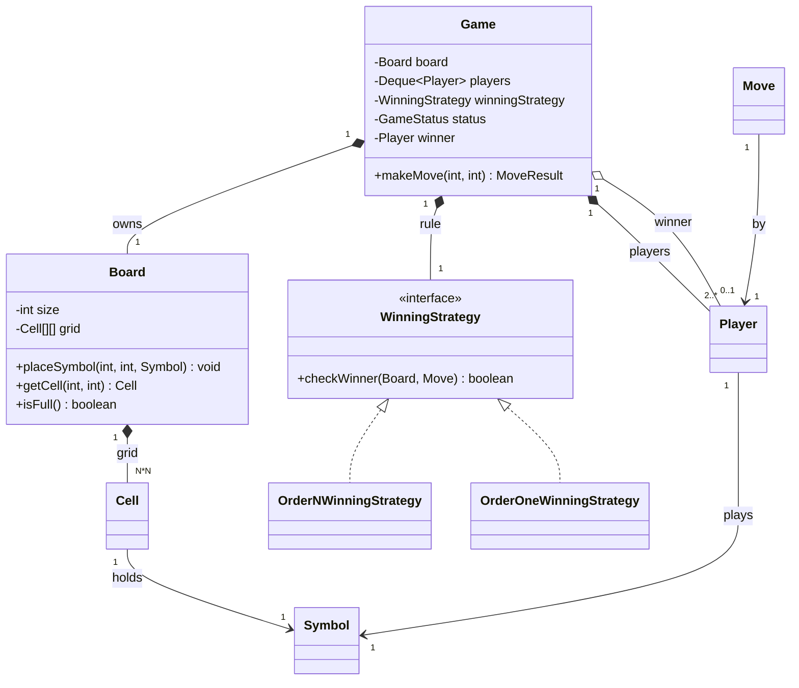
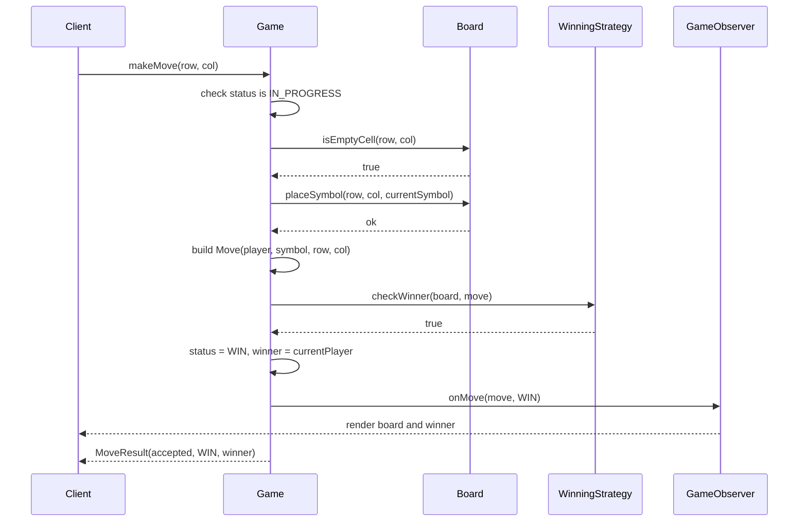
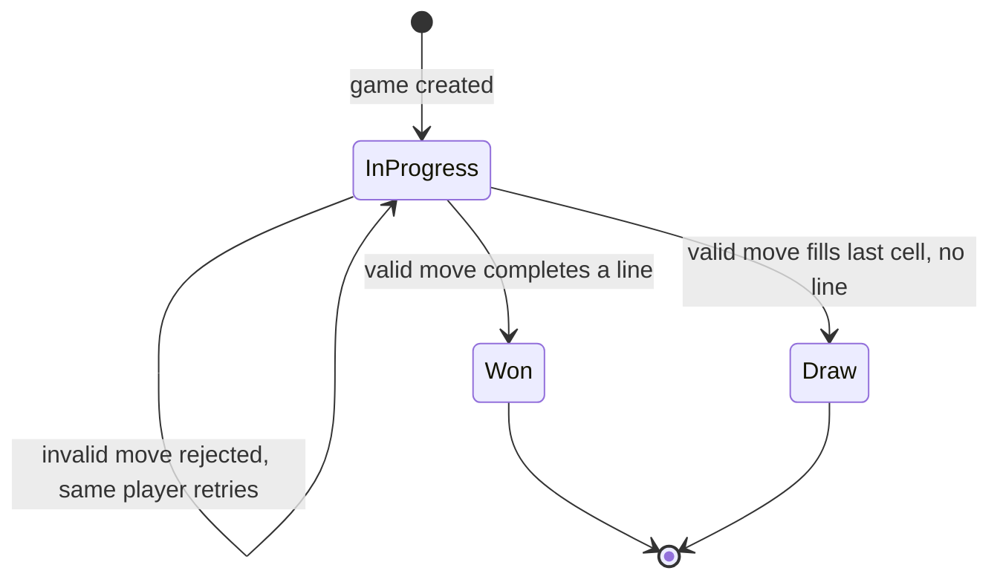

# ⭕ Low-Level Design: Tic-Tac-Toe

> A complete, interview-ready walkthrough of the classic **Tic-Tac-Toe** design problem — from a three-by-three grid a child could draw to a staff-level engine that detects a winner in constant time, generalizes to an N×N board with K-in-a-row, and survives the concurrency and extensibility follow-ups an interviewer keeps firing after the "textbook" answer.

Tic-Tac-Toe looks trivial, and that is exactly why it is asked. The rules fit on a napkin, so the interviewer is free to spend the whole session probing *how you think about design* rather than *whether you understand the game*. The naive candidate writes one giant `if`-ladder, scans the entire board after every move, hardcodes `3`, and assumes exactly two players — then freezes when asked "make win detection O(1)" or "now it's a 10×10 board where you need 5 in a row." The strong candidate models the board, the players, the turn order, and above all the *win-checking rule* as separate, replaceable pieces, and reaches for constant-time counters the moment board size enters the conversation. This guide walks that entire arc: from the beginner's mental model, through a clean object-oriented decomposition, to the algorithmic and systems-level depth that separates an L4 answer from an L6 one.

---

## 📋 Table of Contents

**Part I — Framing the Problem**

1. [Problem Statement](#1-problem-statement)
2. [Requirement Clarification & Assumptions](#2-requirement-clarification--assumptions)
3. [Functional & Non-Functional Requirements](#3-functional--non-functional-requirements)
4. [Core Concepts Being Tested](#4-core-concepts-being-tested)

**Part II — Modeling the Domain**

5. [Domain Model & Entities](#5-domain-model--entities)
6. [CRC Cards](#6-crc-cards)
7. [UML Class Diagram](#7-uml-class-diagram)
8. [Package Structure](#8-package-structure)

**Part III — Design Rationale**

9. [Design Decisions & Trade-offs](#9-design-decisions--trade-offs)
10. [Class-by-Class Deep Dive](#10-class-by-class-deep-dive)
11. [Design Patterns Applied](#11-design-patterns-applied)
12. [SOLID Principles Mapping](#12-solid-principles-mapping)

**Part IV — Behavior & Diagrams**

13. [Sequence Diagram](#13-sequence-diagram)
14. [State Diagram](#14-state-diagram)

**Part V — The Implementation**

15. [Complete Java Implementation](#15-complete-java-implementation)
16. [Execution Flow & Code Walkthrough](#16-execution-flow--code-walkthrough)

**Part VI — Engineering Depth**

17. [Complexity Analysis](#17-complexity-analysis)
18. [Thread Safety & Concurrency](#18-thread-safety--concurrency)
19. [Error Handling & Validation](#19-error-handling--validation)
20. [Scalability Discussion](#20-scalability-discussion)
21. [Alternative Designs & Trade-offs](#21-alternative-designs--trade-offs)

**Part VII — Interview Mastery**

22. [Common FAANG Follow-up Questions (L4 → L6)](#22-common-faang-follow-up-questions-l4--l6)
23. [Common Design Mistakes](#23-common-design-mistakes)
24. [Testing Strategy](#24-testing-strategy)
25. [FAANG Q&A Section](#25-faang-qa-section)
26. [STAR Behavioral Questions](#26-star-behavioral-questions)
27. [⚡ Quick Revision Cheat Sheet](#27--quick-revision-cheat-sheet)

---

## 1. Problem Statement

Design the software that runs a game of **Tic-Tac-Toe**. Two players take turns marking cells on a square grid — traditionally three-by-three — one placing `X`, the other placing `O`. A player wins the instant they complete a full line of their own marks: an entire row, an entire column, or one of the two diagonals. If every cell fills up and no line has been completed, the game is a **draw**. Players alternate strictly; a player may only mark a cell that is empty and in bounds, and only when it is their turn.

The deliverable in an interview is not a polished game with graphics; it is a **clean object-oriented model** — the set of classes, their responsibilities, the turn mechanics, and the win-detection logic — that a team could realistically build a UI or a network layer on top of. The grading centers on how cleanly you separate the board, the players, and the *rule that decides a win*; how you detect that win efficiently; and how gracefully your design absorbs the follow-ups the interviewer is holding in reserve — a bigger board, a different win condition, more than two players, an undo feature, or a networked multiplayer version.

<details>
<summary>📖 <b>In plain terms — what are we actually building?</b></summary>

Picture the pen-and-paper game you played as a kid: a grid with nine boxes, you draw X, your friend draws O, and whoever gets three in a row wins. Our job is to write the *brains* behind that — the software objects and rules, not the drawing. We need something that remembers whose turn it is, checks that the box you picked is empty and on the board, records your mark, and then decides after each mark whether someone just won, whether the board is full (a tie), or whether play continues. We are not building the buttons or the animation — we are building the logic that would sit underneath any front end, from a terminal prompt to a phone app, and enforce the rules correctly every single time.

</details>

The subtle art here is resisting the urge to treat "it's just Tic-Tac-Toe" as license to write throwaway code. The interviewer expects the *same design discipline* you would bring to a payments system, applied to a small problem — because a candidate who over-simplifies a small problem will over-simplify a large one too.

---

## 2. Requirement Clarification & Assumptions

The single biggest mistake candidates make is coding before scoping. Because Tic-Tac-Toe *feels* obvious, the temptation to skip clarification is strong — and skipping it is precisely what marks a junior candidate. A strong candidate spends the first few minutes converting the deceptively simple prompt into a bounded, extensible problem, and — crucially — asks the questions whose answers will shape the class design.

### 2.1 Actors

The people and systems that interact with the game define its surface area.

| Actor | Role in the system |
|-------|--------------------|
| **Player** | Takes turns marking a cell by row and column; wins, loses, or draws. |
| **Game / Referee** | Enforces the rules — validates each move, alternates turns, decides win or draw. |
| **UI / Client** | The terminal, GUI, or network client that captures a player's chosen cell and renders the board. Out of our core scope, but our API serves it. |

### 2.2 Key Clarifying Questions

Before modeling anything, resolve these with the interviewer. Each answer materially changes the design — and asking them signals that you see the generalizations hiding behind the toy problem.

- **Board size** — Is it always 3×3, or should the board be a configurable N×N? *(Assumption: build for a configurable N×N; hardcoding 3 is the first thing an interviewer attacks.)*
- **Win condition** — Is it always "a full line," or could it be "K in a row" on a larger board (Connect-style)? *(Assumption: v1 requires a full line of length N; we design so K-in-a-row can slot in later.)*
- **Number of players** — Always two, or could there be three-plus on a bigger board? *(Assumption: two players in v1, but turn management and symbols are modeled so more players are cheap to add.)*
- **Symbols** — Fixed to X and O, or arbitrary marks? *(Assumption: each player owns a symbol; X and O are just the defaults, not a hardcoded assumption.)*
- **Move validation** — What happens on an illegal move (occupied cell, out of bounds, wrong turn)? *(Assumption: reject with a clear error and do not advance the turn; the same player tries again.)*
- **Undo / replay** — Do we need to undo moves or replay a game? *(Assumption: not in v1, but we keep a move history so it's a small addition.)*
- **Interface** — Console, GUI, or networked? *(Assumption: we design a headless engine with a clean API; any UI plugs in on top.)*
- **Concurrency** — Local hot-seat, or two clients over a network hitting the same game? *(Assumption: v1 is single-threaded local play; we discuss what changes for networked, concurrent play.)*

### 2.3 Explicit Non-Goals

Naming what you will *not* build is a senior signal — it shows you can bound scope deliberately rather than by omission.

- No UI, rendering, or input parsing — we expose an engine API and assume a client drives it.
- No AI opponent or move-suggestion engine (minimax) in v1 — though we note exactly where it would hook in.
- No network protocol, matchmaking, or persistence layer in v1 — discussed under scalability.
- No animation, sound, or timing/clock rules (no move timers).
- No account system, ratings, or leaderboards.

<details>
<summary>📖 <b>Why spend clarification time on such a simple game?</b></summary>

Because the interviewer is testing whether you *generalize*. The three questions that most change the design are "is the board always 3×3?", "is the win always a full line?", and "is it always two players?" If you hardcode `3`, assume a full-line win, and bake in two players, your design collapses the moment any of those change — and the interviewer *will* change them. Asking upfront lets you build the flexible model from the start instead of retrofitting it under pressure, and it demonstrates that you treat a small problem with the same rigor as a large one.

</details>

---

## 3. Functional & Non-Functional Requirements

### 3.1 Functional Requirements (what the system *does*)

These are the concrete behaviors the engine must support. In an interview, list them crisply — they become your checklist for the class design.

1. **Initialize a game** — create an N×N board and register the participating players, each with a distinct symbol.
2. **Enforce turn order** — allow only the current player to move; alternate strictly after each valid move.
3. **Validate a move** — the target cell must be inside the board and currently empty.
4. **Place a mark** — record the current player's symbol in the chosen cell.
5. **Detect a win** — after each move, determine whether the just-placed mark completed a row, column, or diagonal.
6. **Detect a draw** — recognize when the board is full with no winner.
7. **Report game state** — expose whether the game is in progress, won (and by whom), or drawn.
8. **Render / expose the board** — provide the current board state for a client to display.

### 3.2 Non-Functional Requirements (how *well* it does it)

These are the qualities that make the design production-grade, and they are where staff-level discussion lives.

| Attribute | Requirement | Why it matters |
|-----------|-------------|----------------|
| **Correctness** | Never allow an illegal move; never miss or falsely declare a win. | These are the rules of the game — violating them makes the engine useless. |
| **Efficiency** | Win detection should not degrade badly as the board grows. | A full-board rescan is O(N²); a 1000×1000 board makes that painful. Constant-time detection is the marquee follow-up. |
| **Extensibility** | New board sizes, win conditions, and player counts slot in with minimal change. | The interviewer's follow-ups *are* these changes. |
| **Testability** | The rule logic must be verifiable in isolation. | Win detection has many edge cases (diagonals, last-move ties); it must be unit-testable without a UI. |
| **Usability of API** | A client should be able to drive the game with a small, clear interface. | The engine is a library; a confusing API is a real defect. |
| **Concurrency-safety** | If two networked clients share one game, moves must not corrupt state or double-apply. | Relevant only when we scale beyond local hot-seat, but a favorite probe. |

<details>
<summary>📖 <b>Functional vs non-functional — the quick distinction</b></summary>

Functional requirements are the *verbs* — place a mark, check for a win, alternate turns. If a functional requirement fails, the game did the wrong thing (accepted an illegal move, missed a win). Non-functional requirements are the *adverbs* — do it efficiently, do it in a way that's easy to extend and test. If a non-functional requirement fails, the game still works but *badly* — win detection crawls on a big board, or adding a new rule means rewriting the core class. Interviewers push on the non-functional ones because that's where a "correct but junior" solution is separated from a senior one.

</details>

---

## 4. Core Concepts Being Tested

This problem is a proxy for a bundle of skills. Knowing what's being measured helps you narrate your design to the *right* audience.

- **Object-oriented decomposition** — finding the right nouns (Board, Cell, Player, Game, WinningStrategy) and giving each a single, clear responsibility. The central test is whether you separate the *rule* from the *board* from the *orchestration*.
- **Encapsulation of state** — the board owns its cells and guards its own invariants (in bounds, empty) rather than letting the game class reach in and mutate raw arrays.
- **Algorithmic thinking** — win detection is a real algorithm. The naive scan is O(N²) per move; the constant-time counter approach is O(1). Recognizing and implementing that jump is the marquee L5 signal.
- **Design patterns in context** — Strategy (the win-checking rule), State (the game's lifecycle), Factory or Builder (game construction), Observer (notifying UIs of moves) — applied where they *earn their place*, not sprinkled for show.
- **Extensibility under pressure** — the interviewer changes the board size, the win length, the player count. Your design either flexes or shatters.
- **Edge-case reasoning** — the winning move on the last empty cell (win beats draw), diagonal wins, an anti-diagonal on an even board, rejecting an occupied cell. Naming and handling these is a senior signal.

Keep these in the back of your mind as you read on — each section below is, in part, a chance to demonstrate one or more of them.

---

## 5. Domain Model & Entities

Before any code, we identify the **nouns** in the problem and turn them into entities. Good domain modeling is the difference between a design that flexes and one that fights you.

### 5.1 The Entity Landscape

Here is the cast of the system, grouped by role:

- **Game** — the top-level orchestrator (the *context*). Owns the board, the ordered set of players, the current turn, the win-checking strategy, and the game status. Its `makeMove` method is the single entry point that drives one turn.
- **Board** — the N×N grid. Owns its `Cell` matrix, exposes safe operations to place a symbol and query a cell, and knows its own size and whether it is full. It guards the in-bounds and empty invariants.
- **Cell** — one square of the grid. Knows its row and column and which `Symbol` (if any) occupies it.
- **Player** — a participant. Carries a name and the `Symbol` they play. Immutable.
- **Symbol** — the mark a player places, modeled as an enum (`X`, `O`, and a conceptual `EMPTY` for vacant cells).
- **Move** — a single action: which player, placing which symbol, at which row and column. Useful as a value object for history, validation, and passing to the win strategy.
- **WinningStrategy** — the pluggable *rule* that answers one question: "did the move that was just made win the game?" This is the seam that lets win detection evolve (naive scan vs. O(1) counters vs. K-in-a-row) without touching the game loop.
- **GameStatus** — an enum capturing the lifecycle: `IN_PROGRESS`, `WIN`, `DRAW`.

### 5.2 Entity Relationships



<details>
<summary>📖 <b>How to read this relationship map</b></summary>

The diamond-headed lines mean "owns / is composed of" — a Game *is made of* its board, its players, and its winning strategy; they live and die with the game. The board is likewise composed of its cells. The hollow diamond between Game and the winning Player means "refers to" — the game points at whoever won, but that player exists independently. The plain arrows mean "uses / holds" — a cell *holds* a symbol, a player *plays* a symbol. The triangle arrows show the concrete strategies *implementing* the `WinningStrategy` interface, which is the structural seam that makes win detection swappable — the single most important design decision in the whole problem.

</details>

### 5.3 Core Enumerations

Enums keep the type system honest and make illegal states harder to represent.

- `Symbol { X, O, EMPTY }` — the mark in a cell. `EMPTY` models a vacant square, so a `Cell` never holds a `null` symbol and callers never dereference nothing.
- `GameStatus { IN_PROGRESS, WIN, DRAW }` — the game lifecycle, modeled as an explicit enum so the state is always one legible value rather than a scatter of booleans (`isOver`, `hasWinner`).

Modeling the empty state as a first-class `Symbol.EMPTY` rather than `null` is a small but real senior touch — it removes an entire class of null-pointer bugs and makes "is this cell free?" a simple, readable equality check.

---

## 6. CRC Cards

CRC (Class–Responsibility–Collaborator) cards are a lightweight way to pin down *what each class is responsible for* and *who it talks to*, before drowning in fields and methods. They force single-responsibility thinking, which interviewers reward.

| Class | Responsibilities | Collaborators |
|-------|------------------|---------------|
| **Game** | Orchestrate a turn: validate it's a legal move, place it, ask the strategy about a win, detect a draw, alternate turns, track status and winner. | Board, Player, WinningStrategy, Move |
| **Board** | Own the grid; place a symbol; return a cell; report bounds, emptiness, and fullness. | Cell, Symbol |
| **Cell** | Hold its position and the symbol occupying it; report whether it is empty. | Symbol |
| **Player** | Identify itself (name) and the symbol it plays. | Symbol |
| **Move** | Bundle a single action — the player, symbol, row, and column — as an immutable value. | Player, Symbol |
| **WinningStrategy** *(interface)* | Answer one question: did the last move win? | Board, Move |
| **OrderNWinningStrategy** | Detect a win by scanning the row, column, and diagonals of the last move — O(N). | Board, Move, Symbol |
| **OrderOneWinningStrategy** | Detect a win in O(1) by maintaining running counts per row, column, and diagonal for each symbol. | Board, Move, Symbol |
| **GameStatus** *(enum)* | Represent the lifecycle: in progress, win, or draw. | — |

Notice how each card has a *tight* set of responsibilities. The danger sign to watch for is a "god `Game` class" that owns the grid array directly, hardcodes the win-scan inline, alternates turns, *and* parses input — that concentration of duties is exactly the smell that the board, the rule, and the UI should be separate collaborators.

---

## 7. UML Class Diagram

Here is the full static structure in ASCII, the way you'd sketch it on a whiteboard. Abstract types are marked `«interface»`; the Strategy seam for win detection is deliberately front and center.

```
        ┌────────────────────────────────────────────────┐
        │ Game                                            │
        ├────────────────────────────────────────────────┤
        │ - board: Board                                  │
        │ - players: Deque<Player>                        │
        │ - winningStrategy: WinningStrategy              │
        │ - status: GameStatus                            │
        │ - winner: Player                                │
        │ - moveHistory: List<Move>                       │
        ├────────────────────────────────────────────────┤
        │ + makeMove(row: int, col: int): MoveResult      │
        │ + getStatus(): GameStatus                       │
        │ + getWinner(): Player                           │
        │ + getBoard(): Board                             │
        └───────────────┬────────────────┬───────────────┘
                        │ owns           │ delegates win check to
                        ▼                ▼
        ┌───────────────────────┐   ┌──────────────────────────────────┐
        │ Board                 │   │ «interface» WinningStrategy       │
        ├───────────────────────┤   ├──────────────────────────────────┤
        │ - size: int           │   │ + checkWinner(b: Board,           │
        │ - grid: Cell[][]      │   │       m: Move): boolean           │
        ├───────────────────────┤   └───────────────┬──────────────────┘
        │ + placeSymbol(r,c,s)  │                   │ implements
        │ + getCell(r,c): Cell  │        ┌──────────┴───────────┐
        │ + isFull(): boolean   │        ▼                      ▼
        │ + isEmptyCell(r,c)    │  ┌───────────────────┐ ┌───────────────────────┐
        │ + getSize(): int      │  │ OrderNWinning     │ │ OrderOneWinning        │
        └──────────┬────────────┘  │ Strategy          │ │ Strategy               │
                   │ composed of   ├───────────────────┤ ├───────────────────────┤
                   ▼               │ (stateless scan)  │ │ - rowCounts: Map       │
        ┌───────────────────────┐  │ + checkWinner(..) │ │ - colCounts: Map       │
        │ Cell                  │  └───────────────────┘ │ - diagCounts: Map      │
        ├───────────────────────┤                        │ - antiDiagCounts: Map  │
        │ - row: int            │                        │ + checkWinner(..)      │
        │ - col: int            │                        └───────────────────────┘
        │ - symbol: Symbol      │
        ├───────────────────────┤        ┌────────────────────────┐
        │ + isEmpty(): boolean  │        │ Player                 │
        │ + getSymbol(): Symbol │        ├────────────────────────┤
        └───────────────────────┘        │ - name: String         │
                                         │ - symbol: Symbol       │
        ┌───────────────────────┐        └────────────────────────┘
        │ «enum» Symbol         │
        │   X, O, EMPTY         │        ┌────────────────────────┐
        └───────────────────────┘        │ Move                   │
                                         ├────────────────────────┤
        ┌───────────────────────┐        │ - player: Player       │
        │ «enum» GameStatus     │        │ - symbol: Symbol       │
        │  IN_PROGRESS,         │        │ - row: int             │
        │  WIN, DRAW            │        │ - col: int             │
        └───────────────────────┘        └────────────────────────┘
```

The shape to internalize: `Game` sits at the top and *delegates* the two hard jobs — grid storage goes to `Board`, and the win decision goes to a `WinningStrategy`. Everything else (`Cell`, `Player`, `Move`, the enums) is a small value type feeding those two. That delegation is what keeps `Game` readable and what lets you answer "make it O(1)" by swapping one strategy object.

---

## 8. Package Structure

A clean package layout communicates the architecture at a glance and enforces dependency direction — the core domain must not depend on any UI or transport.

```
com.example.tictactoe
│
├── model                       // pure data / domain entities
│   ├── Board.java
│   ├── Cell.java
│   ├── Player.java
│   ├── Move.java
│   ├── Symbol.java             // enum: X, O, EMPTY
│   └── GameStatus.java         // enum: IN_PROGRESS, WIN, DRAW
│
├── strategy                    // the swappable win-detection rule
│   ├── WinningStrategy.java    // interface
│   ├── OrderNWinningStrategy.java     // O(N) scan
│   └── OrderOneWinningStrategy.java   // O(1) counters
│
├── game                        // orchestration
│   ├── Game.java               // the context / turn engine
│   ├── GameBuilder.java        // fluent construction
│   └── MoveResult.java         // outcome of one move
│
├── observer                    // optional: notify UIs / loggers
│   ├── GameObserver.java       // interface
│   └── ConsoleGameObserver.java
│
└── app
    └── TicTacToeDemo.java      // wires it together, runs a sample game
```

<details>
<summary>📖 <b>Why split into these packages?</b></summary>

The layering encodes a rule: dependencies point *inward* toward the domain. The `model` package knows nothing about strategies, games, or UIs — it is pure data. The `strategy` package depends only on `model`. The `game` package orchestrates both. The `observer` and `app` packages sit at the outer edge and depend on everything inside, but nothing inside depends on them. This is why you could throw away the console app and drop in a web server without touching a single line of the board or the win logic — the important stuff never learned that a UI exists.

</details>

---

## 9. Design Decisions & Trade-offs

Every meaningful design choice is a fork with consequences. Below are the decisions that define this solution, each framed as the alternative you rejected and *why* — because in an interview, being able to defend a choice against its alternative is worth more than the choice itself.

### 9.1 Extract the win rule into a `WinningStrategy` interface

The tempting shortcut is to write the win check as a private method inside `Game`. It works for 3×3. But the moment the interviewer says "now it's 10×10, and O(N²) per move is too slow" or "now a win is 4-in-a-row," you're editing the core game loop — a violation of the open/closed principle. By putting the rule behind a `WinningStrategy` interface, you can start with a simple O(N) scan and later inject an O(1) counter-based strategy, or a K-in-a-row strategy, *without touching `Game` at all*. This single decision is what turns "textbook" into "senior."

The trade-off: an interface plus a couple of implementations is more code than one inline loop. For a genuinely fixed 3×3 game that will never change, that's over-engineering. The judgment call — and you should say this out loud — is that the interviewer is *signaling* future change through the clarifying questions, so the seam pays for itself.

### 9.2 Represent the empty cell as `Symbol.EMPTY`, not `null`

Storing `null` in an empty cell forces every reader to null-check before use and invites `NullPointerException`. A first-class `Symbol.EMPTY` makes "is this cell free?" a clean equality check, makes the board printable without special-casing, and makes illegal states harder to reach. The cost is one extra enum constant — a trivial price for eliminating a whole bug category.

### 9.3 Model game status as a `GameStatus` enum, not scattered booleans

Two booleans (`gameOver`, `hasWinner`) can encode a contradictory state (`gameOver = false` but `hasWinner = true`). A single `GameStatus` enum with `IN_PROGRESS`, `WIN`, `DRAW` makes every state legal-by-construction and reads cleanly in `switch` statements. This is the same "make illegal states unrepresentable" instinct as the `EMPTY` choice.

### 9.4 Manage turns with a `Deque<Player>`

Turn rotation is naturally a queue: poll the front player, let them move, then push them to the back. A `Deque` (used as a queue) generalizes to any number of players for free — two, three, or ten — whereas a boolean `isPlayerOneTurn` flag hardcodes exactly two players. It also makes "skip a player" or "reverse order" trivial later.

### 9.5 Keep the engine headless and return a `MoveResult`

`makeMove` returns a structured `MoveResult` (was the move accepted, the resulting status, the winner) instead of printing to the console. This keeps the engine pure and testable — a unit test asserts on the returned object; a console app or web server interprets it however it likes. Coupling the engine to `System.out` would make it untestable and unusable over a network.

<details>
<summary>📖 <b>The one decision that matters most</b></summary>

If you remember a single thing from this problem, make it this: separate *the rule* from *the game*. Almost every follow-up an interviewer asks — bigger board, faster win check, different win condition, more players — is really asking "how loosely coupled is your win-detection logic?" A candidate who hardcoded a triple-nested `if` for the 3×3 case has to rewrite the core to answer any of them. A candidate who put the rule behind `WinningStrategy` just writes a new class and injects it. Everything else in this design is good hygiene; this one is the difference-maker.

</details>

### 9.6 Decision summary

| Decision | Chosen approach | Rejected alternative | Why |
|----------|-----------------|----------------------|-----|
| Win detection | `WinningStrategy` interface | Inline check in `Game` | Swappable algorithm; open/closed |
| Empty cell | `Symbol.EMPTY` | `null` | No NPEs; illegal states harder |
| Game state | `GameStatus` enum | Multiple booleans | No contradictory states |
| Turn order | `Deque<Player>` | `boolean` turn flag | Generalizes to N players |
| Engine output | Return `MoveResult` | Print to console | Testable, transport-agnostic |
| Board size | Configurable `size` | Hardcoded `3` | Absorbs the N×N follow-up |

---

## 10. Class-by-Class Deep Dive

With the decisions settled, here is what each class is *for* and the reasoning baked into it. Read this as the narration you'd give while whiteboarding.

### 10.1 `Symbol` (enum)

The mark that occupies a cell: `X`, `O`, and `EMPTY`. Making it an enum rather than a `char` or `String` means the compiler enforces the closed set of legal values — you cannot accidentally place a `'Z'`. `EMPTY` lets a `Cell` always hold a valid symbol, so no code path ever inspects a `null`.

### 10.2 `Cell`

A single square. It knows its `row`, its `col`, and the `Symbol` currently in it. It exposes `isEmpty()` (a check against `Symbol.EMPTY`) and getters/setters for the symbol. Keeping position *inside* the cell means a `Move` or a win-scan can reason about a cell without carrying its coordinates separately — the cell is self-describing.

### 10.3 `Board`

The N×N grid and the guardian of its own invariants. It owns a `Cell[][]` and exposes a *narrow, safe* surface: `placeSymbol(row, col, symbol)`, `getCell(row, col)`, `isEmptyCell(row, col)`, `isFull()`, and `getSize()`. Callers never touch the raw array. Crucially, `Board` does *not* decide wins — that would overload it. It only answers structural questions about the grid. `isFull()` is tracked with a running `filledCells` counter so it's O(1) rather than an O(N²) scan on every draw check.

### 10.4 `Player`

An immutable participant: a `name` and the `Symbol` they play. Immutability means a player object can be shared freely (across the turn queue, move history, and observers) with no risk of its symbol changing mid-game.

### 10.5 `Move`

An immutable value object bundling one action: the `player`, their `symbol`, and the target `row` and `col`. It exists so the win strategy receives a single, complete description of "what just happened" rather than a loose bag of parameters, and so `Game` can keep a `moveHistory` for free — the foundation for undo or replay later.

### 10.6 `WinningStrategy` (interface)

The heart of the design. One method: `boolean checkWinner(Board board, Move move)` — "given the board and the move just applied, did that move win?" Passing the `Move` (not just the board) is deliberate: a winning line must pass through the cell just played, so a smart strategy only needs to examine lines touching that cell, not the whole board.

### 10.7 `OrderNWinningStrategy`

The straightforward, stateless implementation. After a move at `(r, c)`, it checks only the four lines that could possibly have been completed by that move: row `r`, column `c`, the main diagonal (if `r == c`), and the anti-diagonal (if `r + c == size - 1`). Each check is O(N), so the whole thing is O(N) per move and holds no state — you can share one instance across games. This is the correct *first* answer.

### 10.8 `OrderOneWinningStrategy`

The staff-level implementation. Instead of scanning after each move, it maintains running counts: for each symbol, how many of its marks are in each row, each column, the main diagonal, and the anti-diagonal. When a symbol is placed at `(r, c)`, it increments the four relevant counters and checks whether any just hit `size`. That's O(1) time per move and O(N) space. The cost: the strategy is now *stateful* and tied to one game — a trade-off we examine head-on in the patterns section, because a stateful "strategy" bends the classic definition of the pattern.

### 10.9 `Game`

The orchestrator. It holds the `Board`, a `Deque<Player>` for turns, the injected `WinningStrategy`, the current `GameStatus`, the `winner`, and a `moveHistory`. Its one real method, `makeMove(row, col)`, is the whole game loop for a single turn: reject if the game is over, validate the cell, place the symbol, build a `Move`, ask the strategy about a win, else check for a draw, else rotate the turn — and return a `MoveResult` describing the outcome. Every hard decision is delegated; `Game` just sequences them.

### 10.10 `GameBuilder` and `MoveResult`

`GameBuilder` gives fluent, validated construction — set the board size, add players, choose a strategy — so `Game`'s constructor doesn't sprawl into a five-argument tangle and invalid configurations (zero players, size below one) are rejected at build time. `MoveResult` is the immutable outcome of `makeMove`: whether it was accepted, the new status, and the winner if any — the engine's clean contract with whatever drives it.

---

## 11. Design Patterns Applied

Patterns are not decoration; each one here solves a concrete problem the requirements created. Naming them *and justifying them* is the difference between "I memorized the Gang of Four" and "I know when to reach for a tool."

### 11.1 Strategy — the win-detection rule

`WinningStrategy` with its `OrderN` and `OrderOne` implementations is a textbook **Strategy** pattern: a family of interchangeable algorithms behind a common interface, chosen at construction time. This is what lets you answer "make it O(1)" or "make it K-in-a-row" by injecting a different object instead of editing `Game`.

<details>
<summary>📖 <b>Strategy pattern in one breath</b></summary>

The Strategy pattern captures "there are several ways to do this one job, and I want to pick which one at runtime." Here the job is "decide if a move won." The naive way scans the board; the fast way keeps counters; a future way might check for K-in-a-row. Each is a separate class implementing `WinningStrategy`, and `Game` just holds a reference to whichever one it was handed — it neither knows nor cares which. Swapping the algorithm is a one-line change at setup, with zero edits to the game loop.

</details>

### 11.2 State — the game lifecycle (and where it earns its place)

The `GameStatus` enum is a lightweight state model. In the richer version discussed under alternatives, the game's behavior itself changes with state — a move is rejected once the status is `WIN` or `DRAW` — which is the **State** pattern's territory. For a game this small, an enum plus a guard clause is the right weight; you should mention that a full State-object implementation is available if the lifecycle grew (pause, resume, forfeit, rematch).

### 11.3 Factory / Builder — game construction

`GameBuilder` is the **Builder** pattern: it assembles a `Game` from a board size, a player list, and a strategy through a fluent, validated API. It prevents half-constructed games and keeps the constructor clean. A `SymbolFactory` or `PlayerFactory` (a simple **Factory**) can standardize creating players with their symbols, though for two players it's often overkill — worth naming, worth not over-applying.

### 11.4 Observer — notifying the outside world

A `GameObserver` interface with an `onMove(Move, GameStatus)` callback is the **Observer** pattern: the `Game` publishes each move, and any number of listeners — a console renderer, a network broadcaster, a move logger, an analytics sink — react without the game knowing they exist. This is how the headless engine stays decoupled from every possible front end.

<details>
<summary>📖 <b>Why Observer instead of the game printing directly?</b></summary>

If `Game` called `System.out.println` after each move, it would be welded to the console — useless in a web app, impossible to test quietly. With Observer, the game just announces "a move happened, here's the new state," and whoever cares subscribes. The console app registers a `ConsoleGameObserver` that prints; a web server registers one that pushes over a WebSocket; a test registers none. The game logic never changes across all three. That is the whole point of keeping the engine headless.

</details>

### 11.5 Pattern summary

| Pattern | Where | Problem it solves |
|---------|-------|-------------------|
| **Strategy** | `WinningStrategy` + implementations | Swap win-detection algorithm without editing `Game` |
| **State** | `GameStatus` (enum; objects if it grows) | Behavior depends on game phase; reject moves once over |
| **Builder** | `GameBuilder` | Validated, readable construction; no telescoping constructor |
| **Factory** | Player/Symbol creation (optional) | Centralize and standardize object creation |
| **Observer** | `GameObserver` | Decouple the engine from any UI or transport |

---

## 12. SOLID Principles Mapping

SOLID is the vocabulary interviewers use to grade OO design. Here's how each principle shows up — concretely, not as a recitation.

**S — Single Responsibility.** Each class has exactly one reason to change. `Board` changes only if grid storage changes; `WinningStrategy` only if the win rule changes; `Game` only if the turn-sequencing flow changes. The win logic is *not* buried in `Game`, which is the most common SRP violation in naive solutions.

**O — Open/Closed.** The design is open to extension, closed to modification. Adding a K-in-a-row rule, a larger board, or a diagonal-only variant means writing a *new* `WinningStrategy` — the existing `Game`, `Board`, and other strategies are untouched. This is the payoff of the Strategy seam.

**L — Liskov Substitution.** Any `WinningStrategy` implementation is a drop-in for any other; `Game` works identically whether handed `OrderNWinningStrategy` or `OrderOneWinningStrategy`. Both honor the same contract: "return true iff the given move completed a winning line." No caller needs to know which concrete type it holds.

**I — Interface Segregation.** `WinningStrategy` exposes exactly one method, and `GameObserver` exactly one. No class is forced to implement methods it doesn't use. Contrast with a bloated `GameEngine` interface mixing rendering, rules, and persistence — that would force every implementer to stub methods it ignores.

**D — Dependency Inversion.** `Game` depends on the `WinningStrategy` *abstraction*, not on a concrete algorithm; the concrete strategy is injected via the builder. High-level orchestration doesn't depend on low-level detail — both depend on the interface. The same holds for `GameObserver`.

<details>
<summary>📖 <b>The SOLID payoff in one sentence</b></summary>

Every SOLID principle here is pulling in the same direction: keep the *win rule*, the *grid*, the *turn flow*, and the *output* as four separate, loosely-coupled pieces so that changing any one of them — which the interviewer will ask you to do — never forces you to touch the other three. If you can point at the `WinningStrategy` seam and explain how it satisfies O, L, I, and D at once, you've demonstrated SOLID far more convincingly than by reciting the acronym.

</details>

---

## 13. Sequence Diagram

This diagram traces the most important flow in the system: a player makes a move, and the move happens to win the game. Follow how `Game` orchestrates and *delegates* rather than doing the work itself.



The reading: the client knows nothing about boards, cells, or win rules — it just calls `makeMove` and interprets the returned `MoveResult`. `Game` is the conductor: it guards the game-over check, asks the `Board` about the cell, delegates the win decision to the `WinningStrategy`, updates its status, and fans the event out to observers. Notice that *no single object does everything* — the responsibility is spread exactly as the CRC cards promised.

<details>
<summary>📖 <b>Walking through the happy-and-winning path</b></summary>

A player picks a square, say the bottom-right. The client hands `(2, 2)` to the game. The game first confirms nobody has already won. It asks the board "is that square free?" — yes. It stamps the current player's symbol there. It packages that action as a `Move` and hands it to the win strategy, asking "did that just complete a line?" The strategy says yes. The game records the winner, flips its status to `WIN`, tells any observers so the screen can update, and returns a result object saying "accepted, game won, here's the winner." Every step is one object asking another to do its one job.

</details>

---

## 14. State Diagram

Tic-Tac-Toe has a small but real lifecycle. Modeling it explicitly is what prevents the classic bug of accepting a move after the game is already over.



The important transitions to narrate: from `InProgress`, a valid non-winning move loops back to `InProgress` (with the turn passed to the next player); a winning move goes to `Won`; a move that fills the final cell without a line goes to `Draw`. An *invalid* move (occupied cell, out of bounds) is rejected and the state stays `InProgress` with the *same* player still on the clock — a subtle correctness point interviewers love. Both `Won` and `Draw` are terminal: any further `makeMove` is rejected outright.

<details>
<summary>📖 <b>Why "win beats draw" on the very last move</b></summary>

The trickiest transition is the final move of a full board. Suppose the ninth mark both fills the last empty cell *and* completes a diagonal. Is that a draw (board full) or a win? It must be a win. The engine has to check for a win *before* it checks for a full-board draw — order matters. Getting this backwards is a genuine bug: you'd declare a tie on a move that actually won. The state diagram makes the priority explicit, and the code mirrors it by testing the winning condition first.

</details>

---

## 15. Complete Java Implementation

Below is the full, runnable implementation, one collapsible per class so you can study each in isolation. Every class name, field, and method signature here matches the diagrams above exactly. The code favors clarity and correctness over cleverness — which is what an interviewer wants to see.

<details>
<summary>💻 <b>Symbol.java</b> — the enum for cell marks</summary>

```java
package com.example.tictactoe.model;

/**
 * The mark that can occupy a cell. EMPTY models a vacant square so a Cell
 * never holds null and callers never dereference nothing.
 */
public enum Symbol {
    X,
    O,
    EMPTY
}
```

</details>

<details>
<summary>💻 <b>GameStatus.java</b> — the lifecycle enum</summary>

```java
package com.example.tictactoe.model;

/**
 * The game's lifecycle as a single legible value, so we never encode
 * contradictory state with scattered booleans.
 */
public enum GameStatus {
    IN_PROGRESS,
    WIN,
    DRAW
}
```

</details>

<details>
<summary>💻 <b>Cell.java</b> — one square of the grid</summary>

```java
package com.example.tictactoe.model;

/**
 * A single square. Self-describing: it knows its own coordinates and the
 * symbol occupying it. Starts EMPTY.
 */
public class Cell {
    private final int row;
    private final int col;
    private Symbol symbol;

    public Cell(int row, int col) {
        this.row = row;
        this.col = col;
        this.symbol = Symbol.EMPTY;
    }

    public boolean isEmpty() {
        return symbol == Symbol.EMPTY;
    }

    public Symbol getSymbol() {
        return symbol;
    }

    public void setSymbol(Symbol symbol) {
        this.symbol = symbol;
    }

    public int getRow() {
        return row;
    }

    public int getCol() {
        return col;
    }
}
```

</details>

<details>
<summary>💻 <b>Board.java</b> — the grid and guardian of its invariants</summary>

```java
package com.example.tictactoe.model;

/**
 * The N x N grid. Owns its cells and exposes a narrow, safe surface.
 * It answers structural questions only -- it does NOT decide wins.
 * isFull() is O(1) thanks to a running filledCells counter.
 */
public class Board {
    private final int size;
    private final Cell[][] grid;
    private int filledCells;

    public Board(int size) {
        if (size < 1) {
            throw new IllegalArgumentException("Board size must be at least 1");
        }
        this.size = size;
        this.grid = new Cell[size][size];
        for (int r = 0; r < size; r++) {
            for (int c = 0; c < size; c++) {
                grid[r][c] = new Cell(r, c);
            }
        }
        this.filledCells = 0;
    }

    /** Places a symbol; assumes the caller already validated the cell. */
    public void placeSymbol(int row, int col, Symbol symbol) {
        grid[row][col].setSymbol(symbol);
        filledCells++;
    }

    public Cell getCell(int row, int col) {
        return grid[row][col];
    }

    public boolean isEmptyCell(int row, int col) {
        return isInBounds(row, col) && grid[row][col].isEmpty();
    }

    public boolean isInBounds(int row, int col) {
        return row >= 0 && row < size && col >= 0 && col < size;
    }

    public boolean isFull() {
        return filledCells == size * size;
    }

    public int getSize() {
        return size;
    }

    /** Renders the board for any observer that wants to print it. */
    public String render() {
        StringBuilder sb = new StringBuilder();
        for (int r = 0; r < size; r++) {
            for (int c = 0; c < size; c++) {
                Symbol s = grid[r][c].getSymbol();
                sb.append(s == Symbol.EMPTY ? "." : s.name());
                if (c < size - 1) sb.append(" | ");
            }
            sb.append(System.lineSeparator());
        }
        return sb.toString();
    }
}
```

</details>

<details>
<summary>💻 <b>Player.java</b> — an immutable participant</summary>

```java
package com.example.tictactoe.model;

/** An immutable participant: a name and the symbol they play. */
public class Player {
    private final String name;
    private final Symbol symbol;

    public Player(String name, Symbol symbol) {
        this.name = name;
        this.symbol = symbol;
    }

    public String getName() {
        return name;
    }

    public Symbol getSymbol() {
        return symbol;
    }
}
```

</details>

<details>
<summary>💻 <b>Move.java</b> — an immutable value object for one action</summary>

```java
package com.example.tictactoe.model;

/**
 * One action, bundled immutably: which player placed which symbol where.
 * Given to the WinningStrategy and kept in Game's move history.
 */
public class Move {
    private final Player player;
    private final Symbol symbol;
    private final int row;
    private final int col;

    public Move(Player player, int row, int col) {
        this.player = player;
        this.symbol = player.getSymbol();
        this.row = row;
        this.col = col;
    }

    public Player getPlayer() {
        return player;
    }

    public Symbol getSymbol() {
        return symbol;
    }

    public int getRow() {
        return row;
    }

    public int getCol() {
        return col;
    }
}
```

</details>

<details>
<summary>💻 <b>WinningStrategy.java</b> — the swappable win-detection interface</summary>

```java
package com.example.tictactoe.strategy;

import com.example.tictactoe.model.Board;
import com.example.tictactoe.model.Move;

/**
 * The heart of the design. Answers exactly one question: did the move that
 * was just applied complete a winning line? Passing the Move (not just the
 * board) lets an implementation examine only the lines touching that cell.
 */
public interface WinningStrategy {
    boolean checkWinner(Board board, Move move);
}
```

</details>

<details>
<summary>💻 <b>OrderNWinningStrategy.java</b> — the stateless O(N) scan (correct first answer)</summary>

```java
package com.example.tictactoe.strategy;

import com.example.tictactoe.model.Board;
import com.example.tictactoe.model.Move;
import com.example.tictactoe.model.Symbol;

/**
 * Checks only the four lines that the last move could have completed:
 * its row, its column, and (when applicable) the two diagonals.
 * O(N) time per move, no state -- one instance can be shared across games.
 */
public class OrderNWinningStrategy implements WinningStrategy {

    @Override
    public boolean checkWinner(Board board, Move move) {
        int size = board.getSize();
        Symbol s = move.getSymbol();
        int r = move.getRow();
        int c = move.getCol();

        // Row r
        boolean win = true;
        for (int col = 0; col < size; col++) {
            if (board.getCell(r, col).getSymbol() != s) { win = false; break; }
        }
        if (win) return true;

        // Column c
        win = true;
        for (int row = 0; row < size; row++) {
            if (board.getCell(row, c).getSymbol() != s) { win = false; break; }
        }
        if (win) return true;

        // Main diagonal (only if the move sits on it)
        if (r == c) {
            win = true;
            for (int i = 0; i < size; i++) {
                if (board.getCell(i, i).getSymbol() != s) { win = false; break; }
            }
            if (win) return true;
        }

        // Anti-diagonal (only if the move sits on it)
        if (r + c == size - 1) {
            win = true;
            for (int i = 0; i < size; i++) {
                if (board.getCell(i, size - 1 - i).getSymbol() != s) { win = false; break; }
            }
            if (win) return true;
        }

        return false;
    }
}
```

</details>

<details>
<summary>💻 <b>OrderOneWinningStrategy.java</b> — the O(1) counter approach (staff-level)</summary>

```java
package com.example.tictactoe.strategy;

import com.example.tictactoe.model.Board;
import com.example.tictactoe.model.Move;
import com.example.tictactoe.model.Symbol;

import java.util.HashMap;
import java.util.Map;

/**
 * Maintains running counts of each symbol's marks per row, per column, and
 * on the two diagonals. Each move increments the four relevant counters and
 * checks whether any just reached `size`. O(1) time per move, O(N) space.
 *
 * NOTE: this strategy is STATEFUL and therefore tied to one game / board.
 * Do not share a single instance across concurrent games.
 */
public class OrderOneWinningStrategy implements WinningStrategy {
    private final int size;
    private final Map<Symbol, int[]> rowCounts = new HashMap<>();
    private final Map<Symbol, int[]> colCounts = new HashMap<>();
    private final Map<Symbol, Integer> diagCounts = new HashMap<>();
    private final Map<Symbol, Integer> antiDiagCounts = new HashMap<>();

    public OrderOneWinningStrategy(int size) {
        this.size = size;
    }

    @Override
    public boolean checkWinner(Board board, Move move) {
        Symbol s = move.getSymbol();
        int r = move.getRow();
        int c = move.getCol();

        rowCounts.putIfAbsent(s, new int[size]);
        colCounts.putIfAbsent(s, new int[size]);

        int rowVal = ++rowCounts.get(s)[r];
        int colVal = ++colCounts.get(s)[c];

        int diagVal = 0;
        if (r == c) {
            diagVal = diagCounts.merge(s, 1, Integer::sum);
        }

        int antiVal = 0;
        if (r + c == size - 1) {
            antiVal = antiDiagCounts.merge(s, 1, Integer::sum);
        }

        return rowVal == size || colVal == size || diagVal == size || antiVal == size;
    }
}
```

</details>

<details>
<summary>💻 <b>MoveResult.java</b> — the immutable outcome of a move</summary>

```java
package com.example.tictactoe.game;

import com.example.tictactoe.model.GameStatus;
import com.example.tictactoe.model.Player;

/** The engine's clean contract with whatever drives it. */
public class MoveResult {
    private final boolean accepted;
    private final String message;
    private final GameStatus status;
    private final Player winner;   // null unless status == WIN

    public MoveResult(boolean accepted, String message, GameStatus status, Player winner) {
        this.accepted = accepted;
        this.message = message;
        this.status = status;
        this.winner = winner;
    }

    public boolean isAccepted() { return accepted; }
    public String getMessage() { return message; }
    public GameStatus getStatus() { return status; }
    public Player getWinner() { return winner; }
}
```

</details>

<details>
<summary>💻 <b>GameObserver.java & ConsoleGameObserver.java</b> — decoupled notifications</summary>

```java
package com.example.tictactoe.observer;

import com.example.tictactoe.model.GameStatus;
import com.example.tictactoe.model.Move;

/** Anyone who wants to react to moves implements this. */
public interface GameObserver {
    void onMove(Move move, GameStatus status);
}
```

```java
package com.example.tictactoe.observer;

import com.example.tictactoe.model.GameStatus;
import com.example.tictactoe.model.Move;

/** A concrete observer that prints move events. Swap for a WebSocket
 *  broadcaster or a logger without touching the engine. */
public class ConsoleGameObserver implements GameObserver {
    @Override
    public void onMove(Move move, GameStatus status) {
        System.out.printf("%s played (%d, %d) -> %s%n",
                move.getPlayer().getName(), move.getRow(), move.getCol(), status);
    }
}
```

</details>

<details>
<summary>💻 <b>Game.java</b> — the orchestrator / turn engine</summary>

```java
package com.example.tictactoe.game;

import com.example.tictactoe.model.*;
import com.example.tictactoe.observer.GameObserver;
import com.example.tictactoe.strategy.WinningStrategy;

import java.util.ArrayList;
import java.util.Deque;
import java.util.List;

/**
 * The context / orchestrator. Sequences one turn in makeMove() and delegates
 * every hard decision: grid storage to Board, the win rule to WinningStrategy.
 */
public class Game {
    private final Board board;
    private final Deque<Player> players;
    private final WinningStrategy winningStrategy;
    private final List<GameObserver> observers;
    private final List<Move> moveHistory = new ArrayList<>();

    private GameStatus status = GameStatus.IN_PROGRESS;
    private Player winner;

    // Package-private: built via GameBuilder.
    Game(Board board, Deque<Player> players, WinningStrategy winningStrategy,
         List<GameObserver> observers) {
        this.board = board;
        this.players = players;
        this.winningStrategy = winningStrategy;
        this.observers = observers;
    }

    /** The whole game loop for a single turn. */
    public MoveResult makeMove(int row, int col) {
        // 1. Reject moves once the game is over.
        if (status != GameStatus.IN_PROGRESS) {
            return new MoveResult(false, "Game is already over", status, winner);
        }
        // 2. Validate the target cell.
        if (!board.isInBounds(row, col)) {
            return new MoveResult(false, "Move out of bounds", status, null);
        }
        if (!board.isEmptyCell(row, col)) {
            return new MoveResult(false, "Cell already occupied", status, null);
        }

        // 3. Apply the move.
        Player current = players.peekFirst();
        board.placeSymbol(row, col, current.getSymbol());
        Move move = new Move(current, row, col);
        moveHistory.add(move);

        // 4. Check win BEFORE draw -- win must beat a full-board tie.
        if (winningStrategy.checkWinner(board, move)) {
            status = GameStatus.WIN;
            winner = current;
        } else if (board.isFull()) {
            status = GameStatus.DRAW;
        } else {
            // 5. Rotate the turn: front player goes to the back.
            players.addLast(players.pollFirst());
        }

        notifyObservers(move);
        return new MoveResult(true, "Move accepted", status, winner);
    }

    private void notifyObservers(Move move) {
        for (GameObserver o : observers) {
            o.onMove(move, status);
        }
    }

    public GameStatus getStatus() { return status; }
    public Player getWinner() { return winner; }
    public Board getBoard() { return board; }
    public List<Move> getMoveHistory() { return List.copyOf(moveHistory); }
}
```

</details>

<details>
<summary>💻 <b>GameBuilder.java</b> — fluent, validated construction</summary>

```java
package com.example.tictactoe.game;

import com.example.tictactoe.model.Board;
import com.example.tictactoe.model.Player;
import com.example.tictactoe.observer.GameObserver;
import com.example.tictactoe.strategy.OrderOneWinningStrategy;
import com.example.tictactoe.strategy.WinningStrategy;

import java.util.ArrayDeque;
import java.util.ArrayList;
import java.util.Deque;
import java.util.List;

/** Prevents half-constructed games and telescoping constructors. */
public class GameBuilder {
    private int size = 3;
    private final List<Player> players = new ArrayList<>();
    private WinningStrategy winningStrategy;
    private final List<GameObserver> observers = new ArrayList<>();

    public GameBuilder boardSize(int size) {
        this.size = size;
        return this;
    }

    public GameBuilder addPlayer(Player player) {
        this.players.add(player);
        return this;
    }

    public GameBuilder winningStrategy(WinningStrategy strategy) {
        this.winningStrategy = strategy;
        return this;
    }

    public GameBuilder addObserver(GameObserver observer) {
        this.observers.add(observer);
        return this;
    }

    public Game build() {
        if (players.size() < 2) {
            throw new IllegalStateException("Need at least two players");
        }
        if (players.size() > size) {
            throw new IllegalStateException("Too many players for this board size");
        }
        Board board = new Board(size);
        WinningStrategy strategy = (winningStrategy != null)
                ? winningStrategy
                : new OrderOneWinningStrategy(size); // sensible default
        Deque<Player> queue = new ArrayDeque<>(players);
        return new Game(board, queue, strategy, observers);
    }
}
```

</details>

<details>
<summary>💻 <b>TicTacToeDemo.java</b> — wiring it together</summary>

```java
package com.example.tictactoe.app;

import com.example.tictactoe.game.Game;
import com.example.tictactoe.game.GameBuilder;
import com.example.tictactoe.game.MoveResult;
import com.example.tictactoe.model.Player;
import com.example.tictactoe.model.Symbol;
import com.example.tictactoe.observer.ConsoleGameObserver;
import com.example.tictactoe.strategy.OrderOneWinningStrategy;

public class TicTacToeDemo {
    public static void main(String[] args) {
        Player alice = new Player("Alice", Symbol.X);
        Player bob = new Player("Bob", Symbol.O);

        Game game = new GameBuilder()
                .boardSize(3)
                .addPlayer(alice)
                .addPlayer(bob)
                .winningStrategy(new OrderOneWinningStrategy(3))
                .addObserver(new ConsoleGameObserver())
                .build();

        // Alice takes the top row: (0,0), (0,1), (0,2). Bob answers on row 1.
        int[][] script = {
                {0, 0}, // X
                {1, 0}, // O
                {0, 1}, // X
                {1, 1}, // O
                {0, 2}  // X wins the top row
        };

        for (int[] m : script) {
            MoveResult result = game.makeMove(m[0], m[1]);
            if (!result.isAccepted()) {
                System.out.println("Rejected: " + result.getMessage());
            }
        }

        System.out.println(game.getBoard().render());
        System.out.println("Status: " + game.getStatus());
        if (game.getWinner() != null) {
            System.out.println("Winner: " + game.getWinner().getName());
        }
    }
}
```

</details>

---

## 16. Execution Flow & Code Walkthrough

Reading code top to bottom is not the same as understanding how control flows through it at runtime. Here is the life of a single call to `makeMove`, tracing the demo above at the winning fifth move — Alice playing `(0, 2)` to complete the top row.

1. **Guard the lifecycle.** `makeMove` first checks `status`. It's still `IN_PROGRESS`, so we proceed. (Had Alice already won, this returns a rejected `MoveResult` immediately — the code embodiment of the terminal states in the state diagram.)

2. **Validate the cell.** `board.isInBounds(0, 2)` is true, and `board.isEmptyCell(0, 2)` is true — nobody has played there. Both guards pass. Had either failed, we'd return a rejected result *without* rotating the turn, so Alice would simply try again.

3. **Identify the mover and apply.** `players.peekFirst()` returns Alice (she's at the front of the deque). `board.placeSymbol(0, 2, Symbol.X)` stamps her mark and bumps `filledCells` to 5. We wrap it as an immutable `Move`.

4. **Ask the rule — win check first.** `winningStrategy.checkWinner(board, move)` runs. Using `OrderOneWinningStrategy`, placing X at `(0, 2)` increments `rowCounts[X][0]` to 3, which equals `size`. The strategy returns `true` in O(1) — no board scan.

5. **Record the result.** Because the win check returned true, we set `status = WIN` and `winner = Alice`. The draw branch and the turn-rotation branch are both skipped — this is exactly why the win check must come before the draw check.

6. **Fan out and return.** We notify observers (`ConsoleGameObserver` prints the move and `WIN`) and return `MoveResult(accepted, WIN, Alice)`. The client sees a clean, structured outcome.

<details>
<summary>📖 <b>Following one move from click to result</b></summary>

A player taps a square. The engine asks three quick questions in order: "Is the game still going? Is that square on the board? Is it empty?" If any answer is no, it politely refuses and the same player tries again. If all yes, it stamps the mark, then immediately asks the rule-checker "did that just win?" If yes, it crowns the winner and stops. If no but the board is now full, it's a tie. Otherwise it hands the turn to the next player and waits. That ordered sequence — guard, validate, place, check-win, check-draw, rotate — is the entire heartbeat of the game.

</details>

---

## 17. Complexity Analysis

Let N be the board dimension (so the board has N² cells) and let M be the number of moves in a game.

| Operation | `OrderNWinningStrategy` | `OrderOneWinningStrategy` |
|-----------|-------------------------|----------------------------|
| Place a symbol | O(1) | O(1) |
| Check for win (per move) | O(N) — scans up to 4 lines of length N | **O(1)** — increments 4 counters |
| Check for draw | O(1) — `filledCells` counter | O(1) |
| Full game | O(N² · N) = O(N³) worst case | O(N²) — dominated by the moves themselves |
| Extra space | O(1) beyond the board | O(N) — counter arrays per symbol |

The board itself always costs O(N²) space to store the grid. The interesting comparison is the win check: the naive scan is O(N) per move because it walks the row, column, and diagonals; over a full board of O(N²) moves that's O(N³) total work. The counter approach trades a little memory — O(N) for the per-row and per-column arrays — to make each check O(1), bringing the whole game down to O(N²), which is optimal since you must at least fill the cells.

<details>
<summary>📖 <b>Why the O(1) trick matters — and when it doesn't</b></summary>

For a 3×3 board, O(N) versus O(1) is the difference between checking 3 cells and 1 counter — utterly irrelevant. So why does the interviewer care? Because they're testing whether you *recognize* the optimization exists and can implement it, which signals how you'd think about a genuinely large board (say a 19×19 Go-style board or a huge Connect-style grid). The honest senior answer is: "For 3×3 I'd ship the O(N) scan — it's simpler and the difference is noise. I'd switch to O(1) counters only when the board is large enough for the scan to matter, and my Strategy interface lets me do that without touching the game loop." That framing — right tool, right size, seam ready — is the answer they want.

</details>

---

## 18. Thread Safety & Concurrency

The v1 engine is deliberately single-threaded: one client, hot-seat play, one move at a time. In that model there is no shared mutable state across threads, so no synchronization is needed — and adding locks would be premature complexity. But the interviewer will almost certainly ask "what if this is a networked game with two remote players?" That's where the real discussion lives.

The moment two clients can call `makeMove` on the same `Game` concurrently, several fields become shared mutable state: the `Board` cells, the `players` deque, `status`, `winner`, and the `OrderOneWinningStrategy` counters. A naive concurrent design has a **check-then-act race**: two moves could both pass the `isEmptyCell` guard for the same cell before either writes, or both could rotate the turn, corrupting the queue.

The clean fixes, in increasing order of scale:

- **Serialize per game.** Since a single Tic-Tac-Toe game is inherently turn-based, the simplest correct approach is to make `makeMove` atomic per game instance — a `synchronized` method or a per-game `ReentrantLock`. Contention is near zero (only two players, alternating), so a coarse lock costs nothing here and eliminates every race.
- **Enforce turn ownership.** Beyond locking, validate that the caller *is* the current player (attach a player identity to the request), so a player can't move out of turn even if their client misbehaves. This turns the turn order into a correctness guarantee, not just a convention.
- **Scale across a fleet.** For thousands of concurrent games on many servers, don't share one process's memory. Give each game an identity, keep its authoritative state in a fast store (for example, Redis) or an actor that owns that game, and route both players' moves to the same owner. Each game is a tiny, independent unit of concurrency — an embarrassingly parallel workload.

<details>
<summary>📖 <b>The core concurrency risk in plain terms</b></summary>

Imagine both players' phones send a move for the very same empty square at nearly the same instant. Without protection, both requests could read "that square is empty," and both could then write their mark — the second silently overwriting the first, or the turn counter advancing twice. The fix is to make "check the square, place the mark, advance the turn" happen as one indivisible step per game, so a second move can't sneak in halfway through the first. Because only two players ever touch one game and they alternate, a simple lock around that step is both correct and effectively free.

</details>

---

## 19. Error Handling & Validation

Robust input handling is where a design proves it's production-grade rather than a happy-path demo. The engine faces two categories of bad input: *illegal moves* (recoverable — the player just retries) and *misconfiguration* (a programming error — fail fast).

**Illegal moves are expected and handled gracefully.** An out-of-bounds coordinate, an occupied cell, or a move after the game is over are all normal user behavior, not exceptions. The engine returns a rejected `MoveResult` carrying a clear message and *does not advance the turn* — the same player tries again. Returning a result object rather than throwing keeps the control flow clean for the client and avoids using exceptions for ordinary flow control, which is an anti-pattern.

**Misconfiguration fails fast at construction.** A board size below one, fewer than two players, or more players than the board can seat are programmer errors that should never reach production. `GameBuilder.build()` and the `Board` constructor throw `IllegalArgumentException` / `IllegalStateException` immediately, so the bug surfaces at setup with a clear message rather than as mysterious behavior mid-game.

| Failure | Category | Handling |
|---------|----------|----------|
| Cell out of bounds | Illegal move | Rejected `MoveResult`, turn not advanced |
| Cell already occupied | Illegal move | Rejected `MoveResult`, turn not advanced |
| Move after game over | Illegal move | Rejected `MoveResult` with terminal status |
| Board size < 1 | Misconfiguration | `IllegalArgumentException` at construction |
| Fewer than 2 players | Misconfiguration | `IllegalStateException` at build |
| Wrong player moving (networked) | Illegal move | Reject; validate caller identity == current player |

<details>
<summary>📖 <b>Why reject with a result instead of throwing?</b></summary>

Tapping an already-filled square isn't a *crash* — it's a normal thing players do all the time. If the engine threw an exception every time, the client would have to wrap every move in a try/catch and exceptions would become part of ordinary gameplay, which is slow and confusing. Instead the engine returns a small object that says "not accepted — cell occupied," and the client just shows a gentle nudge and lets the player pick again. Exceptions are reserved for genuine mistakes in *how the game was set up*, which should stop the program loudly and early.

</details>

---

## 20. Scalability Discussion

A single game is trivial to scale — the interesting question is scaling to a *platform* hosting millions of games. The good news is that Tic-Tac-Toe games are perfectly independent: no game shares state with another, so the workload is embarrassingly parallel. The scaling story is therefore about routing, state ownership, and real-time delivery, not about the game logic itself.

**Stateless app servers, externalized game state.** Keep the app servers stateless and store each game's authoritative state keyed by a `gameId` in a low-latency store (Redis, or an in-memory actor/grain in a framework like Akka or Orleans). Any server can then handle any player's move by loading and mutating that one game. This is the standard shared-nothing horizontal-scaling pattern.

**Route both players to one authority.** Both players in a game must hit the same source of truth for their game, or you get split-brain state. Use consistent routing on `gameId` (sticky sessions, a hash ring, or an actor addressed by `gameId`) so concurrent moves serialize against a single owner — which also gives you the per-game lock from the concurrency section for free.

**Real-time delivery.** Players expect to see the opponent's move instantly. Push moves over WebSockets (or Server-Sent Events); the `GameObserver` seam is exactly where a WebSocket broadcaster plugs in, so the engine needs no changes. For massive fan-out (spectators), a pub/sub layer (Redis Pub/Sub, Kafka) decouples the game from the delivery.

**Persistence and analytics.** Completed games can be written to durable storage (the `moveHistory` serializes cleanly) for replay, anti-cheat, and rating systems. Move events streamed to Kafka feed analytics without slowing the game path.

<details>
<summary>📖 <b>The key insight for scaling this</b></summary>

The reason a Tic-Tac-Toe platform scales almost effortlessly is that every game is an island — Alice-vs-Bob shares nothing with Carol-vs-Dave. So you never need a giant shared database transaction; you just need to make sure both people playing one game always talk to the same little authority that owns that game's state. Spread a million of those tiny authorities across a fleet of servers, push each move to the two players over a live connection, and you've scaled to a million games without the game logic getting one bit more complicated. The hard parts become routing and real-time messaging, not the rules of the game.

</details>

---

## 21. Alternative Designs & Trade-offs

A senior candidate can articulate the designs they *didn't* choose and why. Here are the main forks.

**Bitboards instead of a `Cell[][]`.** For a fixed small board, you can represent each player's marks as bits in an integer and detect a win by masking against precomputed winning patterns — extremely fast and memory-tiny. The trade-off: it's cryptic, hard to read, and doesn't generalize cleanly to arbitrary N×N with K-in-a-row. It's the right call for a high-performance engine (or an AI doing millions of board evaluations), and the wrong call for a readable interview design. Mention it as the performance option.

**A full State pattern for the lifecycle.** Instead of a `GameStatus` enum plus a guard clause, you could model `InProgressState`, `WonState`, and `DrawState` as objects that each handle `makeMove` differently. This shines if the lifecycle grows rich (pause, resume, forfeit, rematch, timed moves). For three states and one guard, it's heavier than the enum — so the enum is the right weight for v1, with the State-object upgrade named as the path if requirements expand.

**Baking win detection into `Board`.** Simpler at first — one fewer class. But it fuses two responsibilities and kills the swappability that every follow-up depends on. Rejected for violating SRP and open/closed.

**Generalizing to a `WinningStrategy` for K-in-a-row now.** You could build the K-in-a-row rule immediately rather than the full-line rule. This is often *over*-building for v1 — but because the strategy is already a seam, deferring it costs nothing. Build the simple rule, note that K-in-a-row is a new strategy class away.

| Alternative | Upside | Downside | Verdict |
|-------------|--------|----------|---------|
| Bitboard representation | Blazing fast, tiny memory | Cryptic, poor generalization | Use for AI/perf engines, not readability |
| Full State-object lifecycle | Scales to rich lifecycles | Overkill for 3 states | Enum now, upgrade if it grows |
| Win logic inside `Board` | One fewer class | Breaks SRP and open/closed | Rejected |
| K-in-a-row strategy up front | Maximum flexibility | Over-building v1 | Defer — the seam makes it cheap later |

<details>
<summary>📖 <b>How to talk about alternatives without rambling</b></summary>

The interviewer isn't asking you to implement every alternative — they want to see that you *know they exist* and can pick deliberately. The strong move is one sentence each: "A bitboard would be faster but unreadable and hard to generalize, so I'd only use it for an AI engine. A full State-object lifecycle is cleaner if we add pause/forfeit, but for three states an enum is the right weight. And because win detection is already behind a Strategy interface, upgrading from full-line to K-in-a-row is a new class, not a rewrite." That shows judgment — choosing the simplest thing that leaves the door open — which is exactly the staff-level signal.

</details>

---

## 22. Common FAANG Follow-up Questions (L4 → L6)

Interviews escalate. The same base problem gets pushed harder depending on the level you're targeting. Here is the ladder, with the *shape* of the expected answer at each rung.

**L4 (entry / SDE I) — "get it working correctly."**

- *"How do you check for a win?"* — Scan the row, column, and (if applicable) the diagonals of the last move. Show you check only lines touching that cell, not the whole board.
- *"What if a player picks a taken cell?"* — Validate and reject; the same player retries. Don't advance the turn.
- *"How do you know it's a draw?"* — Board is full and no one has won. Emphasize checking win *before* draw.

**L5 (senior / SDE II) — "make it clean and efficient."**

- *"Make win detection O(1)."* — Introduce per-row, per-column, and per-diagonal counters keyed by symbol; increment on each move, compare to `size`. Explain the O(N) space trade-off.
- *"Now the board is N×N. What breaks?"* — Nothing, if you never hardcoded 3. Walk through how size flows through `Board`, the strategy, and the counters.
- *"Support K-in-a-row, not full-line."* — A new `WinningStrategy` implementation; the game loop is untouched. This is where the Strategy seam pays off visibly.
- *"How would you unit-test the win logic?"* — Test the strategy in isolation with crafted boards: each row, each column, both diagonals, a near-miss, and the last-move win-vs-draw case.

**L6 (staff / principal) — "make it a platform and defend every choice."**

- *"Turn this into online multiplayer for millions of games."* — Stateless servers, per-`gameId` state ownership, consistent routing, WebSocket push, the `GameObserver` seam for delivery.
- *"Where are the concurrency bugs and how do you prevent them?"* — The check-then-act race on a cell; serialize per game with a lock or single-owner actor; validate turn ownership.
- *"How would you add an AI opponent?"* — A `Player` backed by a minimax (with alpha-beta pruning) move generator; it plugs in behind the same move API. The engine doesn't know a player is a bot.
- *"How do you prevent cheating?"* — Server is authoritative; never trust the client's claim of a win. Validate every move server-side; log `moveHistory` for audit.
- *"Cut this to an MVP shippable next week — what stays, what goes?"* — Keep the headless engine, `Board`, the O(N) strategy, and turn logic. Drop observers, the builder's fancy validation, and the O(1) optimization until scale demands them.

<details>
<summary>📖 <b>Reading the level from the question</b></summary>

The tell is *what kind of pressure* the interviewer applies. If they push on correctness and edge cases ("what if the cell is taken?"), they're calibrating you at L4 and want to see rigor. If they push on efficiency and extensibility ("make it O(1)", "now it's K-in-a-row"), that's L5 — they want clean seams. If they push on systems, concurrency, and trade-off defense ("scale to millions", "where are the races", "what would you cut"), that's L6 — they want judgment about the whole platform, not just the class diagram. Answer at the rung you're being asked, and signal you can climb the next one.

</details>

---

## 23. Common Design Mistakes

These are the traps that sink otherwise-capable candidates. Naming them proactively in your interview is itself a strong signal.

- **Hardcoding the board size.** Writing `3` throughout instead of a `size` field. The interviewer *will* say "now it's 10×10," and hardcoded solutions require a rewrite. Parameterize from the start.
- **Rescanning the entire board every move.** An O(N²) full-board scan when only the four lines through the last move can possibly have changed. Correct but wasteful, and it signals you haven't thought about the algorithm.
- **Checking draw before win.** Declaring a tie on a full board *before* checking whether the last move won — misclassifying a winning final move as a draw. Always check win first.
- **Burying win logic inside `Game` or `Board`.** A giant inline `if`-ladder that fuses the rule with the orchestration, making every follow-up a core rewrite. Extract the `WinningStrategy`.
- **Assuming exactly two players.** A boolean `isPlayerOneTurn` flag instead of a queue. It works until the interviewer asks for three players; a `Deque` costs nothing extra and generalizes.
- **Using `null` for empty cells.** Invites `NullPointerException` and forces null checks everywhere. Use `Symbol.EMPTY`.
- **Coupling the engine to `System.out`.** Printing inside `makeMove` makes the engine untestable and useless over a network. Return a `MoveResult`; notify via observers.
- **Boolean-soup game state.** `gameOver` plus `hasWinner` plus `isDraw` can encode contradictions. Use a single `GameStatus` enum.
- **Not validating turn ownership in a networked design.** Trusting the client that it's their turn opens the door to cheating and out-of-order moves.

<details>
<summary>📖 <b>The mistake that costs the most points</b></summary>

Of all of these, burying the win logic inside `Game` as a hardcoded 3×3 `if`-ladder is the one that quietly caps your score. Everything still *works* for the demo, so it feels fine — but then every single follow-up the interviewer has queued up (bigger board, faster check, different win rule) lands on that one tangled method, and you're rewriting core logic live under time pressure while they watch. Extracting the rule into a `WinningStrategy` from the start costs you one interface and turns all those follow-ups into "I'll write a new strategy class" — which is the answer that gets you leveled up.

</details>

---

## 24. Testing Strategy

Win detection is deceptively edge-case-heavy, so the test suite is where you prove correctness. The headless engine makes this easy: no UI to mock, just assert on `MoveResult` and `GameStatus`.

**Unit tests for the `WinningStrategy` (the highest-value tests).** Craft boards that isolate each winning line and each near-miss:

- A win on each row, each column, the main diagonal, and the anti-diagonal.
- A near-miss (two of three in a line, third cell taken by the opponent) — must *not* report a win.
- The crucial last-move case: a ninth move that both fills the board and completes a line — must report `WIN`, not `DRAW`.
- Equivalence between `OrderNWinningStrategy` and `OrderOneWinningStrategy` — feed both the same move sequence and assert identical verdicts. This is a property-based / differential test and catches counter bugs.

**Unit tests for `Board`.** Placement, bounds checking, `isEmptyCell`, and `isFull` (including the O(1) `filledCells` counter staying accurate).

**Unit tests for `Game` (the orchestration).** Turn alternation, rejection of occupied/out-of-bounds/after-game-over moves without advancing the turn, correct `winner` on a win, and correct `DRAW` on a full board.

**Configuration tests for `GameBuilder`.** Rejecting fewer than two players, an oversubscribed board, and an invalid size.

| Test level | Target | Representative cases |
|------------|--------|----------------------|
| Unit | `WinningStrategy` | Each line, near-miss, last-move win-vs-draw, N-vs-1 differential |
| Unit | `Board` | Placement, bounds, `isFull` counter |
| Unit | `Game` | Turn rotation, illegal-move rejection, win/draw status |
| Config | `GameBuilder` | Too few / too many players, bad size |
| Integration | Full game | Scripted games ending in each outcome |

<details>
<summary>📖 <b>The single most valuable test to write first</b></summary>

Write the "win on the last move" test before anything else. Set up a board where the final empty cell, when filled, completes a diagonal, and assert the status is `WIN` and not `DRAW`. This one test guards the most common subtle bug in the whole problem — checking for a full board before checking for a win — and if it passes, you know your win/draw ordering is correct. A close second is the differential test that runs the same moves through both strategies and asserts they agree; it's the cheapest way to trust your O(1) counter logic against the obviously-correct O(N) scan.

</details>

---

## 25. FAANG Q&A Section

Twenty of the most frequently asked interview questions on this problem, split into conceptual/modeling (L4) and algorithms/systems/staff-level (L5–L6). Each answer is written the way you'd actually deliver it out loud.

### 🎯 Conceptual & Modeling (L4)

<details>
<summary><b>Q1. Walk me through the core entities you'd model for Tic-Tac-Toe.</b></summary>

I'd model a `Game` as the orchestrator that owns a `Board`, an ordered set of `Player` objects, a `WinningStrategy`, and a `GameStatus`. The `Board` is an N×N grid of `Cell` objects, each holding a `Symbol` (`X`, `O`, or `EMPTY`). A `Move` bundles one action — player, symbol, row, column — as an immutable value. The key modeling decision is that the *win rule* is not a method on `Game` or `Board` but a separate `WinningStrategy` interface, so it can be swapped without touching the game loop. For example, I'd start with a straightforward O(N) scan strategy and leave room to inject an O(1) counter-based one later.

</details>

<details>
<summary><b>Q2. Why put win detection behind a Strategy interface instead of a method in Game?</b></summary>

Because almost every follow-up an interviewer asks is really "how coupled is your win logic?" — bigger board, faster check, K-in-a-row, diagonal-only. If the rule lives in a `WinningStrategy` interface, each of those is a *new class* injected at construction; the `Game`, `Board`, and other strategies never change, satisfying the open/closed principle. If instead it's a hardcoded `if`-ladder inside `Game`, every follow-up forces a rewrite of core logic under time pressure. The cost is one interface plus a couple of implementations — cheap insurance against the exact changes the interviewer is about to request.

</details>

<details>
<summary><b>Q3. Why represent an empty cell as Symbol.EMPTY rather than null?</b></summary>

A `null` symbol forces every reader to null-check before use and invites `NullPointerException` — a whole category of bugs for zero benefit. A first-class `Symbol.EMPTY` makes "is this cell free?" a clean equality check, lets me render the board without special-casing, and keeps illegal states harder to reach because a `Cell` always holds a valid `Symbol`. It's the same "make illegal states unrepresentable" instinct I'd apply anywhere — the cost is one extra enum constant.

</details>

<details>
<summary><b>Q4. How do you manage whose turn it is, and why that way?</b></summary>

I use a `Deque<Player>` as a queue: peek the front player to identify the mover, and after a valid non-terminal move, poll the front and add it to the back. The reason I avoid a `boolean isPlayerOneTurn` flag is that a flag hardcodes exactly two players — the moment the interviewer asks for three players on a larger board, a flag breaks and a queue doesn't. The deque also makes future variants like "skip a turn" or "reverse order" trivial. Turn rotation only happens on a valid move, so an illegal move leaves the same player on the clock.

</details>

<details>
<summary><b>Q5. What exactly happens, step by step, when a player makes a move?</b></summary>

First I guard the lifecycle — if the status isn't `IN_PROGRESS`, I reject immediately. Then I validate the cell is in bounds and empty; if not, I return a rejected `MoveResult` *without* advancing the turn. If valid, I identify the current player, place their symbol, and wrap it as a `Move`. Then — critically — I check for a win *before* a draw: if the strategy says the move won, I set status `WIN` and record the winner; else if the board is full it's a `DRAW`; else I rotate the turn. Finally I notify observers and return a structured `MoveResult`. The whole thing is guard, validate, place, check-win, check-draw, rotate.

</details>

<details>
<summary><b>Q6. Why check for a win before checking for a draw?</b></summary>

Because the final move of a full board can be *both* the ninth mark and a winning line simultaneously. If I checked "is the board full?" first, I'd wrongly declare a draw on a move that actually won. Order matters: a completed line always beats a full board. So the code tests `winningStrategy.checkWinner` first and only falls through to the `isFull` draw check if there's no win. This is one of the most common subtle bugs in the problem, and I write a dedicated unit test for exactly this last-move case.

</details>

<details>
<summary><b>Q7. How does your win check avoid scanning the whole board?</b></summary>

A winning line must pass through the cell that was just played — no other cell changed — so I only examine the lines touching that cell: its row, its column, the main diagonal if `row == col`, and the anti-diagonal if `row + col == size - 1`. That's at most four lines of length N, so O(N) per move instead of O(N²) for a full rescan. Passing the `Move` into `checkWinner` (not just the board) is what enables this — the strategy knows precisely which cell to reason about.

</details>

<details>
<summary><b>Q8. How would you make the game support an N×N board?</b></summary>

If I never hardcoded 3, the answer is "nothing changes" — which is the point. The `Board` takes a `size` in its constructor and builds a `size × size` grid; the strategy reads `board.getSize()` and compares line lengths against it; the counter strategy sizes its arrays to `size`. The only guardrail I add is in the builder: reject a size below one, and reject more players than the board can seat. I'd demonstrate this by constructing a 5×5 game with the same code path and no special cases.

</details>

<details>
<summary><b>Q9. Why model game state as a GameStatus enum instead of booleans?</b></summary>

Two booleans like `gameOver` and `hasWinner` can encode a contradictory state — `gameOver = false` but `hasWinner = true` — which is a bug waiting to happen and forces defensive checks everywhere. A single `GameStatus` enum with `IN_PROGRESS`, `WIN`, and `DRAW` makes every state legal by construction, reads cleanly in a `switch`, and gives the game loop one authoritative value to guard on. It's the same principle as `Symbol.EMPTY`: represent state as one legible value rather than a scatter of flags that can disagree.

</details>

<details>
<summary><b>Q10. Why does the engine return a MoveResult instead of printing output?</b></summary>

Coupling `makeMove` to `System.out` would weld the engine to the console — I couldn't reuse it in a web app and couldn't test it quietly. Returning a structured `MoveResult` (accepted flag, message, new status, winner) keeps the engine headless and pure: a unit test asserts on the returned object, a console app prints it, a web server serializes it to JSON. For anything that wants to *react* to moves rather than drive them — a renderer, a logger — I use the `GameObserver` seam. The engine never learns what's consuming its output.

</details>

### 💡 Algorithms, Concurrency & Staff-Level (L5 / L6)

<details>
<summary><b>Q11. Make win detection O(1). Walk me through it.</b></summary>

I keep running counts instead of scanning. For each symbol, I maintain an array of per-row counts, an array of per-column counts, and two integers for the main and anti diagonals. When a symbol is placed at `(r, c)`, I increment `rowCounts[symbol][r]`, `colCounts[symbol][c]`, `diagCounts[symbol]` if `r == c`, and `antiDiagCounts[symbol]` if `r + c == size - 1`, then check whether any of those four just reached `size`. That's O(1) time per move and O(N) extra space. The trade-off I'd flag out loud is that this strategy becomes *stateful* and tied to one game, unlike the stateless O(N) scan — which is why I keep it behind the same `WinningStrategy` interface and choose per situation.

</details>

<details>
<summary><b>Q12. A stateful "Strategy" bends the pattern. Is that a problem?</b></summary>

It's a real tension worth naming. The classic Strategy pattern assumes stateless, interchangeable algorithms, but `OrderOneWinningStrategy` holds per-game counters, so one instance can't be shared across games or threads. I accept that trade-off deliberately and document it: the interface contract stays identical (`checkWinner` returns whether the move won), so `Game` remains oblivious, satisfying Liskov substitution. If I wanted to keep the strategy pure, the alternative is to move the counters into `Board` and let the strategy read them — but that leaks win-specific state into the board and couples the two. I'd choose the stateful strategy and guard it with a clear "one instance per game" contract.

</details>

<details>
<summary><b>Q13. Generalize this to K-in-a-row on an N×N board.</b></summary>

Full-line detection is the special case where K equals N. For general K, a win no longer needs a *complete* line, so counters-to-`size` don't work — instead, after a move at `(r, c)`, I scan outward from that cell in all four directions (horizontal, vertical, both diagonals), counting consecutive same-symbol cells on each axis, and declare a win if any axis reaches K. That's O(K) per move. The beautiful part is this is just a new `KInARowWinningStrategy` implementing the same interface — the `Game` loop, `Board`, and everything else are untouched. This is Connect-Four's win logic too, which is why the seam matters.

</details>

<details>
<summary><b>Q14. Turn this into online multiplayer for millions of concurrent games.</b></summary>

Games are perfectly independent, so it's an embarrassingly parallel workload. I'd keep app servers stateless and store each game's authoritative state keyed by `gameId` in a fast store like Redis, or as an in-memory actor/grain (Akka, Orleans) addressed by `gameId`. Both players' moves route consistently to that one owner — via a hash ring or sticky routing — which serializes concurrent moves and gives me a per-game lock for free. Moves push to players over WebSockets, and the `GameObserver` seam is exactly where the broadcaster plugs in. Completed games serialize their `moveHistory` to durable storage for replay and anti-cheat. The game logic itself never gets more complex — the hard parts are routing and real-time delivery.

</details>

<details>
<summary><b>Q15. Where are the concurrency bugs in a networked version, and how do you fix them?</b></summary>

The core bug is a check-then-act race: two moves for the same empty cell could both pass the `isEmptyCell` guard before either writes, so the second silently overwrites the first — or both rotate the turn queue, corrupting it. Because a single game is inherently turn-based with only two players alternating, the simplest correct fix is to make `makeMove` atomic per game — a `synchronized` method or a per-game `ReentrantLock`. Contention is essentially zero, so a coarse lock is effectively free. I'd also validate that the caller is the current player, so turn order becomes a correctness guarantee rather than a client-side convention.

</details>

<details>
<summary><b>Q16. How would you add an AI opponent?</b></summary>

An AI player plugs in behind the same move API — the engine doesn't care whether a human or a bot produced the coordinates. I'd implement the AI as a move generator using minimax with alpha-beta pruning: from the current board, explore the game tree, scoring terminal states (win/lose/draw), and pick the move maximizing the AI's guaranteed outcome. For 3×3 the tree is tiny (fully solvable), so the AI plays perfectly. For a large N×N board I'd add a depth limit with a heuristic evaluation and iterative deepening. The clean part is that this lives entirely outside the engine: the AI reads `getBoard()`, decides, and calls `makeMove` like any client.

</details>

<details>
<summary><b>Q17. How do you prevent cheating in an online game?</b></summary>

The server must be authoritative and never trust the client. I'd validate every move server-side — bounds, emptiness, turn ownership, and game status — and never accept a client's *claim* that it won; the server recomputes the win itself. I authenticate each request to a player identity and verify that identity matches the current player before applying the move, which stops out-of-turn and impersonation attacks. I keep the full `moveHistory` server-side as an audit log so any dispute or anomaly can be replayed and verified. The client is purely a renderer and input capturer; all rule enforcement is server-side.

</details>

<details>
<summary><b>Q18. How would you implement undo, and what does it cost each strategy?</b></summary>

Because I keep an ordered `moveHistory`, undo pops the last `Move`, clears that cell back to `EMPTY`, decrements the board's `filledCells`, resets status to `IN_PROGRESS`, and rewinds the turn queue by one. The catch is the O(1) strategy: its counters must also be *decremented* for the undone move, so I'd add a symmetric `undoMove` to the `WinningStrategy` interface (or make the counter mutation reversible). The stateless O(N) scan strategy needs nothing extra — it recomputes from the board every time. This is a nice illustration of the trade-off: the faster strategy pays for its speed with more state to maintain on undo.

</details>

<details>
<summary><b>Q19. How do you unit-test win detection thoroughly?</b></summary>

I test the `WinningStrategy` in isolation — no UI, no full game. I craft boards that produce a win on each row, each column, the main diagonal, and the anti-diagonal, plus near-misses (two of three, opponent in the third) that must *not* fire. The highest-value test is the last-move case: a final move that both fills the board and completes a line must return `WIN`, guarding the win-before-draw ordering. Then I add a differential test that feeds the same move sequence to both `OrderNWinningStrategy` and `OrderOneWinningStrategy` and asserts they always agree — the cheapest way to trust the O(1) counter logic against the obviously-correct scan.

</details>

<details>
<summary><b>Q20. Cut this to an MVP you'd ship next week. What stays, what goes?</b></summary>

I keep the essentials: the headless engine, `Board`, `Player`, `Move`, the `GameStatus` enum, strict turn logic, and the O(N) `OrderNWinningStrategy` — that's a correct, testable game. I drop everything speculative: the observer system (the client can poll the returned `MoveResult`), the O(1) optimization (irrelevant at 3×3), the builder's elaborate validation (a simple constructor suffices), and any networking or AI. Crucially I *keep the `WinningStrategy` interface* even though I ship only one implementation, because it costs nothing and preserves the seam for the optimizations I deferred. The philosophy is: ship the simplest correct thing that leaves the extension points open.

</details>

---

## 26. STAR Behavioral Questions

Design interviews increasingly include behavioral rounds probing *how you work*, not just what you know. These four use the STAR format (Situation, Task, Action, Result) and are framed around the judgment this problem exercises.

<details>
<summary><b>⭐ Q1. Tell me about a time you refactored tangled conditional logic into a cleaner design.</b></summary>

**Situation:** I inherited a game-rules module where the win/scoring logic was a 200-line method of nested `if`-`else` branches, and every new game variant meant editing that method and re-testing everything.

**Task:** I needed to add two new rule variants without destabilizing the existing ones, on a deadline.

**Action:** I extracted the rule into a `Strategy` interface with one method, moved each variant into its own implementation, and injected the chosen rule at construction. I wrote characterization tests against the old behavior first so I could refactor with a safety net, then migrated one variant at a time.

**Result:** Adding the two new variants became two new classes with zero edits to existing rules; regression risk dropped to near zero because each rule was independently testable. The pattern was reused by two other teams. The lesson I carry into design interviews is to isolate the thing that varies behind an interface *before* it becomes a tangle — which is exactly why I extract `WinningStrategy` in Tic-Tac-Toe from the start.

</details>

<details>
<summary><b>⭐ Q2. Describe a time a subtle edge case would have caused a real bug if you'd missed it.</b></summary>

**Situation:** On a turn-based feature, the end-of-round logic decided "round over, no winner" before it checked whether the final action had actually produced a winner.

**Task:** I was reviewing the code and had to decide whether the ordering was correct before it shipped.

**Action:** I traced the exact case where the last possible action both ended the round *and* won it, and confirmed the code would misreport it as a no-winner draw. I reordered the checks so the win condition was evaluated first, and added a dedicated test for that precise last-action case.

**Result:** We caught it pre-release; had it shipped, players would have seen wins misrecorded as draws — a trust-destroying bug in a competitive feature. It reinforced a habit I apply directly to Tic-Tac-Toe: always check for a win *before* a draw, and write the last-move test first, because ordering bugs hide in the one path that's hardest to hit by hand.

</details>

<details>
<summary><b>⭐ Q3. Tell me about a time you pushed back on over-engineering.</b></summary>

**Situation:** A teammate proposed a full plugin architecture with dynamic rule loading for a feature that had exactly one rule and no roadmap for more.

**Task:** I wanted to keep the door open for future flexibility without paying for machinery we didn't need yet.

**Action:** I argued for the middle path: define the single-method `Strategy` interface (cheap, and it documents the seam) but ship only one concrete implementation and skip the dynamic loading, registry, and config entirely. I made the case that the interface preserves optionality at almost no cost, while the plugin framework was speculative complexity we'd have to maintain and test.

**Result:** We shipped faster with a clean seam. Six months later a second rule *did* arrive, and adding it was a one-class change — no plugin framework required. This is precisely the judgment I bring to Tic-Tac-Toe: keep the `WinningStrategy` interface even in an MVP, but don't build the O(1) strategy or K-in-a-row until something actually needs them.

</details>

<details>
<summary><b>⭐ Q4. Describe a time you had to cut scope to hit a deadline without creating tech debt.</b></summary>

**Situation:** A game feature was over-scoped for its ship date — it included real-time spectating, an AI opponent, and analytics, none of which were core to launch.

**Task:** I had to decide what to cut so we'd hit the date with something correct and extensible rather than something ambitious and broken.

**Action:** I separated must-haves (the correct headless rules engine and turn logic) from nice-to-haves (spectating, AI, analytics). I kept the extension seams — an observer interface for future spectating and a clean move API a bot could later drive — but shipped none of those consumers. I documented each deferral with the exact hook where it would plug in.

**Result:** We launched on time with a correct core, and both the AI and spectating were added later as pure additions with no rework, because the seams were already there. The transferable principle — ship the simplest correct thing but leave the extension points open — is exactly how I'd approach an MVP of this system: keep the engine and `WinningStrategy` interface, defer observers, AI, and the O(1) optimization.

</details>

---

## 27. ⚡ Quick Revision Cheat Sheet

**The one-line pitch.** Tic-Tac-Toe is an OO-design and algorithm problem disguised as a toy. The whole game is won or lost on one decision: separate *the win rule* (a `WinningStrategy` interface) from *the grid* (`Board`) from *the orchestration* (`Game`). Almost every follow-up — bigger board, faster check, different win condition, more players, networked play — is really testing how loosely coupled your win logic is. Hardcode `3` and bury the rule in an `if`-ladder and you rewrite core code live; extract the seam and every follow-up becomes a new class.

**The cast of entities.** `Game` orchestrates a turn and delegates the hard parts. It owns a `Board` (an N×N grid of `Cell` objects, each holding a `Symbol` of `X`, `O`, or `EMPTY`), a `Deque<Player>` for turn rotation, an injected `WinningStrategy`, and a `GameStatus` (`IN_PROGRESS`, `WIN`, `DRAW`). A `Move` is an immutable value — player, symbol, row, column — handed to the strategy and kept in `moveHistory`. `makeMove` returns a structured `MoveResult` so the engine stays headless and testable; a `GameObserver` seam lets any UI or logger react without the engine knowing it exists.

**The turn heartbeat.** Every call to `makeMove` runs the same ordered sequence: guard the lifecycle (reject if not `IN_PROGRESS`), validate the cell (in bounds and empty, else reject *without* advancing the turn), place the symbol, then check for a win *before* checking for a draw, else rotate the front player to the back of the deque. The win-before-draw ordering is the single most important correctness detail: the final move of a full board can be both the last mark and a winning line, and it must count as a win.

**The win-detection algorithm — the marquee topic.** Only lines through the just-played cell can have changed, so you never rescan the whole board. The stateless `OrderNWinningStrategy` checks the move's row, column, and (if the move sits on them) the two diagonals — O(N) per move, and it's the correct first answer. The staff-level `OrderOneWinningStrategy` keeps per-symbol counts for each row, each column, and both diagonals, increments the four relevant counters on each move, and declares a win when any hits `size` — O(1) time, O(N) space. The honest framing: ship O(N) for 3×3, switch to O(1) only when the board is large enough to matter, and note that the counter strategy is *stateful* (one instance per game), which bends the classic stateless-Strategy definition.

**Patterns and SOLID.** Strategy is the star (swappable win rule); State models the lifecycle (enum now, State objects if it grows to pause/forfeit/rematch); Builder gives validated construction; Observer decouples the engine from any UI or transport; Factory optionally standardizes player creation. On SOLID, everything pulls one way — keep the rule, grid, turn flow, and output as four loosely-coupled pieces so changing any one (which the interviewer *will* ask) never forces touching the others. The `WinningStrategy` seam alone demonstrates Open/Closed, Liskov, Interface Segregation, and Dependency Inversion at once.

**Extensibility answers to have ready.** N×N board: nothing changes if you never hardcoded 3 — `size` flows through `Board`, the strategy, and the counters. K-in-a-row (Connect-Four's rule): a new `KInARowWinningStrategy` that scans outward from the last cell counting consecutive marks to K — O(K) per move, zero changes to `Game`. More players: the `Deque` already generalizes. Undo: pop `moveHistory`, clear the cell, rewind the turn, and — for the O(1) strategy — decrement the counters (the price the fast strategy pays for its speed).

**Concurrency and scale.** v1 is single-threaded; add nothing. Networked, the risk is a check-then-act race on a cell — fix by making `makeMove` atomic per game (a `synchronized` method or per-game lock; contention is near zero) and validating turn ownership. To scale to millions of games, exploit that games are perfectly independent: stateless app servers, per-`gameId` state ownership in Redis or an actor, consistent routing so both players hit one authority, WebSocket push (via the `GameObserver` seam), and `moveHistory` persisted for replay and anti-cheat. The logic never gets harder — routing and real-time delivery do.

**Mistakes to never make.** Hardcoding board size; rescanning the whole board each move; checking draw before win; burying the rule inside `Game`; assuming two players with a boolean flag; using `null` for empty cells; printing from inside the engine; boolean-soup state instead of a `GameStatus` enum; and — in networked play — trusting the client about whose turn it is or whether it won. Name these proactively and you signal seniority.

**If you have 30 seconds before the interview:** say "I'll model `Game`, `Board`, `Cell`, `Player`, and put the win rule behind a `WinningStrategy` interface. I'll start with an O(N) scan of just the lines through the last move, check win before draw, alternate turns with a deque, and return a `MoveResult` so the engine stays headless. When you push on efficiency I'll swap in an O(1) counter strategy; when you push on new win conditions I'll add a new strategy class; when you push on scale I'll give each game an owner and push moves over WebSockets." That single paragraph hits every rung from L4 to L6.
