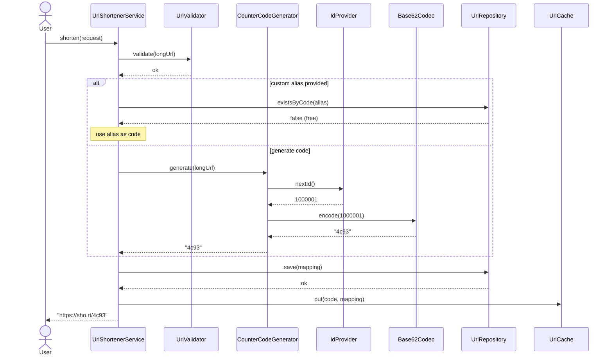
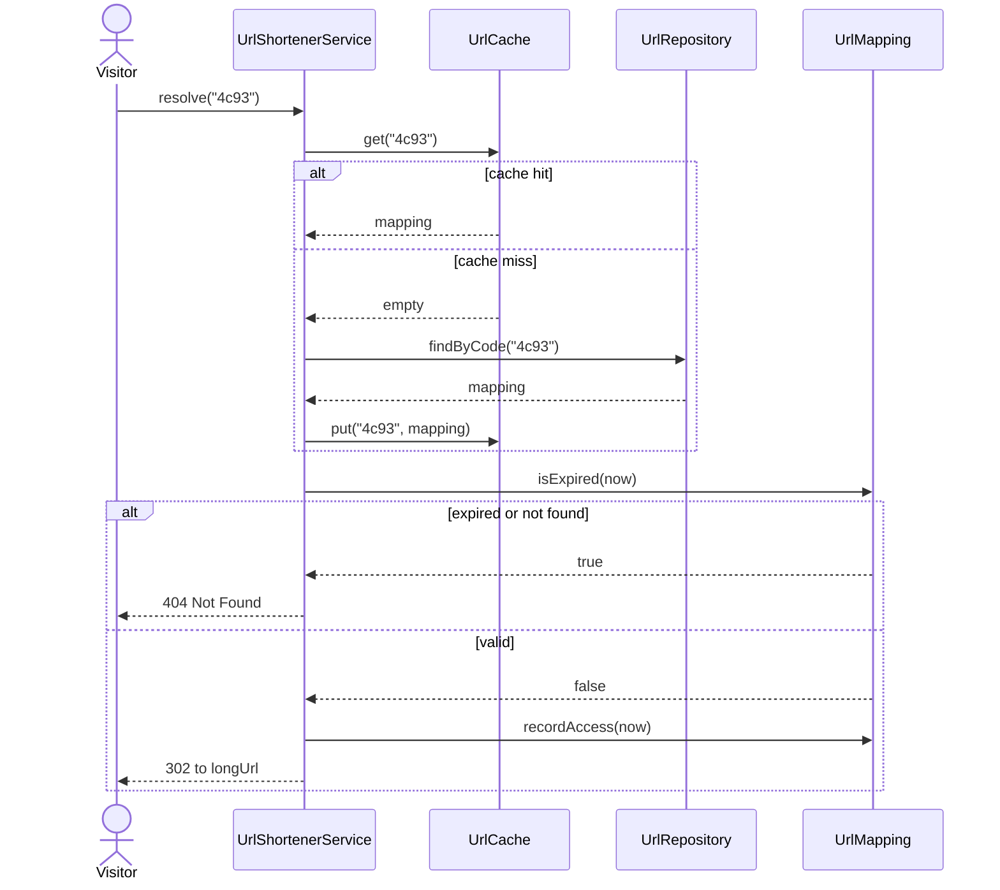
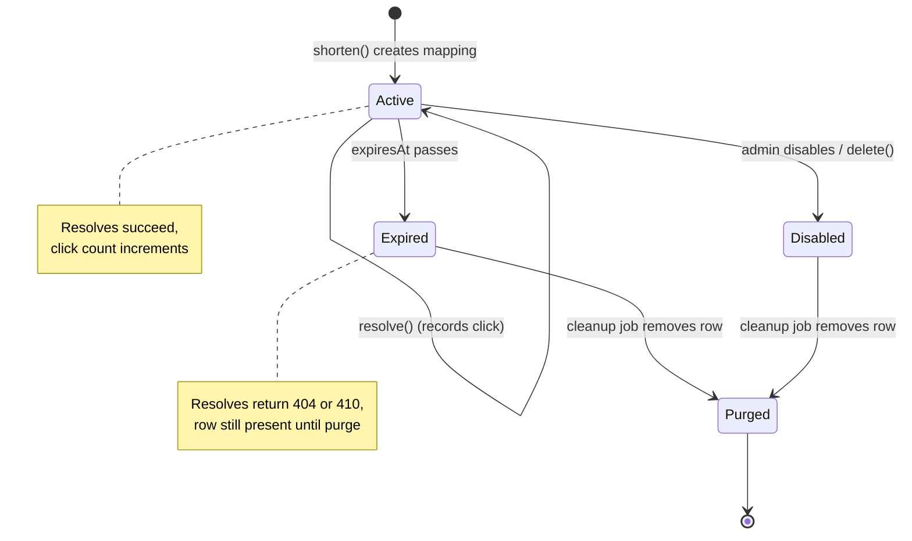
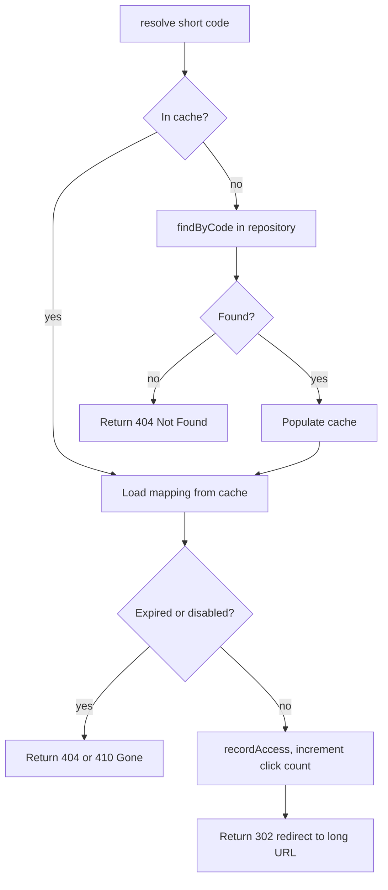
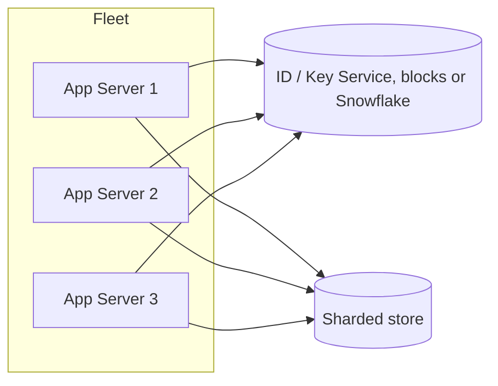

# 🔗 Low-Level Design: URL Shortener

> A complete, interview-ready walkthrough of the **URL Shortener** design problem — from a blank whiteboard to a staff-level system that generates unique short codes without collisions, resolves redirects in single-digit milliseconds, and scales from one JVM to a globally distributed fleet serving billions of links.

The URL shortener is deceptively the most popular object-oriented *and* systems design problem asked at FAANG interviews, precisely because it lives at the seam between the two. On the surface the ask is almost insultingly simple — "take a long URL, give back a short one, and when someone visits the short one, send them to the long one." Two operations, one lookup table. But the moment you begin to write it, the real questions surface. How do you turn a number into the string `bit.ly/aZ8kQ` and guarantee no two long URLs ever collide onto the same code? Do you hash the URL, or hand out sequential IDs, or pre-generate keys? What happens when two servers try to mint the same code at the same instant? A redirect that takes 200ms feels broken, so how do you make it feel instant when you have five billion links and no single machine can hold them? And the interviewer's favorite twist: *"the same long URL was submitted twice — do we return the same short code or a new one, and why does the answer change the whole design?"* This guide walks the entire journey, escalating from the beginner's mental model of encoding a counter to the sharding, caching, and concurrency reasoning a principal engineer raises in the final minutes.

---

## 📋 Table of Contents

**Part I — Framing the Problem**

1. [Problem Statement](#1-problem-statement)
2. [Requirement Clarification & Assumptions](#2-requirement-clarification--assumptions)
3. [Functional & Non-Functional Requirements](#3-functional--non-functional-requirements)
4. [Core Concepts Being Tested](#4-core-concepts-being-tested)

**Part II — Modeling the Domain**

5. [Domain Model & Entities](#5-domain-model--entities)
6. [CRC Cards](#6-crc-cards)
7. [UML Class Diagram](#7-uml-class-diagram)
8. [Package Structure](#8-package-structure)

**Part III — Design Rationale**

9. [Design Decisions & Trade-offs](#9-design-decisions--trade-offs)
10. [Short-Code Generation — Deep Dive](#10-short-code-generation--deep-dive)
11. [Class-by-Class Deep Dive](#11-class-by-class-deep-dive)
12. [Design Patterns Applied](#12-design-patterns-applied)
13. [SOLID Principles Mapping](#13-solid-principles-mapping)

**Part IV — Behavior & Diagrams**

14. [Sequence Diagram](#14-sequence-diagram)
15. [State & Flow Diagrams](#15-state--flow-diagrams)

**Part V — The Implementation**

16. [Complete Java Implementation](#16-complete-java-implementation)
17. [Execution Flow & Code Walkthrough](#17-execution-flow--code-walkthrough)

**Part VI — Engineering Depth**

18. [Complexity Analysis](#18-complexity-analysis)
19. [Thread Safety & Concurrency](#19-thread-safety--concurrency)
20. [Error Handling & Validation](#20-error-handling--validation)
21. [Scalability & Distributed Design](#21-scalability--distributed-design)
22. [Alternative Designs & Trade-offs](#22-alternative-designs--trade-offs)

**Part VII — Interview Mastery**

23. [Common FAANG Follow-up Questions (L4 → L6)](#23-common-faang-follow-up-questions-l4--l6)
24. [Common Design Mistakes](#24-common-design-mistakes)
25. [Testing Strategy](#25-testing-strategy)
26. [FAANG Q&A Section](#26-faang-qa-section)
27. [STAR Behavioral Questions](#27-star-behavioral-questions)
28. [⚡ Quick Revision Cheat Sheet](#28--quick-revision-cheat-sheet)

---

## 1. Problem Statement

Design a **URL shortening service** — a system like TinyURL, Bitly, or the `t.co` service behind Twitter — that takes a long, unwieldy URL such as `https://www.example.com/articles/2026/03/deep-dive-into-distributed-systems?ref=newsletter&utm_source=email` and returns a compact alias like `https://sho.rt/aZ8kQ`. When anyone later visits that short alias, the service looks up the original URL and issues an HTTP redirect so the browser lands on the intended page.

The service exposes two core operations. **Shorten** accepts a long URL and returns a short one, minting a unique short code the first time it sees a given URL. **Resolve** (redirect) accepts a short code, finds the long URL it maps to, and returns a redirect response. Around these two verbs sit the features that make it a real product: optional **custom aliases** (`sho.rt/my-brand`), **expiration** of links after a date, **analytics** on how many times a link was clicked, and the operational machinery to do all of this correctly under enormous read traffic.

<details>
<summary>📖 <b>In plain terms — what are we actually building?</b></summary>

Long web links are ugly to share, break when wrapped in emails, and can't fit on a printed flyer or a tweet. A URL shortener is a tiny service that stores a long link in a table and hands you a short stand-in code for it. Later, when someone clicks the short link, the service looks up which long link that code belongs to and forwards the browser there. We are not building a browser, a web server, or the destination site — just the small, extremely fast lookup service in the middle that maps short codes to long URLs and back, plus the logic that decides what each new code should be so no two links ever clash.

</details>

The deliverable in an interview is a **clean object-oriented model** — a `UrlShortenerService` façade, a pluggable short-code generation strategy, a repository abstraction over storage, and a correct concurrency and caching story — that a real platform team could build on. Grading centers on three things: whether your code-generation scheme is collision-free and justified, whether your redirect path is fast and correct under massive read load, and how convincingly you extend the single-node design to one that shards across many machines and serves billions of links.

---

## 2. Requirement Clarification & Assumptions

The single biggest mistake candidates make is jumping straight to "hash the URL with MD5 and take the first six characters" without scoping the problem. A strong candidate spends the first few minutes turning the vague prompt into a bounded problem. Below is the clarification dialogue you should drive, framed as the questions to ask and the assumptions to lock in.

### 2.1 Actors

The people and systems that interact with the shortener define its surface area.

| Actor | Role in the system |
|-------|--------------------|
| **End User / Creator** | Submits a long URL (optionally with a custom alias or expiry) and receives a short URL back. |
| **Visitor / Clicker** | Clicks a short URL in a browser or app; expects a fast redirect to the original destination. |
| **Analytics Consumer** | Reads click counts and access statistics for a short link (dashboard, reporting job). |
| **Administrator** | Configures policy — allowed domains, default expiry, rate limits — and can disable abusive links. |
| **Storage Layer** | The database and cache that persist the code-to-URL mappings and serve them on the read path. |

### 2.2 Key Clarifying Questions

Before modeling anything, resolve these with the interviewer. Each answer materially changes the design.

- **Read/write ratio and scale?** — How many shortens per day versus how many redirects? *(Assumption: heavily read-dominated, roughly 100:1 reads to writes — around 100M new URLs/day and 10B redirects/day. This single fact drives caching, replication, and the whole storage story.)*
- **Idempotency — same long URL twice?** — Return the same short code, or a fresh one each time? *(Assumption: by default mint a new code per shorten request so we don't need a reverse index; offer a "deduplicate" mode as an explicit variant, because the trade-off is instructive.)*
- **Custom aliases allowed?** — Can users pick their own code like `/black-friday`? *(Assumption: yes, custom aliases are supported and must be checked for uniqueness against the generated space.)*
- **How long should codes be, and what characters?** — *(Assumption: Base62 codes (`[A-Za-z0-9]`), 7 characters, giving 62⁷ ≈ 3.5 trillion combinations — comfortably enough for decades of growth.)*
- **Do links expire?** — *(Assumption: links may carry an optional expiry; expired links return 404/410 and are eventually purged. Default is no expiry.)*
- **What redirect status — 301 or 302?** — *(Assumption: default 302 (temporary) so we retain the ability to change targets and keep counting clicks; 301 discussed as a trade-off because browsers cache it and skip the server.)*
- **Do we need analytics?** — *(Assumption: track a click count and last-access time per link; a full event pipeline is a non-goal but we design so it can bolt on.)*
- **Single node or distributed?** — *(Assumption: design a clean single-node core first, then make the ID generation and storage distributed — this is the natural difficulty ramp.)*

### 2.3 Explicit Non-Goals

Naming what you will *not* build is a senior signal — it shows you can bound scope deliberately rather than by omission.

- No user authentication or account management — we assume the caller's identity is resolved upstream if needed.
- No full analytics pipeline (per-geography, per-device dashboards, real-time stream processing) — we track only a click count and last-access time; richer analytics is a downstream consumer.
- No link preview, malware scanning, or spam/phishing detection — a real product needs this, but it's a separate safety subsystem.
- No HTML rendering, landing pages, or ad interstitials — we return a redirect, not a page.
- No billing, quotas, or tiered plans — the service maps and resolves; monetization is out of scope.

<details>
<summary>📖 <b>Why spend so long on clarification?</b></summary>

The prompt "design a URL shortener" hides two forks that completely reshape the answer. The first is *do we deduplicate identical URLs* — if the same long URL must always map to one short code, you suddenly need a reverse index (long-URL to code) on the write path, which adds a lookup, a storage cost, and a race condition; if you don't, shortening becomes a simple append. The second is *how do we generate the code* — a counter-plus-Base62 scheme is collision-free but needs a distributed sequence, while a hash-of-URL scheme needs no counter but must handle collisions. Pin these two down early and the rest of the interview flows; skip them and you'll confidently design a system that solves the wrong problem.

</details>

---

## 3. Functional & Non-Functional Requirements

With scope bounded, we can state precisely what the system must do and how well it must do it. Keeping these two lists separate is itself a senior habit: functional requirements describe *behavior*, non-functional requirements describe *qualities*, and interviewers listen for whether you can tell them apart.

### 3.1 Functional Requirements

The behaviors the system must support:

- **Shorten a URL** — given a valid long URL, return a unique short URL. The same request may optionally include a custom alias and an expiry.
- **Resolve a short URL** — given a short code, return the original long URL (or a not-found signal if the code is unknown, expired, or disabled).
- **Custom alias** — let a user propose their own code; accept it only if it is well-formed and not already taken.
- **Expiration** — honor an optional expiry timestamp; a resolve on an expired link fails cleanly rather than redirecting.
- **Click tracking** — increment a hit counter and record the last-access time on each successful resolve.
- **Delete / disable** — allow a link to be removed or turned off so it stops resolving.

### 3.2 Non-Functional Requirements

The qualities that separate a toy from a production system — and where most of the staff-level discussion lives:

- **Low redirect latency** — resolution is the hot path; it must complete in single-digit milliseconds at p99, because a slow redirect is perceived as a broken link.
- **High availability** — redirects must keep working even during partial outages. A shortener that goes down breaks every link ever created; target 99.99%+ on the read path.
- **Scalability** — handle billions of stored links and tens of thousands of redirects per second, scaling horizontally rather than by buying a bigger box.
- **Uniqueness / no collisions** — every generated code must be unique; two different long URLs must never resolve to the same code.
- **Durability** — a created mapping must never be lost; losing a code-to-URL row breaks a live link permanently.
- **Read-optimized** — with a ~100:1 read/write ratio, the design must favor read throughput (caching, replicas) even at some cost to write complexity.
- **Predictable code length** — codes should be short and fixed-ish in length for shareability.

<details>
<summary>📖 <b>Which non-functional requirement dominates?</b></summary>

Availability and read latency dominate everything else in a URL shortener, and understanding *why* is what earns senior points. This system is almost pure reads — every link that was ever shared can be clicked at any time, forever — so the redirect path is hit orders of magnitude more than the shorten path. A shortener that is merely slow on redirects feels broken to users, and one that is down makes every link in every email and tweet a dead end. That's why the design pours effort into caching hot links, replicating reads, and keeping the resolve path as short as possible, while the write path can afford to be a little slower and more complex.

</details>

---

## 4. Core Concepts Being Tested

Interviewers reach for the URL shortener because a good answer forces you to demonstrate a specific, transferable set of skills. Naming them helps you recognize what each part of the discussion is really probing.

The first is **encoding and number systems** — the heart of the problem is turning a unique integer ID into a compact string and back, which is just base conversion (Base62). The second is **collision-free unique ID generation at scale**, the deepest systems concept here: how do many machines hand out unique IDs without coordinating on every request. The third is **read-heavy system design** — recognizing the 100:1 ratio and responding with caching and replication rather than treating reads and writes symmetrically. The fourth is **strategy-based extensibility** — the code generator, the storage, and the cache should all be swappable behind interfaces, because interviewers escalate by asking you to change one without touching the others. Underlying all of it is **separation of concerns**: a clean façade that orchestrates a generator, a repository, and a cache, each with a single job.

Handled well, the URL shortener is a compact tour through hashing versus counters, base conversion, caching strategy, database sharding, and concurrency control — which is exactly why it remains one of the most frequently asked design questions in the industry.

<details>
<summary>📖 <b>Why is such a "simple" problem asked so often?</b></summary>

Because it scales in difficulty exactly as far as the interviewer wants to push it. A junior candidate can produce a working answer with a hash map in five minutes, which makes it a friendly warm-up. But every layer of the real problem — collision handling, distributed ID generation, the read/write imbalance, caching, sharding, the deduplication fork — is a doorway to a deeper systems conversation. One problem statement smoothly tests an L4's coding, an L5's design instincts, and an L6's distributed-systems judgment, so it efficiently sorts candidates across levels without changing the prompt.

</details>

---

## 5. Domain Model & Entities

Before writing a single class, we identify the nouns of the problem and turn them into entities with clear responsibilities. A URL shortener has a surprisingly small domain — its elegance is that a handful of entities carry the whole system — but naming them crisply is what keeps the later design clean.

The central entity is the **`UrlMapping`**: one record binding a short code to its long URL, together with metadata like creation time, optional expiry, click count, and last-access time. Everything the system does is either creating one of these or reading one. Surrounding it are the collaborators that produce and manage mappings. A **`ShortCodeGenerator`** is the strategy that decides what a new code should be — a counter encoded to Base62, a hash of the URL, or a pre-generated key. A **`UrlRepository`** abstracts persistence: store a mapping, fetch one by code, check whether a code exists. A **`UrlCache`** sits in front of the repository to serve hot links without touching the database. A **`Base62Codec`** encapsulates the pure math of converting between numbers and short strings. And a **`UrlShortenerService`** is the façade that orchestrates them all, exposing just `shorten` and `resolve` to the outside world.

The table below captures the model. Note the deliberate split between the *data* entity (`UrlMapping`) and the *behavioral* collaborators (generator, repository, cache) — that separation is what lets each piece vary independently later.

| Entity | Type | Responsibility | Key Fields / Methods |
|--------|------|----------------|----------------------|
| **`UrlMapping`** | Entity (data) | Represents one short-to-long binding and its metadata | `shortCode`, `longUrl`, `createdAt`, `expiresAt`, `clickCount`, `lastAccessedAt` |
| **`UrlShortenerService`** | Service (façade) | Orchestrates shortening and resolving; the public API | `shorten(...)`, `resolve(code)`, `getStats(code)` |
| **`ShortCodeGenerator`** | Strategy interface | Produces a unique short code for a new URL | `generate(longUrl)` |
| **`CounterCodeGenerator`** | Strategy impl | Encodes a monotonically increasing ID as Base62 | uses `IdProvider` + `Base62Codec` |
| **`HashCodeGenerator`** | Strategy impl | Hashes the URL and encodes a prefix, resolving collisions | uses a digest + `Base62Codec` |
| **`Base62Codec`** | Utility | Pure base-conversion between `long` and Base62 `String` | `encode(long)`, `decode(String)` |
| **`IdProvider`** | Interface | Hands out unique, monotonically increasing IDs | `nextId()` |
| **`UrlRepository`** | Repository interface | Persists and retrieves mappings | `save(m)`, `findByCode(c)`, `existsByCode(c)` |
| **`UrlCache`** | Interface | Fast in-memory front for hot mappings | `get(code)`, `put(code, m)`, `evict(code)` |
| **`ShortenRequest`** | Value object | Bundles a shorten request's inputs | `longUrl`, `customAlias?`, `ttl?` |

<details>
<summary>📖 <b>Why separate the generator, repository, and cache?</b></summary>

Each of these answers a different question and changes for a different reason. The generator answers "what should this code be" and might switch from a counter to a hash as the system scales. The repository answers "where do mappings live" and might move from an in-memory map to MySQL to a sharded key-value store. The cache answers "how do we serve reads fast" and might be a local map or a Redis cluster. If you fuse them into one class, a change to any one forces you to reopen and re-test the others. Keeping them behind separate interfaces means each can evolve on its own — which is exactly the flexibility the interviewer probes when they say "now change the storage."

</details>

---

## 6. CRC Cards

CRC (Class–Responsibility–Collaborator) cards are a lightweight way to pin down what each class knows, what it does, and who it talks to — before committing to code. They keep responsibilities from leaking across class boundaries. Here are the cards for the core classes.

**`UrlShortenerService`** — the orchestrating façade.

| Responsibility | Collaborators |
|----------------|---------------|
| Validate incoming long URLs and custom aliases | `UrlValidator` |
| Obtain a unique short code for a new URL | `ShortCodeGenerator` |
| Persist and retrieve mappings | `UrlRepository` |
| Serve hot resolves from cache; update it on writes | `UrlCache` |
| Enforce expiry and record click stats | `UrlMapping` |

**`ShortCodeGenerator`** (interface) — the code-minting strategy.

| Responsibility | Collaborators |
|----------------|---------------|
| Produce a unique, well-formed short code for a URL | `IdProvider`, `Base62Codec` |
| Hide *how* the code is derived from callers | — |

**`Base62Codec`** — the pure encoding math.

| Responsibility | Collaborators |
|----------------|---------------|
| Convert a non-negative `long` into a Base62 string | — |
| Convert a Base62 string back into a `long` | — |

**`UrlRepository`** (interface) — the persistence boundary.

| Responsibility | Collaborators |
|----------------|---------------|
| Save a mapping durably | `UrlMapping` |
| Find a mapping by its short code | `UrlMapping` |
| Report whether a code is already taken | — |

**`UrlCache`** (interface) — the read accelerator.

| Responsibility | Collaborators |
|----------------|---------------|
| Return a cached mapping for a code, if present | `UrlMapping` |
| Store a mapping under its code with a TTL | `UrlMapping` |
| Evict a mapping when it changes or expires | — |

<details>
<summary>📖 <b>What is a CRC card doing for us here?</b></summary>

A CRC card forces one question per class: "does this class have exactly one clear job, and does it collaborate with only the classes it truly needs?" When you fill in the `UrlShortenerService` card and its responsibility list runs long, that is the design telling you the façade is doing too much and some work belongs in the generator or repository. When `Base62Codec` has zero collaborators, that confirms it's a pure, easily testable utility. Doing this on paper is cheap; discovering a tangled responsibility after you've written 300 lines of code is not.

</details>

---

## 7. UML Class Diagram

The diagram below shows the static structure: the façade at the center, depending on abstractions (generator, repository, cache) rather than concrete classes, with the data entity and utility off to the side. Every name, field type, and method signature here matches the Java implementation in Part V exactly.

```
┌─────────────────────────────────────────────────────────────────────────┐
│                          UrlShortenerService                              │
├───────────────────────────────────────────────────────────────────────── │
│ - generator   : ShortCodeGenerator                                        │
│ - repository  : UrlRepository                                             │
│ - cache       : UrlCache                                                  │
│ - validator   : UrlValidator                                              │
│ - baseUrl     : String                                                    │
├───────────────────────────────────────────────────────────────────────── │
│ + shorten(request : ShortenRequest) : String                             │
│ + resolve(shortCode : String) : String                                    │
│ + getStats(shortCode : String) : UrlStats                                 │
│ + delete(shortCode : String) : boolean                                    │
└───────────┬───────────────────┬────────────────────┬─────────────────────┘
            │ uses              │ uses               │ uses
            ▼                   ▼                    ▼
┌──────────────────────┐  ┌──────────────────┐  ┌──────────────────────┐
│  «interface»         │  │  «interface»     │  │  «interface»         │
│  ShortCodeGenerator  │  │  UrlRepository   │  │  UrlCache            │
├──────────────────────┤  ├──────────────────┤  ├──────────────────────┤
│ + generate(          │  │ + save(m         │  │ + get(code :         │
│     longUrl : String)│  │    : UrlMapping) │  │     String)          │
│   : String           │  │   : void         │  │   : Optional<        │
│                      │  │ + findByCode(    │  │      UrlMapping>     │
│                      │  │    code : String)│  │ + put(code : String, │
│                      │  │   : Optional<    │  │    m : UrlMapping)   │
│                      │  │      UrlMapping> │  │   : void             │
│                      │  │ + existsByCode(  │  │ + evict(code :       │
│                      │  │    code : String)│  │     String) : void   │
│                      │  │   : boolean      │  │                      │
└──────┬─────────┬─────┘  └────────┬─────────┘  └──────────┬───────────┘
       │         │                 │                       │
   implements implements       implements              implements
       │         │                 │                       │
       ▼         ▼                 ▼                       ▼
┌──────────────┐ ┌──────────────┐ ┌──────────────────┐ ┌──────────────────┐
│ CounterCode  │ │ HashCode     │ │ InMemoryUrl      │ │ InMemoryUrlCache │
│ Generator    │ │ Generator    │ │ Repository       │ │ (LRU + TTL)      │
├──────────────┤ ├──────────────┤ ├──────────────────┤ ├──────────────────┤
│ - idProvider │ │ - repository │ │ - store : Map<   │ │ - map : Map<     │
│              │ │              │ │    String,       │ │    String,       │
│ + generate() │ │ + generate() │ │    UrlMapping>   │ │    Entry>        │
└──────┬───────┘ └──────┬───────┘ └──────────────────┘ └──────────────────┘
       │ uses           │ uses  (Base62Codec used statically)
       ▼                ▼
┌──────────────┐ ┌──────────────────┐
│ «interface»  │ │   Base62Codec    │
│ IdProvider   │ ├──────────────────┤
├──────────────┤ │ + encode(        │
│ + nextId()   │ │    n : long)     │
│   : long     │ │   : String       │
└──────┬───────┘ │ + decode(        │
       │         │    s : String)   │
  implements     │   : long         │
       │         └──────────────────┘
       ▼
┌────────────────────┐
│ InMemoryIdProvider │
│ (AtomicLong)       │
└────────────────────┘

        ┌──────────────────────────────────────────────┐
        │                 UrlMapping                    │
        ├──────────────────────────────────────────────┤
        │ - shortCode      : String                     │
        │ - longUrl        : String                     │
        │ - createdAt      : Instant                    │
        │ - expiresAt      : Instant  (nullable)        │
        │ - clickCount     : AtomicLong                 │
        │ - lastAccessedAt : Instant                    │
        ├──────────────────────────────────────────────┤
        │ + isExpired(now : Instant) : boolean          │
        │ + recordAccess(now : Instant) : void          │
        └──────────────────────────────────────────────┘
```

The key relationships to read off this diagram: `UrlShortenerService` depends only on the three interfaces (dependency inversion), the two generator strategies both lean on the shared `Base62Codec` and an `IdProvider`, and `UrlMapping` is a plain data entity that no interface depends on structurally — it flows through them as a parameter and return type.

---

## 8. Package Structure

A clean package layout communicates the architecture at a glance and enforces the dependency direction: the service depends on abstractions, concrete implementations sit in their own leaf packages, and the pure model/utility have no dependencies on anything else.

```
com.example.urlshortener
│
├── UrlShortenerService.java        // the orchestrating façade (public API)
│
├── model/                          // pure data — no behavior dependencies
│   ├── UrlMapping.java
│   ├── ShortenRequest.java
│   └── UrlStats.java
│
├── generator/                      // short-code minting strategies
│   ├── ShortCodeGenerator.java     // interface
│   ├── CounterCodeGenerator.java
│   └── HashCodeGenerator.java
│
├── id/                             // unique-ID supply
│   ├── IdProvider.java             // interface
│   └── InMemoryIdProvider.java     // AtomicLong-backed
│
├── codec/                          // pure encoding math
│   └── Base62Codec.java
│
├── repository/                     // persistence boundary
│   ├── UrlRepository.java          // interface
│   └── InMemoryUrlRepository.java
│
├── cache/                          // read accelerator
│   ├── UrlCache.java               // interface
│   └── InMemoryUrlCache.java       // LRU + TTL
│
├── validation/
│   └── UrlValidator.java           // URL and alias validation
│
├── exception/                      // typed failures
│   ├── InvalidUrlException.java
│   ├── AliasAlreadyExistsException.java
│   └── ShortCodeNotFoundException.java
│
└── Demo.java                       // runnable main() wiring it together
```

The dependency arrows all point inward toward `model` and `codec`, which depend on nothing. `generator`, `repository`, and `cache` each expose an interface plus one or more implementations, so the concrete storage or generation strategy can be swapped by changing only the wiring in `Demo.java`. This is the layout a real platform team would recognize, and it makes the "swap the storage" and "swap the generator" follow-ups trivial to answer — you point at the interface and say "only this leaf package changes."

---

## 9. Design Decisions & Trade-offs

Every meaningful design is a sequence of decisions, each closing off alternatives for a reason. Walking the interviewer through these deliberately — decision, options, choice, justification — is the difference between "I wrote some classes" and "I designed a system." Here are the decisions that shape a URL shortener.

**Decision 1 — How to generate the short code.** This is the defining choice of the whole problem, and it gets its own deep dive in the next section. The three families are: encode a monotonically increasing counter to Base62 (collision-free by construction, but needs a distributed sequence), hash the long URL and take a prefix (needs no counter, but must handle collisions), or pre-generate a pool of random unused keys (offloads generation entirely, but needs a key-management service). We choose **counter + Base62 as the default** because it is collision-free without any retry logic, produces short codes, and its only real weakness — needing unique IDs across machines — has well-understood solutions.

**Decision 2 — Deduplicate identical URLs or not.** If two users shorten the same long URL, do they get the same code? Deduplicating saves storage and gives stable codes, but requires a reverse index (long-URL → code) checked on every write, which adds a lookup and a race. We **default to *not* deduplicating** — every shorten mints a fresh code — because it keeps the write path a simple append and avoids the reverse-index cost; deduplication is offered as an explicit mode for callers who want it. This is a genuine trade-off worth naming aloud.

**Decision 3 — Redirect status code: 301 vs 302.** A `301 Moved Permanently` lets browsers and proxies cache the redirect, so subsequent clicks skip our server entirely — great for latency and load, terrible for analytics, and impossible to change the target later. A `302 Found` (temporary) sends every click back through us. We **default to 302** so we can count clicks, change or disable targets, and honor expiry; the caching win of 301 is discussed as an option for links that are truly immutable and don't need analytics.

**Decision 4 — Where mappings live and how reads are served.** Given the ~100:1 read/write ratio, we put a **cache in front of the repository** and design the read path to hit the database only on a cache miss. The repository is an interface so the backing store can be an in-memory map for the demo, a relational table for a small deployment, or a sharded key-value store at scale, without touching the service.

**Decision 5 — Program to interfaces for generator, repository, and cache.** Each is a seam the interviewer will push on. By depending on `ShortCodeGenerator`, `UrlRepository`, and `UrlCache` rather than concrete classes, the façade never changes when we swap a counter for a hash, an in-memory map for MySQL, or a local cache for Redis.

The table summarizes the trade-off space:

| Decision | Chosen approach | Main alternative | Why the choice |
|----------|-----------------|------------------|----------------|
| Code generation | Counter + Base62 | Hash-of-URL / random keys | Collision-free, short, no retry logic |
| Duplicate URLs | New code each time (default) | Deduplicate via reverse index | Simple append; avoids reverse-index cost and race |
| Redirect status | 302 (temporary) | 301 (permanent) | Preserves analytics, changeability, expiry |
| Storage & reads | Cache in front of repository | DB-only reads | Serves the 100:1 read majority fast |
| Coupling | Interfaces for all collaborators | Concrete classes | Swap generator/store/cache freely |

<details>
<summary>📖 <b>Why not just hash the URL — isn't that simpler?</b></summary>

Hashing feels simpler because it needs no counter and no shared sequence — you take MD5 of the URL, grab the first few Base62 characters, and you're done. The catch is collisions: with a 7-character code you're picking from 3.5 trillion slots, and two different URLs *will* eventually hash to the same prefix. Now you need collision detection (check if that code exists, and if it does, rehash with a salt and check again), which turns a "simple" write into a read-then-maybe-retry loop that gets slower as the table fills. A counter is collision-free by construction — ID 1 becomes one code, ID 2 becomes another, and they can never clash — so the apparent simplicity of hashing is paid back later in retry logic. That's why counter-based generation is the more common production choice.

</details>

---

## 10. Short-Code Generation — Deep Dive

This is the intellectual core of the problem, so it deserves its own section. Everything else — storage, caching, the façade — is standard system plumbing; the code-generation strategy is where the interesting decisions and the collision reasoning live. There are three canonical approaches, and a strong candidate can sketch all three and defend a choice.

### 10.1 Base62 Encoding — the shared foundation

Before any strategy, understand the encoding. We want short codes drawn from the 62 URL-safe characters `[0-9A-Za-z]`. Base62 is simply representing a number in base 62 instead of base 10, mapping each digit to one of those characters. A 7-character Base62 code addresses 62⁷ ≈ 3.5 trillion values; a 6-character code addresses 62⁶ ≈ 56 billion — so 7 characters comfortably covers decades of growth even at a hundred million new links a day.

The math is ordinary base conversion. To **encode** the number 125, we repeatedly divide by 62 and collect remainders: 125 ÷ 62 = 2 remainder 1, then 2 ÷ 62 = 0 remainder 2, giving digits `[2, 1]`, which map to characters `'2'` and `'1'` → the code `"21"` (reading most-significant first). To **decode** `"21"` back, we compute 2 × 62 + 1 = 125. This is exactly how you convert between number bases; only the digit alphabet differs.

<details>
<summary>📖 <b>Why Base62 and not Base64 or hexadecimal?</b></summary>

Hexadecimal (base 16) only uses 16 symbols, so codes get long fast — representing a billion needs about 8 hex characters versus 6 in Base62. Base64 packs more per character but includes `+`, `/`, and `=`, which have special meaning in URLs and must be percent-encoded, defeating the goal of a clean short link. Base62 uses only letters and digits — every character is URL-safe, case carries information (so `aZ` and `Az` are different codes), and it's about as dense as you can get while staying readable and safe to paste anywhere. It's the standard alphabet for exactly this reason.

</details>

### 10.2 Approach A — Counter + Base62 (the default)

Maintain a single monotonically increasing counter. Each new URL claims the next integer, and we Base62-encode that integer to get the code. ID 1,000,000 becomes `"4c92"`; the very next URL gets 1,000,001 → `"4c93"`. Because each ID is unique by construction, **collisions are impossible** — there is no check, no retry, no salt. The code length grows gracefully: the first codes are short and they lengthen only as the ID space fills.

Its strengths are that it is collision-free, O(1) to generate, and produces the shortest possible codes for a given number of links. Its weaknesses are two. First, the codes are *sequential and predictable* — someone can enumerate `aaa`, `aab`, `aac` and crawl every link, which is a privacy concern for a shortener holding sensitive URLs. Second, and more important at scale, the counter itself must be **globally unique across many machines**, which is the central distributed problem covered in the scalability section (Section 21). The predictability is mitigated by encoding a *scrambled* or offset ID, or by mixing in random bits, at the cost of slightly longer codes.

### 10.3 Approach B — Hash the URL

Compute a hash of the long URL (MD5, SHA-256), then take enough of it, Base62-encoded, to form the code — for example the first 7 Base62 characters of the digest. This needs no counter and no shared sequence, and it naturally deduplicates: the same URL always hashes to the same code.

The unavoidable problem is **collisions**. Truncating a hash to 7 characters throws away most of its bits, so two different URLs can produce the same 7-character prefix. You must therefore check whether the code is already taken by a *different* URL, and if so, rehash with a salt or extend the length and check again. This turns a write into a read-then-maybe-retry loop whose cost rises as the table fills (the birthday paradox makes collisions more frequent than intuition suggests). Hashing shines when deduplication is a hard requirement and you accept the collision-handling complexity.

### 10.4 Approach C — Pre-generated Key Pool (KGS)

A separate **Key Generation Service** generates a large pool of unique random codes offline, verifies their uniqueness once, and stores them in a "available keys" table. When the shortener needs a code, it simply pops one from the pool. Generation is entirely off the request path, codes are unpredictable (random, not sequential), and there is no collision check at write time because the pool was pre-deduplicated.

The costs are operational: you now run and monitor a KGS, you must hand out keys to app servers without two servers grabbing the same key (each server checks out a *block* of keys under a lock), and you need to track used-versus-available keys durably. This is the approach several large production shorteners actually use because it cleanly separates the "hard part" (guaranteeing uniqueness) from the fast path.

### 10.5 Choosing among them

| Approach | Collision handling | Predictable? | Dedup? | Best when |
|----------|-------------------|--------------|--------|-----------|
| Counter + Base62 | None needed (unique by construction) | Yes (mitigable) | No | Default; simplest correct scheme |
| Hash of URL | Required (check + rehash) | No | Yes (free) | Deduplication is a hard requirement |
| Pre-generated KGS | Done offline, once | No (random) | No | Very high scale; want unpredictable codes |

In an interview, **lead with counter + Base62**, note that it's collision-free and explain the sequential-ID scaling problem, then offer the KGS as the way you'd remove predictability and take generation off the hot path at scale, and hashing as the choice if the requirement is strict deduplication. That progression demonstrates you understand not just one scheme but the trade-off space.

---

## 11. Class-by-Class Deep Dive

With the strategies understood, we walk each class in the design, explaining not just what it holds but *why it is shaped that way*. This mirrors how you'd narrate the code to an interviewer.

**`UrlMapping`** is the data heart of the system — one instance per short link. It holds the `shortCode`, the `longUrl`, a `createdAt` timestamp, a nullable `expiresAt`, an atomic `clickCount`, and a `lastAccessedAt`. It carries two behaviors, not just data: `isExpired(now)` centralizes the expiry check so no caller reimplements it, and `recordAccess(now)` atomically bumps the click count and updates the access time. Making `clickCount` an `AtomicLong` is deliberate — the same hot link is resolved concurrently by many threads, and a plain `long++` would lose increments under that race.

**`UrlShortenerService`** is the façade and the only class outside code needs to know. Its `shorten(request)` validates the URL, either honors a custom alias (checking it's free) or asks the generator for a code, builds a `UrlMapping`, saves it, and returns the full short URL. Its `resolve(code)` is the hot path: it checks the cache first, falls back to the repository on a miss, returns not-found for unknown or expired codes, records the access, and warms the cache. It depends only on interfaces, so it is completely decoupled from *how* codes are made or *where* they're stored.

**`ShortCodeGenerator`** is the strategy interface with a single method, `generate(longUrl)`. **`CounterCodeGenerator`** implements it by asking an `IdProvider` for the next ID and Base62-encoding it — no collision check, because IDs are unique. **`HashCodeGenerator`** implements it by hashing the URL and resolving collisions against the repository. The façade holds a `ShortCodeGenerator` reference and never knows which concrete strategy it has.

**`Base62Codec`** is a pure utility: `encode(long)` and `decode(String)`, no state, no dependencies. Keeping it separate makes the encoding math independently and exhaustively testable (round-trip every number, check boundaries) and reusable by any generator.

**`IdProvider`** abstracts "give me the next unique ID." **`InMemoryIdProvider`** backs it with an `AtomicLong`, which is correct for a single JVM; the interface is what lets us swap in a Redis `INCR`, a Twitter-Snowflake generator, or a database-ticket server when we go distributed, without touching the generator.

**`UrlRepository`** is the persistence seam — `save`, `findByCode`, `existsByCode`. **`InMemoryUrlRepository`** backs it with a `ConcurrentHashMap` for the demo. The interface is the boundary that lets storage become MySQL or a sharded key-value store later.

**`UrlCache`** is the read accelerator — `get`, `put`, `evict`. **`InMemoryUrlCache`** is an LRU cache with per-entry TTL so hot links are served without a repository hit and stale entries fall out. In production this interface is fronted by Redis or Memcached.

**`UrlValidator`** encapsulates input rules: the long URL must be a well-formed absolute HTTP(S) URL within any allowed length, and a custom alias must match the Base62 alphabet and length constraints. Centralizing validation keeps the façade readable and the rules in one testable place.

<details>
<summary>📖 <b>Why does the service hold interfaces instead of the concrete classes?</b></summary>

Because the interfaces are the promises the façade actually depends on — "I can get a code," "I can save and find a mapping," "I can cache" — and none of those promises say anything about *how*. When the service field is typed as `UrlRepository` rather than `InMemoryUrlRepository`, swapping to a MySQL-backed repository is a one-line change in the wiring code and zero changes in the façade, which never gets recompiled or re-tested for that swap. This is the concrete payoff of the dependency-inversion principle, and it's exactly the flexibility the interviewer is testing when they ask you to change the storage or the generator midway through.

</details>

---

## 12. Design Patterns Applied

Good LLD isn't about name-dropping patterns; it's about recognizing where a well-known solution fits and letting it earn its place. The URL shortener naturally uses a handful.

**Strategy** — the headline pattern here. `ShortCodeGenerator` is a strategy interface with interchangeable implementations (`CounterCodeGenerator`, `HashCodeGenerator`). The façade holds the abstraction and delegates, so the code-generation algorithm can change at wiring time without any change to the orchestration. `IdProvider` and `UrlCache` are strategies in the same spirit.

**Facade** — `UrlShortenerService` is a classic façade. Behind its two simple methods (`shorten`, `resolve`) sits a coordinated dance of validation, generation, persistence, and caching. Callers get a small, stable surface and are shielded from the moving parts.

**Repository** — `UrlRepository` abstracts the data store behind a collection-like interface (`save`, `findByCode`), decoupling business logic from persistence technology. This is the seam that lets storage evolve from a map to a sharded database.

**Factory (Method)** — a `GeneratorFactory` or the wiring in `Demo` builds the right generator/repository/cache based on configuration, centralizing object creation so the rest of the code depends only on interfaces.

**Singleton** — the `IdProvider` (and in production the KGS client) is effectively a singleton: there must be exactly one source of monotonic IDs per node so two threads never receive the same ID.

The table maps each pattern to where and why it appears:

| Pattern | Where it appears | What it buys us |
|---------|------------------|-----------------|
| **Strategy** | `ShortCodeGenerator`, `IdProvider`, `UrlCache` | Swap algorithm/store/cache without touching the façade |
| **Facade** | `UrlShortenerService` | Small, stable public API over a coordinated subsystem |
| **Repository** | `UrlRepository` | Decouple business logic from storage technology |
| **Factory** | Generator/store wiring | Centralize creation; depend on interfaces |
| **Singleton** | `IdProvider` / KGS client | One authoritative source of unique IDs per node |

<details>
<summary>📖 <b>How does Strategy show up here concretely?</b></summary>

The service field is typed `ShortCodeGenerator generator`, and at startup we inject either `new CounterCodeGenerator(...)` or `new HashCodeGenerator(...)`. The `shorten` method just calls `generator.generate(longUrl)` — it has no idea whether a counter or a hash produced the code. If a new requirement arrives ("we need unpredictable codes"), we write a third implementation and change one line of wiring; the façade, the repository, and every test around them stay untouched. That is the Strategy pattern doing exactly its job: making one axis of the design free to vary.

</details>

---

## 13. SOLID Principles Mapping

The design was built with SOLID in mind, and being able to point at each principle in your own code is a reliable senior signal. Here's how each shows up.

**Single Responsibility** — every class has one reason to change. `Base62Codec` changes only if the encoding alphabet changes; `UrlValidator` only if validation rules change; `UrlRepository` implementations only if storage changes; the façade only if the orchestration flow changes. Nothing does two jobs.

**Open/Closed** — the system is open to extension, closed to modification. Adding a new code-generation scheme (a KGS-backed generator) or a new store (a MySQL repository) means adding a class that implements an existing interface — no existing class is edited. The `Algorithm`-style extension points absorb new behavior without reopening old code.

**Liskov Substitution** — any `ShortCodeGenerator`, `UrlRepository`, or `UrlCache` implementation can replace another without breaking the façade, because each honors its interface contract fully (a repository's `findByCode` always returns an `Optional`, never throws for a missing key; a generator always returns a well-formed unique code).

**Interface Segregation** — the interfaces are small and focused. `IdProvider` has one method; `UrlCache` has three tightly related ones. No implementation is forced to stub out methods it doesn't need, because we didn't bundle unrelated operations into a fat interface.

**Dependency Inversion** — the high-level `UrlShortenerService` depends on abstractions (`ShortCodeGenerator`, `UrlRepository`, `UrlCache`), not on concrete classes, and the concrete classes are injected at construction. High-level policy doesn't know about low-level detail.

<details>
<summary>📖 <b>Which SOLID principle matters most here, and why?</b></summary>

Dependency Inversion is the load-bearing one for this design, because the entire "now change X" line of interview follow-ups depends on it. Every escalation — swap the in-memory store for a database, swap the counter for a KGS, add a Redis cache — is asking whether your high-level logic is coupled to low-level detail. Because the façade depends only on interfaces and receives its collaborators by injection, each of those swaps is a wiring change, not a surgery on business logic. Get Dependency Inversion right and Open/Closed and Liskov tend to follow; get it wrong and every change ripples through the façade.

</details>

---

## 14. Sequence Diagram

Static structure tells you what the classes are; sequence diagrams tell you how they collaborate over time. The two flows that matter are the write path (shorten) and the read path (resolve). Every participant and call below matches the Java in Part V.

### 14.1 Shorten flow (write path)

When a user submits a long URL, the service validates it, mints a code, persists the mapping, warms the cache, and returns the full short URL.



### 14.2 Resolve flow (read path, the hot path)

When a visitor clicks a short link, the service tries the cache first, falls back to the repository on a miss, enforces expiry, records the click, and returns the long URL for the redirect.



<details>
<summary>📖 <b>Why does resolve check the cache before the database?</b></summary>

Because the read path is hit around a hundred times more often than the write path, and a cache lookup is roughly a thousand times faster than a database query. Most redirect traffic concentrates on a small set of currently-viral links, so a modestly sized cache absorbs the large majority of reads and the database only sees the misses. Checking the cache first is what turns a p99 of tens of milliseconds (database-bound) into single-digit milliseconds (memory-bound), which is the difference between a link that feels instant and one that feels broken. On a miss we populate the cache so the next click on that link is fast too.

</details>

---

## 15. State & Flow Diagrams

A short link has a small but real lifecycle, and modeling it explicitly clarifies the expiry and disable logic. Alongside the state machine, a decision-flow diagram of the resolve path makes the branching logic concrete.

### 15.1 Link lifecycle (state diagram)

A `UrlMapping` moves through a handful of states from creation to purge.



An **Active** link resolves normally and counts clicks. When its `expiresAt` passes it becomes **Expired** — still stored, but resolves now fail cleanly rather than redirect. An admin action moves a link to **Disabled**. A background cleanup job eventually moves expired and disabled links to **Purged**, reclaiming storage. Keeping the row briefly after expiry (rather than deleting instantly) lets us return a precise 410 Gone and avoids a race where a resolve arrives the instant a link expires.

### 15.2 Resolve decision flow

The branching logic of a single resolve, as a flowchart:



<details>
<summary>📖 <b>Why keep an expired link's row instead of deleting it immediately?</b></summary>

Two reasons, both practical. First, it lets the service distinguish "this code never existed" (404 Not Found) from "this link existed but has expired" (410 Gone), which is more honest to clients and better for debugging. Second, deleting exactly at the expiry instant creates a race: a resolve request already in flight could arrive a microsecond after deletion and see a confusing "not found" for a link that was valid when the click happened. By marking expired and purging later in a batch cleanup job, the state transition is clean and the row is available to answer accurately until it's swept. This is a common pattern — soft-expire now, hard-delete later.

</details>

---

## 16. Complete Java Implementation

Below is a complete, runnable implementation. It is organized to mirror the package structure: the pure model and codec first, then ID supply and generators, then the repository and cache, then validation and exceptions, and finally the façade and a demo `main`. Every class name, field, and signature matches the diagrams above. The code is wrapped in collapsible blocks so you can read the guide's narrative without wading through it — expand what you want to study.

<details>
<summary>💻 <b>1. Model</b> — <code>UrlMapping</code>, <code>ShortenRequest</code>, <code>UrlStats</code></summary>

```java
package com.example.urlshortener.model;

import java.time.Instant;
import java.util.concurrent.atomic.AtomicLong;

/**
 * One short-to-long binding and its metadata.
 * Carries a little behavior (expiry check, access recording) so callers
 * don't reimplement it and so concurrent click counting is correct.
 */
public class UrlMapping {

    private final String shortCode;
    private final String longUrl;
    private final Instant createdAt;
    private final Instant expiresAt;          // nullable: null means never expires
    private final AtomicLong clickCount;
    private volatile Instant lastAccessedAt;
    private volatile boolean disabled;

    public UrlMapping(String shortCode, String longUrl, Instant createdAt, Instant expiresAt) {
        this.shortCode = shortCode;
        this.longUrl = longUrl;
        this.createdAt = createdAt;
        this.expiresAt = expiresAt;
        this.clickCount = new AtomicLong(0);
        this.lastAccessedAt = createdAt;
        this.disabled = false;
    }

    /** True if this link should no longer resolve (expired or turned off). */
    public boolean isExpired(Instant now) {
        if (disabled) return true;
        return expiresAt != null && now.isAfter(expiresAt);
    }

    /** Atomically records a successful resolve. Safe under concurrent clicks. */
    public void recordAccess(Instant now) {
        clickCount.incrementAndGet();
        this.lastAccessedAt = now;
    }

    public void disable() { this.disabled = true; }

    public String getShortCode()      { return shortCode; }
    public String getLongUrl()        { return longUrl; }
    public Instant getCreatedAt()     { return createdAt; }
    public Instant getExpiresAt()     { return expiresAt; }
    public long getClickCount()       { return clickCount.get(); }
    public Instant getLastAccessedAt(){ return lastAccessedAt; }
    public boolean isDisabled()       { return disabled; }
}
```

```java
package com.example.urlshortener.model;

import java.time.Duration;

/**
 * Immutable bundle of a shorten request's inputs.
 * customAlias and ttl are optional (may be null).
 */
public final class ShortenRequest {

    private final String longUrl;
    private final String customAlias;   // nullable
    private final Duration ttl;         // nullable: null means never expires

    private ShortenRequest(Builder b) {
        this.longUrl = b.longUrl;
        this.customAlias = b.customAlias;
        this.ttl = b.ttl;
    }

    public String getLongUrl()     { return longUrl; }
    public String getCustomAlias() { return customAlias; }
    public Duration getTtl()       { return ttl; }

    public boolean hasCustomAlias() { return customAlias != null && !customAlias.isBlank(); }

    public static Builder of(String longUrl) { return new Builder(longUrl); }

    public static final class Builder {
        private final String longUrl;
        private String customAlias;
        private Duration ttl;

        private Builder(String longUrl) { this.longUrl = longUrl; }

        public Builder alias(String alias) { this.customAlias = alias; return this; }
        public Builder ttl(Duration ttl)   { this.ttl = ttl; return this; }
        public ShortenRequest build()      { return new ShortenRequest(this); }
    }
}
```

```java
package com.example.urlshortener.model;

import java.time.Instant;

/** Read-only snapshot of a link's analytics. */
public final class UrlStats {
    private final String shortCode;
    private final String longUrl;
    private final long clickCount;
    private final Instant createdAt;
    private final Instant lastAccessedAt;

    public UrlStats(String shortCode, String longUrl, long clickCount,
                    Instant createdAt, Instant lastAccessedAt) {
        this.shortCode = shortCode;
        this.longUrl = longUrl;
        this.clickCount = clickCount;
        this.createdAt = createdAt;
        this.lastAccessedAt = lastAccessedAt;
    }

    public String getShortCode()      { return shortCode; }
    public String getLongUrl()        { return longUrl; }
    public long getClickCount()       { return clickCount; }
    public Instant getCreatedAt()     { return createdAt; }
    public Instant getLastAccessedAt(){ return lastAccessedAt; }

    @Override public String toString() {
        return String.format("UrlStats{code=%s, clicks=%d, longUrl=%s}",
                shortCode, clickCount, longUrl);
    }
}
```

</details>

<details>
<summary>💻 <b>2. Base62 codec</b> — pure base conversion</summary>

```java
package com.example.urlshortener.codec;

/**
 * Pure, stateless conversion between a non-negative long and a Base62 string.
 * Alphabet order [0-9A-Za-z] makes the encoding order-preserving for readability.
 */
public final class Base62Codec {

    private static final String ALPHABET =
            "0123456789ABCDEFGHIJKLMNOPQRSTUVWXYZabcdefghijklmnopqrstuvwxyz";
    private static final int BASE = ALPHABET.length(); // 62

    private Base62Codec() { }  // utility: no instances

    /** Encode a non-negative number to its Base62 representation. */
    public static String encode(long number) {
        if (number < 0) throw new IllegalArgumentException("number must be non-negative");
        if (number == 0) return String.valueOf(ALPHABET.charAt(0));

        StringBuilder sb = new StringBuilder();
        while (number > 0) {
            int remainder = (int) (number % BASE);
            sb.append(ALPHABET.charAt(remainder));
            number /= BASE;
        }
        return sb.reverse().toString();  // most-significant digit first
    }

    /** Decode a Base62 string back to the number it represents. */
    public static long decode(String code) {
        if (code == null || code.isEmpty())
            throw new IllegalArgumentException("code must be non-empty");

        long number = 0;
        for (int i = 0; i < code.length(); i++) {
            int digit = ALPHABET.indexOf(code.charAt(i));
            if (digit < 0)
                throw new IllegalArgumentException("invalid Base62 character: " + code.charAt(i));
            number = number * BASE + digit;
        }
        return number;
    }
}
```

</details>

<details>
<summary>💻 <b>3. ID supply</b> — <code>IdProvider</code>, <code>InMemoryIdProvider</code></summary>

```java
package com.example.urlshortener.id;

/**
 * Source of unique, monotonically increasing IDs.
 * The seam that becomes Redis INCR / Snowflake / a ticket server when distributed.
 */
public interface IdProvider {
    long nextId();
}
```

```java
package com.example.urlshortener.id;

import java.util.concurrent.atomic.AtomicLong;

/**
 * Single-JVM ID provider. AtomicLong gives lock-free, thread-safe increments
 * so two threads never receive the same ID.
 */
public class InMemoryIdProvider implements IdProvider {

    private final AtomicLong counter;

    public InMemoryIdProvider(long start) {
        this.counter = new AtomicLong(start);
    }

    public InMemoryIdProvider() {
        // Start high so the very first codes are a few characters long, not "1".
        this(1_000_000_000L);
    }

    @Override
    public long nextId() {
        return counter.incrementAndGet();
    }
}
```

</details>

<details>
<summary>💻 <b>4. Code generators</b> — <code>ShortCodeGenerator</code>, <code>CounterCodeGenerator</code>, <code>HashCodeGenerator</code></summary>

```java
package com.example.urlshortener.generator;

/** Strategy: produce a unique short code for a URL. */
public interface ShortCodeGenerator {
    String generate(String longUrl);
}
```

```java
package com.example.urlshortener.generator;

import com.example.urlshortener.codec.Base62Codec;
import com.example.urlshortener.id.IdProvider;

/**
 * Default strategy: take the next unique ID and Base62-encode it.
 * Collision-free by construction — no existence check, no retry.
 */
public class CounterCodeGenerator implements ShortCodeGenerator {

    private final IdProvider idProvider;

    public CounterCodeGenerator(IdProvider idProvider) {
        this.idProvider = idProvider;
    }

    @Override
    public String generate(String longUrl) {
        long id = idProvider.nextId();
        return Base62Codec.encode(id);
    }
}
```

```java
package com.example.urlshortener.generator;

import com.example.urlshortener.codec.Base62Codec;
import com.example.urlshortener.repository.UrlRepository;

import java.nio.charset.StandardCharsets;
import java.security.MessageDigest;
import java.security.NoSuchAlgorithmException;

/**
 * Alternative strategy: hash the URL and take a Base62 prefix, resolving
 * collisions by salting and retrying. Naturally deduplicates identical URLs
 * (before salting) at the cost of a collision check on every write.
 */
public class HashCodeGenerator implements ShortCodeGenerator {

    private static final int CODE_LENGTH = 7;
    private static final int MAX_ATTEMPTS = 5;

    private final UrlRepository repository;

    public HashCodeGenerator(UrlRepository repository) {
        this.repository = repository;
    }

    @Override
    public String generate(String longUrl) {
        for (int attempt = 0; attempt < MAX_ATTEMPTS; attempt++) {
            String salted = attempt == 0 ? longUrl : longUrl + "#" + attempt;
            String candidate = hashToCode(salted);
            // Accept if free, or if it already maps to this exact URL (dedup).
            if (!repository.existsByCode(candidate)
                    || repository.findByCode(candidate)
                                 .map(m -> m.getLongUrl().equals(longUrl))
                                 .orElse(false)) {
                return candidate;
            }
        }
        throw new IllegalStateException("could not generate a free code after "
                + MAX_ATTEMPTS + " attempts");
    }

    private String hashToCode(String input) {
        try {
            MessageDigest md = MessageDigest.getInstance("SHA-256");
            byte[] digest = md.digest(input.getBytes(StandardCharsets.UTF_8));
            // Fold the first 8 bytes into a positive long, then Base62-encode.
            long value = 0;
            for (int i = 0; i < 8; i++) {
                value = (value << 8) | (digest[i] & 0xFF);
            }
            value = value & Long.MAX_VALUE;  // force non-negative
            String encoded = Base62Codec.encode(value);
            return encoded.length() >= CODE_LENGTH
                    ? encoded.substring(0, CODE_LENGTH)
                    : encoded;
        } catch (NoSuchAlgorithmException e) {
            throw new IllegalStateException("SHA-256 unavailable", e);
        }
    }
}
```

</details>

<details>
<summary>💻 <b>5. Repository</b> — <code>UrlRepository</code>, <code>InMemoryUrlRepository</code></summary>

```java
package com.example.urlshortener.repository;

import com.example.urlshortener.model.UrlMapping;
import java.util.Optional;

/** Persistence boundary for mappings. */
public interface UrlRepository {
    /** Save (or replace) a mapping. */
    void save(UrlMapping mapping);

    /** Look up a mapping by its short code. */
    Optional<UrlMapping> findByCode(String shortCode);

    /** True if a code is already taken. */
    boolean existsByCode(String shortCode);

    /** Remove a mapping; returns true if one was removed. */
    boolean deleteByCode(String shortCode);
}
```

```java
package com.example.urlshortener.repository;

import com.example.urlshortener.model.UrlMapping;

import java.util.Optional;
import java.util.concurrent.ConcurrentHashMap;

/**
 * Single-JVM store backed by a ConcurrentHashMap.
 * The interface is the seam that becomes MySQL or a sharded KV store later.
 */
public class InMemoryUrlRepository implements UrlRepository {

    private final ConcurrentHashMap<String, UrlMapping> store = new ConcurrentHashMap<>();

    @Override
    public void save(UrlMapping mapping) {
        store.put(mapping.getShortCode(), mapping);
    }

    @Override
    public Optional<UrlMapping> findByCode(String shortCode) {
        return Optional.ofNullable(store.get(shortCode));
    }

    @Override
    public boolean existsByCode(String shortCode) {
        return store.containsKey(shortCode);
    }

    @Override
    public boolean deleteByCode(String shortCode) {
        return store.remove(shortCode) != null;
    }
}
```

</details>

<details>
<summary>💻 <b>6. Cache</b> — <code>UrlCache</code>, <code>InMemoryUrlCache</code> (LRU + TTL)</summary>

```java
package com.example.urlshortener.cache;

import com.example.urlshortener.model.UrlMapping;
import java.util.Optional;

/** Fast in-memory front for hot mappings. */
public interface UrlCache {
    Optional<UrlMapping> get(String shortCode);
    void put(String shortCode, UrlMapping mapping);
    void evict(String shortCode);
}
```

```java
package com.example.urlshortener.cache;

import com.example.urlshortener.model.UrlMapping;

import java.time.Duration;
import java.time.Instant;
import java.util.LinkedHashMap;
import java.util.Map;
import java.util.Optional;

/**
 * Bounded LRU cache with per-entry TTL. Access-ordered LinkedHashMap evicts
 * the least-recently-used entry when capacity is exceeded; TTL drops stale entries
 * lazily on read. Synchronized because LinkedHashMap access-order mutates on get().
 */
public class InMemoryUrlCache implements UrlCache {

    private static final class Entry {
        final UrlMapping mapping;
        final Instant expiresAt;
        Entry(UrlMapping mapping, Instant expiresAt) {
            this.mapping = mapping;
            this.expiresAt = expiresAt;
        }
    }

    private final int capacity;
    private final Duration ttl;
    private final LinkedHashMap<String, Entry> map;

    public InMemoryUrlCache(int capacity, Duration ttl) {
        this.capacity = capacity;
        this.ttl = ttl;
        this.map = new LinkedHashMap<>(16, 0.75f, true) {  // access-order = true
            @Override
            protected boolean removeEldestEntry(Map.Entry<String, Entry> eldest) {
                return size() > InMemoryUrlCache.this.capacity;
            }
        };
    }

    @Override
    public synchronized Optional<UrlMapping> get(String shortCode) {
        Entry e = map.get(shortCode);
        if (e == null) return Optional.empty();
        if (Instant.now().isAfter(e.expiresAt)) {   // lazily drop stale entries
            map.remove(shortCode);
            return Optional.empty();
        }
        return Optional.of(e.mapping);
    }

    @Override
    public synchronized void put(String shortCode, UrlMapping mapping) {
        map.put(shortCode, new Entry(mapping, Instant.now().plus(ttl)));
    }

    @Override
    public synchronized void evict(String shortCode) {
        map.remove(shortCode);
    }
}
```

</details>

<details>
<summary>💻 <b>7. Validation & exceptions</b></summary>

```java
package com.example.urlshortener.validation;

import com.example.urlshortener.exception.InvalidUrlException;
import java.net.URI;
import java.util.regex.Pattern;

/** Centralized rules for long URLs and custom aliases. */
public class UrlValidator {

    private static final int MAX_URL_LENGTH = 2048;
    private static final int MIN_ALIAS = 3;
    private static final int MAX_ALIAS = 20;
    private static final Pattern ALIAS_PATTERN = Pattern.compile("^[0-9A-Za-z]+$");

    /** Throws InvalidUrlException if the long URL is not a well-formed http(s) URL. */
    public void validateUrl(String longUrl) {
        if (longUrl == null || longUrl.isBlank())
            throw new InvalidUrlException("URL must not be empty");
        if (longUrl.length() > MAX_URL_LENGTH)
            throw new InvalidUrlException("URL exceeds " + MAX_URL_LENGTH + " characters");
        try {
            URI uri = new URI(longUrl);
            String scheme = uri.getScheme();
            if (scheme == null || !(scheme.equals("http") || scheme.equals("https")))
                throw new InvalidUrlException("URL must use http or https");
            if (uri.getHost() == null)
                throw new InvalidUrlException("URL must have a host");
        } catch (Exception e) {
            throw new InvalidUrlException("malformed URL: " + longUrl);
        }
    }

    /** Throws InvalidUrlException if a custom alias is not Base62 and in-range. */
    public void validateAlias(String alias) {
        if (alias.length() < MIN_ALIAS || alias.length() > MAX_ALIAS)
            throw new InvalidUrlException("alias must be " + MIN_ALIAS + "-" + MAX_ALIAS + " chars");
        if (!ALIAS_PATTERN.matcher(alias).matches())
            throw new InvalidUrlException("alias must be alphanumeric (Base62)");
    }
}
```

```java
package com.example.urlshortener.exception;

public class InvalidUrlException extends RuntimeException {
    public InvalidUrlException(String message) { super(message); }
}
```

```java
package com.example.urlshortener.exception;

public class AliasAlreadyExistsException extends RuntimeException {
    public AliasAlreadyExistsException(String alias) {
        super("alias already in use: " + alias);
    }
}
```

```java
package com.example.urlshortener.exception;

public class ShortCodeNotFoundException extends RuntimeException {
    public ShortCodeNotFoundException(String code) {
        super("no active link for code: " + code);
    }
}
```

</details>

<details>
<summary>💻 <b>8. The façade</b> — <code>UrlShortenerService</code></summary>

```java
package com.example.urlshortener;

import com.example.urlshortener.cache.UrlCache;
import com.example.urlshortener.exception.AliasAlreadyExistsException;
import com.example.urlshortener.exception.ShortCodeNotFoundException;
import com.example.urlshortener.generator.ShortCodeGenerator;
import com.example.urlshortener.model.ShortenRequest;
import com.example.urlshortener.model.UrlMapping;
import com.example.urlshortener.model.UrlStats;
import com.example.urlshortener.repository.UrlRepository;
import com.example.urlshortener.validation.UrlValidator;

import java.time.Instant;
import java.util.Optional;

/**
 * Orchestrating facade. Depends only on abstractions (generator, repository,
 * cache) so the code-generation scheme and storage can be swapped freely.
 */
public class UrlShortenerService {

    private final ShortCodeGenerator generator;
    private final UrlRepository repository;
    private final UrlCache cache;
    private final UrlValidator validator;
    private final String baseUrl;

    public UrlShortenerService(ShortCodeGenerator generator, UrlRepository repository,
                               UrlCache cache, UrlValidator validator, String baseUrl) {
        this.generator = generator;
        this.repository = repository;
        this.cache = cache;
        this.validator = validator;
        this.baseUrl = baseUrl.endsWith("/") ? baseUrl : baseUrl + "/";
    }

    /** Write path: validate, mint or honor a code, persist, warm cache, return short URL. */
    public String shorten(ShortenRequest request) {
        validator.validateUrl(request.getLongUrl());

        String code;
        if (request.hasCustomAlias()) {
            code = request.getCustomAlias();
            validator.validateAlias(code);
            if (repository.existsByCode(code)) {
                throw new AliasAlreadyExistsException(code);
            }
        } else {
            code = generator.generate(request.getLongUrl());
        }

        Instant now = Instant.now();
        Instant expiresAt = request.getTtl() == null ? null : now.plus(request.getTtl());
        UrlMapping mapping = new UrlMapping(code, request.getLongUrl(), now, expiresAt);

        repository.save(mapping);
        cache.put(code, mapping);
        return baseUrl + code;
    }

    /** Read path (hot): cache first, repository on miss, enforce expiry, record click. */
    public String resolve(String shortCode) {
        UrlMapping mapping = load(shortCode)
                .orElseThrow(() -> new ShortCodeNotFoundException(shortCode));

        if (mapping.isExpired(Instant.now())) {
            cache.evict(shortCode);
            throw new ShortCodeNotFoundException(shortCode);
        }

        mapping.recordAccess(Instant.now());
        return mapping.getLongUrl();
    }

    public UrlStats getStats(String shortCode) {
        UrlMapping m = load(shortCode)
                .orElseThrow(() -> new ShortCodeNotFoundException(shortCode));
        return new UrlStats(m.getShortCode(), m.getLongUrl(), m.getClickCount(),
                m.getCreatedAt(), m.getLastAccessedAt());
    }

    public boolean delete(String shortCode) {
        cache.evict(shortCode);
        return repository.deleteByCode(shortCode);
    }

    /** Cache-aside read: try cache, fall back to repository and populate cache. */
    private Optional<UrlMapping> load(String shortCode) {
        Optional<UrlMapping> cached = cache.get(shortCode);
        if (cached.isPresent()) {
            return cached;
        }
        Optional<UrlMapping> fromDb = repository.findByCode(shortCode);
        fromDb.ifPresent(m -> cache.put(shortCode, m));
        return fromDb;
    }
}
```

</details>

<details>
<summary>💻 <b>9. Wiring & demo</b> — <code>Demo.main</code></summary>

```java
package com.example.urlshortener;

import com.example.urlshortener.cache.InMemoryUrlCache;
import com.example.urlshortener.cache.UrlCache;
import com.example.urlshortener.generator.CounterCodeGenerator;
import com.example.urlshortener.generator.ShortCodeGenerator;
import com.example.urlshortener.id.IdProvider;
import com.example.urlshortener.id.InMemoryIdProvider;
import com.example.urlshortener.model.ShortenRequest;
import com.example.urlshortener.repository.InMemoryUrlRepository;
import com.example.urlshortener.repository.UrlRepository;
import com.example.urlshortener.validation.UrlValidator;

import java.time.Duration;

public class Demo {
    public static void main(String[] args) {
        // Compose the object graph — the only place concrete classes are named.
        IdProvider idProvider = new InMemoryIdProvider();
        ShortCodeGenerator generator = new CounterCodeGenerator(idProvider);
        UrlRepository repository = new InMemoryUrlRepository();
        UrlCache cache = new InMemoryUrlCache(10_000, Duration.ofMinutes(10));
        UrlValidator validator = new UrlValidator();

        UrlShortenerService service = new UrlShortenerService(
                generator, repository, cache, validator, "https://sho.rt");

        // 1. Basic shorten + resolve
        String shortUrl = service.shorten(
                ShortenRequest.of("https://www.example.com/articles/deep-dive?ref=news").build());
        System.out.println("Shortened -> " + shortUrl);
        String code = shortUrl.substring(shortUrl.lastIndexOf('/') + 1);
        System.out.println("Resolves  -> " + service.resolve(code));

        // 2. Custom alias
        String branded = service.shorten(
                ShortenRequest.of("https://www.example.com/black-friday").alias("bf2026").build());
        System.out.println("Branded   -> " + branded + "  =>  " + service.resolve("bf2026"));

        // 3. Click tracking
        service.resolve(code);
        service.resolve(code);
        System.out.println("Stats     -> " + service.getStats(code));

        // 4. Expiry
        String temp = service.shorten(
                ShortenRequest.of("https://www.example.com/flash-sale")
                        .ttl(Duration.ofMillis(50)).build());
        String tempCode = temp.substring(temp.lastIndexOf('/') + 1);
        try {
            Thread.sleep(80);
            service.resolve(tempCode);
        } catch (Exception e) {
            System.out.println("Expired   -> " + e.getMessage());
        }
    }
}
```

</details>

---

## 17. Execution Flow & Code Walkthrough

Reading the code top-to-bottom is one thing; understanding how a single request flows through it is another. Here we trace the two paths end to end, tying the narrative back to the classes above.

**Shortening `https://www.example.com/articles/deep-dive`.** The call enters `UrlShortenerService.shorten`. First `UrlValidator.validateUrl` confirms it's a well-formed `https` URL under the length cap. The request has no custom alias, so the service calls `generator.generate(longUrl)`. Our injected `CounterCodeGenerator` asks `InMemoryIdProvider.nextId()`, which does an `AtomicLong.incrementAndGet()` and returns, say, 1,000,000,001. That number goes to `Base62Codec.encode`, which divides by 62 repeatedly to produce a short string like `"15ftgH"`. Back in the façade, we build a `UrlMapping` with that code, the URL, `createdAt = now`, and `expiresAt = null` (no TTL). We `repository.save(mapping)` — a `ConcurrentHashMap.put` — then `cache.put(code, mapping)` to warm the cache, and return `"https://sho.rt/15ftgH"`. No collision check happened anywhere, because the counter guarantees uniqueness.

**Resolving `15ftgH`.** The call enters `resolve`, which delegates to the private `load`. `load` first calls `cache.get("15ftgH")` — a cache hit here because we just warmed it, returning the mapping without touching the repository. The façade checks `mapping.isExpired(now)`; it's not expired and not disabled, so we call `mapping.recordAccess(now)`, which does an atomic `clickCount.incrementAndGet()` and updates `lastAccessedAt`, then return the long URL for the caller to issue a 302. Had the cache missed — say the entry had aged out — `load` would fall through to `repository.findByCode`, populate the cache with the result, and continue identically. An unknown code returns an empty `Optional` all the way up, which the façade converts to a `ShortCodeNotFoundException` (the HTTP layer maps that to a 404).

**The expiry path.** When we shorten with `ttl(Duration.ofMillis(50))`, `expiresAt` is set to `now + 50ms`. After sleeping 80ms, `resolve` loads the mapping (from cache or DB), calls `isExpired(now)` which is now `true`, evicts the stale cache entry, and throws `ShortCodeNotFoundException` — the link cleanly stops resolving without ever being physically deleted, exactly as the state diagram described.

<details>
<summary>📖 <b>What actually makes the resolve path fast?</b></summary>

Three things stack up. First, the cache-aside read means the common case never touches the database — a `LinkedHashMap.get` in local memory is nanoseconds, versus milliseconds for a database round trip. Second, the counter-based code means resolving is a pure key lookup with no computation — we don't decode or verify anything, just look up the string. Third, `recordAccess` uses an atomic increment rather than a lock, so concurrent clicks on the same hot link don't serialize behind each other. The net effect is that a resolve is essentially "hash the code, read a map entry, bump a counter" — all memory-speed operations — which is why a well-built shortener resolves in single-digit milliseconds even under heavy traffic.

</details>

---

## 18. Complexity Analysis

Both core operations are designed to be constant-time in the common case; the interesting analysis is in the space and in the tail behavior of the alternative generators.

| Operation | Time (average) | Time (worst) | Space | Notes |
|-----------|----------------|--------------|-------|-------|
| `shorten` (counter) | O(L) | O(L) | O(1) extra | L = code length (~7); encode is O(log₆₂ id) = O(L) |
| `shorten` (hash) | O(L) | O(k·L) | O(1) extra | k = collision retries; degrades as table fills |
| `resolve` (cache hit) | O(1) | O(1) | — | LinkedHashMap get |
| `resolve` (cache miss) | O(1) | O(1)* | — | one repository lookup; *O(1) for hash-map/KV store |
| `getStats` | O(1) | O(1) | — | same load path |
| Base62 `encode`/`decode` | O(L) | O(L) | O(L) | proportional to code length, not to id magnitude |
| Storage total | — | — | O(N) | N mappings; one row each, ~500 bytes/row |

The headline is that the counter generator's `shorten` and every `resolve` are effectively O(1) — the code length is a small constant (7), so the "O(L)" encode/decode work is negligible. The hash generator is the only place worst-case degrades: as the table fills, collisions become more frequent (the birthday paradox), so the retry factor k grows, which is a concrete reason to prefer the counter at scale.

On space, storage is linear in the number of links: at ~500 bytes per mapping and 100M new links/day, that's roughly 50 GB/day, or ~18 TB/year — a number worth stating aloud because it drives the sharding discussion. The cache adds a bounded, configurable amount (capacity × entry size) independent of N.

<details>
<summary>📖 <b>Why is resolve O(1) and not O(log N) like a tree lookup?</b></summary>

Because we look up the mapping by an exact key — the short code — in a hash-based structure (a `ConcurrentHashMap` locally, a key-value store or a hash-indexed database column in production), not by scanning or comparing ranges. A hash lookup computes the code's hash and jumps straight to the bucket, which is constant time regardless of how many links exist. A tree or a sorted index would be O(log N) because it navigates comparisons; we don't need ordering, only exact-match retrieval, so a hash index is both faster and simpler. This is why the short code is designed as an opaque key rather than something you'd range-query.

</details>

---

## 19. Thread Safety & Concurrency

A URL shortener is a highly concurrent system — many threads shorten and resolve at once — so every shared piece of state must be safe under parallel access. The design handles this at each layer, and being able to point at *where* and *why* is a strong senior signal.

**Unique ID generation** is the most critical race. If two threads both mint a code at the same instant, they must get different IDs or two links collide onto one code. `InMemoryIdProvider` uses `AtomicLong.incrementAndGet()`, a lock-free compare-and-set operation that guarantees each caller gets a distinct, monotonically increasing value with no locking overhead. This is the single-JVM answer; the distributed answer (Section 21) is the same guarantee enforced across machines.

**The repository** uses a `ConcurrentHashMap`, whose `put`, `get`, and `containsKey` are individually thread-safe. Note a subtlety: a custom-alias shorten does `existsByCode` then `save`, which is a check-then-act sequence that isn't atomic as written — two threads racing on the *same* alias could both pass the existence check. In a single JVM you'd close this with `putIfAbsent` (returning failure if a value was already present); in a distributed store you'd rely on a conditional write / unique constraint. Naming this race unprompted is exactly the kind of detail that separates levels.

**Click counting** happens on the hot path under massive concurrency. `UrlMapping.clickCount` is an `AtomicLong`, so `incrementAndGet` never loses an increment the way `count++` would. `lastAccessedAt` is `volatile` so updates are visible across threads without a full lock.

**The cache** wraps its `LinkedHashMap` in `synchronized` methods because access-ordered `LinkedHashMap` mutates its internal order even on `get`, so reads are not safe to run concurrently with each other. For higher throughput you'd replace this with a striped-lock or a library cache (Caffeine) that shards its locks; the interface stays identical.

<details>
<summary>📖 <b>Where would this design break under concurrency if we weren't careful?</b></summary>

The classic break is the custom-alias check-then-act: thread A checks that alias `"sale"` is free, thread B checks the same and also sees it free, and both then save — one silently overwrites the other, and one user's link is lost. The fix is to make the check and the write a single atomic operation: `putIfAbsent` in a `ConcurrentHashMap`, or a unique-constraint/conditional-write in a real database that fails the second writer. The second subtle break is losing click increments if `clickCount` were a plain `long` — under a few thousand concurrent clicks you'd systematically undercount because `count++` is read-modify-write, not atomic. Both are invisible in single-threaded testing and only appear under load, which is why interviewers probe for them specifically.

</details>

---

## 20. Error Handling & Validation

A production shortener meets a lot of bad input and edge conditions, and handling them cleanly — with typed exceptions the HTTP layer can map to precise status codes — is part of the design, not an afterthought.

**Input validation** happens first, in `UrlValidator`, before any state changes. A malformed, non-HTTP, or over-length URL throws `InvalidUrlException` (→ HTTP 400). A custom alias that isn't Base62 or is out of the length range throws the same. Validating up front means we never persist garbage and never generate a code for an invalid request.

**Alias conflicts** throw `AliasAlreadyExistsException` (→ HTTP 409 Conflict) so the caller knows to pick a different alias rather than being told the request simply failed.

**Unknown, expired, or disabled codes** on resolve throw `ShortCodeNotFoundException` (→ HTTP 404, or 410 Gone if you want to distinguish expired-but-known from never-existed). The design deliberately treats "expired" and "not found" the same way at the exception level while leaving room to differentiate at the HTTP layer.

**Storage and generation failures** — a repository that's unreachable, or a hash generator that exhausts its retry budget — surface as runtime exceptions the service layer can catch and translate to a 503, ideally with a retry. The key principle is that failures are *typed and specific*, never a bare `RuntimeException` or a null return that the caller must guess about.

| Failure | Exception | HTTP mapping | Where caught |
|---------|-----------|--------------|--------------|
| Malformed / non-http URL | `InvalidUrlException` | 400 Bad Request | `UrlValidator` |
| Alias violates format/length | `InvalidUrlException` | 400 Bad Request | `UrlValidator` |
| Alias already taken | `AliasAlreadyExistsException` | 409 Conflict | `shorten` |
| Unknown / expired / disabled code | `ShortCodeNotFoundException` | 404 / 410 | `resolve` |
| Store unreachable | (wrapped) runtime | 503 Service Unavailable | service/HTTP layer |
| Code generation exhausted | `IllegalStateException` | 503 / 500 | `HashCodeGenerator` |

<details>
<summary>📖 <b>Why use typed exceptions instead of returning null or false?</b></summary>

Because a null or a bare `false` throws away *why* something failed, and the caller — ultimately the HTTP layer — needs that reason to return the right status code and message. If `resolve` returned `null` for both "unknown code" and "expired code," the API couldn't tell a 404 from a 410, and a `null` from a "storage down" situation would look identical to a genuinely missing link, masking an outage as a not-found. Typed exceptions carry the failure category up the stack so each layer can react appropriately — retry a 503, surface a 409 to the user, log a 500 — which is far more robust than sentinel return values that every caller must remember to check.

</details>

---

## 21. Scalability & Distributed Design

This is where the interview goes from L4/L5 to staff, and where most of the interesting reasoning lives. The single-node design is correct but caps out at one machine's memory and throughput. Scaling it means solving three problems: generating unique IDs across many machines, storing billions of mappings across many databases, and serving a read-dominated workload fast and globally.

### 21.1 Distributed unique ID generation

The counter is the crux. A single `AtomicLong` in one JVM doesn't work across a fleet — every server would hand out ID 1. There are three standard answers, escalating in sophistication.

The first is a **centralized sequence** — Redis `INCR` or a database auto-increment — where every server asks one authority for the next ID. Correct and simple, but the authority is a bottleneck and a single point of failure, and it adds a network round trip to every shorten.

The second, which removes the per-request round trip, is **range/block allocation** (a ticket server). Each server checks out a *block* of IDs at once — say 1,000 — under a lock, then hands them out locally with no coordination until the block runs dry. This cuts coordination traffic thousandfold; the only cost is that IDs aren't strictly globally sequential (server A uses 1–1000 while server B uses 1001–2000) and a crash wastes an unused block, which is harmless.

The third is a **timestamp-based scheme like Twitter Snowflake**: each ID packs a timestamp, a machine ID, and a per-machine sequence number into 64 bits. No coordination at all — each machine generates IDs independently and they're globally unique by construction and roughly time-ordered. This is the standard high-scale answer.



### 21.2 Sharding the storage

At ~18 TB/year, no single database holds all mappings. We shard by the short code: a hash of the code (or a code-prefix range) selects which shard owns it. Because resolves are exact-key lookups, sharding by code is ideal — the code alone tells you which shard to ask, with no cross-shard queries. A relational store works for smaller scale, but a horizontally scalable key-value/wide-column store (DynamoDB, Cassandra, Bigtable) is the common choice because the access pattern is a pure key lookup with no joins.

### 21.3 Caching and read scaling

With a 100:1 read ratio, caching is the highest-leverage optimization. A distributed cache (Redis or Memcached) in front of the database absorbs the large majority of resolves, since click traffic is heavily skewed toward a small set of currently-popular links. On top of that, a CDN or edge cache can serve 301-redirected links without ever reaching the origin, and read replicas spread the remaining database load. The write path stays comparatively small, so it needs far less scaling attention.

### 21.4 Global distribution

For a global audience, the shortener is deployed in multiple regions with the mapping data replicated. Since mappings are immutable after creation (the code-to-URL binding never changes), replication is easy — there's no write-conflict problem to resolve, only eventual propagation of new links. Click counts, which *do* mutate, are aggregated asynchronously rather than kept strongly consistent, because an approximate real-time count is perfectly acceptable for analytics.

<details>
<summary>📖 <b>Why is sharding by the short code the natural choice?</b></summary>

Because every resolve — the operation we do a hundred times more than anything else — arrives with the short code in hand and needs exactly one thing: the mapping for that code. If we shard by a hash of the code, the code itself tells any server precisely which shard owns the answer, so a resolve is a single-shard, single-key lookup with zero cross-shard coordination. Sharding by anything else (creation time, user, long URL) would mean a resolve doesn't know where its data lives and might have to scatter-gather across shards, which is exactly the latency we're trying to avoid. Aligning the shard key with the dominant query pattern is the core principle, and here the dominant query is "give me the URL for this code."

</details>

---

## 22. Alternative Designs & Trade-offs

A senior candidate doesn't present one design as the only truth; they map the space and explain why they landed where they did. Here are the meaningful alternatives and when each wins.

**Counter + Base62 vs. Hash-of-URL vs. Pre-generated keys.** Covered in depth in Section 10 — counter is the collision-free default, hashing wins when deduplication is mandatory, and a KGS wins at extreme scale and when codes must be unpredictable. The axis is *how much complexity you accept at write time in exchange for what property* (dedup, unpredictability, no coordination).

**301 vs. 302 redirects.** A 301 lets browsers and CDNs cache the redirect, slashing origin load and latency for the second click onward — but it makes analytics impossible (the origin never sees repeat clicks) and freezes the target (you can't change or disable the link). A 302 keeps every click flowing through you. Choose 301 for immutable, high-traffic, analytics-free links; 302 (the default) when you need counting, changeability, or expiry.

**Deduplicate vs. not.** Deduplicating identical URLs saves storage and yields stable codes but requires a reverse index (long-URL → code) consulted on every write, adding a lookup, storage, and a race. Not deduplicating keeps shortening a clean append. Choose dedup only when the requirement explicitly calls for it.

**SQL vs. NoSQL storage.** A relational database gives you transactions, secondary indexes, and familiarity — fine up to millions of links. A key-value/wide-column store gives you effortless horizontal scaling and matches the pure-key access pattern — the choice at billions of links. The access pattern (exact-key lookup, no joins) actually favors NoSQL at scale.

**Synchronous vs. asynchronous click counting.** Counting clicks inline on the resolve path is simplest but adds a write to the hot path. Buffering click events and aggregating them asynchronously (via a queue like Kafka) keeps the resolve path pure-read and scales analytics independently, at the cost of slightly stale counts.

| Axis | Option A | Option B | Pick B when |
|------|----------|----------|-------------|
| Code generation | Counter + Base62 | Hash / KGS | Need dedup or unpredictable codes |
| Redirect | 302 (default) | 301 | Immutable link, no analytics needed |
| Duplicate URLs | New code each time | Deduplicate | Requirement demands stable codes |
| Storage | SQL | NoSQL / KV | Billions of links, pure key access |
| Click counting | Synchronous | Async pipeline | High scale, stale counts acceptable |

<details>
<summary>📖 <b>If you had to defend one design in the room, what would it be?</b></summary>

Counter-plus-Base62 for codes, 302 redirects, no deduplication by default, a key-value store sharded by code, and a Redis cache in front — with async click aggregation once scale demands it. The reasoning chain is: the counter is collision-free so I avoid retry logic entirely; 302 preserves analytics and the ability to expire or change links, which most products want; skipping dedup keeps writes a simple append and avoids a reverse-index race; sharding by code aligns storage with the dominant exact-key read; and caching is the single highest-leverage move given the 100:1 read ratio. Every one of those choices is defensible on its own terms, and I'd name the alternative and the condition under which I'd switch — which is what turns a design into a conversation.

</details>

---

## 23. Common FAANG Follow-up Questions (L4 → L6)

Interviewers rarely stop at the first working design. They escalate, and the level of the escalation signals the level they're evaluating. Here is how the same problem deepens from L4 to L6, with the reasoning each tier expects.

**L4 — "Get it working and correct."** How do you generate a code? (Counter + Base62.) How do you store and look up mappings? (A map/repository keyed by code.) What happens if the code doesn't exist? (Return 404 via a typed exception.) At this level the interviewer wants clean, correct single-node code with a sensible class structure and no obvious bugs.

**L5 — "Make it robust and justified."** Why counter over hashing, and what's the collision story? How do you handle custom aliases and the check-then-act race? Why 302 over 301? How does the cache-aside read path work, and why is it needed given the read/write ratio? How do you keep click counting correct under concurrency? At this level they want you to defend each decision against its alternative and to spot the concurrency edges (alias race, atomic click count) unprompted.

**L6 — "Make it work at global scale."** How do you generate unique IDs across a thousand servers without a bottleneck? (Block allocation or Snowflake.) How do you shard 18 TB/year of mappings, and why shard by code? How do you serve billions of reads globally — cache tiers, CDN, replicas? What's your consistency model for click counts (async aggregation) versus the mapping itself (immutable, easy to replicate)? What's the fail-open/fail-closed behavior when the ID service or a shard is down? At this level the OO design is assumed; the entire conversation is distributed-systems trade-offs, and they're listening for whether you align every choice with the dominant access pattern.

<details>
<summary>📖 <b>How do I tell which level the interviewer is probing?</b></summary>

Listen to the verb in the follow-up. "Would this work?" and "what happens if the code is missing?" are L4 correctness checks. "Why did you choose that?" and "what breaks under concurrency?" are L5 robustness and justification probes. "How does this work across a hundred machines?" and "what's your consistency model?" are L6 scale questions. A good habit is to solve cleanly at the level asked, then *offer* the next level yourself — "this is correct on one node; want me to walk through how I'd make the ID generation distributed?" — which signals you can operate above your current tier without over-engineering the immediate answer.

</details>

---

## 24. Common Design Mistakes

These are the errors that most often cost candidates points, drawn from what interviewers repeatedly flag. Recognizing them is as valuable as knowing the right answer.

The first is **jumping straight to a solution without clarifying scope** — announcing "I'll hash the URL with MD5" before asking about dedup, scale, or custom aliases. It signals you design before you understand the problem. The second is **ignoring collisions when hashing** — proposing "take the first 6 chars of the hash" and not mentioning that two URLs can collide or how you'd detect and resolve it. The third is **not recognizing the read/write imbalance** — treating shorten and resolve as symmetric and missing that caching and read replicas are the whole game. The fourth is **making the ID counter a single global lock** at scale without realizing it's a bottleneck, or conversely putting a per-request network hop to a sequence service and not noticing the latency. The fifth is **choosing 301 by reflex** because it's "more correct," without realizing it destroys analytics and the ability to change links. The sixth is **the check-then-act alias race** — writing `if (!exists) save()` and not seeing that two threads can both pass the check. The seventh is **losing click increments** by using a plain `long++` on a hot, concurrent counter.

The meta-mistake behind most of these is **failing to state trade-offs**. Interviewers don't expect a perfect design; they expect you to know what you gave up and why. Saying "I'm choosing the counter because it's collision-free, accepting that codes are sequential, which I'd mitigate with a KGS if predictability mattered" scores far higher than silently picking one and moving on.

<details>
<summary>📖 <b>What's the single highest-leverage thing to get right?</b></summary>

Recognizing and designing around the read/write imbalance. Almost everything that makes a URL shortener a *systems* problem rather than a coding exercise flows from the fact that reads outnumber writes by roughly a hundred to one: it's why you cache aggressively, why you add read replicas and a CDN, why the resolve path must be a pure fast lookup, and why the write path can afford to be more complex. A candidate who states "this is read-dominated, so I'll optimize the resolve path and cache hot links" in the first few minutes has framed the entire rest of the interview correctly, whereas one who treats the two operations as equal will keep getting pushed toward the same realization the hard way.

</details>

---

## 25. Testing Strategy

A convincing design comes with a convincing test plan. For a URL shortener the tests cluster into correctness of the encoding, correctness of the flows, and correctness under concurrency and edge conditions.

**Unit tests — the codec.** `Base62Codec` is pure math and deserves exhaustive testing: round-trip a large sample of numbers (`decode(encode(n)) == n`), check boundaries (0, 1, 61, 62, `Long.MAX_VALUE`), and confirm invalid characters throw. This is the easiest place to have total confidence and the most damaging place to be wrong.

**Unit tests — the generators.** For `CounterCodeGenerator`, assert that a sequence of `generate` calls yields strictly distinct codes and that they map back to increasing IDs. For `HashCodeGenerator`, inject a repository stub that forces a collision and assert the generator salts and retries, and that it eventually throws after the retry budget.

**Component tests — the service flows.** Shorten-then-resolve returns the original URL; an unknown code throws `ShortCodeNotFoundException`; a custom alias is honored and a duplicate alias throws `AliasAlreadyExistsException`; an expired link stops resolving after its TTL; `getStats` reflects the right click count after N resolves; a malformed URL throws `InvalidUrlException`.

**Concurrency tests — the hard ones.** Fire hundreds of threads calling `shorten` and assert every returned code is unique (catches ID races). Fire hundreds of threads resolving the same code and assert the final `clickCount` equals exactly the number of calls (catches lost increments). Fire two threads on the same custom alias and assert exactly one succeeds (catches the check-then-act race). These are the tests that fail only under load and prove the concurrency reasoning.

**Cache behavior.** Verify a resolve populates the cache, a second resolve is served from it, eviction on delete works, and TTL expiry drops stale entries.

| Layer | What to test | Why it matters |
|-------|--------------|----------------|
| Codec | Round-trip, boundaries, bad input | Encoding bug corrupts every code |
| Generator | Uniqueness, collision retry | Collisions break links permanently |
| Service flow | Shorten/resolve/expiry/alias/stats | Core behavior correctness |
| Concurrency | Unique codes, exact click count, alias race | Bugs invisible until production load |
| Cache | Populate, hit, evict, TTL | Wrong cache = stale or missing redirects |

<details>
<summary>📖 <b>Which test would you write first, and why?</b></summary>

The concurrency test that fires many threads at `shorten` and asserts all codes are unique, because uniqueness is the one property whose failure is catastrophic and silent. A collision means two different long URLs resolve to the same code — one link is permanently broken and there's no error, just a user landing on the wrong page. Every other bug is recoverable or visible; a duplicate code is neither. Writing that test first forces the ID-generation design to be correct under concurrency from the start, and it's the test I'd port straight into CI so the guarantee is locked in against future refactors. The exact-click-count test is a close second for the same reason — it catches a lost-update bug that unit tests never will.

</details>

---

## 26. FAANG Q&A Section

Twenty of the most frequently asked questions, escalating from conceptual to staff/principal. Each answer is written the way you'd actually speak it in the room.

### 🎯 Conceptual & Design (L4 / L5)

<details>
<summary><b>Q1. How would you design a URL shortener at a high level?</b></summary>

I'd expose two operations behind a façade: `shorten(longUrl)` returns a short code, and `resolve(code)` returns the long URL for a redirect. Shorten mints a unique code — I'd use a monotonic counter Base62-encoded, which is collision-free — builds a mapping record, and persists it. Resolve is the hot path: it checks a cache first, falls back to the database on a miss, and issues a 302. The key framing I'd state up front is that this is a read-heavy system, roughly 100:1, so I optimize the resolve path with caching and replicas while the write path stays simpler. For example, this is essentially how Bitly and Twitter's `t.co` are structured — a fast key-value lookup fronted by a cache.

</details>

<details>
<summary><b>Q2. How do you generate the short code, and how do you guarantee uniqueness?</b></summary>

My default is a monotonically increasing counter Base62-encoded. Each URL claims the next integer — ID 1,000,000,001 becomes something like `"15ftgH"` — and because every ID is distinct by construction, two URLs can never produce the same code, so there's zero collision-checking and zero retry logic. Base62 uses `[0-9A-Za-z]`, so a 7-character code addresses 62⁷ ≈ 3.5 trillion links. The one real weakness is that the counter must be unique across machines, which I solve at scale with block allocation or Snowflake IDs. I'd contrast this with hashing the URL, which needs no counter but forces collision detection.

</details>

<details>
<summary><b>Q3. Why Base62 specifically, and how does the encoding work?</b></summary>

Base62 uses exactly the URL-safe characters — digits and upper/lowercase letters — so every code can be pasted anywhere without percent-encoding, unlike Base64's `+` and `/`. It's also dense: representing a billion takes about 6 Base62 characters versus 8 in hex. The encoding is ordinary base conversion — to encode a number I repeatedly divide by 62 and map each remainder to a character, reading most-significant digit first; to decode I do the reverse Horner evaluation. For example, 125 encodes as `"21"` because 125 = 2×62 + 1. Keeping this in a pure, stateless `Base62Codec` makes it trivial to test exhaustively.

</details>

<details>
<summary><b>Q4. Should identical long URLs get the same short code?</b></summary>

It's a genuine design fork, and I'd ask the interviewer. By default I say no — each shorten mints a fresh code — because that keeps the write path a simple append with no extra lookup. Deduplicating means maintaining a reverse index from long URL to code, consulted on every write, which adds storage, a lookup, and a check-then-act race between concurrent shortens of the same URL. I'd only deduplicate if the requirement explicitly wants stable codes or storage savings on a highly repetitive URL set. It's worth noting hashing gives dedup "for free" since the same URL always hashes the same way — which is one argument for hashing when dedup is mandatory.

</details>

<details>
<summary><b>Q5. Why did you choose a 302 redirect over a 301?</b></summary>

A 301 Moved Permanently lets browsers and CDNs cache the redirect, so after the first click the request never reaches my server — great for latency and load. But that's exactly the problem: I lose all analytics on repeat clicks, and I can never change or disable the target because clients have cached it. A 302 Found sends every click back through me, so I can count clicks, honor expiry, and change or kill a link. I default to 302 because most products want analytics and control; I'd switch to 301 only for immutable, high-traffic links where I explicitly don't need counting — say, a permanent redirect for a corporate domain.

</details>

<details>
<summary><b>Q6. Walk me through what happens when someone clicks a short link.</b></summary>

The request hits `resolve(code)`. I first check the cache — a hit returns the mapping immediately without touching the database, which is the common case because click traffic concentrates on a few hot links. On a miss I query the repository by exact code, and populate the cache so the next click is fast. Then I check whether the mapping is expired or disabled; if so I evict it and return a 404 (or 410 Gone). Otherwise I atomically increment the click count, update last-access time, and return the long URL for a 302 redirect. The whole path is memory-speed in the common case, which is why it resolves in single-digit milliseconds.

</details>

<details>
<summary><b>Q7. How do custom aliases fit into the design?</b></summary>

A shorten request can carry a proposed alias like `"black-friday"`. I validate it against the Base62 alphabet and a length range, then check it's not already taken before saving. The subtlety is that the check-and-save must be atomic — two users racing on the same alias could both pass a naive existence check, so I use `putIfAbsent` locally or a unique constraint / conditional write in a real database, and throw `AliasAlreadyExistsException` (HTTP 409) to the loser. Custom aliases share the same namespace as generated codes, so I also have to make sure a generated code can never accidentally equal a reserved alias — one way is to reserve a code-length or prefix range for generated codes.

</details>

<details>
<summary><b>Q8. How do you handle link expiration?</b></summary>

A mapping carries an optional `expiresAt`. On resolve I check `isExpired(now)`, and if it's past I evict any cache entry and return not-found rather than redirecting. I deliberately *don't* delete the row at the expiry instant — I mark it expired and let a background cleanup job purge it later in batches. That soft-expire-then-purge approach lets me return a precise 410 Gone (distinguishing "expired" from "never existed") and avoids a race where a click in flight arrives a microsecond after deletion. It also makes cleanup efficient — one batched job instead of a delete on the hot path.

</details>

<details>
<summary><b>Q9. What's the storage schema, and what database would you pick?</b></summary>

The core row is short code (primary key), long URL, created-at, optional expires-at, click count, and last-accessed-at — roughly 500 bytes. For a small deployment a relational table with the code as the primary key is fine and gives me transactions for the alias uniqueness check. At billions of links I'd move to a key-value or wide-column store like DynamoDB or Cassandra, because the access pattern is a pure exact-key lookup with no joins, which is exactly what those stores are built for and they shard horizontally without effort. I'd shard by the short code so a resolve always hits exactly one shard.

</details>

<details>
<summary><b>Q10. How much storage and traffic should this system plan for?</b></summary>

I'd size it out loud. Say 100M new URLs a day at ~500 bytes each — that's ~50 GB/day, ~18 TB/year, so within a couple of years I'm well past a single machine and must shard. On traffic, a 100:1 read ratio means ~10B redirects/day, which is ~115K reads/second average and multiples of that at peak, versus ~1,200 writes/second. Those numbers directly justify the architecture: sharded storage for the 18 TB/year, and heavy caching plus read replicas and a CDN for the 115K+ reads/second. Stating the arithmetic shows I design from requirements, not by reflex.

</details>

### 🎓 Staff / Principal (L5 / L6)

<details>
<summary><b>Q11. How do you generate unique IDs across a thousand servers without a bottleneck?</b></summary>

A single `AtomicLong` only works in one JVM, so I need distributed uniqueness. Three options: a centralized sequence (Redis `INCR`) is simple but a bottleneck and adds a round trip per write; block allocation, where each server checks out a range of, say, 1,000 IDs at once and hands them out locally, cuts coordination ~1000x at the cost of non-sequential and occasionally-wasted IDs; and Snowflake, where each machine packs a timestamp, machine ID, and sequence into 64 bits for zero coordination and roughly time-ordered IDs. I'd default to block allocation for its simplicity and pick Snowflake at very high scale. For example, Twitter built Snowflake precisely for this problem.

</details>

<details>
<summary><b>Q12. If you shard the database, what do you shard on and why?</b></summary>

I shard on the short code, using a hash of the code to pick the shard. The reason is that the dominant operation — resolve — always arrives with the code in hand and needs exactly the mapping for that code, so hashing the code routes every read to precisely one shard with no scatter-gather. If I sharded on anything else — creation time, user, long URL — a resolve wouldn't know which shard holds its data and might have to query all of them, which is the latency I'm trying to eliminate. The principle is to align the shard key with the highest-frequency query, and here that's exact-match on code.

</details>

<details>
<summary><b>Q13. The counter produces sequential, guessable codes. Is that a problem, and how do you fix it?</b></summary>

It can be. Sequential codes let someone enumerate `...aab`, `...aac` and crawl every link, which is a privacy and scraping concern if the URLs are sensitive. I have a few fixes: XOR or multiply the ID by a secret to scramble it before encoding (a bijection, so still collision-free), add a few random bits at the cost of slightly longer codes, or switch to a pre-generated key pool where codes are random by design. The KGS approach is cleanest at scale because it also takes generation off the hot path. I'd raise this proactively — noticing the enumeration risk unprompted is a senior signal.

</details>

<details>
<summary><b>Q14. How do you make the read path fast and available globally?</b></summary>

Layers. A distributed cache (Redis/Memcached) in front of the database absorbs most resolves because click traffic is heavily skewed to a small hot set — a modest cache serves the large majority of reads. Behind that, read replicas spread the database load, and sharding by code keeps each lookup single-shard. For a global audience I deploy in multiple regions and replicate the mapping data, which is easy because mappings are immutable after creation — there's no write conflict, only propagation of new links. For truly hot immutable links I can even use 301s so a CDN serves the redirect without reaching my origin at all.

</details>

<details>
<summary><b>Q15. What's your consistency model — for the mapping and for click counts?</b></summary>

I treat them differently. The mapping itself is immutable once created — the code-to-URL binding never changes — so I can replicate it aggressively and tolerate eventual consistency: a brand-new link might take a moment to appear in every region, which is fine because nobody clicks a link before it's shared. Click counts, which do mutate on every resolve, I deliberately keep *weakly* consistent — I buffer click events and aggregate them asynchronously through something like Kafka rather than doing a strongly-consistent write on the hot path. An analytics count that's a few seconds stale is perfectly acceptable, and keeping it off the resolve path preserves latency.

</details>

<details>
<summary><b>Q16. What happens if the ID service or a database shard goes down?</b></summary>

For the ID service, block allocation is my resilience: each server already holds a local block of unused IDs, so it keeps minting codes through a brief outage of the central allocator — the outage only bites if every block drains simultaneously, which block sizing prevents. For a downed shard, resolves for codes on that shard fail, so I run replicas per shard and fail over reads to a replica. The design principle is that the read path — the thing users actually experience — must degrade gracefully: a shard replica serves stale-but-correct mappings (they're immutable anyway), so a primary failure is invisible to clickers. Writes to that shard can queue or fail fast until failover completes.

</details>

<details>
<summary><b>Q17. How would you support analytics without slowing down redirects?</b></summary>

I decouple counting from resolving. Instead of writing a click to the database inline, the resolve path emits a lightweight click event to a message queue (Kafka) and returns the redirect immediately. A separate consumer aggregates those events into counts, geographies, and device breakdowns at whatever granularity the product needs. This keeps the hot path a pure read plus a fire-and-forget publish, scales analytics independently of redirects, and lets me build richer reporting later without touching the resolve code. The trade-off is that counts are eventually consistent — a click shows up in the dashboard seconds later — which is universally acceptable for link analytics.

</details>

<details>
<summary><b>Q18. How do you prevent abuse — spam links, phishing, or one client hammering the service?</b></summary>

Three layers. For request volume, I put a rate limiter in front keyed by API key or IP, so no single client can exhaust the shorten path or scrape resolves. For malicious *destinations*, I run submitted URLs against a safe-browsing / phishing blocklist at shorten time and can disable a link post-hoc if it's reported — the `disable()` flag on a mapping makes a link stop resolving instantly without deleting it. For enumeration scraping, scrambled or KGS-generated non-sequential codes make it infeasible to walk the namespace. I'd frame abuse prevention as a separate safety subsystem layered on the core, not baked into it.

</details>

<details>
<summary><b>Q19. Where's the concurrency bug hiding in a naive implementation, and how do you fix it?</b></summary>

Two places. The first is custom-alias creation: `if (!exists(alias)) save(alias)` is check-then-act, so two threads can both see the alias free and both save, silently overwriting one user's link. The fix is an atomic `putIfAbsent` or a database unique constraint that fails the second writer. The second is click counting: a plain `long count++` is read-modify-write, so under concurrent clicks on a hot link you lose increments and systematically undercount. The fix is an `AtomicLong.incrementAndGet`. Both bugs are invisible in single-threaded tests and only surface under load, so I'd write concurrency tests — many threads on one alias, many threads clicking one code — to lock the fixes in.

</details>

<details>
<summary><b>Q20. If you had to serve reads with sub-millisecond p99 globally, what would you change?</b></summary>

I'd push the mapping as close to the user as possible. Because mappings are immutable, they're ideal for edge caching: I'd replicate the hot set into edge caches or a CDN in every region so most resolves are answered at the edge without crossing a continent. For the very hottest, truly-immutable links I'd use 301 so the browser itself caches the redirect and skips the network entirely after the first click. Behind the edge I'd keep a regional Redis tier and only fall through to the sharded store on a cold miss. The whole strategy leans on immutability — the one property that makes a URL mapping trivial to cache anywhere — and accepts eventual propagation of brand-new links as the cost.

</details>

---

## 27. STAR Behavioral Questions

Design interviews increasingly include behavioral rounds. Here are four, answered in the STAR format (Situation, Task, Action, Result), framed around real URL-shortener and link-infrastructure work.

<details>
<summary><b>⭐ Q1. Tell me about a time you fixed a scaling bottleneck in a high-traffic service.</b></summary>

**Situation:** Our link service minted codes by calling a central database sequence on every shorten request, and as traffic grew that single sequence became the write-path bottleneck, adding tens of milliseconds and occasionally timing out under bursts.

**Task:** Remove the per-request coordination without giving up unique, collision-free codes.

**Action:** I replaced the per-request sequence call with block allocation — each app server checked out a range of 1,000 IDs in one call and handed them out locally from memory until the block drained. I sized the blocks so a server rarely re-fetched under peak, accepted that IDs were no longer strictly globally sequential, and confirmed that a crash merely wasted an unused block, which was harmless.

**Result:** Shorten latency dropped from tens of milliseconds to sub-millisecond in the common case, coordination traffic to the sequence fell roughly a thousandfold, and the timeout errors disappeared. The pattern became our standard for any monotonic-ID need across the platform.

</details>

<details>
<summary><b>⭐ Q2. Describe a time you diagnosed a subtle concurrency bug in production.</b></summary>

**Situation:** Support reported that occasionally a user's custom short link would silently start pointing at a *different* destination than they'd set, with no error logged.

**Task:** Find how two links could end up fighting over one alias and stop it without disrupting live traffic.

**Action:** I reproduced it by firing concurrent shorten requests for the same alias and confirmed both passed the "is this alias free?" check and both wrote — a classic check-then-act race, with the second write overwriting the first. I replaced the read-then-write with an atomic conditional insert backed by a unique constraint on the code column, so the second writer failed cleanly with a 409, and I added a multi-thread test asserting exactly one of N concurrent claimants succeeds.

**Result:** The silent overwrites stopped entirely, the losing request now got a clear "alias taken" response, and the regression test locked the guarantee into CI. I documented the check-then-act pattern in our engineering guide so adjacent code wouldn't repeat it.

</details>

<details>
<summary><b>⭐ Q3. Tell me about a time you made a trade-off between accuracy and performance.</b></summary>

**Situation:** Our redirect path wrote a click-count increment to the database inline on every resolve, and as redirect volume climbed those writes became the dominant load on the primary and started adding latency to the user-facing redirect.

**Task:** Keep useful click analytics while getting the counting off the hot path.

**Action:** I moved click counting to an asynchronous pipeline — the resolve path published a lightweight click event to Kafka and returned the redirect immediately, and a separate consumer aggregated counts in the background. I explicitly accepted that dashboard counts would now lag by a few seconds and got product sign-off that near-real-time was fine for link analytics.

**Result:** Redirect p99 latency dropped sharply and the primary's write load fell by the bulk of its volume, while analytics stayed useful. Decoupling also let us add per-geography and per-device breakdowns later without ever touching the resolve code.

</details>

<details>
<summary><b>⭐ Q4. Describe a time you pushed back on a requirement to protect the design.</b></summary>

**Situation:** A product manager asked that every short link use a permanent 301 redirect "because it's faster and more correct," which would have let browsers and CDNs cache the redirects.

**Task:** Decide whether to adopt 301 globally or push back, and align the team on the right default.

**Action:** I laid out the trade-off concretely: 301s would indeed cut load, but they'd permanently break our click analytics (repeat clicks would never reach us) and make it impossible to change or disable a link after creation, including for abuse takedowns. I proposed keeping 302 as the default to preserve analytics and control, and offering 301 as an opt-in only for immutable links that explicitly don't need tracking.

**Result:** The team adopted the 302 default with a 301 opt-in. A month later that decision paid off directly when we had to disable a batch of phishing links instantly — impossible had they been cached 301s. The PM later cited it as the right call.

</details>

---

## 28. ⚡ Quick Revision Cheat Sheet

**The problem in one breath.** A URL shortener maps a long URL to a short code and resolves the code back to the URL via an HTTP redirect. Two operations — `shorten` and `resolve` — sit over one logical lookup table. The defining fact is that it's read-dominated, roughly 100:1, so the entire architecture bends toward serving reads fast (caching, replicas, CDN) while the write path stays comparatively simple. Grading centers on collision-free code generation, a fast correct resolve path, and a convincing single-node-to-distributed story.

**Code generation — the heart.** Three schemes. Counter + Base62 (the default): take the next monotonic ID, Base62-encode it — collision-free by construction, shortest codes, O(1), but sequential/guessable and needs a distributed counter at scale. Hash-of-URL: hash and take a Base62 prefix — needs no counter and dedups for free, but must detect and resolve collisions with salt-and-retry, degrading as the table fills. Pre-generated key pool (KGS): generate unique random codes offline and hand them out — unpredictable and off the hot path, at the cost of running a key service. Lead with the counter, offer the KGS for scale and unpredictability, and hashing when dedup is mandatory. Base62 = `[0-9A-Za-z]`, 62 symbols, URL-safe; 62⁷ ≈ 3.5 trillion codes at 7 chars. Encoding is plain base conversion (divide by 62, collect remainders; decode with Horner).

**The class model.** A `UrlShortenerService` façade orchestrates a `ShortCodeGenerator` (strategy: `CounterCodeGenerator`, `HashCodeGenerator`), a `UrlRepository` (persistence seam), and a `UrlCache` (read accelerator). `Base62Codec` is a pure utility; `IdProvider` (an `AtomicLong` locally) supplies unique IDs; `UrlMapping` is the data entity carrying code, URL, timestamps, expiry, and an atomic click count. The service depends only on the three interfaces, so generator, storage, and cache each swap independently — which is exactly what the "now change X" follow-ups test. Patterns in play: Strategy (generator/cache/id), Facade (service), Repository (storage), Factory (wiring), Singleton (id source).

**The two flows.** Shorten: validate URL → honor custom alias (check free, atomically) or `generator.generate` → build `UrlMapping` → `repository.save` → warm cache → return short URL. No collision check with the counter. Resolve (hot path): cache-aside — try cache, fall back to repository on miss and populate cache → check `isExpired` (evict + 404/410 if so) → atomic `recordAccess` → return long URL for a 302. Both are effectively O(1); the resolve path is memory-speed because it's a pure key lookup plus an atomic increment.

**Key decisions to defend.** 302 over 301 (preserves analytics, changeability, expiry — 301 caches at the browser/CDN and freezes the link). New code per shorten over dedup (append vs. reverse-index cost and race). Cache in front of the store (the 100:1 ratio makes it the highest-leverage move). Interfaces everywhere (Dependency Inversion is the load-bearing SOLID principle — every "swap the store/generator" follow-up is a wiring change, not surgery).

**Concurrency edges.** Unique IDs via `AtomicLong.incrementAndGet` (lock-free, never duplicate). Custom-alias check-then-act race → fix with `putIfAbsent` / unique constraint. Lost click increments if `long++` → fix with `AtomicLong`. The access-ordered LRU cache mutates on `get`, so its methods are `synchronized`. All three bugs are invisible single-threaded and only appear under load — write concurrency tests for them.

**Scaling to staff level.** Distributed IDs: centralized `INCR` (bottleneck) → block/range allocation (cut coordination ~1000x) → Snowflake (timestamp + machine + sequence, zero coordination). Storage: ~500 B/row × 100M/day ≈ 18 TB/year → shard by code (hash of code routes every resolve to one shard) using a KV/wide-column store (DynamoDB, Cassandra). Reads: distributed cache + read replicas + CDN + multi-region replication — easy because mappings are immutable. Click counts are mutable, so aggregate them asynchronously (Kafka) and keep them weakly consistent. Fail-open the read path; a shard replica serves immutable mappings so a primary failure is invisible to clickers.

**Common mistakes to avoid.** Jumping to a solution before clarifying dedup/scale/aliases; ignoring hash collisions; missing the read/write imbalance; making the ID counter a global bottleneck; choosing 301 by reflex and losing analytics; the check-then-act alias race; losing click increments with a non-atomic counter. The meta-mistake is failing to state trade-offs — always name what you gave up and the condition under which you'd switch.

**Numbers to remember.** 62 symbols; 62⁷ ≈ 3.5T codes at 7 chars, 62⁶ ≈ 56B at 6; ~100:1 read/write; ~500 B/mapping → ~18 TB/year at 100M/day; target single-digit-ms p99 resolves and 99.99%+ read availability.

---

*This guide is part of a low-level design study series. The URL shortener sits at the intersection of clean object-oriented modeling and distributed-systems reasoning — master the code-generation trade-offs and the read-heavy scaling story, and you can carry the same framing into caching, ID-generation, and key-value-store design problems.*

