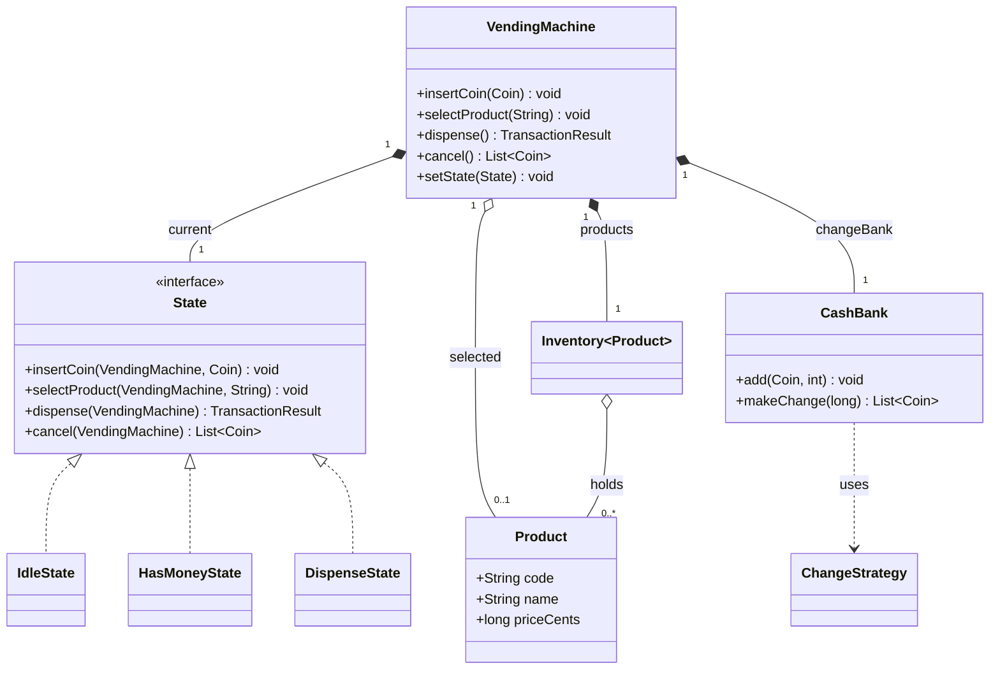
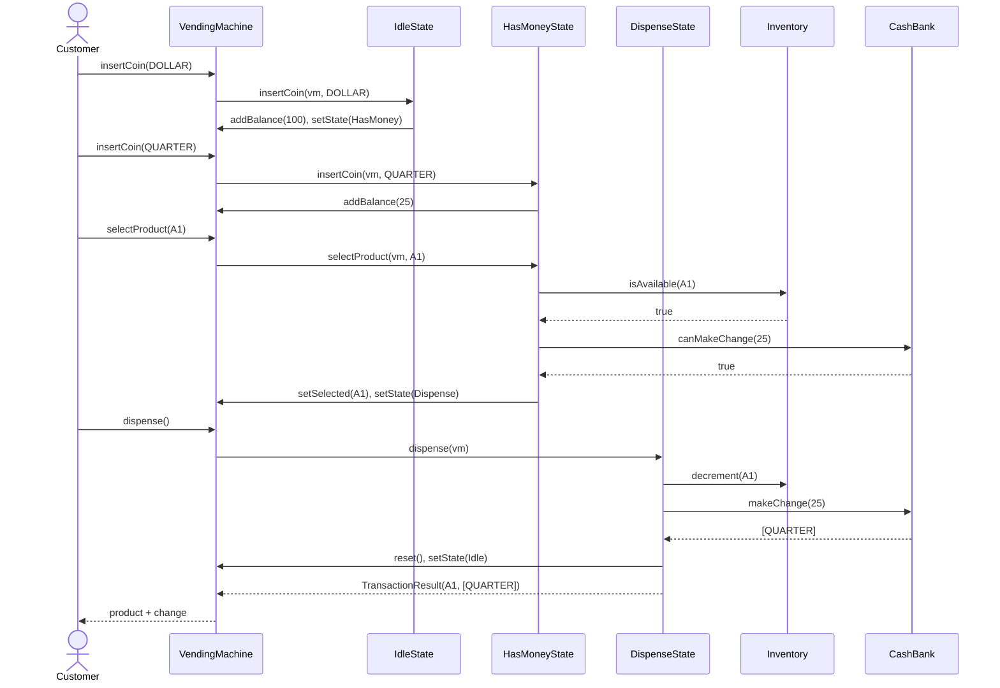
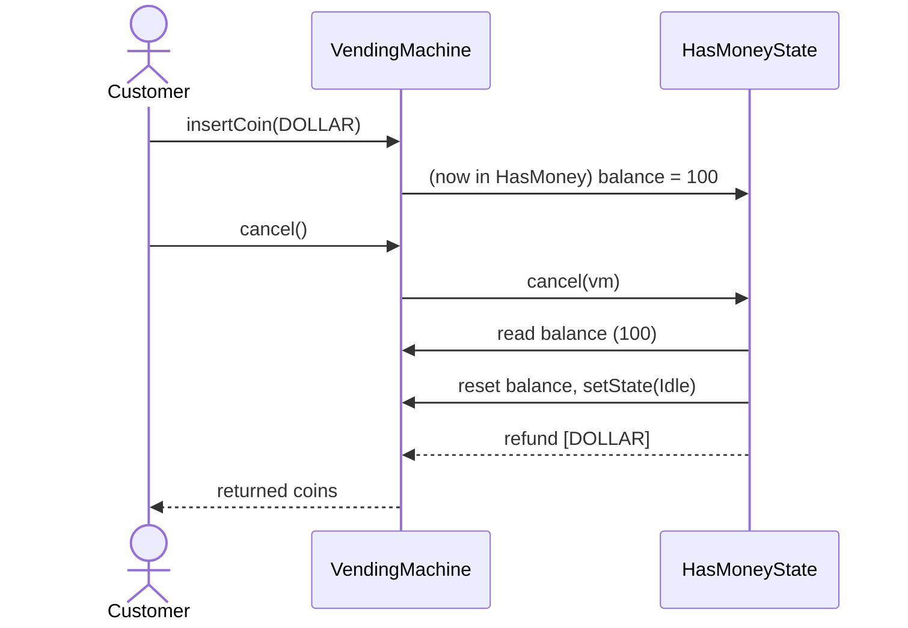
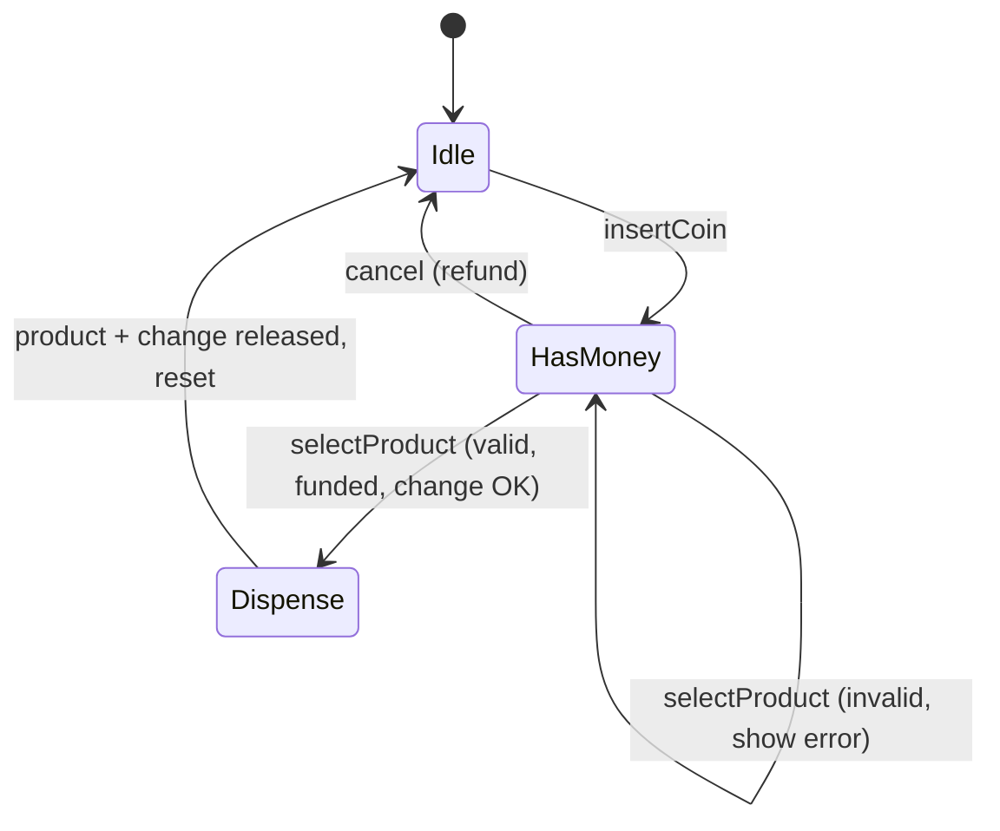
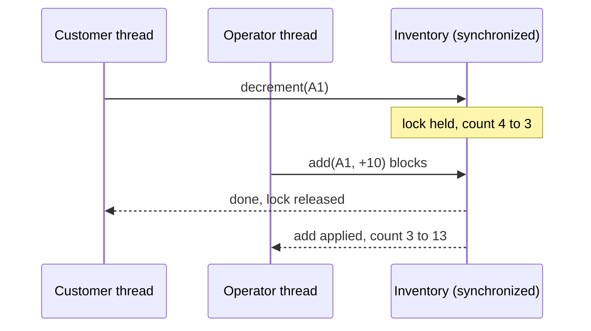
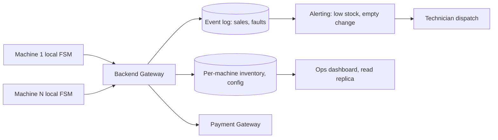

# 🥤 Low-Level Design: Vending Machine System

> A complete, interview-ready walkthrough of the classic **Vending Machine** design problem — from a blank whiteboard to a staff-level system that models behavior as an explicit state machine, makes change correctly, and survives concurrency and follow-up grilling.

The Vending Machine is the interview problem that exists to test one thing above all others: **can you model behavior that changes depending on state?** A machine sitting idle behaves nothing like a machine that already has your five dollars in it — insert a coin into an idle machine and it starts a transaction; insert a coin after you've selected a sold-out item and it should refuse. The same button press means different things at different moments. Candidates who reach for a tangle of boolean flags (`hasMoney`, `isDispensing`, `isSelected`) drown in `if` statements and ship bugs; candidates who recognize this as a *state machine* write clean, extensible code. This guide walks the whole journey, escalating from the beginner's mental model to the change-making, concurrency, and reliability concerns a principal engineer raises in the final minutes of the interview.

---

## 📋 Table of Contents

**Part I — Framing the Problem**

1. [Problem Statement](#1-problem-statement)
2. [Requirement Clarification & Assumptions](#2-requirement-clarification--assumptions)
3. [Functional & Non-Functional Requirements](#3-functional--non-functional-requirements)
4. [Core Concepts Being Tested](#4-core-concepts-being-tested)

**Part II — Modeling the Domain**

5. [Domain Model & Entities](#5-domain-model--entities)
6. [CRC Cards](#6-crc-cards)
7. [UML Class Diagram](#7-uml-class-diagram)
8. [Package Structure](#8-package-structure)

**Part III — Design Rationale**

9. [Design Decisions & Trade-offs](#9-design-decisions--trade-offs)
10. [Class-by-Class Deep Dive](#10-class-by-class-deep-dive)
11. [Design Patterns Applied](#11-design-patterns-applied)
12. [SOLID Principles Mapping](#12-solid-principles-mapping)

**Part IV — Behavior & Diagrams**

13. [Sequence Diagram](#13-sequence-diagram)
14. [State Diagram](#14-state-diagram)

**Part V — The Implementation**

15. [Complete Java Implementation](#15-complete-java-implementation)
16. [Execution Flow & Code Walkthrough](#16-execution-flow--code-walkthrough)

**Part VI — Engineering Depth**

17. [Complexity Analysis](#17-complexity-analysis)
18. [Thread Safety & Concurrency](#18-thread-safety--concurrency)
19. [Error Handling & Validation](#19-error-handling--validation)
20. [Scalability Discussion](#20-scalability-discussion)
21. [Alternative Designs & Trade-offs](#21-alternative-designs--trade-offs)

**Part VII — Interview Mastery**

22. [Common FAANG Follow-up Questions (L4 → L6)](#22-common-faang-follow-up-questions-l4--l6)
23. [Common Design Mistakes](#23-common-design-mistakes)
24. [Testing Strategy](#24-testing-strategy)
25. [FAANG Q&A Section](#25-faang-qa-section)
26. [STAR Behavioral Questions](#26-star-behavioral-questions)
27. [⚡ Quick Revision Cheat Sheet](#27--quick-revision-cheat-sheet)

---

## 1. Problem Statement

Design the software that runs a **vending machine**. A customer approaches the machine, inserts coins or notes, selects a product by its code (e.g., `A1`), and the machine dispenses the product along with any change owed. If the customer changes their mind before selecting, they can hit *cancel* and get their money back. An operator periodically restocks products and refills the coin bank used to make change.

The machine must handle **multiple products at different prices**, accept a **fixed set of coin and note denominations**, **track inventory** so it never sells what it doesn't have, **compute and dispense change** correctly (and refuse a sale it cannot make change for), and behave sensibly across every ordering of user actions — including the awkward ones, like selecting a product before inserting enough money, or inserting more coins mid-transaction.

<details>
<summary>📖 <b>In plain terms — what are we actually building?</b></summary>

Picture the snack machine in an office break room. You feed in a couple of dollar coins, punch in "B4" for the granola bar, and out drops the bar plus your forty cents change. Our job is to write the *brains* behind that: the logic that remembers how much you've put in so far, checks whether B4 is in stock and whether you've paid enough, releases exactly one granola bar, figures out which coins to return as change, and resets itself for the next customer. We are not building the physical motors or the coin sensor — we are building the software objects and rules that decide what happens on every button press and coin drop, so the machine never gives away free snacks or eats your money.

</details>

The deliverable in an interview is not a running product; it is a **clean object-oriented model** — the set of classes, their responsibilities, and above all the *state machine* that governs behavior — that a team could realistically build on. Grading centers on how cleanly you model the state transitions, how gracefully the design absorbs new denominations or products, and how correctly you reason about change-making and concurrency.

---

## 2. Requirement Clarification & Assumptions

The single biggest mistake candidates make is coding before scoping. A strong candidate spends the first few minutes turning the vague prompt into a bounded problem. Below is the clarification dialogue you should drive, framed as the questions to ask and the assumptions to lock in.

### 2.1 Actors

The people and systems that interact with the machine define its surface area.

| Actor | Role in the system |
|-------|--------------------|
| **Customer** | Inserts money, selects a product, collects the product and change, or cancels for a refund. |
| **Operator / Technician** | Restocks products, refills the change bank, collects deposited cash, sets prices. |
| **Coin & Note Acceptor** | The hardware that validates and reports each inserted denomination to our software. |
| **Dispenser Hardware** | The motors and coin hoppers our software drives to release products and change. |

### 2.2 Key Clarifying Questions

Before modeling anything, resolve these with the interviewer. Each answer materially changes the design.

- **Payment types** — Coins only, or coins and notes? Card payments? *(Assumption: a fixed set of coins and notes; card is out of scope for v1 but the payment path should not preclude it.)*
- **Change-making** — Must the machine give change? What if it *can't* make exact change? *(Assumption: yes, it makes change; if it cannot, it refuses the sale and refunds, rather than short-changing the customer.)*
- **Concurrency** — Can two people use one machine at once? *(Assumption: a single physical machine serves one customer at a time — but inventory and the change bank still need protection, and a fleet of machines shares a backend.)*
- **Cancellation** — Can the customer cancel mid-transaction? *(Assumption: yes, before dispensing; cancel refunds everything inserted so far.)*
- **Partial payment** — What if inserted money is less than the price? *(Assumption: the machine holds the balance and waits for more, or lets the customer cancel.)*
- **Product selection** — Select-then-pay, or pay-then-select? *(Assumption: money can be inserted first or a product selected first; we handle both orderings — this is exactly what the state machine is for.)*
- **Restocking** — Does restocking happen live while customers use it? *(Assumption: operators restock via a separate maintenance mode/API; we ensure it's safe under concurrency.)*

### 2.3 Explicit Non-Goals

Naming what you will *not* build is a senior signal — it shows you can bound scope deliberately rather than by omission.

- No physical hardware control (motor timing, coin-sensor calibration) — we assume clean interfaces to them.
- No card/mobile/contactless payment integration in v1 (the design leaves a seam for it).
- No remote telemetry dashboard, though we discuss it under scalability.
- No promotions, loyalty, or dynamic pricing.
- No multi-item single transaction (one product per transaction in v1).

<details>
<summary>📖 <b>Why spend so long on clarification?</b></summary>

The prompt "design a vending machine" is intentionally thin. If you start drawing classes immediately, you will guess at requirements and guess wrong. The two questions that most change the design are "must it make change, and what if it can't?" and "can money and selection arrive in either order?" The first forces the change-making algorithm and the "refuse if no change" rule; the second is the entire justification for the State pattern. Asking them upfront shows product sense and plants the seeds for the hard follow-ups later.

</details>

---

## 3. Functional & Non-Functional Requirements

### 3.1 Functional Requirements (what the system *does*)

These are the concrete behaviors the system must support. In an interview, list them crisply — they become your checklist for the class design.

1. **Accept money** — take valid coins and notes one at a time, accumulating a running balance.
2. **Select a product** by code, validating it exists and is in stock.
3. **Validate sufficient funds** — dispense only when the balance meets or exceeds the price.
4. **Dispense the product** and decrement its inventory.
5. **Compute and return change** — the difference between balance and price, in available denominations.
6. **Refuse gracefully** when out of stock, underpaid, or unable to make change — and refund appropriately.
7. **Cancel / refund** — return all inserted money on demand before dispensing.
8. **Restock & refill** — let an operator replenish products and the change bank.

### 3.2 Non-Functional Requirements (how *well* it does it)

These are the qualities that make the design production-grade, and they are where staff-level discussion lives.

| Attribute | Requirement | Why it matters |
|-----------|-------------|----------------|
| **Correctness** | Never dispense without full payment; never short-change; never sell out-of-stock. | These are money-handling invariants — violating them loses cash or trust. |
| **Consistency** | Balance, inventory, and change bank must always reflect reality. | A crash mid-dispense must not leave phantom stock or lost coins. |
| **Extensibility** | New products, denominations, and payment methods slot in with minimal change. | Requirements *will* change (new snacks, card readers). |
| **Responsiveness** | Each action (coin, selection) responds instantly. | A customer stands at the machine; lag feels broken. |
| **Reliability** | Hardware or payment failures must fail safe, not lose money. | A jammed motor shouldn't charge the customer for nothing. |
| **Concurrency-safety** | A shared inventory/change bank (across a fleet backend) must not be corrupted by parallel access. | Restock and sale racing must not double-count. |

<details>
<summary>📖 <b>Functional vs non-functional — the quick distinction</b></summary>

Functional requirements are the *verbs* — accept money, dispense a product, make change. If a functional requirement fails, the machine did the wrong thing. Non-functional requirements are the *adverbs* — do it correctly, do it without ever short-changing, do it safely if the motor jams. If a non-functional requirement fails, the machine did the right thing but *badly* (gave wrong change, or lost your money on a crash). Interviewers push on the non-functional ones because a clean class diagram alone can't answer them — they force you to reason about invariants, failure modes, and money.

</details>

---

## 4. Core Concepts Being Tested

This problem is a proxy for a bundle of skills. Knowing what's being measured helps you narrate your design to the *right* audience.

- **Finite state machines** — the marquee skill. Behavior depends on state (idle, money-inserted, dispensing), and the State pattern is the clean way to model it. This is *the* reason this problem is asked.
- **Object-oriented decomposition** — finding the right nouns (Machine, Product, Coin, Inventory) and giving each a single clear responsibility.
- **Algorithmic thinking** — change-making is a real algorithm (greedy vs. dynamic programming), and the "can't make change" edge case is a favorite probe.
- **Design patterns in context** — State (behavior), Strategy (change-making, payment), Factory (state creation), Singleton (the machine), Observer (low-stock alerts) — applied where they *earn their place*.
- **Invariant reasoning** — money in equals product value plus change out; stock never goes negative. Naming and protecting invariants is a senior signal.
- **Concurrency correctness** — protecting shared inventory and the change bank when the design scales to a backend serving many machines.

Keep these in the back of your mind as you read on — each section below is, in part, a chance to demonstrate one or more of them.

---

## 5. Domain Model & Entities

Before any code, we identify the **nouns** in the problem and turn them into entities. Good domain modeling is the difference between a design that flexes and one that fights you.

### 5.1 The Entity Landscape

Here is the cast of the system, grouped by role:

- **VendingMachine** — the top-level context object. Holds the current `State`, the product inventory, the cash/change bank, the running balance of the active transaction, and the currently selected product. There is exactly one per physical machine. It is the *context* in the State pattern.
- **State** — the abstraction that governs behavior. Each concrete state (`IdleState`, `HasMoneyState`, `DispenseState`) knows how to handle each user action *in that state* and which state to transition to next.
- **Product** — the thing being sold. Carries a code (`A1`), a name, and a price. Immutable.
- **Inventory** — a generic count-tracking store, used twice: once for products (code to product-and-quantity) and once conceptually for the change bank (denomination to count).
- **Coin / Note** — the accepted denominations, modeled as enums carrying their value in cents.
- **CashBank / ChangeDispenser** — the store of coins the machine holds, and the logic that selects which coins to return as change.
- **ChangeStrategy** — the pluggable algorithm that turns "return 40 cents" into a specific set of coins, or reports that it can't.
- **TransactionResult** — the outcome handed back to the caller: the dispensed product plus the change returned (or a refund).

### 5.2 Entity Relationships



<details>
<summary>📖 <b>How to read this relationship map</b></summary>

The diamond-headed lines mean "owns / is composed of" — a VendingMachine *is made of* its current state, its inventory, and its change bank; they live and die with the machine. The hollow diamond between VendingMachine and Product means "refers to" — the machine points at the *currently selected* product, but products exist independently in the inventory. The dotted arrow means "uses" — the CashBank *uses* a ChangeStrategy but doesn't own the algorithm's identity. The triangle arrows show the three concrete states *implementing* the `State` interface, which is the structural heart of the whole design.

</details>

### 5.3 Core Enumerations

Enums keep the type system honest and make illegal states unrepresentable.

- `Coin { PENNY(1), NICKEL(5), DIME(10), QUARTER(25), DOLLAR(100) }` — value in cents.
- `Note { ONE(100), FIVE(500), TEN(1000) }` — value in cents (if notes are supported).
- Machine state is modeled not as an enum but as *polymorphic State objects* — a deliberate choice explained in Section 9.

We store all money as **integer cents**, never floating-point dollars, to avoid rounding bugs (a recurring interview trap covered in Section 23).

---

## 6. CRC Cards

CRC (Class–Responsibility–Collaborator) cards are a lightweight way to pin down *what each class is responsible for* and *who it talks to*, before drowning in fields and methods. They force single-responsibility thinking, which interviewers reward.

| Class | Responsibilities | Collaborators |
|-------|------------------|---------------|
| **VendingMachine** | Hold transaction context (balance, selected product); delegate every action to the current state; own inventory and cash bank. | State, Inventory, CashBank, Product |
| **State** *(interface)* | Define how each user action is handled and drive transitions. | VendingMachine |
| **IdleState** | Handle the machine when empty of money — accept a coin (start a transaction) or reject premature selection/dispense. | VendingMachine, Coin |
| **HasMoneyState** | Handle money-inserted — accumulate more coins, validate a selection, cancel/refund. | VendingMachine, Product, Inventory |
| **DispenseState** | Release the product, compute and return change, reset the machine. | VendingMachine, CashBank, Inventory |
| **Product** | Identify itself (code, name) and its price. | — |
| **Inventory** | Track counts of items by key; add, decrement, check availability. | Product |
| **CashBank** | Store the machine's coins; add on payment; make change or report inability. | ChangeStrategy, Coin |
| **ChangeStrategy** | Convert an amount owed into a concrete set of coins, or fail. | Coin, CashBank |
| **TransactionResult** | Bundle the dispensed product and returned change for the caller. | Product, Coin |

Notice how each card has a *tight* set of responsibilities. If a card starts listing five unrelated duties — the classic "god machine" that tracks state, prices, dispenses, *and* makes change all in one class — that's a smell that the class is doing too much and the state logic should be extracted.

---

## 7. UML Class Diagram

Here is the full static structure in ASCII, the way you'd sketch it on a whiteboard. Abstract types are marked `«interface»`; the State pattern's shape is deliberately front and center.

```
        ┌──────────────────────────────────────────────┐
        │ VendingMachine                   «singleton»   │
        ├──────────────────────────────────────────────┤
        │ - currentState: State                         │
        │ - idleState: State                            │
        │ - hasMoneyState: State                        │
        │ - dispenseState: State                        │
        │ - inventory: Inventory<Product>               │
        │ - changeBank: CashBank                        │
        │ - balanceCents: long                          │
        │ - selected: Product                           │
        ├──────────────────────────────────────────────┤
        │ + insertCoin(c: Coin): void                   │
        │ + selectProduct(code: String): void           │
        │ + dispense(): TransactionResult               │
        │ + cancel(): List<Coin>                        │
        │ + setState(s: State): void                    │
        └───────────────┬──────────────────────────────┘
                        │ delegates every action to
                        ▼
        ┌──────────────────────────────────────────────┐
        │ «interface» State                             │
        ├──────────────────────────────────────────────┤
        │ + insertCoin(m: VendingMachine, c: Coin)      │
        │ + selectProduct(m: VendingMachine, code)      │
        │ + dispense(m: VendingMachine): TxnResult      │
        │ + cancel(m: VendingMachine): List<Coin>       │
        └───────────────┬──────────────────────────────┘
                        │ implemented by
        ┌───────────────┼───────────────────────┐
        ▼               ▼                       ▼
┌───────────────┐ ┌──────────────────┐ ┌────────────────────┐
│ IdleState     │ │ HasMoneyState    │ │ DispenseState      │
├───────────────┤ ├──────────────────┤ ├────────────────────┤
│ + insertCoin  │ │ + insertCoin     │ │ + dispense →       │
│   → HasMoney  │ │ + selectProduct  │ │   product + change │
│ + select →err │ │   → Dispense     │ │   → Idle           │
│ + dispense→err│ │ + cancel →refund │ │ (others → error)   │
└───────────────┘ └──────────────────┘ └────────────────────┘

        VendingMachine also owns ↓

┌──────────────────────────┐        ┌───────────────────────────┐
│ Inventory<T>             │        │ CashBank                  │
├──────────────────────────┤        ├───────────────────────────┤
│ - counts: Map<K,Integer> │        │ - coins: Map<Coin,Integer>│
│ - items:  Map<K,T>       │        │ - strategy: ChangeStrategy│
├──────────────────────────┤        ├───────────────────────────┤
│ + add(key,item,qty)      │        │ + add(coin, count)        │
│ + get(key): T            │        │ + makeChange(cents):      │
│ + isAvailable(key): bool │        │      List<Coin>           │
│ + decrement(key)         │        │ + canMakeChange(cents)    │
└──────────────────────────┘        └─────────────┬─────────────┘
                                                   │ uses
                                                   ▼
                                     ┌───────────────────────────┐
                                     │ «interface» ChangeStrategy│
                                     ├───────────────────────────┤
                                     │ + compute(cents, coins):  │
                                     │     Optional<List<Coin>>  │
                                     └─────────────┬─────────────┘
                                                   │
                              ┌────────────────────┴───────────────┐
                              ▼                                    ▼
                  ┌───────────────────────┐         ┌──────────────────────────┐
                  │ GreedyChangeStrategy  │         │ DpChangeStrategy         │
                  └───────────────────────┘         └──────────────────────────┘
```

The shape to notice: `VendingMachine` holds a reference to *one* `State` at a time (`currentState`) plus one cached instance of each concrete state, and forwards every public call to it. That single indirection — "delegate to the current state" — is what replaces the sprawling `if/else` chains a naive design would have.

---

## 8. Package Structure

A clean package layout communicates the architecture at a glance and enforces dependency direction. Here's a pragmatic layout.

```
com.vendingmachine
│
├── model                       // Entities & value objects
│   ├── Product.java
│   ├── Coin.java               //   enum with cent values
│   ├── Note.java               //   enum (optional notes)
│   └── TransactionResult.java
│
├── state                       // State pattern — the behavioral core
│   ├── State.java              //   interface
│   ├── IdleState.java
│   ├── HasMoneyState.java
│   └── DispenseState.java
│
├── inventory                   // Generic count-tracking stores
│   ├── Inventory.java
│   └── CashBank.java
│
├── change                      // Change-making algorithms (Strategy)
│   ├── ChangeStrategy.java
│   ├── GreedyChangeStrategy.java
│   └── DpChangeStrategy.java
│
├── exception                   // Domain exceptions
│   ├── InsufficientFundsException.java
│   ├── OutOfStockException.java
│   └── InsufficientChangeException.java
│
├── VendingMachine.java         // The context / orchestrator
│
└── Demo.java                   // Runnable demonstration
```

The guiding rule: **`model` depends on nothing; everything can depend on `model`.** States depend on the machine and the model; the change algorithms depend only on `Coin`. This keeps the behavioral core testable in isolation and the dependency arrows all pointing inward toward the domain.

---

## 9. Design Decisions & Trade-offs

Every interesting design has forks in the road. Here are the decisions that define this one, each with the alternative considered and the reason for the choice.

### 9.1 State pattern, or a boolean/enum flag machine?

**Decision:** Model behavior with the **State pattern** — one class per state, each implementing how the four user actions behave in that state.

**Trade-off:** The naive approach is a set of flags (`hasMoney`, `isDispensing`) or a single `enum State` switched on inside every method. That works for two states but rots fast: adding a "sold out" or "maintenance" state means editing *every* method's `switch`, and illegal transitions are only caught by hand-written `if` guards scattered everywhere. The State pattern costs a few extra classes, but each state's rules live in one place, transitions are explicit (`machine.setState(...)`), and adding a state is a *new class*, not edits across the codebase. This is the single most important decision in the problem and the reason it's asked.

### 9.2 Should the machine dispense if it can't make exact change?

**Decision:** **No.** If the change bank cannot form the exact change owed, the machine refuses the sale and refunds the full inserted amount.

**Trade-off:** Short-changing the customer is unacceptable (a correctness/trust violation); over-paying change is a revenue loss. The only safe option is to check `canMakeChange` *before* dispensing and abort cleanly if it fails. The cost is that a machine low on small coins may refuse otherwise-valid sales — a real trade-off operators manage by keeping the change bank stocked. Some designs instead ask the customer to insert exact change; we surface the refusal explicitly rather than silently rounding.

### 9.3 Greedy change-making, or dynamic programming?

**Decision:** Default to a **greedy** algorithm (largest coin first), but keep it behind a `ChangeStrategy` interface so a DP-based exact solver can be swapped in.

**Trade-off:** Greedy is O(number of denominations), simple, and *correct for canonical coin systems* like US/EUR currency. But greedy can fail to find a valid combination that exists for non-canonical denomination sets, or when a particular coin has run out. A dynamic-programming solver always finds change if it exists, at higher time/space cost. Making it a Strategy lets us ship greedy and drop in DP where denominations are unusual — a clean Open/Closed win and a great follow-up talking point.

### 9.4 Where does the transaction balance live — in the machine or the state?

**Decision:** Balance, selected product, inventory, and change bank live in **`VendingMachine`** (the context); the `State` objects are stateless behavior and read/write the context.

**Trade-off:** Putting mutable transaction data in the states would make them stateful and non-shareable, forcing a new state object per transaction. Keeping data in the context means the three state instances are flyweight singletons the machine reuses forever, and the states stay pure behavior. The mild cost is that states must reach back into the machine for data — an acceptable, standard shape for the State pattern.

### 9.5 Is VendingMachine a Singleton?

**Decision:** Model the machine as a single instance per process (Singleton in concept), but **inject** it and its collaborators rather than reaching for a static `getInstance()`.

**Trade-off:** There's genuinely one physical machine, so a single instance is natural. But a hard static Singleton is a testing anti-pattern — global mutable state, hard to mock, tests interfere. The senior move is "logically one instance, but dependency-injected": construct one `VendingMachine` with its inventory, cash bank, and states, and pass it where needed. You get the conceptual singleness without the testability tax.

<details>
<summary>📖 <b>Why interviewers love the "trade-off" framing</b></summary>

Junior candidates present a design as *the* answer. Senior candidates present it as *a* choice among alternatives and can articulate what they gave up. Saying "I used greedy change-making because it's simple and correct for standard currency, but it can fail on non-canonical denominations, so I'd swap in a DP solver via the strategy interface" tells the interviewer you understand consequences, not just syntax. Every decision above is phrased this way on purpose — practice narrating the road *not* taken.

</details>

---

## 10. Class-by-Class Deep Dive

Now we walk the key classes, explaining not just *what* they hold but *why* they're shaped that way.

### 10.1 `VendingMachine` (the context)

The orchestrator and the *context* of the State pattern. It holds one reference to the `currentState` plus cached instances of each concrete state (so it never re-allocates them), the product `Inventory`, the `CashBank`, the running `balanceCents`, and the currently `selected` product. Its four public methods — `insertCoin`, `selectProduct`, `dispense`, `cancel` — do almost nothing themselves; each simply forwards to `currentState`. This delegation is the whole point: the machine's *behavior* changes when its state reference is swapped, without any conditional logic in these methods.

### 10.2 `State` (interface)

Defines the four actions a customer can take, each receiving the machine as a parameter so it can read and mutate context and trigger transitions. Every concrete state must decide what each action means *in that state* — including the ones that are errors (selecting a product before inserting money). Making all four methods mandatory forces each state to consciously handle or reject every action, which is exactly the discipline that eliminates "what happens if I press this now?" bugs.

### 10.3 `IdleState`

The resting state. `insertCoin` accepts the coin, adds it to the balance, and transitions to `HasMoneyState`. Every other action is invalid: `selectProduct` and `dispense` are rejected (nothing has been paid), and `cancel` is a harmless no-op returning an empty refund. This is the machine waiting for the next customer.

### 10.4 `HasMoneyState`

The busiest state, entered once money is in. `insertCoin` accumulates more balance (staying in this state). `selectProduct` is where the real validation happens: it checks the product exists, is in stock, that the balance covers the price, and — critically — that the machine *can make change* for the difference; only if all pass does it set the selected product and transition to `DispenseState`. `cancel` refunds the full balance and returns to `IdleState`. This state is where most of the business rules concentrate.

### 10.5 `DispenseState`

The commit state. `dispense` performs the irreversible actions in a deliberate order: decrement inventory, compute the change from the `CashBank`, subtract the price from the balance, release the product plus change as a `TransactionResult`, then reset balance/selection and transition back to `IdleState`. Modeling dispensing as its own state (rather than doing it inline in `HasMoneyState`) makes the "point of no return" explicit and gives a clean home for the commit-ordering logic.

### 10.6 `Product`

An immutable value object: `code` (e.g., `A1`), `name`, and `priceCents`. Immutability means a product's price can't be mutated mid-transaction, and products can be freely shared across the inventory without defensive copying.

### 10.7 `Inventory<T>`

A generic count-tracking store keyed by a code. It maps each key to both the item and its remaining quantity, exposing `isAvailable`, `get`, `add`, and `decrement`. Generic because the same abstraction tracks products by code. Centralizing count logic here means "never sell what's out of stock" is enforced in one place, not re-checked ad hoc.

### 10.8 `CashBank` and `ChangeStrategy`

`CashBank` holds the machine's coins as a `Map<Coin, Integer>` and exposes `add` (on payment or refill), `canMakeChange`, and `makeChange`. It delegates the *algorithm* of selecting coins to an injected `ChangeStrategy`. `GreedyChangeStrategy` takes the largest coins first; `DpChangeStrategy` uses dynamic programming to always find a valid combination if one exists. Separating the *store* (CashBank) from the *algorithm* (ChangeStrategy) lets each vary independently — the archetypal Strategy split.

### 10.9 `TransactionResult`

An immutable bundle of the dispensed `Product` and the `List<Coin>` of change returned, handed back to the caller. It gives the dispense flow a single, clean return type instead of out-parameters or mutable side effects.

---

## 11. Design Patterns Applied

Patterns should appear because the problem *demands* them, not to decorate the design. Here's where each one earns its place.

| Pattern | Where it's used | What it buys us |
|---------|-----------------|-----------------|
| **State** | `IdleState`, `HasMoneyState`, `DispenseState` behind the `State` interface | Behavior changes with state without conditional sprawl; new states are new classes. The defining pattern of this problem. |
| **Strategy** | `ChangeStrategy` (greedy vs. DP), pluggable payment | Swap the change-making or payment algorithm without touching the machine. An Open/Closed win. |
| **Singleton** | `VendingMachine` (one per process) | Model the single physical machine — used judiciously, via injection. |
| **Factory / Simple Factory** | State creation and product setup | Centralize creation; the machine wires states once at construction. |
| **Observer** (optional) | Low-stock / empty-change alerts to an operator | Notify monitoring when inventory or coins run low, without coupling the machine to the alert channel. |

<details>
<summary>📖 <b>A note on not over-patterning</b></summary>

It's tempting to cram in every Gang-of-Four pattern to look sophisticated, but an interviewer reads that as insecurity. The State pattern here is unarguable — behavior genuinely depends on state. Strategy for change-making is natural — the algorithm genuinely varies. But forcing, say, a Command pattern for every button press or a Visitor over the product hierarchy is ceremony without payoff. The skill is knowing when a pattern *reduces* complexity versus when it merely adds indirection. Reach for a pattern when it removes an "if I change X I must edit Y" coupling — which State and Strategy both do here.

</details>

For the deeper theory behind each of these, this guide pairs naturally with the individual State, Strategy, Singleton, and Observer pattern guides.

---

## 12. SOLID Principles Mapping

SOLID isn't an abstract checklist here — each principle shows up concretely in the design.

**S — Single Responsibility.** Each class has one reason to change: `Inventory` tracks counts, `CashBank` holds coins, each `State` handles behavior for one state, `ChangeStrategy` computes change. A pricing change doesn't touch the state classes; a new state doesn't touch the change algorithm.

**O — Open/Closed.** The system is *open to extension, closed to modification*. A new `SoldOutState` or `MaintenanceState` is a new class implementing `State`; a `DpChangeStrategy` is a new class implementing `ChangeStrategy`. No existing class is edited to add them. This is the single most important SOLID win, delivered by the State and Strategy interfaces.

**L — Liskov Substitution.** Any `State` implementation works wherever a `State` is expected — the machine calls the same four methods regardless of which concrete state is current. Any `ChangeStrategy` is substitutable for another. No implementation throws where the interface promised not to.

**I — Interface Segregation.** `State` and `ChangeStrategy` are small, focused interfaces. A change algorithm isn't forced to know about coins-inserted; a state isn't forced to know how change is computed. Clients depend only on the sliver they use.

**D — Dependency Inversion.** `VendingMachine` depends on the *abstractions* `State` and (via `CashBank`) `ChangeStrategy`, not on concrete classes. Concretes are injected at construction. High-level orchestration doesn't know or care whether change-making is greedy or DP.

<details>
<summary>📖 <b>The one-line SOLID gut check</b></summary>

If you can add a brand-new machine state (sold out, maintenance), a new change algorithm, a new coin denomination, and a new payment method *without editing a single existing class* — only adding new ones — your design honors Open/Closed and Dependency Inversion, and the rest of SOLID usually falls into place. That "add, don't edit" test is the fastest way to sanity-check your vending-machine design under interview pressure.

</details>

---

## 13. Sequence Diagram

Two flows matter: a **successful purchase** (insert money, select, dispense with change) and a **cancellation** (refund before dispensing). Here they are as message sequences.

### 13.1 Successful Purchase



### 13.2 Cancellation & Refund



<details>
<summary>📖 <b>Reading the purchase flow</b></summary>

The interesting moment is `selectProduct`, not `dispense`. Selection is where all the validation gates fire: the product must exist and be in stock, the balance must cover the price, and the bank must be able to make change — *all four* must pass before the machine transitions to `DispenseState`. If any fails, the machine stays in `HasMoneyState` and reports why, so the customer can insert more money or cancel. By the time `dispense` runs, success is guaranteed; dispensing is just the commit. This "validate on selection, commit on dispense" split is what keeps the irreversible actions clean and race-free.

</details>

---

## 14. State Diagram

The machine *is* a state machine — this diagram is arguably the single most important artifact in the whole design, and interviewers often ask for it first.

### 14.1 Core Machine States



### 14.2 The Action-by-State Matrix

The clearest way to reason about a state machine is a table of "what does each action do in each state?" This is the exact grid the State pattern encodes in code.

| Action | IdleState | HasMoneyState | DispenseState |
|--------|-----------|---------------|---------------|
| **insertCoin** | Add balance → HasMoney | Add balance (stay) | Reject (busy dispensing) |
| **selectProduct** | Reject (no money) | Validate; if OK → Dispense, else stay + error | Reject (already selected) |
| **dispense** | Reject (nothing selected) | Reject (select first) | Release product + change → Idle |
| **cancel** | No-op (nothing to refund) | Refund all → Idle | Reject (too late) |

<details>
<summary>📖 <b>Why the state diagram comes first</b></summary>

For most LLD problems you model the *nouns* first (the classes). For the vending machine, model the *states and transitions* first — the nouns almost fall out of it. If you can draw this diagram and fill in the action-by-state matrix on the whiteboard early, you've essentially specified the entire behavioral core, and the code becomes a near-mechanical translation: one class per column, one method per row. Interviewers who ask "what states does your machine have?" are checking whether you think in transitions or in flags — and the transition thinker always writes cleaner code.

</details>

An easy enrichment to mention: a `SoldOutState` (entered when the last unit of the selected product is dispensed) and a `MaintenanceState` (for restocking) both slot in as new classes with no edits to the existing three — a concrete demonstration of the Open/Closed payoff.

---

## 15. Complete Java Implementation

Below is a complete, compilable reference implementation. It's organized bottom-up: enums and value objects first, then the change algorithms, then the inventory and cash bank, then the states, then the machine and a demo. Every block is collapsible so you can study one piece at a time. All money is stored as **integer cents** to avoid floating-point currency bugs.

<details>
<summary>💻 <b>1. Coin & Note enums, Money helper</b></summary>

```java
package com.vendingmachine.model;

/** Accepted coins, value stored as integer cents to avoid float rounding bugs. */
public enum Coin {
    PENNY(1), NICKEL(5), DIME(10), QUARTER(25), DOLLAR(100);

    private final int cents;
    Coin(int cents) { this.cents = cents; }
    public int cents() { return cents; }
}
```

```java
package com.vendingmachine.model;

/** Accepted notes (optional). Value in cents for a uniform money model. */
public enum Note {
    ONE(100), FIVE(500), TEN(1000);

    private final int cents;
    Note(int cents) { this.cents = cents; }
    public int cents() { return cents; }
}
```

</details>

<details>
<summary>💻 <b>2. Product & TransactionResult value objects</b></summary>

```java
package com.vendingmachine.model;

import java.util.Objects;

/** Immutable product: a code (e.g. "A1"), a display name, and a price in cents. */
public final class Product {
    private final String code;
    private final String name;
    private final long priceCents;

    public Product(String code, String name, long priceCents) {
        if (code == null || code.isBlank())
            throw new IllegalArgumentException("Product code required");
        if (priceCents <= 0)
            throw new IllegalArgumentException("Price must be positive");
        this.code = code;
        this.name = name;
        this.priceCents = priceCents;
    }

    public String getCode() { return code; }
    public String getName() { return name; }
    public long getPriceCents() { return priceCents; }

    @Override public boolean equals(Object o) {
        return (o instanceof Product) && ((Product) o).code.equals(code);
    }
    @Override public int hashCode() { return Objects.hash(code); }
    @Override public String toString() {
        return String.format("%s (%s) $%d.%02d", name, code, priceCents / 100, priceCents % 100);
    }
}
```

```java
package com.vendingmachine.model;

import java.util.Collections;
import java.util.List;

/** Immutable outcome of a successful dispense: the product plus the change returned. */
public final class TransactionResult {
    private final Product product;
    private final List<Coin> change;

    public TransactionResult(Product product, List<Coin> change) {
        this.product = product;
        this.change = List.copyOf(change);   // defensive, immutable copy
    }

    public Product getProduct() { return product; }
    public List<Coin> getChange() { return Collections.unmodifiableList(change); }

    @Override public String toString() {
        return "Dispensed " + product.getName() + ", change=" + change;
    }
}
```

</details>

<details>
<summary>💻 <b>3. Domain exceptions</b></summary>

```java
package com.vendingmachine.exception;

public class OutOfStockException extends RuntimeException {
    public OutOfStockException(String msg) { super(msg); }
}
```

```java
package com.vendingmachine.exception;

public class InsufficientFundsException extends RuntimeException {
    public InsufficientFundsException(String msg) { super(msg); }
}
```

```java
package com.vendingmachine.exception;

/** Thrown when the machine cannot form exact change; the sale is aborted and refunded. */
public class InsufficientChangeException extends RuntimeException {
    public InsufficientChangeException(String msg) { super(msg); }
}
```

</details>

<details>
<summary>💻 <b>4. ChangeStrategy interface + Greedy & DP implementations</b></summary>

```java
package com.vendingmachine.change;

import com.vendingmachine.model.Coin;
import java.util.List;
import java.util.Map;
import java.util.Optional;

/**
 * Computes a set of coins summing to the requested amount, using only coins
 * currently available (respecting counts). Returns empty if impossible.
 */
public interface ChangeStrategy {
    Optional<List<Coin>> compute(long cents, Map<Coin, Integer> available);
}
```

```java
package com.vendingmachine.change;

import com.vendingmachine.model.Coin;
import java.util.*;

/**
 * Greedy: take the largest coin that fits and is in stock, repeat.
 * Correct for canonical currency systems (US/EUR). May fail on
 * non-canonical denominations even when a solution exists.
 */
public class GreedyChangeStrategy implements ChangeStrategy {

    @Override
    public Optional<List<Coin>> compute(long cents, Map<Coin, Integer> available) {
        if (cents == 0) return Optional.of(List.of());

        Coin[] byValueDesc = Coin.values().clone();
        Arrays.sort(byValueDesc, Comparator.comparingInt(Coin::cents).reversed());

        Map<Coin, Integer> remaining = new EnumMap<>(available);
        List<Coin> result = new ArrayList<>();
        long left = cents;

        for (Coin coin : byValueDesc) {
            int count = remaining.getOrDefault(coin, 0);
            while (left >= coin.cents() && count > 0) {
                left -= coin.cents();
                count--;
                result.add(coin);
            }
        }
        return left == 0 ? Optional.of(result) : Optional.empty();
    }
}
```

```java
package com.vendingmachine.change;

import com.vendingmachine.model.Coin;
import java.util.*;

/**
 * Dynamic programming that finds a valid coin combination whenever one exists,
 * even for non-canonical denominations, while respecting available counts, and
 * minimizes the number of coins returned.
 *
 * Correctness comes from treating each physical coin as a distinct 0/1 item
 * (a bounded knapsack expanded into unit items), so we can never use more of a
 * denomination than the machine actually holds.
 */
public class DpChangeStrategy implements ChangeStrategy {

    @Override
    public Optional<List<Coin>> compute(long cents, Map<Coin, Integer> available) {
        if (cents == 0) return Optional.of(List.of());
        int target = (int) cents;

        // best[a] = fewest coins to make amount a; choice[a] = the coin last added.
        int[] best = new int[target + 1];
        Coin[] choice = new Coin[target + 1];
        Arrays.fill(best, Integer.MAX_VALUE);
        best[0] = 0;

        // Each available coin becomes `count` separate 0/1 items. Iterating the
        // amount axis downward per item is the standard 0/1-knapsack order, which
        // guarantees each physical coin is used at most once.
        for (Map.Entry<Coin, Integer> entry : available.entrySet()) {
            Coin coin = entry.getKey();
            int c = coin.cents();
            for (int copy = 0; copy < entry.getValue(); copy++) {
                for (int a = target; a >= c; a--) {
                    if (best[a - c] != Integer.MAX_VALUE && best[a - c] + 1 < best[a]) {
                        best[a] = best[a - c] + 1;
                        choice[a] = coin;
                    }
                }
            }
        }
        if (best[target] == Integer.MAX_VALUE) return Optional.empty();

        // Reconstruct: each choice[a] contributed exactly one coin of that value.
        List<Coin> result = new ArrayList<>();
        for (int a = target; a > 0; a -= choice[a].cents()) result.add(choice[a]);
        return Optional.of(result);
    }
}
```

</details>

<details>
<summary>💻 <b>5. Inventory (generic count store)</b></summary>

```java
package com.vendingmachine.inventory;

import java.util.HashMap;
import java.util.Map;

/**
 * A generic count-tracking store keyed by a code. Holds both the item and its
 * remaining quantity. Guarded so quantities never go negative.
 */
public class Inventory<T> {
    private final Map<String, T> items = new HashMap<>();
    private final Map<String, Integer> counts = new HashMap<>();

    public synchronized void add(String key, T item, int quantity) {
        if (quantity < 0) throw new IllegalArgumentException("quantity must be >= 0");
        items.put(key, item);
        counts.merge(key, quantity, Integer::sum);
    }

    public synchronized T get(String key) { return items.get(key); }

    public synchronized boolean isAvailable(String key) {
        return counts.getOrDefault(key, 0) > 0;
    }

    public synchronized int count(String key) { return counts.getOrDefault(key, 0); }

    public synchronized void decrement(String key) {
        int c = counts.getOrDefault(key, 0);
        if (c <= 0) throw new IllegalStateException("Nothing to decrement for " + key);
        counts.put(key, c - 1);
    }
}
```

</details>

<details>
<summary>💻 <b>6. CashBank (the change store)</b></summary>

```java
package com.vendingmachine.inventory;

import com.vendingmachine.change.ChangeStrategy;
import com.vendingmachine.model.Coin;
import java.util.*;

/**
 * Holds the machine's coins and makes change via an injected ChangeStrategy.
 * All mutation is synchronized so a shared bank stays consistent under concurrency.
 */
public class CashBank {
    private final Map<Coin, Integer> coins = new EnumMap<>(Coin.class);
    private final ChangeStrategy strategy;

    public CashBank(ChangeStrategy strategy) {
        this.strategy = strategy;
        for (Coin c : Coin.values()) coins.put(c, 0);
    }

    public synchronized void add(Coin coin, int count) {
        coins.merge(coin, count, Integer::sum);
    }

    /** Deposit a single inserted coin into the bank (it becomes available as change). */
    public synchronized void deposit(Coin coin) { add(coin, 1); }

    public synchronized boolean canMakeChange(long cents) {
        return strategy.compute(cents, snapshot()).isPresent();
    }

    /**
     * Removes and returns exact change for `cents`, or throws if impossible.
     * The caller must have verified funds/stock already.
     */
    public synchronized List<Coin> makeChange(long cents) {
        Optional<List<Coin>> plan = strategy.compute(cents, snapshot());
        if (plan.isEmpty())
            throw new IllegalStateException("Cannot make change for " + cents + " cents");
        List<Coin> chosen = plan.get();
        for (Coin c : chosen) coins.merge(c, -1, Integer::sum);
        return chosen;
    }

    private Map<Coin, Integer> snapshot() { return new EnumMap<>(coins); }
}
```

</details>

<details>
<summary>💻 <b>7. State interface</b></summary>

```java
package com.vendingmachine.state;

import com.vendingmachine.VendingMachine;
import com.vendingmachine.model.Coin;
import com.vendingmachine.model.TransactionResult;
import java.util.List;

/**
 * The State pattern's core abstraction. Each concrete state decides how every
 * user action behaves while the machine is in that state, and drives transitions
 * by calling machine.setState(...).
 */
public interface State {
    void insertCoin(VendingMachine machine, Coin coin);
    void selectProduct(VendingMachine machine, String code);
    TransactionResult dispense(VendingMachine machine);
    List<Coin> cancel(VendingMachine machine);
}
```

</details>

<details>
<summary>💻 <b>8. IdleState</b></summary>

```java
package com.vendingmachine.state;

import com.vendingmachine.VendingMachine;
import com.vendingmachine.model.Coin;
import com.vendingmachine.model.TransactionResult;
import java.util.Collections;
import java.util.List;

/** Machine at rest, no money inserted. */
public class IdleState implements State {

    @Override
    public void insertCoin(VendingMachine machine, Coin coin) {
        machine.getCashBank().deposit(coin);
        machine.addBalance(coin.cents());
        machine.setState(machine.getHasMoneyState());   // transition
    }

    @Override
    public void selectProduct(VendingMachine machine, String code) {
        throw new IllegalStateException("Insert money before selecting a product");
    }

    @Override
    public TransactionResult dispense(VendingMachine machine) {
        throw new IllegalStateException("Insert money and select a product first");
    }

    @Override
    public List<Coin> cancel(VendingMachine machine) {
        return Collections.emptyList();   // nothing to refund
    }
}
```

</details>

<details>
<summary>💻 <b>9. HasMoneyState — the validation hub</b></summary>

```java
package com.vendingmachine.state;

import com.vendingmachine.VendingMachine;
import com.vendingmachine.exception.InsufficientChangeException;
import com.vendingmachine.exception.InsufficientFundsException;
import com.vendingmachine.exception.OutOfStockException;
import com.vendingmachine.model.Coin;
import com.vendingmachine.model.Product;
import com.vendingmachine.model.TransactionResult;
import java.util.List;

/** Money has been inserted; accept more, validate a selection, or refund. */
public class HasMoneyState implements State {

    @Override
    public void insertCoin(VendingMachine machine, Coin coin) {
        machine.getCashBank().deposit(coin);
        machine.addBalance(coin.cents());   // accumulate, stay in this state
    }

    @Override
    public void selectProduct(VendingMachine machine, String code) {
        if (!machine.getInventory().isAvailable(code))
            throw new OutOfStockException("Out of stock: " + code);

        Product product = machine.getInventory().get(code);
        long balance = machine.getBalanceCents();
        long price = product.getPriceCents();

        if (balance < price)
            throw new InsufficientFundsException(
                "Need " + (price - balance) + " more cents for " + product.getName());

        long changeOwed = balance - price;
        if (!machine.getCashBank().canMakeChange(changeOwed))
            throw new InsufficientChangeException(
                "Cannot make change of " + changeOwed + " cents — select another or cancel");

        machine.setSelected(product);
        machine.setState(machine.getDispenseState());   // all gates passed
    }

    @Override
    public TransactionResult dispense(VendingMachine machine) {
        throw new IllegalStateException("Select a product before dispensing");
    }

    @Override
    public List<Coin> cancel(VendingMachine machine) {
        List<Coin> refund = machine.refundBalance();     // return all inserted money
        machine.reset();
        machine.setState(machine.getIdleState());
        return refund;
    }
}
```

</details>

<details>
<summary>💻 <b>10. DispenseState — the commit</b></summary>

```java
package com.vendingmachine.state;

import com.vendingmachine.VendingMachine;
import com.vendingmachine.model.Coin;
import com.vendingmachine.model.Product;
import com.vendingmachine.model.TransactionResult;
import java.util.List;

/** All checks passed; perform the irreversible dispense in a safe order. */
public class DispenseState implements State {

    @Override
    public void insertCoin(VendingMachine machine, Coin coin) {
        throw new IllegalStateException("Dispensing in progress — cannot insert coins");
    }

    @Override
    public void selectProduct(VendingMachine machine, String code) {
        throw new IllegalStateException("A product is already selected");
    }

    @Override
    public TransactionResult dispense(VendingMachine machine) {
        Product product = machine.getSelected();
        long change = machine.getBalanceCents() - product.getPriceCents();

        // Ordering: decrement stock, then make change, then release, then reset.
        machine.getInventory().decrement(product.getCode());
        List<Coin> changeCoins = machine.getCashBank().makeChange(change);

        TransactionResult result = new TransactionResult(product, changeCoins);
        machine.reset();
        machine.setState(machine.getIdleState());
        return result;
    }

    @Override
    public List<Coin> cancel(VendingMachine machine) {
        throw new IllegalStateException("Cannot cancel during dispensing");
    }
}
```

</details>

<details>
<summary>💻 <b>11. VendingMachine — the context / orchestrator</b></summary>

```java
package com.vendingmachine;

import com.vendingmachine.inventory.CashBank;
import com.vendingmachine.inventory.Inventory;
import com.vendingmachine.model.Coin;
import com.vendingmachine.model.Product;
import com.vendingmachine.model.TransactionResult;
import com.vendingmachine.state.*;
import java.util.ArrayList;
import java.util.List;

/**
 * The context in the State pattern. Holds transaction data and delegates every
 * user action to the current state. States are cached (flyweight) and reused.
 */
public class VendingMachine {
    private final State idleState;
    private final State hasMoneyState;
    private final State dispenseState;

    private final Inventory<Product> inventory;
    private final CashBank changeBank;

    private State currentState;
    private long balanceCents;
    private Product selected;

    public VendingMachine(Inventory<Product> inventory, CashBank changeBank) {
        this.inventory = inventory;
        this.changeBank = changeBank;
        this.idleState = new IdleState();
        this.hasMoneyState = new HasMoneyState();
        this.dispenseState = new DispenseState();
        this.currentState = idleState;
    }

    // --- Public API: each call simply delegates to the current state ---
    public synchronized void insertCoin(Coin coin) { currentState.insertCoin(this, coin); }
    public synchronized void selectProduct(String code) { currentState.selectProduct(this, code); }
    public synchronized TransactionResult dispense() { return currentState.dispense(this); }
    public synchronized List<Coin> cancel() { return currentState.cancel(this); }

    // --- Context accessors used by states ---
    public void setState(State state) { this.currentState = state; }
    public State getState() { return currentState; }
    public State getIdleState() { return idleState; }
    public State getHasMoneyState() { return hasMoneyState; }
    public State getDispenseState() { return dispenseState; }

    public Inventory<Product> getInventory() { return inventory; }
    public CashBank getCashBank() { return changeBank; }

    public long getBalanceCents() { return balanceCents; }
    public void addBalance(long cents) { this.balanceCents += cents; }

    public Product getSelected() { return selected; }
    public void setSelected(Product p) { this.selected = p; }

    /** Return the currently held balance as a list of coins and clear it (used on cancel). */
    public List<Coin> refundBalance() {
        List<Coin> refund = new ArrayList<>();
        long left = balanceCents;
        Coin[] desc = { Coin.DOLLAR, Coin.QUARTER, Coin.DIME, Coin.NICKEL, Coin.PENNY };
        for (Coin c : desc) {
            while (left >= c.cents()) { refund.add(c); left -= c.cents(); }
        }
        balanceCents = 0;
        return refund;
    }

    /** Clear per-transaction context after a completed sale. */
    public void reset() {
        this.balanceCents = 0;
        this.selected = null;
    }
}
```

</details>

<details>
<summary>💻 <b>12. Demo — putting it all together</b></summary>

```java
package com.vendingmachine;

import com.vendingmachine.change.GreedyChangeStrategy;
import com.vendingmachine.inventory.CashBank;
import com.vendingmachine.inventory.Inventory;
import com.vendingmachine.model.Coin;
import com.vendingmachine.model.Product;
import com.vendingmachine.model.TransactionResult;

public class Demo {
    public static void main(String[] args) {
        // Wire up inventory
        Inventory<Product> inventory = new Inventory<>();
        inventory.add("A1", new Product("A1", "Cola", 125), 5);      // $1.25
        inventory.add("B4", new Product("B4", "Granola Bar", 160), 3); // $1.60

        // Wire up the change bank and seed it with coins
        CashBank bank = new CashBank(new GreedyChangeStrategy());
        bank.add(Coin.QUARTER, 10);
        bank.add(Coin.DIME, 10);
        bank.add(Coin.NICKEL, 10);

        VendingMachine machine = new VendingMachine(inventory, bank);

        // Customer inserts $1.50 for a $1.25 cola (expects $0.25 change)
        machine.insertCoin(Coin.DOLLAR);
        machine.insertCoin(Coin.QUARTER);
        machine.insertCoin(Coin.QUARTER);
        machine.selectProduct("A1");
        TransactionResult result = machine.dispense();
        System.out.println(result);   // Dispensed Cola, change=[QUARTER]

        // Next customer cancels a partial payment
        machine.insertCoin(Coin.DOLLAR);
        System.out.println("Refund: " + machine.cancel());  // Refund: [DOLLAR]
    }
}
```

</details>

---

## 16. Execution Flow & Code Walkthrough

Let's trace a single customer's journey through the code to cement how the pieces cooperate. The customer inserts $1.50 for a $1.25 cola and expects a quarter back.

**Insert first coin.** `machine.insertCoin(DOLLAR)` runs while `currentState` is `IdleState`. The machine delegates: `idleState.insertCoin(machine, DOLLAR)`. Idle deposits the coin into the `CashBank` (so it's available as future change), calls `machine.addBalance(100)`, and — the key move — calls `machine.setState(hasMoneyState)`. The machine's behavior has now changed with a single reference swap, no conditionals.

**Insert more coins.** The next two `insertCoin(QUARTER)` calls delegate to `HasMoneyState.insertCoin`, which deposits each quarter and accumulates the balance to 150, staying in `HasMoneyState`. Notice the *same public method* on the machine now does something different purely because the state changed.

**Select the product.** `machine.selectProduct("A1")` runs `HasMoneyState.selectProduct`. This is the validation hub: it checks `inventory.isAvailable("A1")` (true), fetches the cola, confirms balance 150 ≥ price 125, computes change owed = 25, and asks `cashBank.canMakeChange(25)` — the greedy strategy finds a single quarter, so it returns true. All gates pass, so it sets the selected product and transitions to `DispenseState`. Had any check failed, it would have thrown a descriptive exception and *stayed* in `HasMoneyState`.

**Dispense.** `machine.dispense()` runs `DispenseState.dispense`. It reads the selected cola, computes change = 25, then performs the commit in order: `inventory.decrement("A1")` (stock 5 → 4), `cashBank.makeChange(25)` (removes a quarter and returns `[QUARTER]`), bundles a `TransactionResult(cola, [QUARTER])`, calls `machine.reset()` (balance → 0, selection cleared), and transitions back to `IdleState`. The result bubbles up to the caller.

The critical ordering to call out in an interview is **validate on selection, commit on dispense**. Every check that *could* fail happens in `selectProduct` while the machine can still safely abort; by the time `dispense` runs, the only work left is the guaranteed-safe commit.

<details>
<summary>📖 <b>Following the state hand-off once more</b></summary>

The subtle beauty is that `VendingMachine.insertCoin`, `selectProduct`, `dispense`, and `cancel` each contain exactly one line — a delegation to `currentState`. There is not a single `if (state == ...)` anywhere in the machine. All the branching lives in *which object* `currentState` points to. When you add a `SoldOutState` later, the machine code doesn't change at all — you just make some state transition into it. That is the entire promise of the State pattern made concrete: the conditional logic became polymorphism.

</details>

---

## 17. Complexity Analysis

Interviewers will ask "how fast is each operation?" Here's the honest accounting. Let `D` be the number of coin denominations (a small constant, ~5) and `C` the amount of change in cents.

| Operation | Time | Space | Notes |
|-----------|------|-------|-------|
| **insertCoin** | O(1) | O(1) | Map update + balance add + possible state swap. |
| **selectProduct** | O(cost of `canMakeChange`) | O(D) | Inventory lookups are O(1); the change *feasibility* check dominates. |
| **dispense** | O(cost of `makeChange`) | O(C/denom) | Decrement is O(1); building the change list dominates. |
| **cancel / refund** | O(D + coins returned) | O(coins) | Greedily decompose the balance into coins. |
| **Greedy change** | O(D) | O(coins returned) | One pass over denominations. |
| **DP change** | O(C × D) | O(C) | Fills a table of size C; always finds a solution if one exists. |

The interesting comparison is **greedy vs. DP change-making**. Greedy is O(D) — effectively constant for a fixed currency — and correct for canonical denominations, but it can *fail to find* a valid combination for non-canonical sets or when specific coins are depleted. DP is O(C × D): for typical change amounts (under a few dollars) this is a tiny table, and it *guarantees* a solution when one exists. The right answer in an interview is "greedy by default because our denominations are canonical, DP behind the same interface for correctness when they aren't."

<details>
<summary>📖 <b>Why change-making isn't as trivial as it looks</b></summary>

Greedy change-making — "keep taking the biggest coin that fits" — is correct for US and Euro coins, so it *feels* universally right. But it isn't: with denominations {1, 3, 4} making 6 cents, greedy takes 4 then two 1s (three coins), while the optimal is two 3s (two coins) — and for some target/denomination combos greedy fails to find *any* solution that exists. Interviewers sometimes hand you an odd denomination set precisely to see if you know greedy's limits. Recognizing this and reaching for DP is a strong signal, and putting both behind a `ChangeStrategy` interface shows you can hedge the algorithm choice without rewriting the machine.

</details>

---

## 18. Thread Safety & Concurrency

A single physical vending machine serves one customer at a time, so the naive view is "no concurrency here." That's the junior answer. The senior answer distinguishes two levels: the **single machine** (mostly serial, but restocking can race a sale) and the **fleet backend** (many machines sharing inventory/pricing services), where concurrency is unavoidable.

### 18.1 The single-machine hazards

Even one machine has two threads worth worrying about: the customer-facing transaction thread and an **operator restock thread** that may refill inventory or the change bank at any moment. If a customer's `dispense` reads inventory count while the operator's `add` writes it, a lost update can corrupt the count. Similarly, an interrupt or a second rapid button press could re-enter the machine's methods.

### 18.2 How this design stays safe

Two mechanisms combine:

1. **Synchronize the machine's public actions.** `insertCoin`, `selectProduct`, `dispense`, and `cancel` are `synchronized` on the machine, so a single transaction's steps can't interleave with a stray re-entrant call — the machine processes one action at a time.
2. **Synchronize the shared stores.** `Inventory` and `CashBank` synchronize their own mutators (`add`, `decrement`, `makeChange`), so an operator restocking while a customer buys can't produce a lost update. The check-and-mutate on inventory (`isAvailable` then `decrement`) is protected because the whole `dispense` runs inside the machine's synchronized block *and* the store methods are themselves synchronized.



### 18.3 The check-then-act subtlety

The dangerous pattern is checking `isAvailable(A1)` in `selectProduct` and then `decrement(A1)` in `dispense` — two separate operations with a gap. In this design the gap is closed two ways: dispensing follows selection immediately within the same single-threaded machine session, and even if a restock or another path intervened, `decrement` itself throws if the count reached zero, so we fail loudly rather than going negative. For a backend serving a fleet, this becomes an atomic compare-and-decrement (a conditional DB update `UPDATE ... WHERE count > 0`, or an atomic Redis `DECR` guarded by a check).

### 18.4 The fleet level

When a backend tracks inventory or accepts cashless payment across thousands of machines, true parallelism arrives. There, spot-decrement of stock becomes an atomic database operation, payment authorization is idempotent (keyed so a retried charge doesn't double-bill), and each machine's state can live in its own row so machines never contend with each other — the system shards perfectly by machine ID.

<details>
<summary>📖 <b>Why "check-then-act" is the villain of concurrency</b></summary>

Almost every concurrency bug in inventory-style problems reduces to a "check-then-act" that isn't atomic: check the item is in stock, *then* take it — with a gap where another thread sneaks in. The cure is always to make the check and the act one indivisible operation: a synchronized block, an atomic compare-and-swap, or a conditional database update (`UPDATE stock SET qty = qty - 1 WHERE code = ? AND qty > 0`). If you can spot the check-then-act gap in any design, you can find its race. In the vending machine it shows up as overselling stock; in a payment system as double-charging; in seat booking as double-booking — the same bug wearing different clothes.

</details>

---

## 19. Error Handling & Validation

Robust designs fail loudly and safely. Here are the failure modes and how the design handles each.

- **Selecting before paying** → `IdleState.selectProduct` throws `IllegalStateException`. The state machine makes premature actions structurally impossible rather than relying on scattered flag checks.
- **Out of stock** → `HasMoneyState.selectProduct` checks `isAvailable` and throws `OutOfStockException`. No product is ever dispensed for an empty slot, and the customer stays in `HasMoneyState` to pick another or cancel.
- **Insufficient funds** → the balance-vs-price check throws `InsufficientFundsException` with the exact shortfall, so the UI can prompt "insert 35 more cents." The machine stays funded and waiting.
- **Cannot make change** → the `canMakeChange` gate throws `InsufficientChangeException` *before* any irreversible action, so the customer is never short-changed; they can select a cheaper item that needs no change, or cancel for a full refund.
- **Dispensing while busy** → `DispenseState` rejects `insertCoin`, `selectProduct`, and `cancel`, preventing a second transaction from corrupting an in-flight one.
- **Invalid construction input** → blank product code or non-positive price is rejected at construction with `IllegalArgumentException`, so bad data never enters the system.
- **Decrementing empty stock** → `Inventory.decrement` throws `IllegalStateException` rather than going negative — a last-line invariant guard.

The design principle throughout: **validate at selection, commit at dispense, and never leave the machine in a half-updated state.** Because every failing check happens in `HasMoneyState.selectProduct` — before the transition to `DispenseState` — a failure simply keeps the customer in the funded state with their money intact. The irreversible steps in `DispenseState` run only after success is guaranteed.

---

## 20. Scalability Discussion

The class model runs one machine in one process. Interviewers push: "Now it's a fleet of 10,000 machines with a central dashboard, cashless payment, and remote restock alerts." Here's the escalation path.

**From standalone to connected.** Each machine keeps its local state machine (so it works even offline), but reports events — sales, low stock, empty change, faults — to a backend over an intermittent connection. The local state machine is the source of truth for *this transaction*; the backend aggregates for analytics and operations.

**Inventory and telemetry at fleet scale.** The backend stores per-machine inventory and event streams. Sales events flow into a durable log (e.g., Kafka), and low-stock or empty-change conditions raise alerts (the Observer pattern extended across the network) so a technician is dispatched before the machine goes dead. Reads for the ops dashboard come from a read replica or a materialized view — they tolerate eventual consistency.

**Cashless payment.** A card/mobile payment path slots in behind a `PaymentStrategy` seam. Because external gateways are flaky, wrap the authorization with a timeout, retry with an idempotency key (so a retried charge after an ambiguous timeout doesn't double-bill), and a circuit breaker so a gateway outage fails fast. If payment is degraded, the machine simply declines cashless and accepts coins.

**Consistency boundaries.** The *local dispense* must be strongly consistent — never dispense without payment, never oversell the physical slot — and that's enforced on-device. The *fleet view* (aggregate stock, revenue dashboards) tolerates eventual consistency; a dashboard that's a few seconds stale is fine. Distinguishing these lets you keep the expensive strong-consistency machinery only where money and physical goods are at stake.

**Sharding.** The system shards perfectly by machine ID — no operation spans two machines — so adding machines is linear cost. This is the same "embarrassingly parallel" property that makes fleets easy to scale horizontally.



<details>
<summary>📖 <b>The one scaling idea that matters most here</b></summary>

The key realization is that a vending machine is *autonomous first, connected second*. The local state machine must complete a sale correctly even with the network down — you can't have a snack machine that refuses to work because the cloud is unreachable. So the strong-consistency, must-be-correct logic (take money, dispense, make change) lives on the device, and the backend handles only the parts that tolerate lag: analytics, restock scheduling, and dashboards. Getting that split right — autonomous core, eventually-consistent periphery — is what separates a robust fleet design from a fragile one.

</details>

---

## 21. Alternative Designs & Trade-offs

Strong candidates can compare their design against roads not taken.

**State pattern vs. enum-switch state machine.** We used the State pattern (one class per state). A lighter alternative is a single `enum MachineState` with a `switch` inside each method. For a fixed two- or three-state machine that never grows, the enum-switch is less code and easier to see at a glance. But every new state forces edits to every method's switch, and illegal transitions rely on hand-written guards. The State pattern trades a few extra classes for locality and Open/Closed extensibility — the right call once you anticipate `SoldOut`, `Maintenance`, or `Cashless` states.

**Greedy vs. DP change-making.** Greedy is simple and correct for canonical currency; DP is slower but always finds change when it exists. We ship greedy behind a `ChangeStrategy` so DP can drop in — matching the mechanism to the denomination set rather than committing to one.

**Change stored as coin counts vs. total cents.** We track individual coin counts in the `CashBank` so we can actually *return specific coins*. A simpler design tracks only total cash value — but then it can't reason about *whether it has the right coins* to make change, which is the whole point. The richer model is necessary for correctness.

**Money as long cents vs. BigDecimal vs. double.** We use `long` cents. `double` invites rounding bugs (0.1 + 0.2 ≠ 0.3) and is disqualifying for money. `BigDecimal` is correct but heavier and slower; for a fixed-precision domain like coins, integer cents is the clean, fast, exact choice.

**Synchronized methods vs. lock-free.** We synchronized the machine and stores. For a single device this is more than fast enough and trivially correct. Lock-free structures would add complexity with no benefit here — they'd only matter at the fleet backend, where atomic DB operations replace in-process locks entirely.

---

## 22. Common FAANG Follow-up Questions (L4 → L6)

Interviewers escalate difficulty. Here's the ladder, with the *reasoning* they're probing for.

**L4 (entry-level / new grad):**

- *What states does your machine have?* → Idle, HasMoney, Dispense (plus optional SoldOut/Maintenance). Draw the transition diagram and the action-by-state matrix.
- *What happens if I select before inserting money?* → `IdleState` rejects it; the state machine makes premature actions impossible without scattered flag checks.
- *How do you track inventory?* → An `Inventory` keyed by product code holding item + count, with `isAvailable`/`decrement` guarded so it never goes negative.

**L5 (senior):**

- *Model this with the State pattern — why not just booleans?* → Booleans/enum-switches rot as states grow; State localizes each state's rules and makes new states additive. Show the delegation.
- *What if the machine can't make exact change?* → Check `canMakeChange` *before* dispensing; if it fails, refuse and refund fully. Never short-change.
- *Add a new coin denomination or a sold-out state without breaking things.* → New enum value / new `State` class; Open/Closed means no edits to existing classes.
- *Where does the transaction balance live and why?* → In the context (machine), not the states, so states stay stateless flyweights reused across transactions.

**L6 (staff / principal):**

- *Greedy vs. DP change-making — when does greedy fail?* → Non-canonical denominations or depleted coins; DP always finds a solution if one exists. Both behind `ChangeStrategy`.
- *Scale to a fleet of 10,000 connected machines.* → Autonomous local FSM (works offline), event stream to backend, alerts on low stock/empty change, shard by machine ID, eventual consistency for dashboards.
- *Cashless payment gateway is flaky — design for it.* → `PaymentStrategy` seam with timeouts, idempotent retries with keys, circuit breaker, and graceful degradation to coins.
- *Which parts need strong vs. eventual consistency?* → Local dispense (money + physical goods): strong, on-device. Fleet aggregates/dashboards: eventual.

<details>
<summary>📖 <b>The meta-pattern of the follow-up ladder</b></summary>

Notice how the questions climb: L4 is "does your model represent the domain and its states?", L5 is "does it stay clean and correct as states and rules grow?", and L6 is "does it survive real-world scale, failure, and money-handling edge cases?". You can pre-empt the climb by *seeding* the higher levels early — e.g., when you introduce the State pattern at L5, add "and this is what lets us add a cashless or maintenance state later without touching existing code," which signals L6 thinking before they even ask. Guiding the interviewer up the ladder yourself is a strong senior signal.

</details>

---

## 23. Common Design Mistakes

The traps that sink otherwise-good candidates.

- **Boolean-flag state management.** Tracking `hasMoney`, `isDispensing`, `isSelected` as separate booleans leads to combinatorial `if` sprawl and impossible-state bugs. Use the State pattern.
- **Coding before clarifying.** Not pinning down whether the machine makes change, what happens when it can't, and whether money/selection can arrive in either order.
- **Floating-point money** (`double dollars`). `0.1 + 0.2 != 0.3` will corrupt totals. Use integer cents (or `BigDecimal`).
- **Dispensing before checking change.** Releasing the product and *then* discovering you can't make change short-changes the customer. Check `canMakeChange` before the point of no return.
- **Tracking only total cash, not coin counts.** You can't decide *which* coins to return, so you can't reason about "can I make this change?" Track per-denomination counts.
- **A god `VendingMachine` class** that holds state logic, pricing, inventory, and change-making inline. Violates SRP; extract states, inventory, and the change strategy.
- **Ignoring the "can't make change" case entirely.** The most commonly forgotten edge case, and the one interviewers most reliably probe.
- **Putting transaction data in the state objects.** Makes them stateful and non-reusable; keep balance and selection in the context.
- **Assuming zero concurrency.** Restocking can race a sale even on one machine; synchronize the shared stores.
- **Over-patterning.** Forcing Command for every button or Visitor over products where State + Strategy already suffice.

---

## 24. Testing Strategy

A design is only as trustworthy as its tests. Cover these layers.

**Unit tests (per class, pure logic):**

- `GreedyChangeStrategy` — exact change for canonical amounts, empty for impossible amounts, respects depleted coin counts.
- `DpChangeStrategy` — finds change for non-canonical denominations where greedy fails; returns empty only when truly impossible.
- `Inventory` — `isAvailable` flips at zero, `decrement` throws on empty, `add` accumulates.
- `CashBank` — `canMakeChange` matches `makeChange`, and `makeChange` actually removes the returned coins.

**State-transition tests (the important ones for this problem):**

- From `IdleState`: `insertCoin` moves to `HasMoney`; `selectProduct`/`dispense` throw.
- From `HasMoneyState`: accumulating coins stays put; a valid selection moves to `Dispense`; out-of-stock, underpaid, and no-change selections throw and *stay* in `HasMoney`; `cancel` refunds and returns to `Idle`.
- From `DispenseState`: `dispense` releases product + change and returns to `Idle`; all other actions throw.
- Assert the exact refund on cancel equals the exact coins inserted.

**Integration tests (objects together):**

- Full happy path: insert, select, dispense, correct change, stock decremented, machine back to Idle.
- Insufficient-funds path: selection rejected, balance preserved, can insert more and succeed.
- No-change path: bank drained of small coins, selection refused, full refund on cancel.
- Sold-out path: last unit dispensed, next selection of that code rejected.

**Concurrency tests:**

- Spawn a restock thread and a purchase thread hammering the same product; assert the count invariant (`sold + remaining == initial + restocked`) always holds and never goes negative.
- Use a `CountDownLatch` to release both threads simultaneously and loop thousands of times to shake out races on `Inventory` and `CashBank`.

<details>
<summary>📖 <b>Testing the state machine exhaustively</b></summary>

The highest-value tests for a vending machine are the *transition* tests, and the cleanest way to write them is to walk the action-by-state matrix from Section 14: for each of the three states, fire each of the four actions and assert both the outcome and the resulting state. That's twelve targeted tests that pin down the entire behavioral contract — and if you later add a `SoldOutState`, you just add one more row of assertions. This exhaustive-matrix approach is exactly how you'd test any finite state machine, from a TCP connection to a UI wizard; the vending machine is a friendly stand-in for that whole family.

</details>

---

## 25. FAANG Q&A Section

Twenty of the most frequently asked questions, escalating from conceptual to staff/principal. Each answer is written the way you'd actually speak it in the room.

### 🎯 Conceptual & Modeling (L4)

<details>
<summary><b>Q1. Walk me through the core entities you'd model for a vending machine.</b></summary>

I'd start with `VendingMachine` as the context object holding the current `State`, a product `Inventory`, a `CashBank` for change, the running balance, and the selected product. Behavior lives in three `State` classes — `IdleState`, `HasMoneyState`, `DispenseState` — behind a `State` interface. `Product` is an immutable value object (code, name, price in cents), `Coin` is an enum carrying cent values, and `ChangeStrategy` is the pluggable coin-selection algorithm. For example, inserting a dollar into an idle machine transitions it to `HasMoneyState`; that one action already exercises the machine, a coin, the balance, and a transition — the heart of the model.

</details>

<details>
<summary><b>Q2. Why is the State pattern the right tool here instead of a few boolean flags?</b></summary>

Because the *same action means different things at different times*: inserting a coin starts a transaction when idle but just accumulates when money's already in, and selecting a product is an error before payment but a commit after. With booleans you get combinatorial `if` sprawl and impossible states like `isDispensing && !hasMoney`. The State pattern gives each state one class that defines all four actions, so the rules are local and illegal transitions are structurally prevented. Concretely, adding a `SoldOutState` is a new class, not a new flag threaded through every method — that's the Open/Closed win interviewers look for.

</details>

<details>
<summary><b>Q3. Why store money as integer cents instead of a double?</b></summary>

Floating-point can't represent most decimal fractions exactly, so `0.1 + 0.2` yields `0.30000000000000004` — accumulate enough of those and your totals drift, which is disqualifying for a money-handling machine. I store every amount as a `long` number of cents, so a dollar is `100` and arithmetic is exact. `BigDecimal` is the other correct option but it's heavier and slower; for a fixed-precision coin domain, integer cents is the clean, fast, exact choice. This is a small detail, but getting money representation wrong is one of the fastest ways to fail the problem.

</details>

<details>
<summary><b>Q4. Where does the transaction balance live, and why not inside the state objects?</b></summary>

The balance, selected product, inventory, and cash bank all live in `VendingMachine` — the context — while the `State` objects hold no per-transaction data. If I put the balance in `HasMoneyState`, that state would be stateful and I'd need a fresh instance per transaction. By keeping data in the context, the three state objects are flyweight singletons the machine allocates once and reuses forever, and they stay pure behavior. States read and write the context through accessors like `machine.addBalance(...)` — the standard, clean shape for the State pattern.

</details>

<details>
<summary><b>Q5. What happens step by step when a customer selects a product?</b></summary>

The machine delegates to `HasMoneyState.selectProduct`, which is the validation hub. It checks the product exists and is in stock, that the balance covers the price, and — the commonly forgotten one — that the `CashBank` can make change for the difference. Only if all four gates pass does it set the selected product and transition to `DispenseState`. If any fails, it throws a descriptive exception and *stays* in `HasMoneyState`, so the customer can insert more money, pick another item, or cancel. This "validate on selection, commit on dispense" split is deliberate: it puts every fallible check before the irreversible actions.

</details>

<details>
<summary><b>Q6. How do you handle a customer inserting more money than the price?</b></summary>

The machine accumulates every inserted coin into the balance, and at dispense time it computes change owed as balance minus price, then returns that via the `CashBank`. The subtle guard is that I verify `canMakeChange(change)` during selection — before dispensing — so if the machine can't form the exact change, it refuses the sale rather than short-changing the customer. For example, if you insert $2.00 for a $1.60 item and the machine has quarters and a dime, it returns a quarter, a dime, and a nickel; if it's out of small coins, it declines and you can cancel for a full refund.

</details>

<details>
<summary><b>Q7. How does cancellation and refund work?</b></summary>

Cancel is handled per-state. In `HasMoneyState`, `cancel` reads the accumulated balance, decomposes it back into coins, resets the balance, and transitions to `IdleState` — the customer gets everything back. In `IdleState` it's a harmless no-op (nothing to refund), and in `DispenseState` it's rejected because we're past the point of no return. Modeling cancel as a first-class action on every state, rather than a special-case flag, means each state consciously decides what cancel means in that context — which is exactly what prevents "cancel during dispense" bugs.

</details>

<details>
<summary><b>Q8. How would you add a "sold out" state without breaking existing code?</b></summary>

I'd create a `SoldOutState implements State` and transition into it when the last unit of the selected product is dispensed (or when a selected item is found empty). Its `insertCoin` might refuse or refund, `selectProduct` prompts for a different item, and an operator restock transitions back to `Idle`. Crucially, none of the existing three state classes or the machine change — I only add a new class and wire a transition into it. That's the Open/Closed Principle paying off, and it's the exact test of whether your State-pattern design is actually extensible or just decorative.

</details>

<details>
<summary><b>Q9. Why is the change-making logic behind an interface?</b></summary>

Because there's more than one correct algorithm and the right one depends on context. `GreedyChangeStrategy` (largest coin first) is simple and optimal for canonical currency like US coins, but it can fail on non-canonical denominations or when specific coins are depleted. `DpChangeStrategy` uses dynamic programming to always find a valid combination if one exists. Putting both behind a `ChangeStrategy` interface lets me ship greedy and swap in DP where denominations are unusual — without touching the `CashBank` or machine. It's the Strategy pattern giving me an Open/Closed seam for the one genuinely variable algorithm in the system.

</details>

<details>
<summary><b>Q10. What are the invariants your system must never violate?</b></summary>

Three big ones. First, never dispense a product without a balance that meets or exceeds its price — the payment invariant. Second, never short-change: the change returned must exactly equal balance minus price, or the sale is refused. Third, inventory and coin counts never go negative and are conserved (`sold + remaining == initial + restocked`). I'd encode the first two as assertions in state-transition tests and the third in concurrency tests with a restock thread. Naming invariants explicitly is how you turn "seems to work" into "provably correct," and it's exactly what a reviewer looks for in a money-handling machine.

</details>

### 💡 Algorithms, Concurrency & Staff-Level (L5 / L6)

<details>
<summary><b>Q11. Walk me through the change-making algorithm. When does greedy fail?</b></summary>

Greedy repeatedly takes the largest coin that fits and is in stock. It's O(number of denominations) and provably optimal for *canonical* systems like US/EUR coins. But it fails on non-canonical sets: with denominations {1, 3, 4} to make 6, greedy takes 4 + 1 + 1 (three coins) when two 3s is better — and for some targets greedy finds no solution though one exists. My fix is a DP solver, O(amount × denominations), that fills a table of the fewest coins per sub-amount and always finds a valid combination if one exists, respecting available counts. I keep both behind `ChangeStrategy` so the machine picks greedy for standard currency and DP when denominations are odd.

</details>

<details>
<summary><b>Q12. What if the machine physically cannot make exact change? Design the behavior.</b></summary>

I check `canMakeChange(balance - price)` during `selectProduct`, *before* transitioning to dispense. If it returns false, I throw `InsufficientChangeException` and keep the customer in `HasMoneyState` — they can select a cheaper item that needs no change, insert exact coins, or cancel for a full refund. The one thing I never do is dispense and then discover I can't make change, which would short-change the customer. Operators mitigate this by keeping the change bank stocked with small coins; some real machines display "exact change only" when low, which is just surfacing this same check to the UI proactively.

</details>

<details>
<summary><b>Q13. Even a single machine has concurrency. Where, and how do you handle it?</b></summary>

The customer transaction thread and an operator restock thread can touch the same `Inventory` or `CashBank` concurrently — a restock's `add` racing a sale's `decrement` risks a lost update. I make the machine's public actions `synchronized` so one transaction's steps can't interleave with stray calls, and I synchronize the mutators on `Inventory` and `CashBank` so restock and sale serialize on the shared store. The classic bug is check-then-act — `isAvailable` then `decrement` with a gap — which I close by keeping the check and decrement inside the synchronized dispense and by having `decrement` itself throw if it hits zero. Fail loud, never go negative.

</details>

<details>
<summary><b>Q14. Scale this to a fleet of 10,000 connected machines with a live dashboard.</b></summary>

Each machine keeps its local state machine so it works even offline — you can't have a snack machine that stops selling because the cloud is down. Machines emit events (sales, low stock, empty change, faults) to a backend over an intermittent link; those flow into a durable log like Kafka and populate per-machine inventory rows plus a dashboard served from a read replica. Alerts on low stock or empty change dispatch technicians before a machine dies. Everything shards by machine ID because no operation spans two machines, so it's embarrassingly parallel — adding machines is linear cost. The only strongly-consistent, must-be-correct thing is the local dispense.

</details>

<details>
<summary><b>Q15. Which parts need strong consistency and which tolerate eventual consistency?</b></summary>

The local dispense — taking money, releasing the physical product, making change — needs strong consistency and lives on the device, because dispensing without payment or overselling a physical slot is unacceptable. The fleet-level aggregates — total revenue, stock dashboards, restock scheduling — tolerate eventual consistency; a dashboard that's a few seconds stale causes no harm. Distinguishing these lets me keep expensive strong-consistency machinery only where money and physical goods are at stake and use cheap cached/replicated reads everywhere else. Treating the whole fleet as strongly consistent would needlessly couple machines and cap throughput.

</details>

<details>
<summary><b>Q16. Add cashless (card/mobile) payment. How does your design absorb it?</b></summary>

I introduce a `PaymentStrategy` seam so coins and cashless are interchangeable payment sources feeding the same balance. Cashless calls an external gateway, which is flaky, so I wrap authorization with a timeout (don't hang the customer), retry with an idempotency key (a retried charge after an ambiguous timeout must not double-bill), and a circuit breaker (a gateway outage fails fast and the machine falls back to coins-only). The state machine barely changes — a cashless "insert" credits the balance just like a coin. This is the Strategy plus Circuit Breaker combination, the same approach Stripe integrations use for exactly-once charging under network uncertainty.

</details>

<details>
<summary><b>Q17. How would you make restocking safe and auditable?</b></summary>

Restocking runs through a dedicated maintenance path — ideally a `MaintenanceState` the operator enters with a key, which pauses customer transactions so refills can't race a sale. Every restock and cash collection emits an audit event (who, when, what quantity) to the backend log, so shrinkage and discrepancies are traceable. On the shared store, `Inventory.add` and `CashBank.add` are synchronized so even a live refill can't corrupt counts. Modeling maintenance as a state rather than an ad-hoc flag means the machine's normal actions are automatically disabled during service — the state machine enforces the safety instead of relying on the operator remembering to.

</details>

<details>
<summary><b>Q18. A dispense partially fails — the motor jams after charging. How do you stay correct?</b></summary>

This is where the commit ordering and idempotency matter. I model dispense so the physical release is the last step, and I detect a jam via a hardware acknowledgment; if the motor fails to confirm, I do *not* mark the sale complete — I refund the balance (or credit the cashless charge back via its idempotency key) and flag the slot for service, transitioning to a fault state. The invariant is "the customer is charged only if the product actually left the machine." In a distributed setting this is the classic dual-write problem: I'd log intent, act, then confirm, and reconcile unconfirmed transactions from the durable log rather than trusting in-memory state.

</details>

<details>
<summary><b>Q19. How do you prevent selling the last item to two rapid button presses?</b></summary>

On a single machine the public actions are synchronized, so a second press queues behind the first and finds the item already selected or the machine mid-dispense, which the current state rejects. The deeper guard is that `Inventory.decrement` is atomic and throws on zero, so even if two paths somehow reached it, only one succeeds. At the fleet backend where real parallelism exists, this becomes an atomic conditional update — `UPDATE stock SET qty = qty - 1 WHERE code = ? AND qty > 0` — which either decrements exactly one unit or affects zero rows, telling me instantly whether the sale can proceed. Same check-then-act cure, different substrate.

</details>

<details>
<summary><b>Q20. If you had to cut this design to a minimum viable v1 next week, what would you keep and drop?</b></summary>

Keep: the three-state State machine, integer-cents money, `Inventory` with stock checks, and a single greedy `ChangeStrategy` with the "refuse if no change" rule — because that's the irreducible "pay, select, dispense with change" loop and its correctness is non-negotiable. Drop for v1: cashless payment, the fleet backend and dashboards, DP change-making, and sold-out/maintenance states (log and manually service instead). Crucially I'd keep the *seams* — the `State` and `ChangeStrategy` interfaces and the `PaymentStrategy` shape — even while shipping one implementation each, so v2 features slot in without a rewrite. Cutting scope while preserving extension points is the essence of shipping fast without crippling tech debt.

</details>

---

## 26. STAR Behavioral Questions

Design interviews increasingly include behavioral rounds. Here are four, answered in the STAR format (Situation, Task, Action, Result), framed around real system-design work.

<details>
<summary><b>⭐ Q1. Tell me about a time you replaced tangled conditional logic with a cleaner design.</b></summary>

**Situation:** I inherited a kiosk transaction controller whose behavior was governed by five boolean flags checked in nested `if` blocks across every handler; it had recurring "impossible state" bugs like accepting input mid-dispense.

**Task:** Stop the bug class without a risky big-bang rewrite, and make future states easy to add.

**Action:** I refactored it to the State pattern — one class per lifecycle state, each defining every action explicitly — and moved transition decisions into the states. I migrated one flag at a time behind tests so each step was safe, and I wrote a transition matrix test that fired every action in every state.

**Result:** The impossible-state bugs disappeared because illegal transitions became structurally unrepresentable, and when we later added a "maintenance" mode it was a single new class with zero edits to existing handlers. The team adopted the state-machine approach as the default for any lifecycle-driven controller.

</details>

<details>
<summary><b>⭐ Q2. Describe a time a subtle algorithmic edge case would have caused real harm.</b></summary>

**Situation:** A payout feature used greedy denomination selection to return balances to users, and it had passed all tests against standard currency amounts.

**Task:** Verify it was correct for the full range of denominations we'd soon support in a new market with non-standard note values.

**Action:** I constructed adversarial denomination sets and found cases where greedy returned a suboptimal combination and others where it failed to find a valid one that existed. I implemented a dynamic-programming solver that always finds change when possible, put it behind the existing strategy interface, and added property-based tests comparing the two across thousands of random targets.

**Result:** We shipped the DP solver for the new market while keeping fast greedy for canonical currencies, switching via config. We avoided a class of "we owe you money but can't pay it out" incidents, and the property-test harness became our standard for validating any denomination logic.

</details>

<details>
<summary><b>⭐ Q3. Tell me about a time you pushed back on over-engineering.</b></summary>

**Situation:** For a vending-style device controller, a teammate proposed a full event-sourcing architecture with a Command object per button and a Mediator, anticipating complex future workflows.

**Task:** Decide whether that machinery was justified for our actual, small, well-understood set of actions.

**Action:** I mapped the concrete requirements — four user actions, three states, no audit-replay need on-device — and showed that the State pattern plus a couple of Strategy seams covered every known and near-future case with far less code and no message-bus indirection. I proposed adding event sourcing only at the backend, where replay and audit genuinely mattered, and documented that boundary.

**Result:** We shipped the simpler on-device design; onboarding was faster and the code stayed readable. The heavier patterns lived only where they earned their keep — the backend audit log. The team adopted "add abstraction when the pain is real, not anticipated" as a review guideline.

</details>

<details>
<summary><b>⭐ Q4. Describe a time you had to cut scope to hit a deadline without creating tech debt.</b></summary>

**Situation:** A connected-vending v1 was due in two weeks, but the plan included cashless payment, a fleet dashboard, DP change-making, and sold-out/maintenance states.

**Task:** Ship a usable, correct product on time without a rewrite looming for v2.

**Action:** I ruthlessly cut features but *preserved the seams*: kept the `State` and `ChangeStrategy` interfaces and a `PaymentStrategy`-shaped boundary while shipping single implementations (three states, greedy change, coins only). I made sure the non-negotiables — integer-cents money, the "refuse if no change" rule, and atomic inventory — were fully built and tested.

**Result:** We launched on time with a rock-solid core loop. Over the next two releases, cashless payment, DP change-making, and the fleet dashboard each slotted into the existing seams with additive code and no rework. The "cut features, keep seams" approach became how the team scoped every subsequent MVP.

</details>

---

## 27. ⚡ Quick Revision Cheat Sheet

*Read this and the whole design should snap back into place.*

**The problem in one breath.** Design the software for a vending machine: accept coins/notes and accumulate a balance, select a product by code, validate it exists, is in stock, is funded, and that change can be made, then dispense the product plus exact change and reset. Support cancel/refund before dispensing, and operator restock. Always clarify first — does it make change and what if it can't, can money and selection arrive in either order, coins-only or cashless — then state non-goals (no hardware timing, no card payment in v1, one item per transaction).

**The domain.** `VendingMachine` is the *context*: it holds the current `State`, an `Inventory<Product>`, a `CashBank`, the running `balanceCents`, and the `selected` product. Behavior lives in three `State` classes — `IdleState`, `HasMoneyState`, `DispenseState` — behind a `State` interface with four methods (`insertCoin`, `selectProduct`, `dispense`, `cancel`). `Product` is immutable (code, name, price in cents), `Coin` is an enum of cent values, and change-making sits behind a `ChangeStrategy` (greedy or DP). Money is always integer cents — never doubles.

**The state machine — the heart of the problem.** This is *the* reason the problem is asked, so lead with the diagram and the action-by-state matrix. Idle: a coin moves you to HasMoney; select/dispense are errors. HasMoney: more coins accumulate; a *valid* selection (in stock, funded, change available) moves to Dispense, an invalid one stays and reports why; cancel refunds all and returns to Idle. Dispense: releases product + change and returns to Idle; everything else is rejected. The machine's four public methods each contain one line — delegate to `currentState` — so there is *no* `if (state == ...)` anywhere. New states (SoldOut, Maintenance) are new classes, zero edits — that's Open/Closed.

**The patterns and principles.** State for behavior (the marquee pattern). Strategy for change-making (greedy vs. DP) and for payment (coins vs. cashless) — the Open/Closed seams. Singleton for the machine (logically one, but injected, never a static anti-pattern). Optional Observer for low-stock/empty-change alerts. SOLID shows up concretely: single responsibility per class, open/closed via State and Strategy, Liskov across state and strategy implementations, small segregated interfaces, dependency inversion by injecting abstractions. The gut check: you should be able to add a new state, a new change algorithm, a new coin, and a new payment method *without editing any existing class*.

**The two flows.** *Purchase:* insert coins (Idle → HasMoney, then accumulate) → select (validate stock + funds + **change availability**, then → Dispense) → dispense (decrement stock, make change, release, reset → Idle). *Cancel:* in HasMoney, refund the full balance and return to Idle. The sacred split is **validate on selection, commit on dispense** — every fallible check happens before the irreversible dispense, so a failure just leaves the customer funded and waiting.

**Change-making — the algorithmic probe.** Greedy (largest coin first) is O(denominations) and optimal for canonical currency, but can fail on non-canonical denominations or depleted coins. DP is O(amount × denominations) and always finds a solution if one exists. Both behind `ChangeStrategy`. Track the bank as per-denomination *counts*, not a single total, so you can actually return specific coins and answer "can I make this change?" And never dispense before confirming `canMakeChange` — refuse and refund instead of short-changing.

**Concurrency.** A single machine looks serial but a restock thread can race a sale, so synchronize the machine's public actions and the `Inventory`/`CashBank` mutators. The classic bug is check-then-act (`isAvailable` then `decrement` with a gap); close it by keeping check-and-decrement atomic and having `decrement` throw on zero. At the fleet backend, this becomes an atomic conditional DB update (`UPDATE ... WHERE qty > 0`) or an atomic counter.

**Scaling.** Machines are autonomous first, connected second — the local state machine must work offline. Emit events to a backend (durable log + per-machine rows), alert on low stock/empty change, serve dashboards from read replicas. Shard by machine ID (embarrassingly parallel). Local dispense is strongly consistent (money + physical goods); fleet aggregates tolerate eventual consistency. Cashless payment: `PaymentStrategy` with timeouts, idempotent retries with keys, and a circuit breaker, degrading to coins on outage.

**Top mistakes to avoid.** Boolean-flag state management instead of the State pattern; coding before clarifying; floating-point money; dispensing before confirming change; tracking only total cash instead of coin counts; a god `VendingMachine` class; forgetting the "can't make change" case; putting transaction data in the state objects; assuming zero concurrency; and over-patterning.

**Testing.** Unit-test the change strategies (including non-canonical and depleted cases) and the stores; above all, write the *transition matrix* tests — fire every action in every state and assert the outcome and resulting state (twelve tests pin the whole contract). Integration-test happy path, insufficient funds, no-change refusal, and sold-out. Concurrency-test a restock thread racing a purchase thread, asserting the conservation invariant holds and counts never go negative.

**The one-liner to leave them with.** "A vending machine is a finite state machine with money on the line: model behavior as explicit State objects so it stays correct across every ordering of actions, guard the money invariants — full payment, exact change or refuse — and keep the algorithm and payment edges swappable behind Strategy so the design grows without rewrites."

---

*End of guide. This document pairs naturally with the State, Strategy, Singleton, and Observer pattern guides for the deeper theory behind each applied pattern.*
